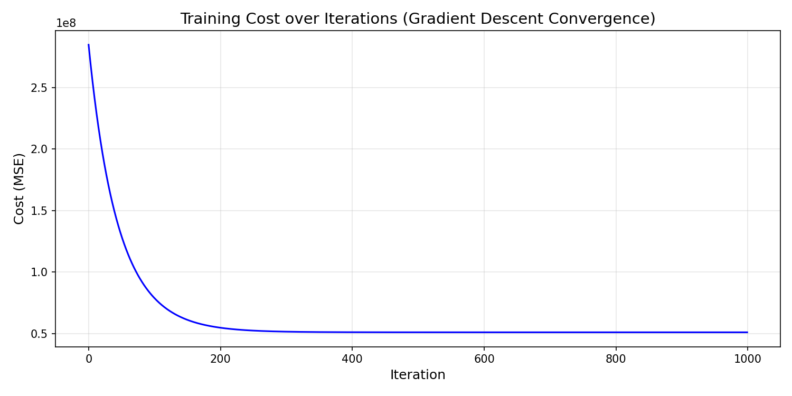
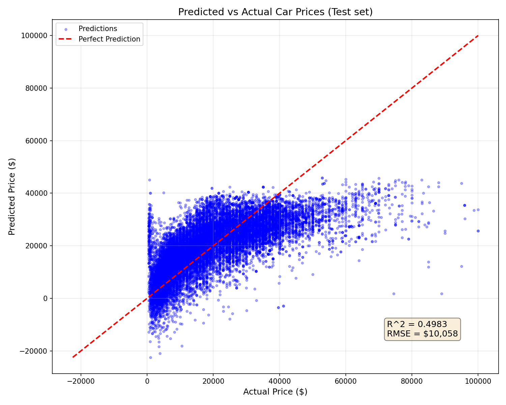

# No-Framework Linear Regression

Pure NumPy implementation of linear regression using gradient descent optimization.

## Overview

This implementation predicts used car prices using only NumPy — no ML libraries. Every component is built from scratch to understand the core mechanics of linear regression.

## Dataset

- **Source**: [Craigslist Cars/Trucks Dataset](https://www.kaggle.com/datasets/austinreese/craigslist-carstrucks-data)
- **Samples**: 100,000 (sampled from ~350k cleaned rows)
- **Features**: 11 (year, manufacturer, condition, cylinders, fuel, odometer, title_status, transmission, drive, type, state)
- **Target**: Price ($500 - $100,000)

## Mathematical Foundation

### Hypothesis Function
```
y_pred = X @ weights + bias
```

### Cost Function (Mean Squared Error)
```
MSE = (1/2n) * Σ(y_pred - y)²
```

### Gradient Descent Update Rules
```
weights = weights - learning_rate * (1/n) * X.T @ (y_pred - y)
bias = bias - learning_rate * (1/n) * Σ(y_pred - y)
```

## Results

| Metric | Training Set | Test Set |
|--------|--------------|----------|
| MSE    | 101,888,811  | 101,153,817 |
| RMSE   | $10,094      | $10,058  |
| R²     | 0.4934       | 0.4983   |

**Interpretation**: The model explains ~50% of price variance with an average prediction error of ~$10,000. No overfitting detected (R² gap: -0.005).

## Learned Weights (Interpretations)

| Feature | Weight | Meaning |
|---------|--------|---------|
| year | +$5,191 | Newer cars cost more |
| odometer | -$4,482 | Higher mileage = lower price |
| cylinders | +$2,401 | Larger engines cost more |
| fuel | -$2,722 | Diesel (encoded 0) costs more than gas (encoded 2) |
| drive | -$2,166 | 4WD (encoded 0) costs more than FWD/RWD |
| transmission | +$1,271 | Manual slightly higher value |
| title_status | -$772 | Clean titles (encoded 0) worth more |
| condition | +$703 | Better condition = higher price |
| manufacturer | -$588 | Brand effect (alphabetical encoding limits insight) |
| type | +$69 | Minimal body type effect |
| state | -$22 | Minimal geographic effect |

## Hyperparameters

- Learning rate: 0.01
- Iterations: 1000
- Train/Test split: 80/20
- Random seed: 113

## Components Implemented

- [x] Manual train/test split
- [x] Z-score feature scaling
- [x] Forward pass (predictions)
- [x] Cost function (MSE)
- [x] Gradient computation
- [x] Gradient descent training loop
- [x] Evaluation metrics (MSE, RMSE, R²)
- [x] Visualizations (cost curve, predictions scatter)

## Visualizations

### Training Convergence


### Predicted vs Actual


## Key Learnings

1. **Feature scaling is critical** — Without z-score normalization, gradient descent fails to converge properly due to vastly different feature ranges (odometer: 0-500k vs year: 1990-2022)

2. **Bias learns the mean** — The learned bias ($19,194) is almost exactly the mean car price, which makes sense mathematically

3. **Weights are interpretable** — In linear regression, weights directly show feature importance (unlike deep learning)

4. **50% R² is reasonable** — Used car pricing depends on many factors not in our data (specific model, photos, description quality, local market)

## Files

```
No-Framework/01-linear-regression/
├── pipeline.ipynb      # Main implementation notebook
├── README.md           # This file
├── requirements.txt    # Dependencies (numpy, matplotlib)
└── results/
    ├── cost_curve.png
    └── predictions_vs_actual.png
```

## How to Run

```bash
cd No-Framework/01-linear-regression
jupyter notebook pipeline.ipynb
```

Requires: `numpy`, `matplotlib`
