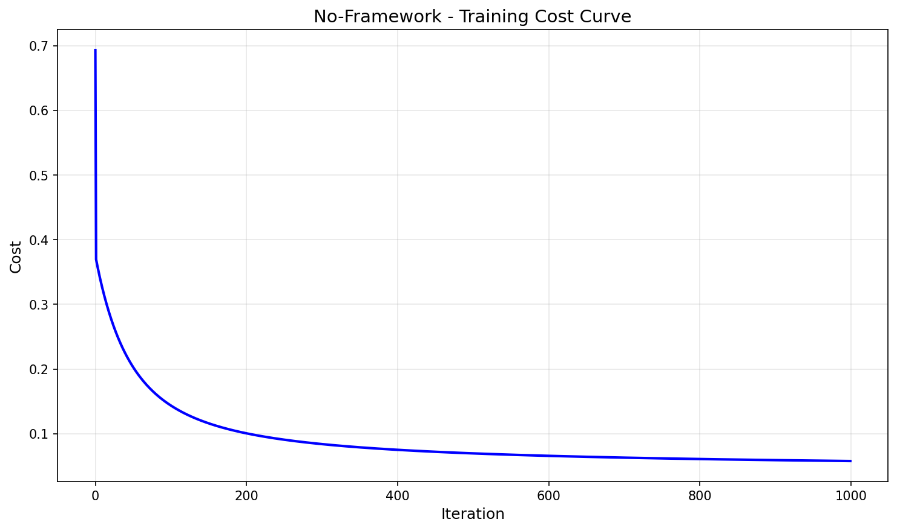
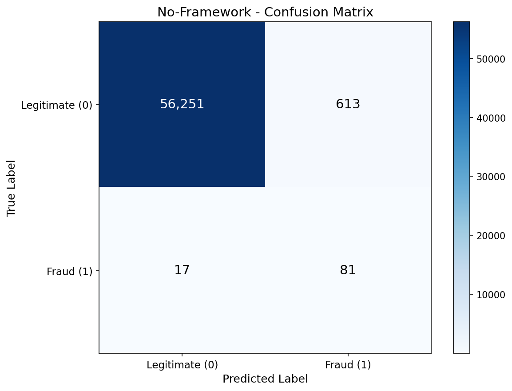
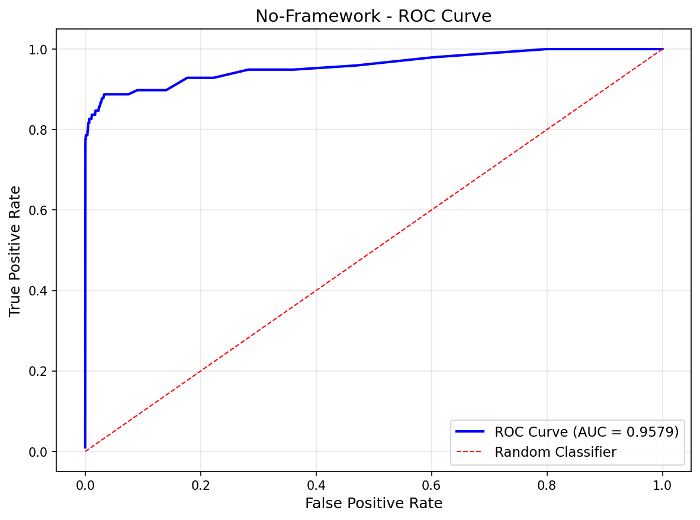
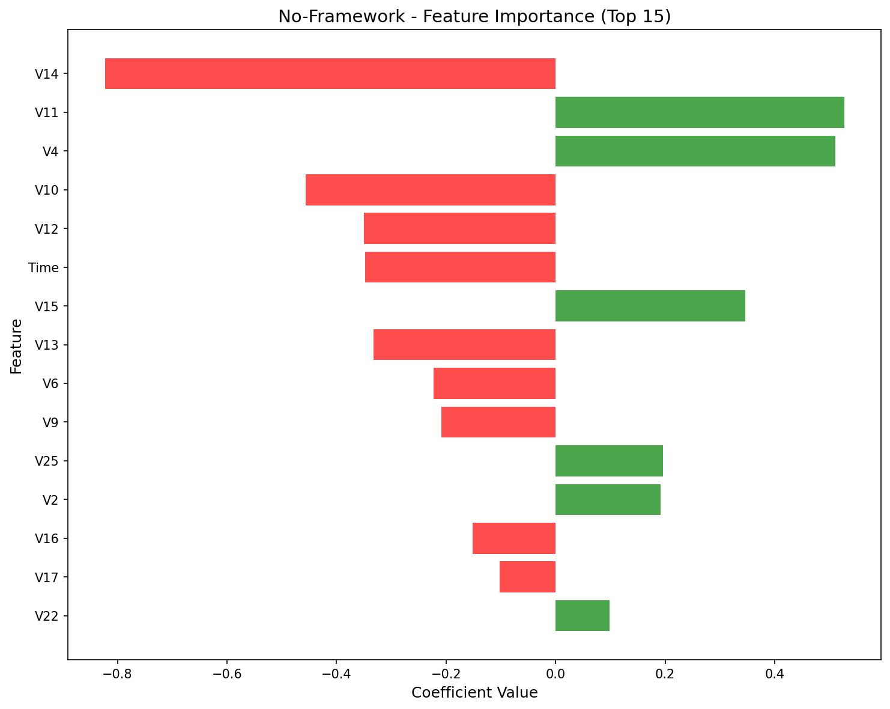

# No-Framework Logistic Regression

Pure NumPy implementation of logistic regression for fraud detection using gradient descent optimization.

## Overview

This implementation classifies credit card transactions as legitimate or fraudulent using only NumPy — no ML libraries. Every component is built from scratch: sigmoid activation, binary cross-entropy loss, and gradient descent optimization.

## Dataset

- **Source**: [Kaggle Credit Card Fraud Detection](https://www.kaggle.com/datasets/mlg-ulb/creditcardfraud)
- **Samples**: 284,807 transactions
- **Features**: 30 (Time, V1-V28 from PCA, Amount)
- **Target**: Class (0 = legitimate, 1 = fraud)
- **Imbalance**: 99.83% legitimate, 0.17% fraud (492 fraud cases)

## Preprocessing: SMOTE + Filtering

To handle extreme class imbalance, we used a multi-step approach:

1. **SMOTE Oversampling**: Generated 3.5x synthetic fraud samples
2. **Tight Filtering**: Removed synthetic samples outside 1.5 std of real fraud distribution
3. **Trim to 50/50**: Randomly sampled to achieve balanced training set

**Result**: 454,902 training samples (50% fraud, 50% legitimate)

Test set preserves original distribution (0.17% fraud) for realistic evaluation.

## Mathematical Foundation

### Sigmoid Function
```
σ(z) = 1 / (1 + e^(-z))
```

### Hypothesis
```
z = X @ weights + bias
y_pred = σ(z)
```

### Binary Cross-Entropy Loss
```
J = -(1/m) * Σ[y*log(y_pred) + (1-y)*log(1-y_pred)]
```

### Gradient Descent Update Rules
```
weights = weights - learning_rate * (1/m) * X.T @ (y_pred - y)
bias = bias - learning_rate * (1/m) * Σ(y_pred - y)
```

## Results

| Metric | Test Set |
|--------|----------|
| Accuracy | 98.89% |
| Precision | 11.67% |
| Recall | 82.65% |
| F1 Score | 20.45% |
| AUC-ROC | 90.34% |

### Confusion Matrix Breakdown

| | Predicted Legit | Predicted Fraud |
|---|---|---|
| **Actual Legit** | 56,251 (TN) | 613 (FP) |
| **Actual Fraud** | 17 (FN) | 81 (TP) |

**Interpretation**:
- High recall (83%) means we catch most fraud — critical for fraud detection
- Low precision (12%) means many false alarms — tradeoff for high recall
- AUC-ROC (90%) shows strong discrimination ability between classes

## Hyperparameters

- Learning rate: 0.1
- Iterations: 1000
- Train/Test split: 80/20
- Random seed: 113
- Decision threshold: 0.5

## Performance

- **Training Time**: 18.34 sec
- **Peak Memory**: 27.87 MB

## Components Implemented

- [x] Sigmoid activation function
- [x] Binary cross-entropy loss
- [x] Gradient computation
- [x] Gradient descent training loop
- [x] Evaluation metrics (Accuracy, Precision, Recall, F1, AUC-ROC)
- [x] ROC curve computation
- [x] Visualizations (cost curve, confusion matrix, ROC, feature importance)

## Visualizations

### Training Convergence


### Confusion Matrix


### ROC Curve


### Feature Importance


## Key Learnings

1. **Class imbalance dominates evaluation** — 98.9% accuracy is misleading when 99.8% of test data is legitimate. Focus on Precision, Recall, F1, and AUC-ROC.

2. **Precision vs Recall tradeoff** — For fraud detection, we prefer catching fraudsters (high recall) even at the cost of false alarms (low precision).

3. **SMOTE + filtering works** — Generating synthetic data then filtering unrealistic samples created a balanced training set without losing model quality.

4. **Same gradient formula** — Logistic regression gradients look identical to linear regression! The sigmoid derivative is mathematically "baked in" to the (y_pred - y) error term.

5. **V14 is the strongest predictor** — PCA component V14 has the largest negative coefficient, strongly indicating fraud.

## Files

```
No-Framework/02-logistic-regression/
├── pipeline.ipynb      # Main implementation notebook
├── README.md           # This file
├── requirements.txt    # Dependencies
└── results/
    ├── cost_curve.png
    ├── confusion_matrix.png
    ├── roc_curve.png
    └── feature_importance.png
```

## How to Run

```bash
cd No-Framework/02-logistic-regression
jupyter notebook pipeline.ipynb
```

**Prerequisites**: Run preprocessing script first:
```bash
cd data-preperation
python preprocess_logistic.py
```

Requires: `numpy`, `matplotlib`
