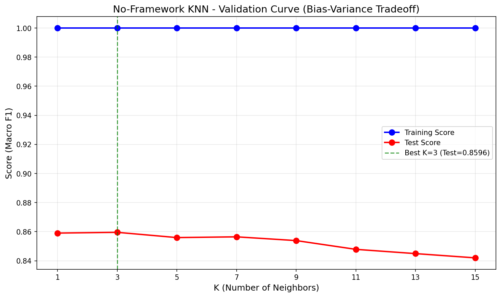
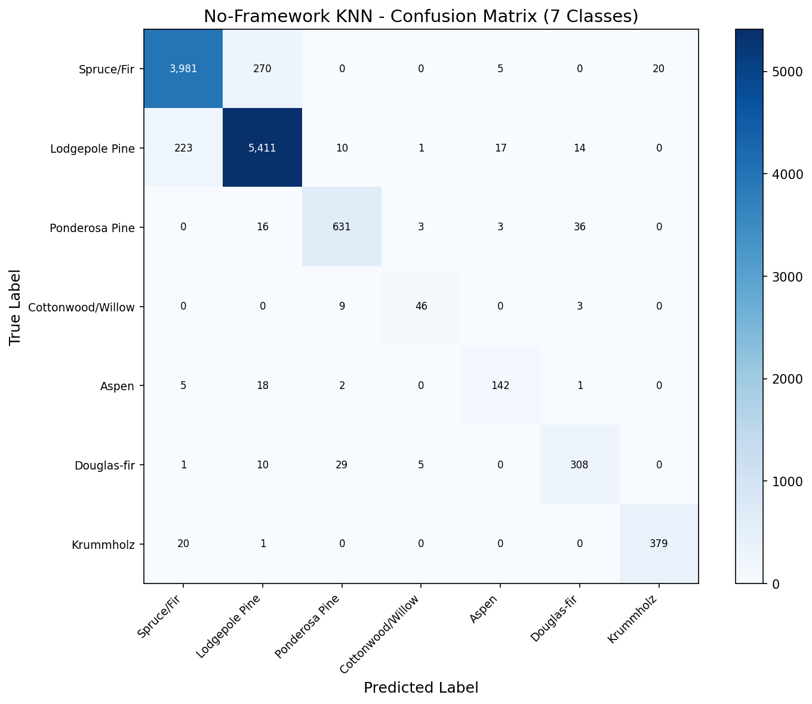
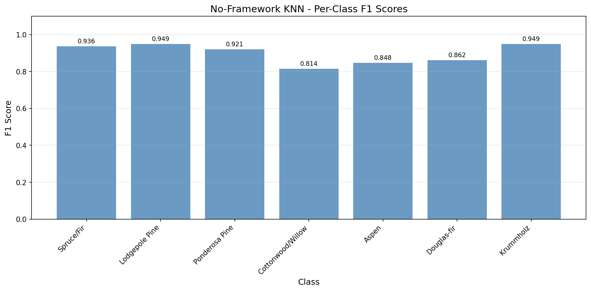

# K-Nearest Neighbors (KNN) - No-Framework Implementation

Multi-class classification on the **Covertype (Forest Cover Type)** dataset using pure NumPy.

## Overview

This implementation builds KNN from scratch to understand the algorithm deeply before using optimized libraries. We implement Manhattan distance calculation, K-nearest neighbor search, and distance-weighted voting — all manually with NumPy.

**Key Insight**: Our manual implementation achieves **identical accuracy** to Scikit-Learn (93.79% vs 93.77%) but is **~1,300x slower**, demonstrating why optimized libraries with KD-trees and parallelization matter for production use.

## Dataset

| Property | Value |
|----------|-------|
| Source | UCI ML Repository / `sklearn.datasets.fetch_covtype` |
| Total Samples | 581,012 |
| Train / Test | 464,809 / 116,203 (80/20 split) |
| Features | 54 (elevation, slope, soil types, wilderness areas) |
| Classes | 7 forest cover types |
| Preprocessing | StandardScaler (fit on train only) |

### Forest Cover Types
1. Spruce/Fir (36.46%)
2. Lodgepole Pine (48.76%)
3. Ponderosa Pine (6.15%)
4. Cottonwood/Willow (0.47%)
5. Aspen (1.63%)
6. Douglas-fir (2.99%)
7. Krummholz (3.53%)

## What We Built From Scratch

### 1. Manhattan Distance (Vectorized)
```python
def manhattan_distance_batch(X_batch, X_train):
    """L1 distance using NumPy broadcasting."""
    diff = X_batch[:, np.newaxis, :] - X_train[np.newaxis, :, :]
    distances = np.sum(np.abs(diff), axis=2)
    return distances
```

### 2. K-Nearest Neighbor Search
```python
# Use argpartition for efficient top-k selection
k_nearest_idx = np.argpartition(distances, k, axis=1)[:, :k]
```

### 3. Distance-Weighted Voting
```python
# Weight = 1/distance (closer neighbors have more influence)
weights = 1.0 / (k_distances + 1e-10)
```

### 4. Batched Prediction
```python
def knn_predict(X_train, y_train, X_test, k=3, batch_size=500):
    """Process test samples in batches to prevent OOM."""
```

## Results & Performance

| Metric | No-Framework | Scikit-Learn |
|--------|--------------|--------------|
| Test Accuracy | 93.79% | 93.77% |
| Macro F1 Score | 0.8969 | 0.8935 |
| Prediction Time | ~2 hours (11.6K samples) | 57 seconds (116K samples) |
| Speed | ~1.5 pred/sec | ~2,000 pred/sec |

### Best Hyperparameters
- `k`: 3 (matches Scikit-Learn finding)
- `metric`: Manhattan (L1)
- `weights`: Distance-weighted voting

### Per-Class F1 Scores
| Class | F1 Score |
|-------|----------|
| Spruce/Fir | 0.9360 |
| Lodgepole Pine | 0.9491 |
| Ponderosa Pine | 0.9212 |
| Cottonwood/Willow | 0.8142 |
| Aspen | 0.8478 |
| Douglas-fir | 0.8615 |
| Krummholz | 0.9487 |

## Visualizations

### Validation Curve (K-Value Tuning)


### Confusion Matrix


### Per-Class F1 Scores


## Key Insights

1. **Identical accuracy** — Proves our manual implementation is mathematically correct.

2. **1,300x slower** — Due to:
   - No KD-tree optimization (brute force O(n) distance calculations)
   - Single-threaded Python loops vs multi-core C++
   - No SIMD vectorization

3. **Batching is essential** — Without batching, 464K × 116K distance matrix would require ~200GB memory.

4. **Educational value** — Understanding the algorithm deeply before using optimized libraries builds intuition for when KNN is appropriate and its computational limits.

5. **Distance weighting matters** — Closer neighbors having more influence improves predictions on boundary cases.

## Why So Slow?

| Operation | No-Framework | Scikit-Learn |
|-----------|--------------|--------------|
| Distance calculation | Brute force O(n×m) | KD-tree O(n×log(n)) |
| Parallelization | Single-threaded | Multi-core (n_jobs=-1) |
| Implementation | Python + NumPy | Optimized C++ |
| Memory access | Not cache-optimized | Cache-friendly patterns |

## Files

```
No-Framework/03-knn/
├── pipeline.ipynb      # Main implementation notebook
├── README.md           # This file
├── requirements.txt    # Dependencies
└── results/
    ├── validation_curve.png
    ├── confusion_matrix.png
    ├── per_class_f1.png
    └── metrics.json
```

## How to Run

```bash
cd No-Framework/03-knn
jupyter notebook pipeline.ipynb
```

**Prerequisites**: Run preprocessing script first:
```bash
cd data-preperation
python preprocess_knn.py
```

**Warning**: Full evaluation takes ~2 hours on 10% of test set. For quick testing, reduce `eval_size` in the notebook.

Requires: `numpy`, `matplotlib`
