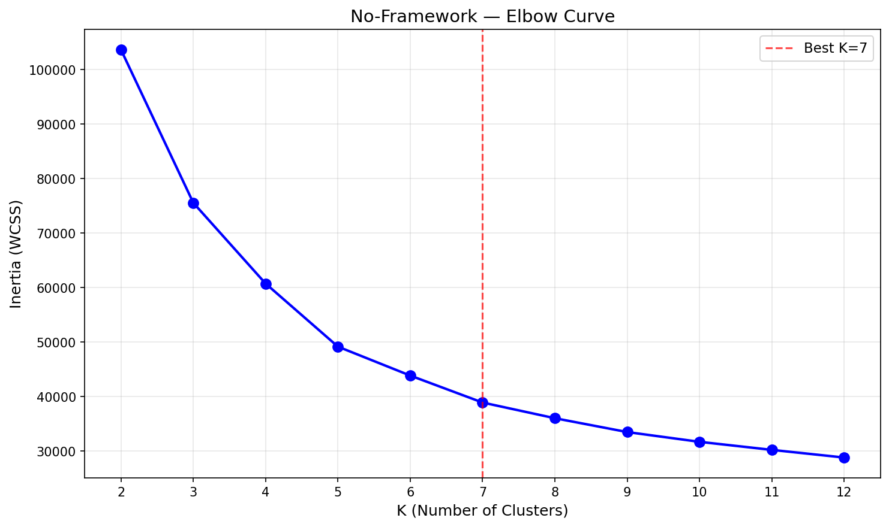
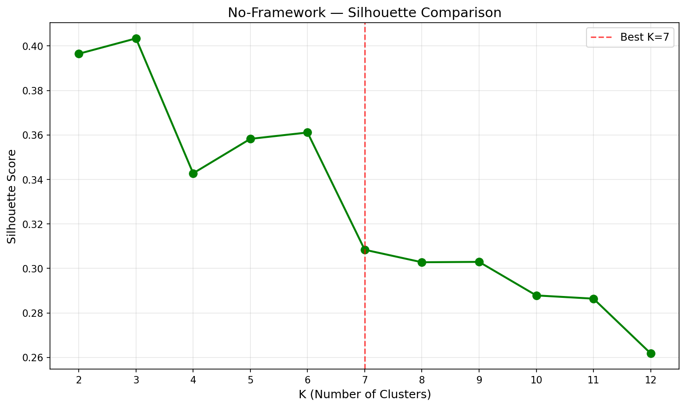
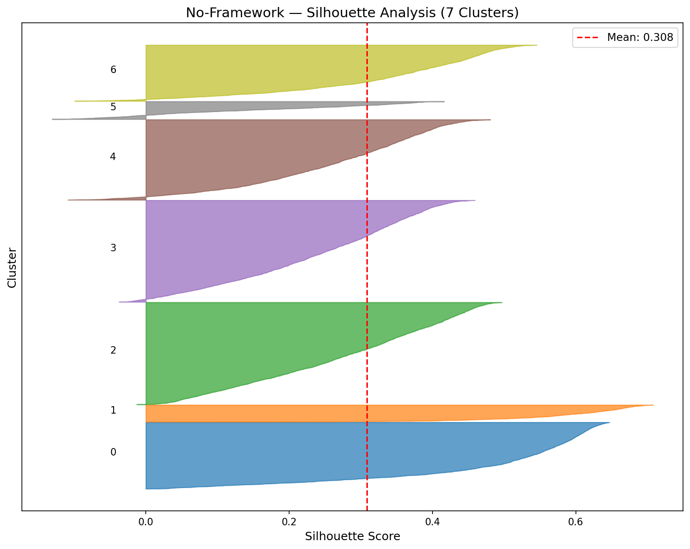
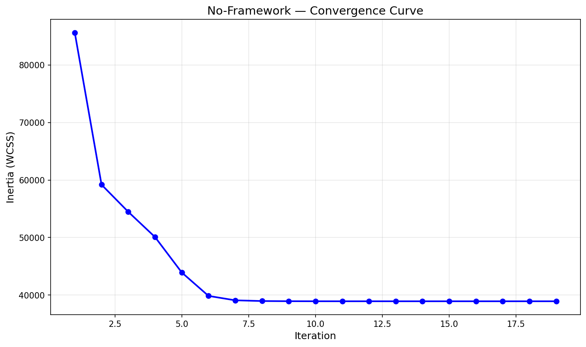

# K-Means Clustering — No-Framework Implementation

Building K-Means from scratch using only NumPy. First unsupervised model in the project — every component of the algorithm is manually implemented.

## Overview

This implementation builds the entire K-Means pipeline from scratch: K-Means++ initialization, vectorized cluster assignment, centroid updates with empty cluster handling, and Lloyd's iterative convergence loop. Unlike KNN (a lazy learner with no training), K-Means has a real iterative training loop — this is our first from-scratch implementation with convergence behavior.

**Key Insight**: Our manual implementation achieves **nearly identical metrics** to Scikit-Learn (ARI 0.6684 vs 0.6686) while being ~17x slower, demonstrating that the algorithm is straightforward but optimized C implementations matter for speed.

## Dataset

| Property | Value |
|----------|-------|
| Source | UCI ML Repository / `sklearn.datasets.fetch_openml('dry-bean')` |
| Total Samples | 13,611 (13,543 after deduplication) |
| Train / Test | 10,834 / 2,709 (80/20 stratified split) |
| Features | 16 geometric measurements |
| Classes | 7 bean types |
| Preprocessing | StandardScaler (fit on train only) |

### Bean Types
| Class | Percentage |
|-------|-----------|
| DERMASON | 26.0% |
| SIRA | 19.0% |
| SEKER | 15.2% |
| HOROZ | 13.0% |
| BARBUNYA | 10.1% |
| CALI | 12.7% |
| BOMBAY | 3.8% |

## What We Built From Scratch

### 1. K-Means++ Initialization
```python
def kmeans_plus_plus_init(X, k, rng):
    """Choose centroids with probability proportional to D(x) squared.
    Spreads initial centroids apart for faster convergence."""
```

### 2. Cluster Assignment (Vectorized)
```python
def assign_clusters(X, centroids):
    """Broadcasting: (n, 1, d) - (1, k, d) for all pairwise distances."""
    diff = X[:, np.newaxis, :] - centroids[np.newaxis, :, :]
    sq_distances = np.sum(diff ** 2, axis=2)
    labels = np.argmin(sq_distances, axis=1)
```

### 3. Centroid Update
```python
def update_centroids(X, labels, k, rng):
    """Mean of assigned samples. Empty clusters reinitialized to random point."""
```

### 4. Lloyd's Algorithm (Single Run)
```python
def kmeans_single_run(X, k, max_iter=300, tol=1e-4, rng=None):
    """Init -> assign -> update -> check convergence. Returns inertia_history."""
```

### 5. Multi-Init Wrapper
```python
def kmeans(X, k, n_init=5, max_iter=300, tol=1e-4, random_state=113):
    """Run n_init times, keep best by lowest inertia."""
```

## Results & Performance

### Comparison to Scikit-Learn

| Metric | No-Framework | Scikit-Learn |
|--------|-------------|-------------|
| Test Inertia | 9,976.28 | 9,981.06 |
| Test Silhouette | 0.3064 | 0.3061 |
| Test ARI | 0.6684 | 0.6686 |
| Iterations | 19 | 26 |
| Training Time | 1.0159s | 0.0614s |
| Peak Memory | 19.44 MB | 2.71 MB |

### K-Tuning Results
- K=3: Highest silhouette (0.4034) — geometric optimum
- K=7: Selected to match actual bean class count for ARI evaluation
- Inertia values match Scikit-Learn within 0.1% across all K values

## Visualizations

### Elbow Curve (K-Tuning)


### Silhouette Comparison (K-Tuning)


### Silhouette Analysis (K=7)


### Convergence Curve


## Key Insights

1. **Identical quality** — Inertia, silhouette, and ARI all within 0.1% of Scikit-Learn. Proves our from-scratch implementation is mathematically correct.

2. **17x slower** — Pure NumPy (1.02s) vs sklearn's compiled C (0.06s). Much smaller gap than KNN's 1,300x because K-Means is compute-light (only ~10K samples, 7 clusters, 19 iterations).

3. **7x more memory** — NumPy broadcasting creates intermediate arrays (n_samples, k, n_features) that sklearn avoids with optimized memory management.

4. **Cleaner convergence curve** — Unlike Scikit-Learn where we had to hack `max_iter=1` loops, our `inertia_history` tracks convergence natively from the algorithm.

5. **Fewer iterations** — Converged in 19 iterations vs sklearn's 26. Different K-Means++ initialization seeds led to a slightly more efficient starting point.

## Why Slower?

| Operation | No-Framework | Scikit-Learn |
|-----------|-------------|-------------|
| Distance calculation | NumPy broadcasting | Optimized C/Cython |
| Centroid update | Python loop over k | Vectorized C |
| Memory allocation | New arrays each iteration | In-place operations |
| Parallelization | Single-threaded | Multi-threaded |

## Files

```
No-Framework/04-k-means/
├── pipeline.ipynb      # Main implementation notebook
├── README.md           # This file
├── requirements.txt    # Dependencies
└── results/
    ├── elbow_curve.png
    ├── silhouette_comparison.png
    ├── silhouette_analysis.png
    ├── convergence_curve.png
    └── metrics.json
```

## How to Run

```bash
cd No-Framework/04-k-means
jupyter notebook pipeline.ipynb
```

**Prerequisites**: Run preprocessing script first:
```bash
cd data-preperation
python preprocess_kmeans.py
```

Requires: `numpy`, `matplotlib`
