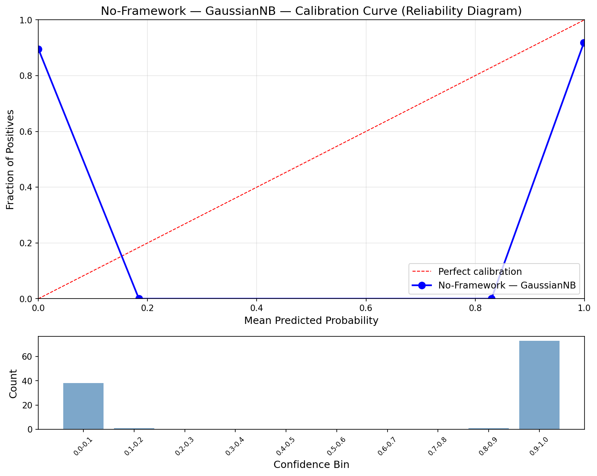
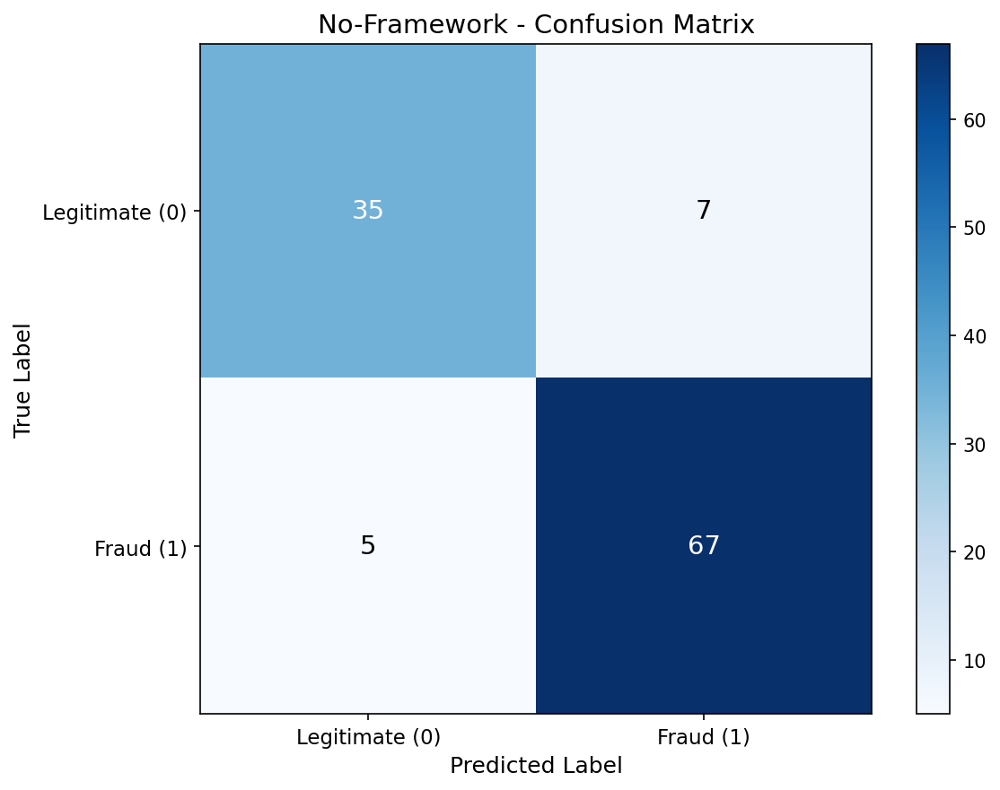
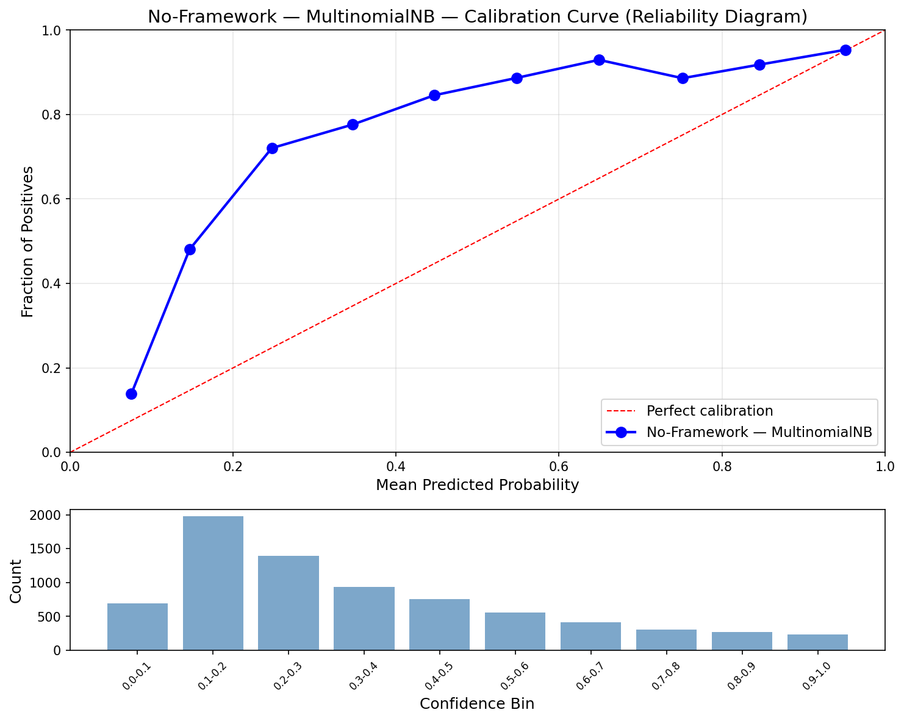
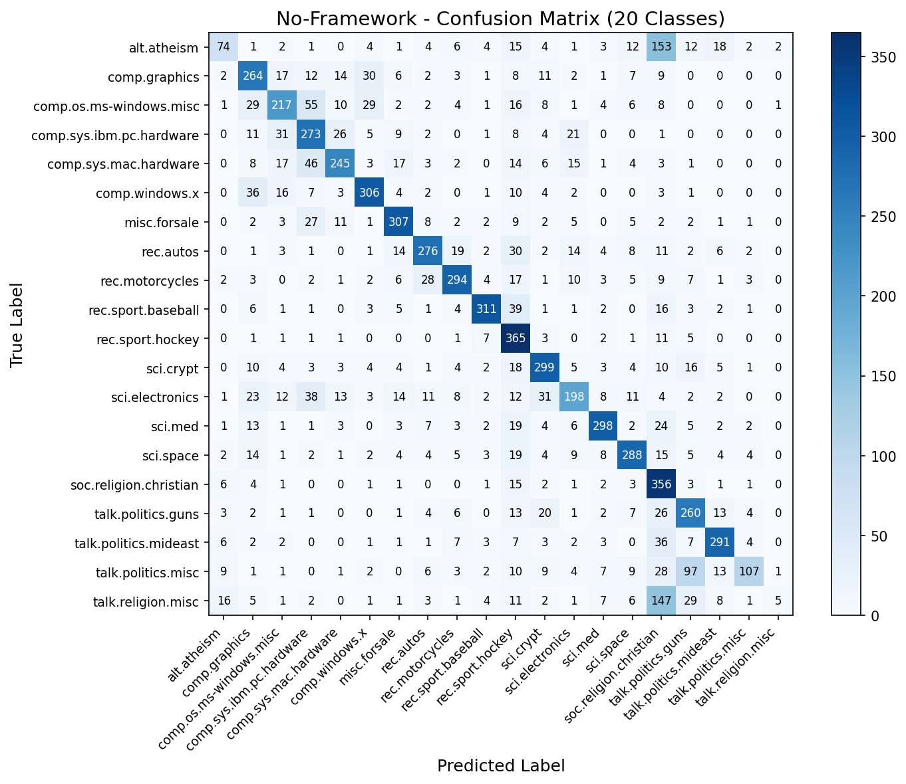
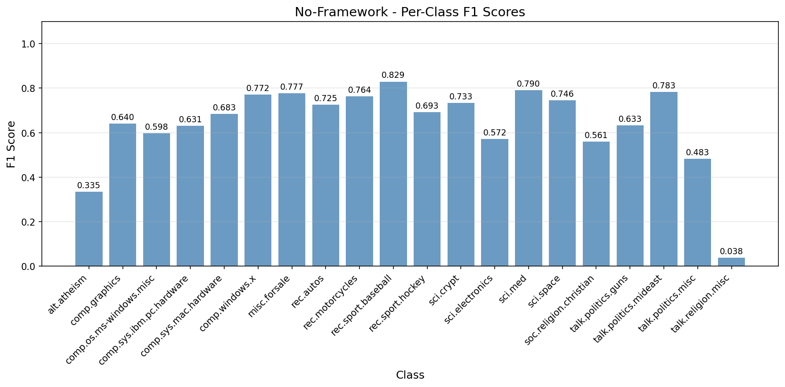

# No-Framework Naive Bayes

Pure NumPy implementation of both Naive Bayes variants: GaussianNB for continuous features and MultinomialNB for text classification. No scikit-learn — every calculation built from scratch.

## Overview

Two-part pipeline implementing both Naive Bayes variants using only NumPy:
- **Part 1**: GaussianNB on Breast Cancer (binary classification baseline)
- **Part 2**: MultinomialNB on 20 Newsgroups (text classification main event)
- **Showcase**: Log-sum-exp trick — the numerical stability technique that makes log-space probability computation safe

## What We Build From Scratch

| Function | Purpose | Key Math |
|----------|---------|----------|
| `gaussian_nb_train()` | Learn class means, variances, priors | `mean(X[y==k])`, `var(X[y==k]) + 1e-9`, `log(n_k/n)` |
| `gaussian_nb_predict()` | Gaussian log-likelihood → softmax | `-0.5*(log(2πσ²) + (x-μ)²/σ²)` per feature |
| `multinomial_nb_train()` | Learn smoothed feature log-probs | `log((count + α) / (total + α·V))` |
| `multinomial_nb_predict()` | Single matmul prediction | `X @ log_prob.T + prior` → log-sum-exp softmax |
| `log_sum_exp()` | Numerically stable log(sum(exp(x))) | `max + log(sum(exp(x - max)))` |

## Datasets

### Breast Cancer Wisconsin (GaussianNB)
- **Source**: `sklearn.datasets.load_breast_cancer()`
- **Samples**: 569 (455 train / 114 test, stratified 80/20 split)
- **Features**: 30 continuous (mean, SE, worst of 10 cell nucleus measurements)
- **Target**: Malignant (0) or Benign (1)

### 20 Newsgroups (MultinomialNB)
- **Source**: `sklearn.datasets.fetch_20newsgroups()` with headers/footers/quotes removed
- **Samples**: 18,846 (11,314 train / 7,532 test, published benchmark split)
- **Features**: 10,000 TF-IDF terms (`max_features=10000, sublinear_tf=True`)
- **Target**: 20 newsgroup categories

## Configuration

| Parameter | Value | Purpose |
|-----------|-------|---------|
| `RANDOM_STATE` | 113 | Reproducibility |
| `ALPHA` | 1.0 | Laplace smoothing (prevents zero probabilities) |
| `VAR_SMOOTHING` | 1e-9 | Variance floor for GaussianNB (prevents division by zero) |

## Results

### Part 1: GaussianNB (Breast Cancer)

| Metric | Train | Test |
|--------|-------|------|
| Accuracy | 0.9385 | 0.8947 |
| Precision | 0.9509 | 0.9054 |
| Recall | 0.9509 | 0.9306 |
| F1 | 0.9509 | 0.9178 |
| AUC | 0.9591 | 0.9363 |
| Log Loss | 0.7158 | 1.0123 |
| Brier Score | 0.0608 | 0.0983 |
| ECE | 0.3703 | 0.3590 |

### Part 2: MultinomialNB (20 Newsgroups)

| Metric | Train | Test |
|--------|-------|------|
| Accuracy | 0.8367 | 0.6683 |
| Macro F1 | 0.8194 | 0.6394 |
| Log Loss | 1.1388 | 1.5576 |
| Brier Score | 0.4553 | 0.6008 |
| ECE | 0.4015 | 0.3229 |

### Performance

| Metric | Value |
|--------|-------|
| Training Time | 0.13s |
| Inference Speed | 14.66 us/sample (68,222 samples/sec) |
| Model Size | 1.53 MB |
| Peak Memory | 47.25 MB |

### No-Framework vs Scikit-Learn

| Metric | No-Framework | Scikit-Learn |
|--------|-------------|--------------|
| Accuracy | 0.6683 | 0.6683 |
| Macro F1 | 0.6394 | 0.6394 |
| Log Loss | 1.5576 | 1.5576 |
| Brier Score | 0.6008 | 0.6008 |
| ECE | 0.3229 | 0.3229 |
| Training Time | 0.13s | 0.21s |
| Inference | 14.66 us/sample | 17.07 us/sample |
| Model Size | 1.53 MB | 3.05 MB |
| Peak Memory | 47.25 MB | 869.71 MB |

All classification and probabilistic metrics are identical. No-Framework is faster and leaner because pure NumPy avoids sklearn's overhead (input validation, attribute storage, diagnostic arrays).

## Showcase: Log-Sum-Exp Trick

When computing class probabilities from log-posteriors, the naive approach fails for high-dimensional data. Log-posteriors for MultinomialNB on 10,000 features can be -500 or -5000. `exp(-500)` underflows to 0.0, giving division-by-zero NaN probabilities.

### The Fix

Subtract the maximum log-posterior before exponentiating:

```
max_val = max(log_posteriors)
P(class_k | x) = exp(log_posterior_k - max_val) / sum(exp(log_posterior_k - max_val))
```

This is mathematically identical (the max cancels in numerator and denominator) but numerically safe because the largest exponent is always 0.

This IS the softmax function — implemented safely in log-space. The `log_sum_exp()` function encapsulates this pattern and is shared between both GaussianNB and MultinomialNB predict functions.

## Visualizations

### GaussianNB Calibration Curve


### GaussianNB Confusion Matrix


### MultinomialNB Calibration Curve


### MultinomialNB Confusion Matrix (20 Classes)


### Per-Class F1 Scores


## Key Learnings

1. **Pure NumPy matches sklearn exactly** — all 5 metrics identical to 4 decimal places, confirming the from-scratch implementation is correct

2. **No-Framework is actually faster** — 0.13s vs 0.21s training, 14.66 vs 17.07 us/sample inference. sklearn's input validation, attribute storage, and object overhead slow it down for this simple algorithm

3. **Memory footprint is 18x smaller** — 47 MB vs 870 MB because sklearn's tracemalloc captures its entire import/object graph while we track only the NumPy operations

4. **Model size is half** — 1.53 MB vs 3.05 MB because we only store `feature_log_prob` + `class_log_prior`, while sklearn also stores `feature_count_`, `class_count_`, and other diagnostic arrays

5. **MultinomialNB prediction is one matmul** — `X @ feature_log_prob.T + class_log_prior` does all the work. The entire predict function is 5 lines of math

6. **Log-sum-exp is invisible but essential** — without it, probability computation breaks on high-dimensional data. The trick is simple (subtract the max) but critical

## NumPy Functions Used

| Function | Purpose |
|----------|---------|
| `np.unique(y)` | Find unique class labels |
| `np.log()`, `np.exp()` | Log-space arithmetic |
| `X[y == k].mean(axis=0)` | Per-class feature means |
| `X[y == k].var(axis=0)` | Per-class feature variances |
| `X @ feature_log_prob.T` | Matrix multiply for prediction |
| `np.argmax(log_posteriors, axis=1)` | Class prediction from log-posteriors |

## Files

```
No-Framework/05-naive-bayes/
├── pipeline.ipynb                          # Main implementation (13 cells)
├── README.md                               # This file
├── requirements.txt                        # Dependencies
└── results/
    ├── metrics.json                        # Saved metrics
    ├── gaussian_calibration.png            # GaussianNB reliability diagram
    ├── gaussian_confusion_matrix.png       # GaussianNB confusion matrix
    ├── multinomial_calibration.png         # MultinomialNB reliability diagram
    ├── multinomial_confusion_matrix.png    # 20-class confusion matrix
    └── multinomial_per_class_f1.png        # Per-class F1 bar chart
```

## How to Run

```bash
cd No-Framework/05-naive-bayes
jupyter notebook pipeline.ipynb
```

Requires: `numpy`, `matplotlib`
