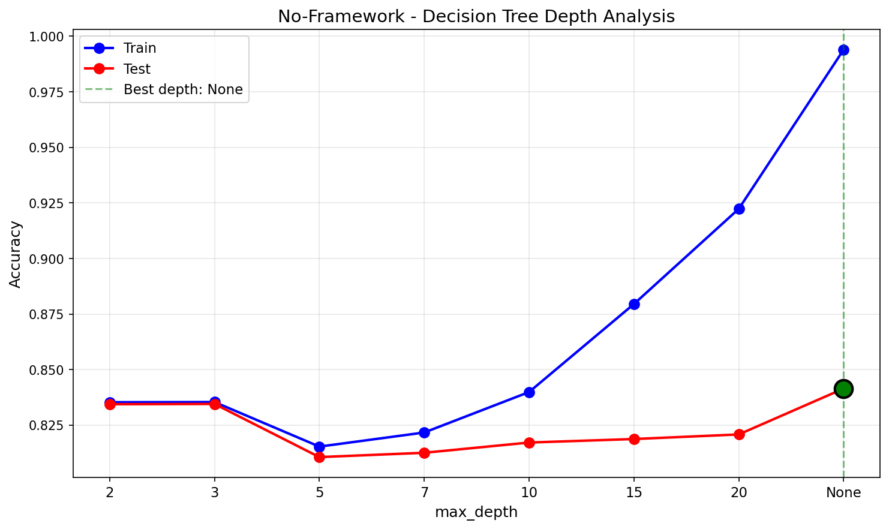
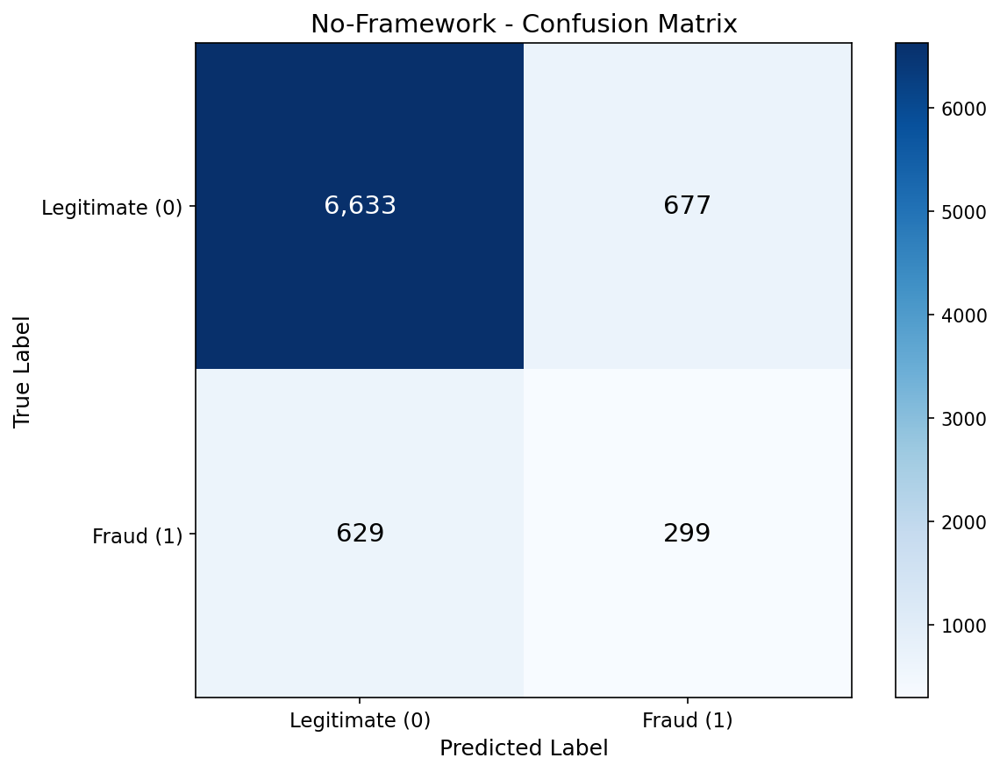
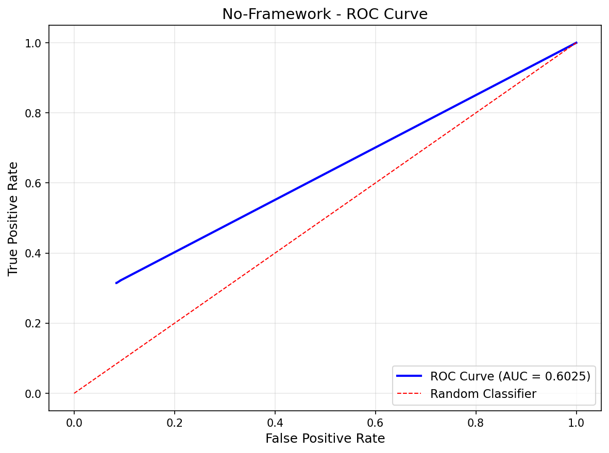
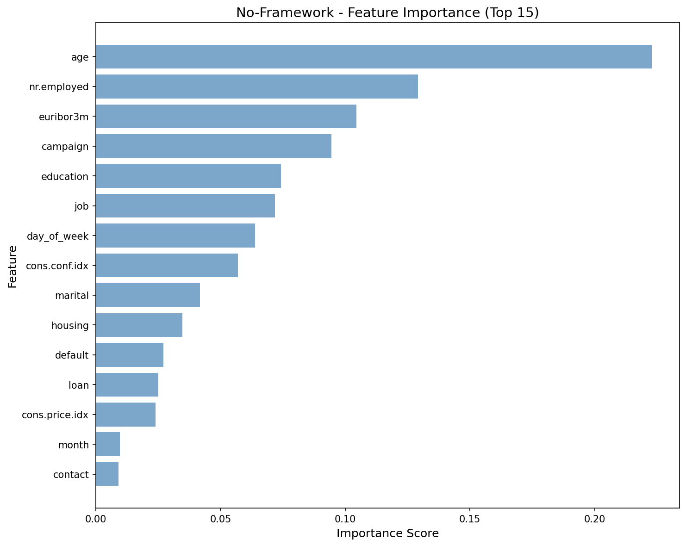
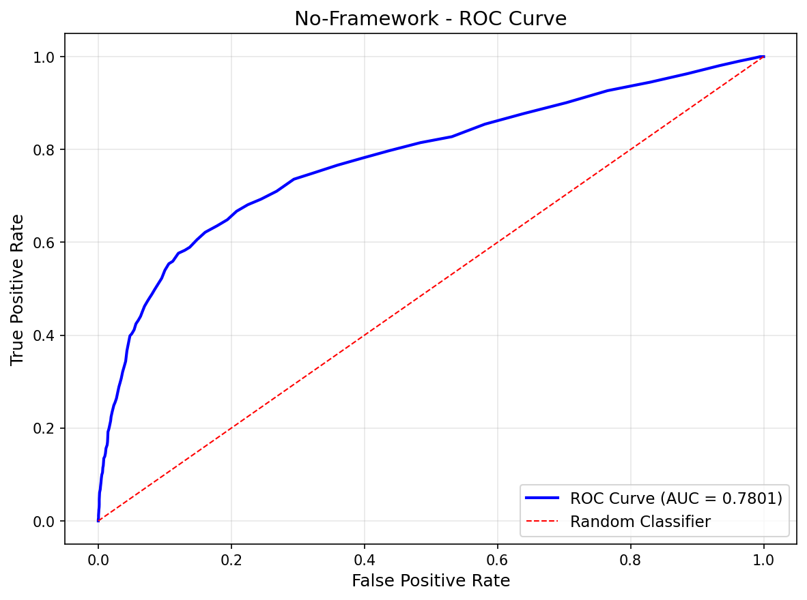
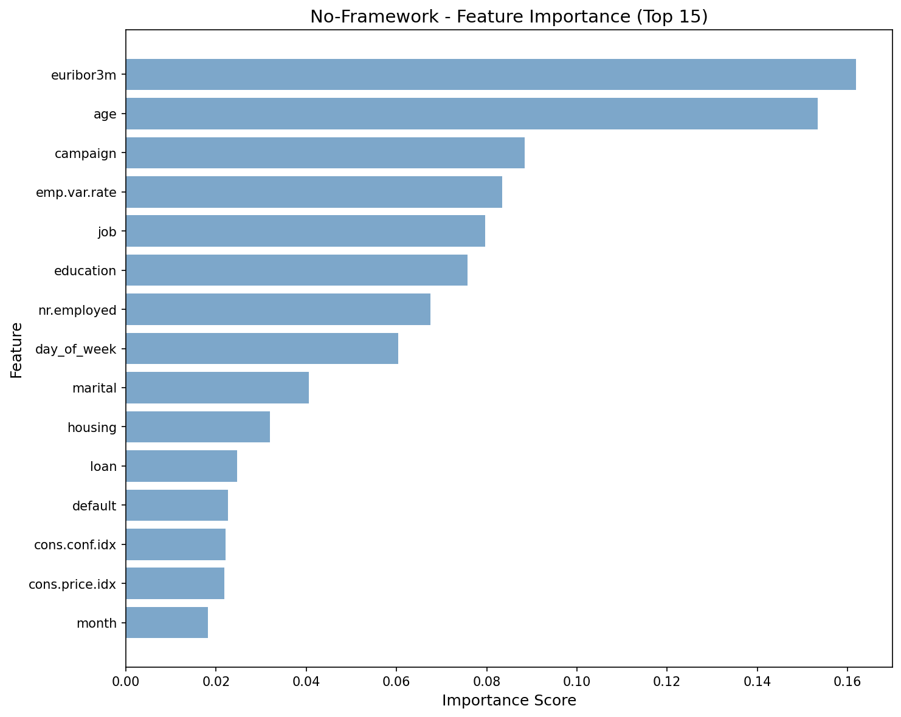
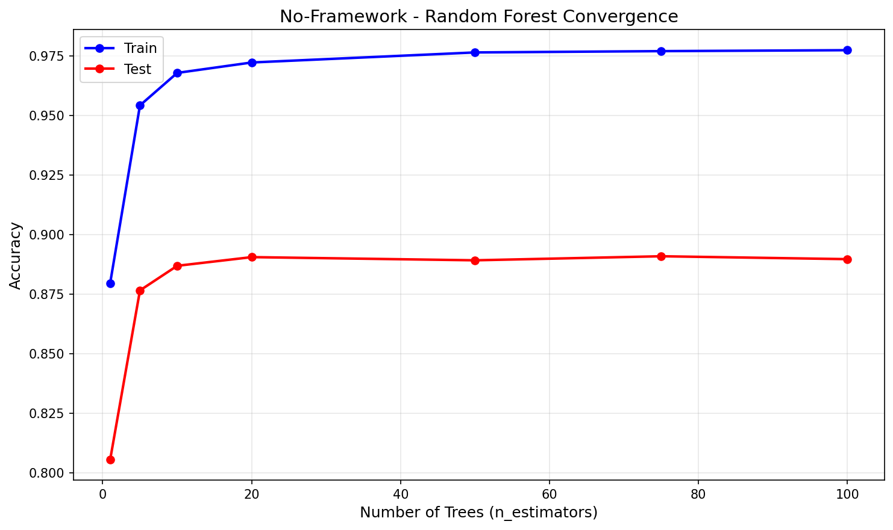

# No-Framework Decision Trees & Random Forests

Pure NumPy implementation of Decision Trees (recursive Gini splitting) and Random Forests (bootstrap aggregation with random feature subsets). No scikit-learn — every split, every tree, every vote built from scratch. The most algorithmically complex from-scratch build in the project.

## Overview

Two-part pipeline implementing both DT and RF using only NumPy:
- **Part 1**: Decision Tree with no depth limit (demonstrates overfitting — depth 42, 5,384 leaves)
- **Part 2**: Random Forest with 100 bootstrap-aggregated trees (fixes overfitting via variance reduction)
- **Showcase Part 1**: Gini vs Entropy comparison — same tree, different split criteria, 99.5% prediction agreement
- **Showcase Part 2**: Manual OOB (Out-of-Bag) score — computed from scratch, matches 1-1/e theory

## What We Build From Scratch

| Function | Purpose | Key Math |
|----------|---------|----------|
| `gini_impurity(y, w)` | Weighted Gini impurity | `1 - sum(p_k^2)` with class weights |
| `entropy_impurity(y, w)` | Weighted entropy | `-sum(p_k * log2(p_k))` with class weights |
| `information_gain()` | Weighted impurity decrease | `H(parent) - (n_L/n)*H(left) - (n_R/n)*H(right)` |
| `find_best_split()` | Sorted scan over all features/thresholds | O(n log n) per feature with running class counts |
| `build_tree()` | Recursive tree construction | Returns nested dict with feature, threshold, left, right |
| `build_rf_tree()` | Tree with random feature subsets | `sqrt(n_features)` random features per split node |
| `bootstrap_sample()` | Sample with replacement | `np.random.choice(n, n, replace=True)` |
| `build_forest()` | Bag of bootstrap trees | 100 trees, each on different bootstrap sample |
| `predict_forest()` | Averaged probability vote | Mean of per-tree probability distributions |
| `compute_sample_weights()` | Balanced class weights | `n / (n_classes * n_k)` per class |

## Dataset

### Bank Marketing (UCI)
- **Source**: UCI ML Repository (Moro et al., 2014) — Portuguese banking direct marketing
- **Samples**: 41,188 (32,950 train / 8,238 test, stratified 80/20 split)
- **Features**: 19 (10 categorical ordinal-encoded, 9 continuous)
- **Target**: Term deposit subscription — no (0) / yes (1)
- **Class Imbalance**: 88.7% no / 11.3% yes
- **Dropped**: `duration` (data leakage — only known after call ends)

## Configuration

| Parameter | Value | Purpose |
|-----------|-------|---------|
| `RANDOM_STATE` | 113 | Reproducibility |
| `N_ESTIMATORS` | 100 | Number of trees in forest |
| `MAX_FEATURES` | 'sqrt' | sqrt(19) = 4 random features per split |
| `DEPTH_VALUES` | [2, 3, 5, 7, 10, 15, 20, None] | Depth sweep for analysis |

## Results

### Part 1: Decision Tree (Unrestricted — depth 42, 5,384 leaves)

| Metric | Train | Test |
|--------|-------|------|
| Accuracy | 0.9940 | 0.8415 |
| Precision | 0.9496 | 0.3115 |
| Recall | 1.0000 | 0.3299 |
| F1 | 0.9742 | 0.3141 |
| AUC | 0.9999 | 0.6025 |

Train near 100% vs test 84% — classic overfitting. The tree memorizes noise, not patterns.

### Part 2: Random Forest (100 trees, OOB 0.8941)

| Metric | Train | Test |
|--------|-------|------|
| Accuracy | 0.9940 | 0.8897 |
| Precision | 0.9516 | 0.5148 |
| Recall | 0.9989 | 0.3448 |
| F1 | 0.9747 | 0.4101 |
| AUC | 0.9999 | 0.7801 |

RF improves test accuracy (+4.8%), AUC (+17.8%), and precision (+20.3%) over DT.

### Performance

| Metric | Value |
|--------|-------|
| Training Time | 1752.37s (29.2 min for 100 trees) |
| Inference Speed | 169.46 us/sample (5,901 samples/sec) |
| Model Size | 55.23 MB |
| Peak Memory | 109.78 MB |

### No-Framework vs Scikit-Learn

| Metric | No-Framework | Scikit-Learn |
|--------|-------------|--------------|
| Accuracy | 0.8897 | 0.8554 |
| F1 | 0.4101 | 0.4837 |
| AUC | 0.7801 | 0.7988 |
| Training Time | 1752s | 21.19s |
| Inference | 169.46 us/sample | 3.39 us/sample |
| Model Size | 55.23 MB | 11.50 MB |
| Peak Memory | 109.78 MB | 62.17 MB |
| n_estimators | 100 | 200 (GridSearchCV tuned) |

Metrics differ because sklearn's model was tuned by GridSearchCV (200 trees, max_depth=10, min_samples_split=5) while No-Framework uses the default 100 trees with no depth limit. The sklearn model trades accuracy for F1 — a deliberate choice when optimizing for F1 with class imbalance. Pure Python is 83x slower at training (no Cython-compiled split search) and 50x slower at inference.

## Showcase Part 1: Gini vs Entropy

Trained two identical Decision Trees (depth 7) differing only in split criterion:

| Comparison | Gini | Entropy |
|------------|------|---------|
| Root Split | nr.employed <= 5087.65 | nr.employed <= 5087.65 |
| Test Accuracy | 0.8785 | 0.8785 |
| Test F1 | 0.3831 | 0.3867 |
| Prediction Agreement | 99.5% | 99.5% |
| Top Feature | nr.employed (0.3140) | nr.employed (0.3073) |

Both criteria find the same root split, agree on 99.5% of predictions, and rank features almost identically. Entropy produces marginally better F1 (+0.0036). This confirms the textbook finding: Gini and Entropy are nearly interchangeable in practice.

## Showcase Part 2: Manual OOB Score

Computed Out-of-Bag score entirely from scratch — for each sample, predictions come only from trees whose bootstrap sample excluded it:

| OOB Metric | Value |
|------------|-------|
| OOB Accuracy | 0.8941 |
| Test Accuracy | 0.8897 |
| Difference | 0.0044 |
| Avg OOB Trees/Sample | 36.8 / 100 |
| Theory (1-1/e) | 36.8% |

OOB accuracy (0.8941) closely matches test accuracy (0.8897), confirming OOB is a reliable validation estimate without needing a separate holdout set. The average 36.8 OOB trees per sample matches the theoretical prediction of `1 - 1/e = 0.632` in-bag probability (so 36.8% out-of-bag).

## Visualizations

### Decision Tree Depth Analysis


### Decision Tree Confusion Matrix


### Decision Tree ROC Curve


### Decision Tree Feature Importance


### Random Forest Confusion Matrix


### Random Forest ROC Curve


### Random Forest Feature Importance


### Random Forest Convergence


## Key Learnings

1. **Pure Python DTs are 83x slower than Cython** — sklearn's `DecisionTreeClassifier` uses Cython-compiled split search. Our sorted-scan approach in Python does the same math but without compiled loops. 100 trees took 29 minutes vs sklearn's 21 seconds.

2. **Dict-based trees carry overhead** — 55 MB model size vs sklearn's 11.5 MB. Python dicts store key strings, hash tables, and object pointers per node. Sklearn packs everything into flat C arrays.

3. **Gini and Entropy are nearly interchangeable** — 99.5% prediction agreement, same root split, same feature rankings. The theoretical difference (Gini favors frequent classes, Entropy favors balanced splits) is negligible on this dataset.

4. **OOB score matches test accuracy within 0.5%** — manual OOB computation confirms the theoretical 1-1/e out-of-bag proportion and validates OOB as a free validation metric.

5. **Balanced class weights are critical** — without them, the 88.7/11.3 imbalance causes trees to predict "no" for everything. The `n/(n_classes*n_k)` weighting gives the minority class ~8x more influence per sample.

6. **Tree building is inherently sequential** — unlike NB (one matmul), each split depends on the parent's data partition. No amount of clever NumPy can vectorize the recursive structure. GPU acceleration (PyTorch phase) will target the split search, not the recursion.

## NumPy Functions Used

| Function | Purpose |
|----------|---------|
| `np.argsort(X[:, feature])` | Sort feature values for threshold scan |
| `np.unique(y, return_counts=True)` | Class counts for impurity |
| `np.random.choice(n, n, replace=True)` | Bootstrap sampling |
| `np.random.choice(n_features, max_f)` | Random feature subsets |
| `np.argmax(probabilities, axis=1)` | Class prediction from probabilities |
| `np.mean(tree_probas, axis=0)` | Average probabilities across trees |

## Files

```
No-Framework/06-decision-trees-random-forests/
├── pipeline.ipynb                          # Main implementation (12 cells)
├── README.md                               # This file
├── requirements.txt                        # Dependencies
└── results/
    ├── metrics.json                        # Saved metrics
    ├── dt_depth_analysis.png              # Train vs test across max_depth
    ├── dt_confusion_matrix.png            # DT confusion matrix
    ├── dt_roc_curve.png                   # DT ROC curve
    ├── dt_feature_importance.png          # DT Gini importance
    ├── dt_calibration.png                 # DT calibration curve
    ├── rf_confusion_matrix.png            # RF confusion matrix
    ├── rf_roc_curve.png                   # RF ROC curve
    ├── rf_feature_importance.png          # RF averaged Gini importance
    ├── rf_calibration.png                 # RF calibration curve
    └── rf_convergence.png                 # Accuracy vs n_estimators
```

## How to Run

```bash
cd No-Framework/06-decision-trees-random-forests
jupyter notebook pipeline.ipynb
```

**Prerequisites**: Run preprocessing script first:
```bash
cd data-preperation
python preprocess_decision_tree.py
```

Requires: `numpy`, `matplotlib`
