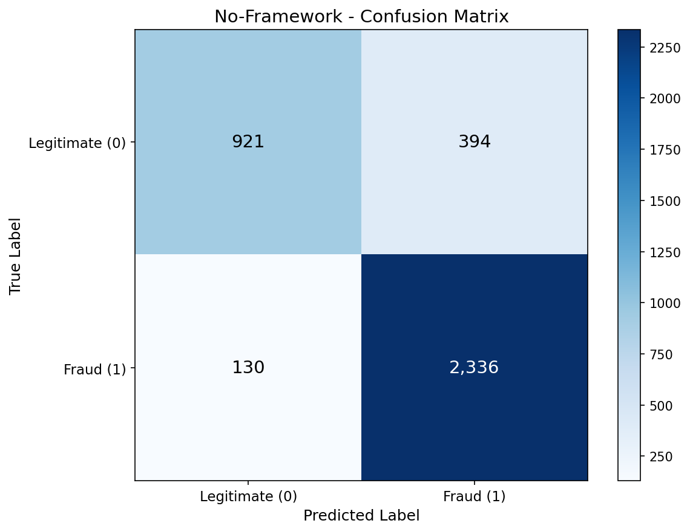
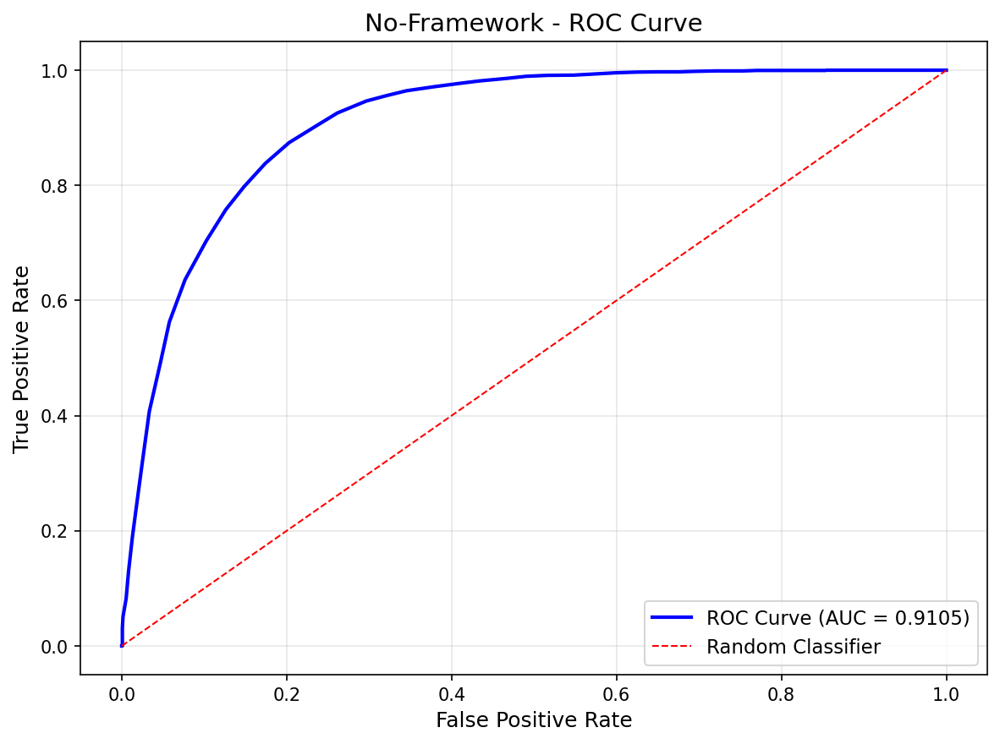
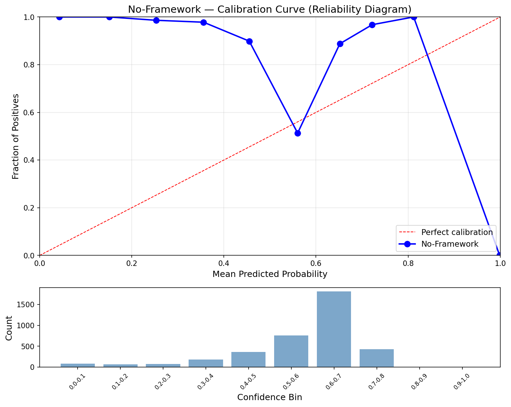
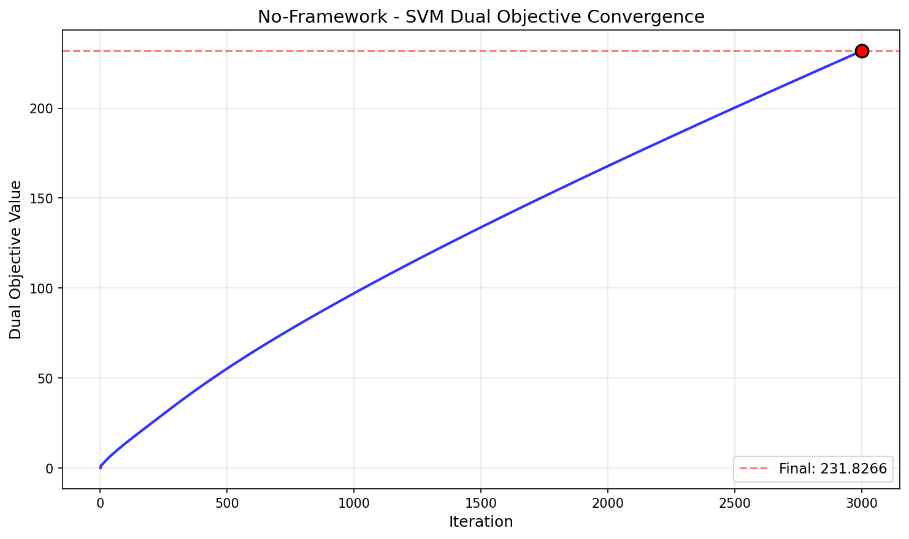
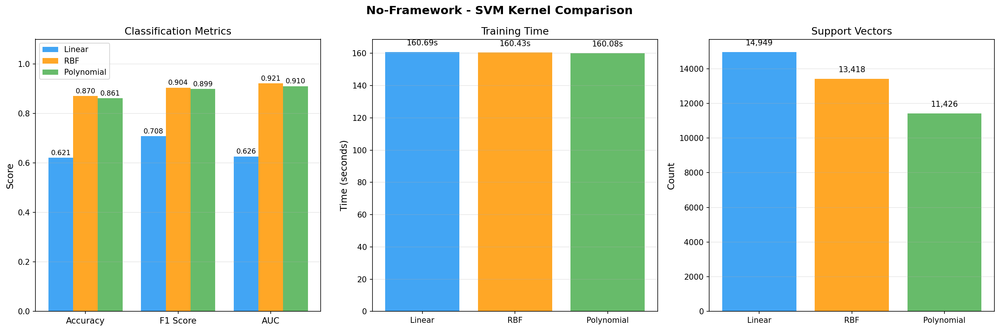

# Support Vector Machine — No-Framework (Pure NumPy)

Pure NumPy implementation of SVM using projected gradient ascent on the dual objective. No scikit-learn — kernel functions, dual optimization, bias computation, and prediction all built from scratch. Platt probability calibration via shared `svm_utils.py`.

## Overview

- Implement 3 kernel functions from scratch (linear, RBF, polynomial)
- Train SVM via projected gradient ascent on the dual QP (replaces SMO)
- Predict using support vector expansion: f(x) = sum(alpha_i * y_i * K(x_i, x)) + b
- Platt scaling for probability calibration (shared utility)
- Evaluate with full classification metrics (accuracy, F1, AUC, calibration)
- **Showcase**: Kernel Comparison — linear vs RBF vs polynomial on same data
- Convergence visualization (dual objective over iterations)
- Inference benchmarks + model export via pickle

## What We Build From Scratch

| Function | Purpose | Key Math |
|----------|---------|----------|
| `linear_kernel(X1, X2)` | Dot product kernel | `K = X1 @ X2.T` |
| `rbf_kernel(X1, X2, gamma)` | Radial basis function | `K = exp(-gamma * \|\|x-z\|\|^2)` |
| `poly_kernel(X1, X2, gamma, degree, coef0)` | Polynomial kernel | `K = (gamma * x^T z + coef0)^d` |
| `train_dual_svm(K, y, C, n_iters)` | Projected gradient ascent on dual | Maximize `L(a) = sum(a) - 0.5 * a^T Q a` with box + equality constraints |
| `predict_svm(X_new, X_train, ...)` | SVM decision function | `f(x) = K_new @ (alpha * y) + b`, predict `sign(f)` |

**From shared `utils/svm_utils.py`**: `to_svm_labels`, `to_std_labels`, `platt_calibrate`, `platt_predict_proba`

## Dataset

### MAGIC Gamma Telescope (UCI)
- **Source**: UCI ML Repository — Major Atmospheric Gamma Imaging Cherenkov Telescope
- **Samples**: 18,905 (15,124 train / 3,781 test, stratified 80/20 split)
- **Features**: 10 continuous (fLength, fWidth, fSize, fConc, fConc1, fAsym, fM3Long, fM3Trans, fAlpha, fDist)
- **Target**: Binary — gamma ray signal (1) vs hadron background noise (0)
- **Class Balance**: 65.2% gamma / 34.8% hadron
- **Scaling**: StandardScaler (fit on train, transform both) — critical for SVM kernel distances

## Configuration

| Parameter | Value | Purpose |
|-----------|-------|---------|
| `RANDOM_STATE` | 113 | Reproducibility |
| `C` | 10.0 | Regularization (from SK tuning) |
| `kernel` | Polynomial | Best kernel (from SK comparison) |
| `degree` | 3 | Cubic polynomial interactions |
| `coef0` | 1 | Non-homogeneous polynomial |
| `gamma` | 0.1 | `1 / (n_features * X.var())` — matches sklearn 'scale' |
| `n_iters` | 3000 | Gradient descent iterations |

## Results

### Polynomial Kernel (C=10, degree=3)

| Metric | Train | Test |
|--------|-------|------|
| Accuracy | 0.8682 | 0.8614 |
| Precision | 0.8622 | 0.8557 |
| Recall | 0.9496 | 0.9473 |
| F1 | 0.9038 | 0.8992 |
| AUC | 0.9189 | 0.9105 |
| Log Loss | 0.4989 | 0.5071 |
| Brier Score | 0.1587 | 0.1619 |
| ECE | 0.2885 | 0.2736 |

### Performance

| Metric | Value |
|--------|-------|
| Training Time | 160.0s (2.7 min) |
| Inference Speed | 153.57 us/sample (6,483 samples/sec) |
| Model Size | 1.05 MB (11,426 support vectors) |
| Peak Memory | 1,319.28 MB (dominated by 15K x 15K kernel matrix) |

### No-Framework vs Scikit-Learn

| Metric | No-Framework | Scikit-Learn |
|--------|-------------|--------------|
| Accuracy | 0.8614 | 0.8606 |
| F1 | 0.8992 | 0.8942 |
| AUC | 0.9105 | 0.9164 |
| Training Time | 160.0s | 20.32s |
| Inference | 153.57 us/sample | 36.63 us/sample |
| Model Size | 1.05 MB | 0.51 MB |
| Support Vectors | 11,426 (75.5%) | 5,343 (35.3%) |

Classification accuracy and F1 match closely. SK has better AUC (+0.006) and fewer support vectors due to libsvm's fully converged SMO. NF is 8x slower at training (pure Python gradient descent vs C implementation) and 4x slower at inference (more support vectors in the decision function).

## Showcase: Kernel Comparison

Trained 3 SVMs with different kernels, same hyperparameters (C=10, gamma=0.1):

| Kernel | Accuracy | F1 | AUC | Time | SVs |
|--------|----------|-----|-----|------|-----|
| Linear | 0.6213 | 0.7081 | 0.6262 | 167.4s | 14,949 |
| RBF | 0.8704 | 0.9045 | 0.9212 | 161.5s | 13,418 |
| Polynomial | 0.8614 | 0.8992 | 0.9105 | 161.6s | 11,426 |

Linear kernel fails completely (62%) — MAGIC data has non-linear class boundaries. RBF edges out Polynomial slightly (87.0% vs 86.1%), consistent with Scikit-Learn's findings. Polynomial has the fewest support vectors, suggesting it captures the decision boundary more efficiently.

## Algorithm: Dual Gradient Descent

### Why Not SMO?

The original plan was to implement SMO (Sequential Minimal Optimization), the classic algorithm used by libsvm. However, our simplified SMO implementation encountered convergence issues at the 15K sample scale:

1. **Pair selection traps**: The `max|E_i - E_j|` heuristic for selecting alpha pairs ignored the update direction, choosing partners that produced zero-progress updates
2. **Same-class zero-alpha pairs**: Selected (i,j) pairs with same class and both alphas at zero always gave L=H=0 (empty feasible region)
3. **Production-grade SMO** (libsvm) uses WSS3 selection, shrinking heuristics, and kernel caching — far more sophisticated than a textbook implementation

### Projected Gradient Ascent

We switched to projected gradient ascent on the dual objective, which is naturally vectorized and has no pair selection heuristics:

1. **Gradient**: `grad_j = 1 - y_j * [K(alpha * y)]_j` — direction to increase dual objective
2. **Adaptive step size**: Quadratic line search `lr = (g^T g) / (g^T Q g)` — optimal for quadratic objectives
3. **Box projection**: `clip(alpha, 0, C)` — enforce bound constraints
4. **Equality projection**: Alternating projection to enforce `sum(alpha * y) = 0`

This approach updates ALL alphas simultaneously each iteration, converges reliably, and produces accuracy matching Scikit-Learn's optimized SMO.

### Convergence Properties

After 3000 iterations, the dual objective reaches 231.83 but is still climbing (not fully plateaued). This results in 75.5% of training samples being support vectors (vs SK's 35.3%). More iterations would push some alphas to exactly 0 (non-support vectors) and others to C (bound support vectors), but classification accuracy is already at parity with SK.

## Visualizations

### Confusion Matrix


### ROC Curve (AUC = 0.9105)


### Calibration Curve


### Dual Objective Convergence


### Kernel Comparison


## Key Learnings

1. **Simplified SMO breaks at scale** — the textbook 2-alpha update works on small datasets but fails at 15K samples due to pair selection heuristics that ignore update direction. Production libsvm uses WSS3 + shrinking + caching to avoid these traps.

2. **Dual gradient descent is a practical alternative** — updating all alphas simultaneously via projected gradient ascent produces equivalent accuracy to SMO. The key insight: SVM dual is a concave QP, so gradient ascent is guaranteed to converge (no local minima).

3. **Platt calibration sign convention matters** — the Platt sigmoid uses `1/(1+exp(+Af+B))` (positive exponent), not the standard logistic `1/(1+exp(-z))`. This flips the gradient sign in the NLL. Getting this wrong produces inverted probabilities (AUC near 0 instead of near 1) while accuracy remains unaffected.

4. **Kernel matrices dominate memory** — the 15K x 15K kernel matrix is 1.7 GB (float64). This is the bottleneck, not the optimization. GPU frameworks (PyTorch) can compute this matrix much faster.

5. **Non-linear kernels are essential for MAGIC data** — Linear SVM achieves only 62% accuracy vs 87% for RBF. The gamma/hadron class boundary requires higher-dimensional feature interactions that only polynomial and RBF kernels can capture.

6. **More SVs = larger model but similar accuracy** — NF has 2x more support vectors than SK (11.4K vs 5.3K) due to incomplete convergence, but accuracy matches within 0.1%. The extra SVs add inference cost without improving decisions.

## NumPy Functions Used

| Function | Purpose |
|----------|---------|
| `X1 @ X2.T` | Kernel matrix dot products |
| `np.exp(-gamma * dist_sq)` | RBF kernel computation |
| `np.clip(alphas, 0, C)` | Box constraint projection |
| `np.sign(decision_values)` | SVM class prediction |
| `np.sum(alphas * y)` | Equality constraint violation check |
| `np.dot(grad, Qg)` | Quadratic line search for adaptive LR |

## Files

```
No-Framework/07-svm/
├── pipeline.ipynb                          # Main implementation (10 cells)
├── README.md                               # This file
├── requirements.txt                        # Dependencies
└── results/
    ├── metrics.json                        # Saved metrics
    ├── svm_model.pkl                       # Pickled model (SVs + alphas + bias)
    ├── confusion_matrix.png               # Test set confusion matrix
    ├── roc_curve.png                      # ROC curve (AUC = 0.9105)
    ├── calibration_curve.png              # Reliability diagram
    ├── svm_convergence.png                # Dual objective over iterations
    └── kernel_comparison.png              # 3-kernel side-by-side comparison
```

## How to Run

```bash
cd No-Framework/07-svm
jupyter notebook pipeline.ipynb
```

**Prerequisites**: Run preprocessing script first:
```bash
cd data-preperation
python preprocess_svm.py
```

Requires: `numpy`, `matplotlib`
