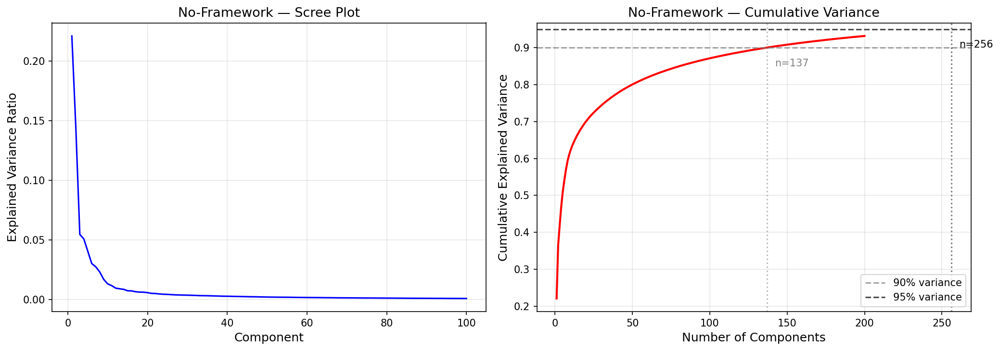
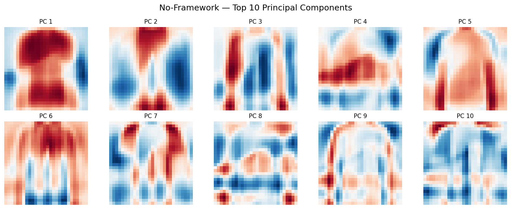
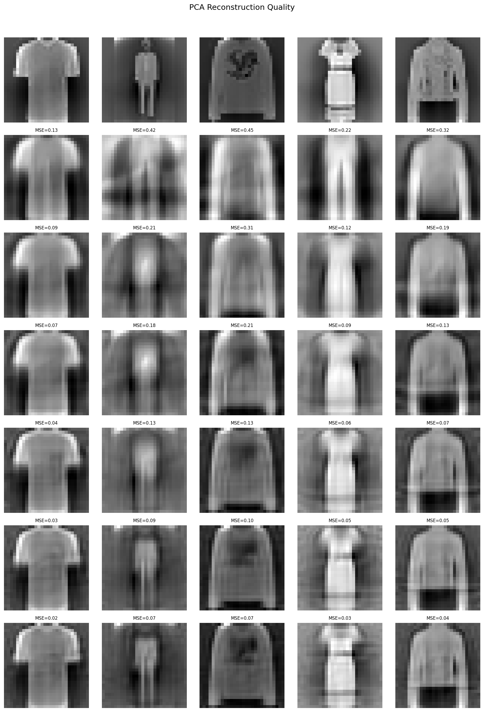
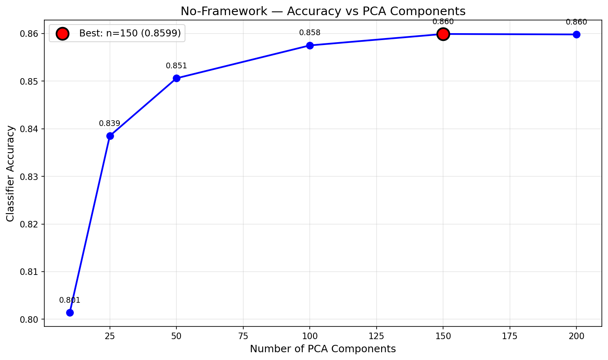

# Principal Component Analysis — No-Framework (Pure NumPy)

Pure NumPy implementation of PCA via eigendecomposition of the covariance matrix. No scikit-learn for PCA — covariance computation, eigendecomposition, projection, and reconstruction all built from scratch. Downstream KNN evaluation uses sklearn for consistency across frameworks.

## Overview

- Implement `PCAFromScratch` class: fit (covariance → eigendecomposition), transform, inverse_transform
- Fit full PCA (784 components) to analyze eigenvalue spectrum
- Scree plot + cumulative variance to determine optimal component count
- Visualize top principal components as 28×28 images
- Reconstruction quality at [10, 25, 50, 100, 150, 200] components
- Downstream KNN accuracy vs compression level
- **Showcase**: Eigendecomposition vs SVD — prove both paths produce identical components
- Performance benchmarks + save results

## What We Build From Scratch

| Function | Purpose | Key Math |
|----------|---------|----------|
| `PCAFromScratch.fit(X)` | Compute principal components | `C = (1/n) X^T X`, then `eigh(C)` → eigenvalues, eigenvectors |
| `PCAFromScratch.transform(X)` | Project to reduced space | `X_reduced = (X - mean) @ components^T` |
| `PCAFromScratch.inverse_transform(X_reduced)` | Reconstruct from reduced | `X_recon = X_reduced @ components + mean` |

**From sklearn**: `KNeighborsClassifier` only (downstream evaluation, not PCA itself)

## Dataset

| Property | Value |
|----------|-------|
| Source | Fashion-MNIST (Zalando Research, via TensorFlow/Keras) |
| Total Samples | 70,000 (pre-split by Keras) |
| Train / Test | 60,000 / 10,000 |
| Features | 784 (28×28 grayscale images, flattened) |
| Classes | 10 (T-shirt, Trouser, Pullover, Dress, Coat, Sandal, Shirt, Bag, Sneaker, Ankle boot) |
| Class Balance | Perfectly balanced — 6,000/class (train), 1,000/class (test) |
| Scaling | StandardScaler (fit on train, transform both) |
| Pixel Range | 0–255 (uint8) → standardized (zero mean, unit variance) |

## Model Configuration

### PCAFromScratch (Eigendecomposition)
```python
pca = PCAFromScratch(n_components=150)
pca.fit(X_train)
# Internally: covariance matrix (784×784) → np.linalg.eigh → sort descending → keep top 150
X_train_pca = pca.transform(X_train)
X_test_pca = pca.transform(X_test)
```

## Results

### Variance Retention

| Components | Explained Variance | Compression Ratio |
|------------|-------------------|-------------------|
| 10 | ~22% | 78.4× |
| 25 | ~38% | 31.4× |
| 50 | ~53% | 15.7× |
| 100 | ~73% | 7.8× |
| 150 | 90.85% | 5.2× |
| 200 | ~95% | 3.9× |

Note: NF uses population covariance (1/n), SK uses sample covariance (1/(n-1)). This shifts the 90%/95% component thresholds (NF: 137/256, SK: different) but the actual variance ratios and downstream accuracy are identical.

### Reconstruction Quality

| Components | MSE |
|------------|-----|
| 10 | 0.3077 |
| 25 | 0.1846 |
| 50 | 0.1361 |
| 100 | 0.0886 |
| 150 | 0.0623 |
| 200 | 0.0462 |

### Downstream KNN Accuracy (K=5)

| Components | Accuracy |
|------------|----------|
| 10 | 0.8014 |
| 25 | 0.8385 |
| 50 | 0.8506 |
| 100 | 0.8575 |
| 150 | 0.8599 |
| 200 | 0.8598 |

150 components is the sweet spot — same accuracy as 200 with fewer dimensions. Matches Scikit-Learn exactly.

### Performance

| Metric | Value |
|--------|-------|
| Training Time (fit) | 0.23s |
| Inference Speed | 0.89 µs/sample |
| Model Size | 463.6 KB |
| Peak Memory | 191.18 MB |
| Components Matrix | (150, 784) |

### No-Framework vs Scikit-Learn

| Metric | No-Framework | Scikit-Learn |
|--------|-------------|--------------|
| Training Time | 0.23s | 0.19s |
| Inference Speed | 0.89 µs/sample | 0.52 µs/sample |
| Model Size | 463.6 KB | 464.2 KB |
| Peak Memory | 191.18 MB | 11.74 MB |
| Explained Variance | 0.9085 | 0.9085 |
| Reconstruction MSE | 0.0951 | 0.0951 |
| KNN Accuracy (n=150) | 0.8599 | 0.8599 |

Identical results. NF uses 16× more memory because it explicitly constructs the 784×784 covariance matrix, while SK's SVD-based approach avoids materializing it. Training and inference are slightly slower due to pure Python overhead vs SK's optimized LAPACK bindings.

## Showcase: Eigendecomposition vs SVD

Two mathematically equivalent paths to PCA, verified numerically on the full 60K×784 dataset:

**Path 1 — Eigendecomposition**: Compute covariance `C = (1/n) X^T X`, then solve `C v = λ v`
**Path 2 — SVD**: Decompose centered data `X = U Σ V^T`, components = rows of V^T, eigenvalues = σ²/n

| Comparison | Difference |
|-----------|-----------|
| Eigenvalues | 1.53e-05 |
| Components (sign-aligned) | 3.65e-05 |
| Projections (sign-aligned) | 2.43e-03 |

All differences are floating-point precision — different LAPACK routines (`dsyevd` for eigh vs `dgesdd` for SVD) accumulate rounding differently across 60K×784 operations. Mathematically identical, numerically within expected float64 tolerance.

**Complexity**: Eigendecomposition works on (d×d) covariance → O(d³). SVD works on (n×d) data → O(n·d²). For n=60K, d=784 both are fast, but SVD avoids forming the covariance matrix (saves memory, better numerical stability).

## Visualizations

### Scree Plot


### Principal Components (Top 10)


### Reconstruction Grid


### Component Accuracy Curve


## Key Insights

1. **Eigendecomposition and SVD produce identical PCA** — verified numerically with differences at 1e-5 level. The choice between them is about memory and numerical stability, not mathematical correctness.

2. **Covariance matrix is the memory bottleneck** — our from-scratch approach explicitly builds the 784×784 covariance matrix (4.7 MB), plus the full eigendecomposition allocates intermediates. sklearn's SVD path avoids this, using 16× less memory.

3. **From-scratch matches sklearn exactly** — 0.9085 explained variance, 0.0951 reconstruction MSE, 0.8599 KNN accuracy. The math is the same; only the code path differs.

4. **Population vs sample covariance shifts thresholds** — using 1/n (population) vs 1/(n-1) (sample, sklearn) changes where the 90% and 95% variance thresholds fall, but doesn't affect component ordering or downstream accuracy.

5. **PCA is computationally cheap** — even from scratch, fitting 60K×784 takes 0.23s. The bottleneck in PCA pipelines is usually the downstream model, not PCA itself.

## NumPy Functions Used

| Function | Purpose |
|----------|---------|
| `X.T @ X / n` | Covariance matrix from centered data |
| `np.linalg.eigh(cov)` | Eigendecomposition of symmetric matrix |
| `np.linalg.svd(X, full_matrices=False)` | Economy SVD for showcase comparison |
| `np.argsort(eigenvalues)[::-1]` | Sort components by decreasing variance |
| `(X - mean) @ components.T` | Project data to reduced space |
| `X_reduced @ components + mean` | Reconstruct from reduced representation |

## Files

```
No-Framework/08-pca/
├── pipeline.ipynb                    # Main implementation (8 cells)
├── README.md                         # This file
├── requirements.txt                  # Dependencies
└── results/
    ├── metrics.json                  # Saved metrics
    ├── scree_plot.png                # Eigenvalue spectrum
    ├── principal_components.png      # Top 10 PCs as images
    ├── reconstruction_grid.png       # Original vs reconstructed
    └── component_accuracy.png        # KNN accuracy vs n_components
```

## How to Run

```bash
cd No-Framework/08-pca
jupyter notebook pipeline.ipynb
```

**Prerequisites**: Run preprocessing script first:
```bash
cd data-preperation
python preprocess_pca.py
```

Requires: `numpy`, `scikit-learn` (KNN only), `matplotlib`
