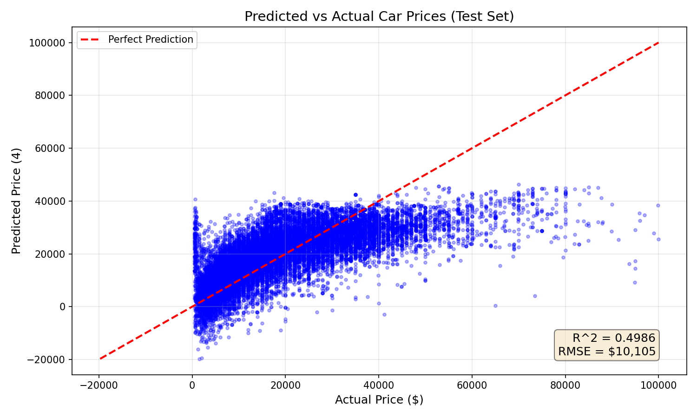
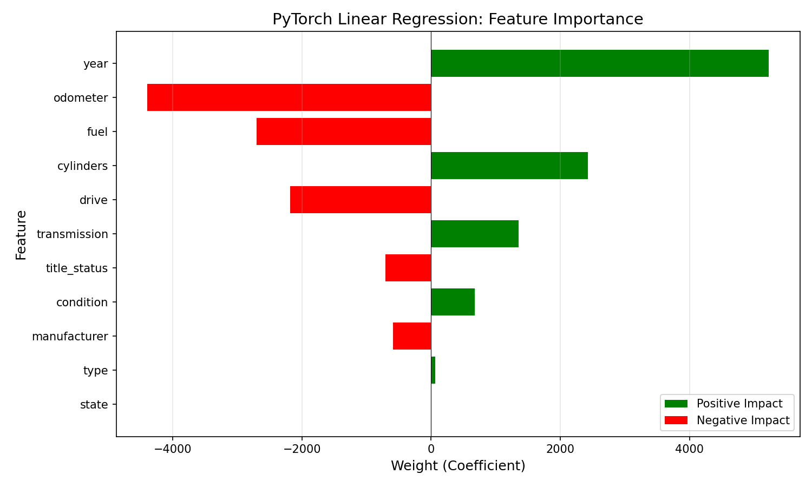

# PyTorch Linear Regression

PyTorch implementation of linear regression using autograd and gradient descent.

## Overview

This implementation predicts used car prices using PyTorch's neural network modules. It serves as a comparison to No-Framework and Scikit-Learn, demonstrating PyTorch's autograd system versus manual gradient computation.

## Dataset

- **Source**: [Craigslist Cars/Trucks Dataset](https://www.kaggle.com/datasets/austinreese/craigslist-carstrucks-data)
- **Samples**: 100,000 (sampled from ~350k cleaned rows)
- **Features**: 11 (year, manufacturer, condition, cylinders, fuel, odometer, title_status, transmission, drive, type, state)
- **Target**: Price ($500 - $100,000)

## Key Difference: Autograd vs Manual Gradients

| Aspect | No-Framework | PyTorch |
|--------|--------------|---------|
| Gradient Computation | Manual calculus | Automatic (autograd) |
| Weight Management | Separate variables | Encapsulated in `nn.Linear` |
| Training Loop | Manual updates | `optimizer.step()` |
| Code Complexity | ~200 lines | ~80 lines |
| GPU Support | No | Yes |

## Results

| Metric | Training Set | Test Set |
|--------|--------------|----------|
| MSE    | 101,652,944  | 102,115,050 |
| RMSE   | $10,082      | $10,105  |
| R²     | 0.4933       | 0.4986   |

**Interpretation**: The model explains ~50% of price variance with an average prediction error of ~$10,100. No overfitting detected (R² gap: -0.005).

## Framework Comparison

| Metric | No-Framework | Scikit-Learn | PyTorch |
|--------|--------------|--------------|---------|
| Training Time | 0.3799 sec | 0.0258 sec | 3.4400 sec |
| Peak Memory | 1.96 MB | 14.76 MB | 54.18 MB |
| Test RMSE | $10,058 | $10,105 | $10,105 |
| Test R² | 0.4983 | 0.4986 | 0.4986 |

**Key Insight**: PyTorch is slower and uses more memory for simple linear regression due to autograd overhead. PyTorch shines on complex neural networks, not simple linear models.

## Learned Weights (Feature Importance)

| Feature | Weight | Impact on Price |
|---------|--------|-----------------|
| year | +$5,191 | Newer cars cost more |
| odometer | -$4,482 | Higher mileage = lower price |
| cylinders | +$2,401 | Larger engines cost more |
| fuel | -$2,722 | Diesel costs more than gas |
| drive | -$2,166 | 4WD costs more than FWD/RWD |
| transmission | +$1,271 | Manual slightly higher value |
| title_status | -$772 | Clean titles worth more |
| condition | +$703 | Better condition = higher price |
| manufacturer | -$588 | Brand effect (limited by encoding) |
| type | +$69 | Minimal body type effect |
| state | -$22 | Minimal geographic effect |

## PyTorch Functions Used

| PyTorch | No-Framework Equivalent |
|---------|------------------------|
| `torch.tensor()` | NumPy arrays |
| `nn.Linear(11, 1)` | `weights = np.zeros(11)` + `bias = 0` |
| `nn.MSELoss()` | `compute_cost()` |
| `optim.SGD()` | Manual `weights -= lr * gradient` |
| `loss.backward()` | `compute_gradients()` |
| `optimizer.step()` | Manual weight updates |
| `torch.no_grad()` | N/A (no gradient tracking in NumPy) |

## Visualizations

### Training Convergence


### Predicted vs Actual



### Feature Importance



## Key Learnings

1. **Autograd eliminates manual calculus** — `loss.backward()` replaces our entire `compute_gradients()` function

2. **PyTorch has overhead for simple tasks** — The computational graph tracking that enables autograd adds time and memory cost

3. **Same results validate implementation** — Matching R² and RMSE confirms our PyTorch code is correct

4. **Framework choice matters** — For linear regression, Scikit-Learn is the best choice. PyTorch's power emerges with neural networks.

5. **Tensors require explicit dtype** — PyTorch expects `float32`, unlike NumPy's default `float64`

## Files

```text
PyTorch/01-linear-regression/
├── pipeline.ipynb          # Main implementation
├── README.md               # This file
├── requirements.txt        # Dependencies
└── results/
    ├── cost_curve.png
    ├── predictions_vs_actual.png
    └── feature_importance.png
```

## How to Run

```bash
cd PyTorch/01-linear-regression
pip install -r requirements.txt
jupyter notebook pipeline.ipynb
```

Requires: `torch`, `numpy`, `pandas`, `matplotlib`, `scikit-learn`
