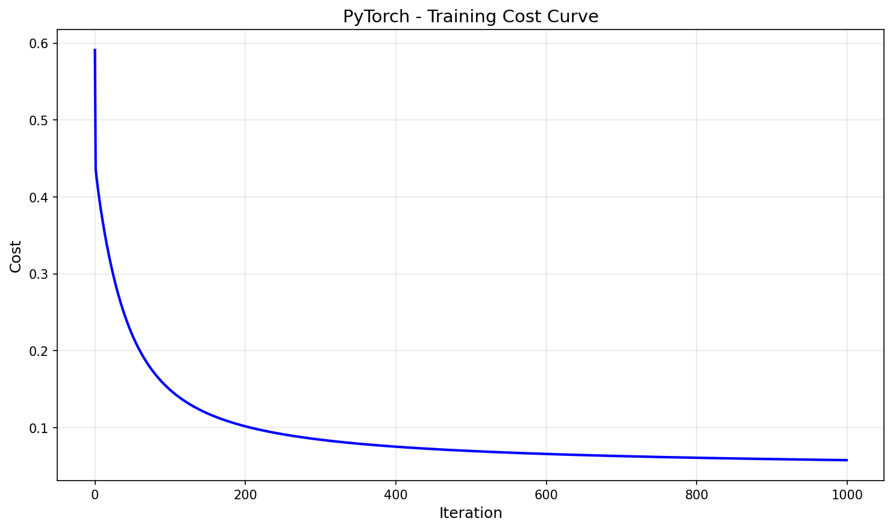
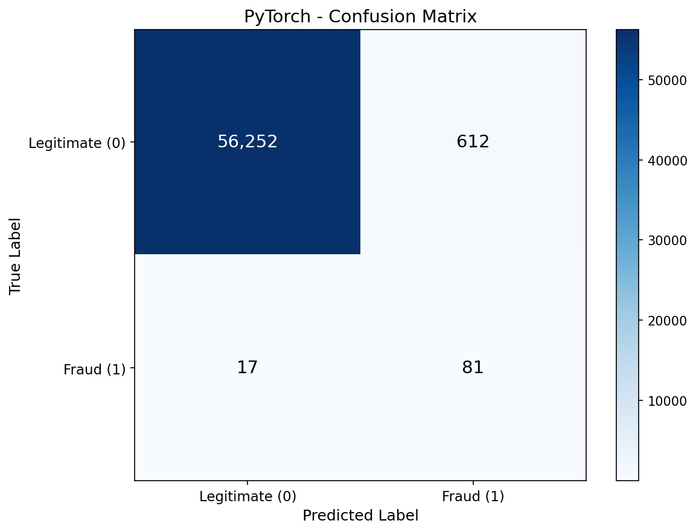
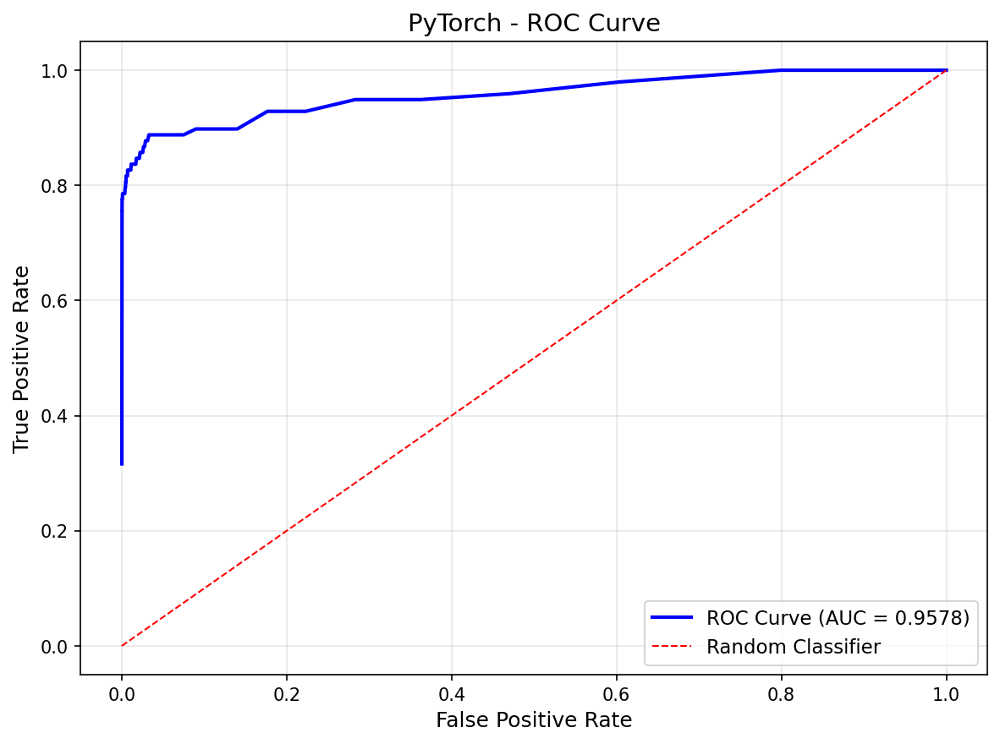
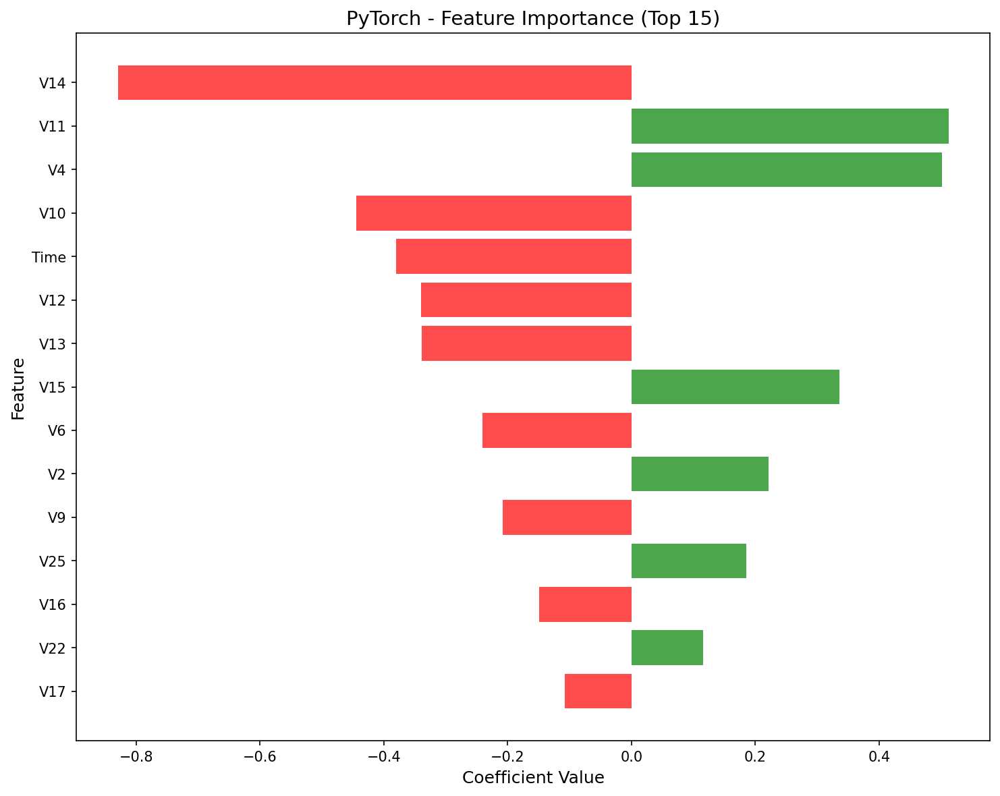

# PyTorch Logistic Regression

PyTorch implementation of logistic regression for fraud detection using autograd for automatic differentiation.

## Overview

This implementation classifies credit card transactions as legitimate or fraudulent using PyTorch's `nn.Linear` and `BCEWithLogitsLoss`. PyTorch's autograd system automatically computes gradients, eliminating manual derivative calculations while maintaining the same SGD optimization as our No-Framework version.

## Dataset

- **Source**: [Kaggle Credit Card Fraud Detection](https://www.kaggle.com/datasets/mlg-ulb/creditcardfraud)
- **Samples**: 284,807 transactions
- **Features**: 30 (Time, V1-V28 from PCA, Amount)
- **Target**: Class (0 = legitimate, 1 = fraud)
- **Imbalance**: 99.83% legitimate, 0.17% fraud (492 fraud cases)

## Preprocessing: SMOTE + Filtering

To handle extreme class imbalance, we used a multi-step approach:

1. **SMOTE Oversampling**: Generated 3.5x synthetic fraud samples
2. **Tight Filtering**: Removed synthetic samples outside 1.5 std of real fraud distribution
3. **Trim to 50/50**: Randomly sampled to achieve balanced training set

**Result**: 454,902 training samples (50% fraud, 50% legitimate)

Test set preserves original distribution (0.17% fraud) for realistic evaluation.

## PyTorch Approach

### Model Architecture
```python
model = nn.Linear(in_features=30, out_features=1)
criterion = nn.BCEWithLogitsLoss()
optimizer = optim.SGD(model.parameters(), lr=0.1)
```

### Key Concepts
- **`nn.Linear`**: Single layer with 30 inputs, 1 output (learnable weights + bias)
- **`BCEWithLogitsLoss`**: Combines sigmoid + BCE for numerical stability
- **Autograd**: `loss.backward()` computes all gradients automatically
- **`optimizer.step()`**: Updates weights using computed gradients

### Training Loop Pattern
```python
for epoch in range(n_epochs):
    logits = model(X_train)           # Forward pass
    loss = criterion(logits, y_train) # Compute loss
    optimizer.zero_grad()             # Clear old gradients
    loss.backward()                   # Compute new gradients
    optimizer.step()                  # Update weights
```

## Results

| Metric | Test Set |
|--------|----------|
| Accuracy | 98.90% |
| Precision | 11.69% |
| Recall | 82.65% |
| F1 Score | 20.48% |
| AUC-ROC | 90.34% |

### Confusion Matrix Breakdown

| | Predicted Legit | Predicted Fraud |
|---|---|---|
| **Actual Legit** | 56,252 (TN) | 612 (FP) |
| **Actual Fraud** | 17 (FN) | 81 (TP) |

**Interpretation**:
- Results nearly identical to No-Framework — both use SGD with same learning rate
- Proves autograd computes correct gradients automatically
- Same precision/recall tradeoff as other implementations

## Performance

- **Training Time**: 2.36 sec
- **Peak Memory**: 0.05 MB (Note: PyTorch manages memory outside Python's tracemalloc)
- **Epochs**: 1000

### Comparison Across Frameworks

| Framework | Time | Recall | Method |
|-----------|------|--------|--------|
| No-Framework | 18.34s | 82.65% | Manual gradient descent |
| Scikit-Learn | 0.32s | 81.63% | L-BFGS optimizer |
| **PyTorch** | **2.36s** | **82.65%** | **SGD + autograd** |

PyTorch is **7.8x faster** than No-Framework thanks to optimized tensor operations, while achieving identical results.

## Components Used

- `nn.Linear` for learnable weights and bias
- `BCEWithLogitsLoss` for numerically stable loss
- `optim.SGD` for gradient descent optimization
- `loss.backward()` for automatic gradient computation
- `torch.no_grad()` for inference without tracking
- `model.eval()` for evaluation mode

## Visualizations

### Training Convergence


### Confusion Matrix


### ROC Curve


### Feature Importance


## Key Learnings

1. **Autograd eliminates manual gradients** — `loss.backward()` computes derivatives automatically, reducing code and errors.

2. **Same results as No-Framework** — Identical metrics prove autograd computes correct gradients.

3. **7.8x faster than manual** — PyTorch's C++ backend and optimized tensor ops provide significant speedup.

4. **BCEWithLogitsLoss is preferred** — Combining sigmoid + BCE in one function avoids numerical instability from log(0).

5. **Tensor conversion required** — Must convert NumPy arrays to `torch.float32` tensors before training.

## Files

```
PyTorch/02-logistic-regression/
├── pipeline.ipynb      # Main implementation notebook
├── README.md           # This file
├── requirements.txt    # Dependencies
└── results/
    ├── cost_curve.png
    ├── confusion_matrix.png
    ├── roc_curve.png
    └── feature_importance.png
```

## How to Run

```bash
cd PyTorch/02-logistic-regression
jupyter notebook pipeline.ipynb
```

**Prerequisites**: Run preprocessing script first:
```bash
cd data-preperation
python preprocess_logistic.py
```

Requires: `numpy`, `matplotlib`, `torch`
