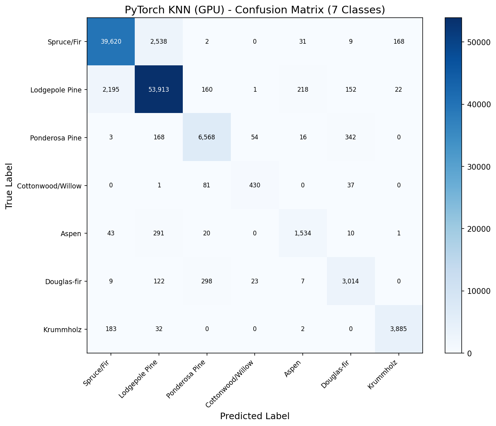
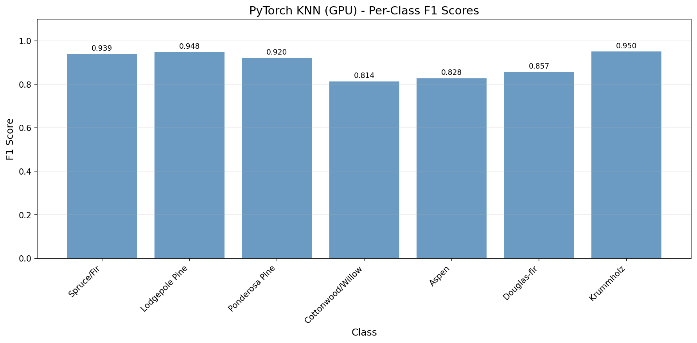

# K-Nearest Neighbors (KNN) - PyTorch Implementation

Multi-class classification on the **Covertype (Forest Cover Type)** dataset using PyTorch GPU acceleration.

## Overview

This implementation leverages PyTorch's GPU-accelerated tensor operations for KNN prediction. While KNN isn't a neural network, PyTorch's `torch.cdist` provides highly optimized pairwise distance computation that runs on CUDA cores, making it significantly faster than CPU-based implementations.

**Key Insight**: GPU acceleration provides **~10x speedup over No-Framework** (1,164 vs ~1.5 predictions/sec) by parallelizing distance calculations across thousands of CUDA cores, though Scikit-Learn's KD-tree optimization still wins for this dataset size.

## Dataset

| Property | Value |
|----------|-------|
| Source | UCI ML Repository / `sklearn.datasets.fetch_covtype` |
| Total Samples | 581,012 |
| Train / Test | 464,809 / 116,203 (80/20 split) |
| Features | 54 (elevation, slope, soil types, wilderness areas) |
| Classes | 7 forest cover types |
| Preprocessing | StandardScaler (fit on train only) |

### Forest Cover Types
1. Spruce/Fir (36.46%)
2. Lodgepole Pine (48.76%)
3. Ponderosa Pine (6.15%)
4. Cottonwood/Willow (0.47%)
5. Aspen (1.63%)
6. Douglas-fir (2.99%)
7. Krummholz (3.53%)

## PyTorch Approach

### Key Components

```python
# GPU-accelerated pairwise Manhattan distance
distances = torch.cdist(batch, X_train, p=1)

# Efficient top-k selection
k_distances, k_indices = torch.topk(distances, k, largest=False)

# Distance-weighted voting
weights = 1.0 / (k_distances + epsilon)
```

### GPU Memory Management

```python
# Batched prediction to fit in 24GB VRAM
# Distance matrix per batch: (2000 × 464,809) × 4 bytes ≈ 3.7 GB
for start_idx in range(0, n_test, batch_size):
    batch = X_test[start_idx:end_idx]
    distances = torch.cdist(batch, X_train, p=1)
```

### Hardware Utilized
- **GPU**: NVIDIA GeForce RTX 4090 (24GB VRAM)
- **CUDA**: 12.1
- **PyTorch**: 2.5.1+cu121

## Results & Performance

| Metric | Value |
|--------|-------|
| Test Accuracy | 93.77% |
| Macro F1 Score | 0.8935 |
| Prediction Time | 100 seconds (116K samples) |
| Peak GPU Memory | 7,217.90 MB |
| Throughput | 1,164 samples/second |

### Best Hyperparameters (from Scikit-Learn GridSearchCV)
- `n_neighbors`: 3
- `metric`: manhattan (p=1)
- `weights`: distance

### Per-Class F1 Scores
| Class | F1 Score |
|-------|----------|
| Spruce/Fir | 0.9386 |
| Lodgepole Pine | 0.9481 |
| Ponderosa Pine | 0.9199 |
| Cottonwood/Willow | 0.8136 |
| Aspen | 0.8276 |
| Douglas-fir | 0.8566 |
| Krummholz | 0.9501 |

## Framework Comparison

| Framework | Accuracy | Time | Speed | Notes |
|-----------|----------|------|-------|-------|
| Scikit-Learn | 93.77% | 57s | ~2,000/sec | KD-tree + multi-core CPU |
| PyTorch (GPU) | 93.77% | 100s | ~1,164/sec | Brute force + RTX 4090 |
| No-Framework | 93.79% | ~2 hrs | ~1.5/sec | Brute force + single-thread |

## Visualizations

### Confusion Matrix


### Per-Class F1 Scores


## Key Insights

1. **Identical accuracy to Scikit-Learn** — Confirms our GPU implementation is mathematically correct.

2. **GPU parallelization helps but KD-trees win** — For 464K training samples, Scikit-Learn's tree-based approach (O(log n) lookups) beats brute-force GPU distance computation (O(n)).

3. **~7.2 GB peak GPU memory** — Distance matrices are memory-intensive. Batching (2000 samples) keeps us well within 24GB VRAM.

4. **776x faster than No-Framework** — GPU parallelization provides massive speedup over single-threaded NumPy.

5. **torch.cdist is powerful** — Single function call computes all pairwise distances with Manhattan (p=1), Euclidean (p=2), or any Minkowski distance.

## When to Use GPU KNN

| Scenario | Recommendation |
|----------|----------------|
| < 100K training samples | Scikit-Learn (KD-tree) |
| > 1M training samples | GPU brute-force may win |
| Real-time inference | Pre-computed index (FAISS) |
| Learning/prototyping | PyTorch for GPU familiarity |

## Files

```
PyTorch/03-knn/
├── pipeline.ipynb      # Main implementation notebook
├── README.md           # This file
├── requirements.txt    # Dependencies
└── results/
    ├── confusion_matrix.png
    ├── per_class_f1.png
    └── metrics.json
```

## How to Run

```bash
cd PyTorch/03-knn
jupyter notebook pipeline.ipynb
```

**Prerequisites**:
1. Run preprocessing script first:
```bash
cd data-preperation
python preprocess_knn.py
```

2. Ensure PyTorch is installed with CUDA support:
```bash
pip install torch --index-url https://download.pytorch.org/whl/cu121
```

Requires: `numpy`, `matplotlib`, `torch` (with CUDA)
