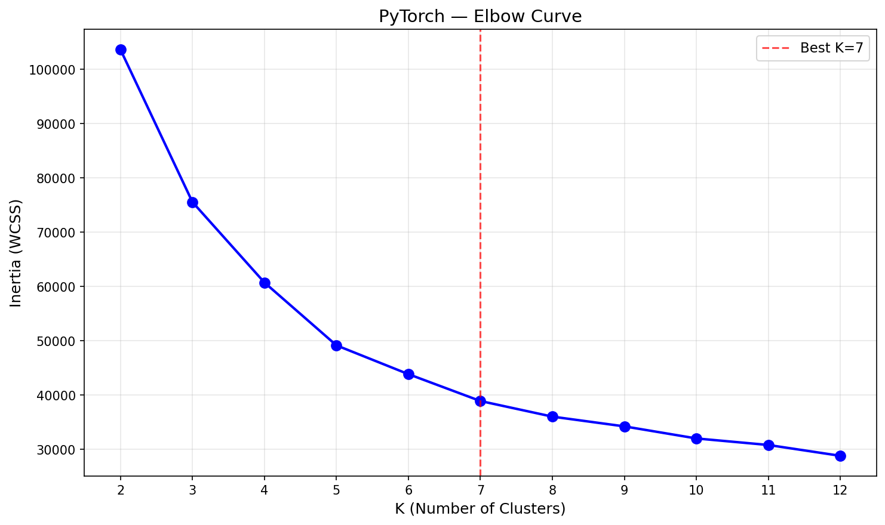
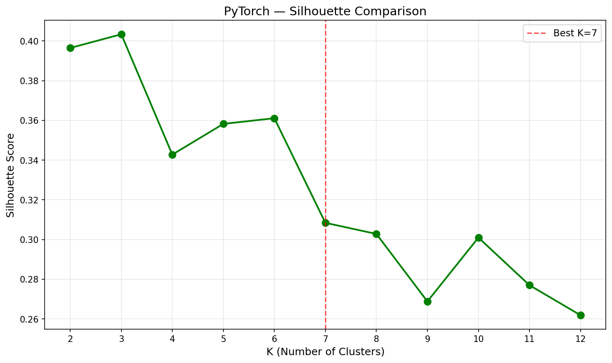
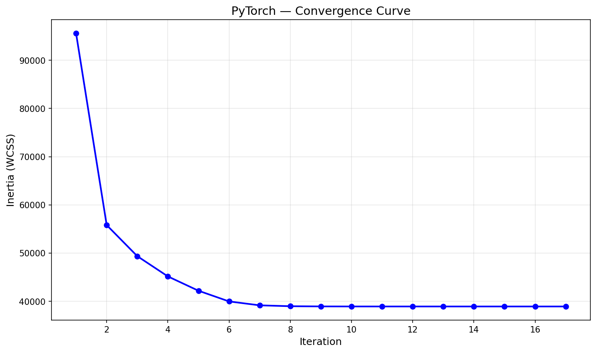

# K-Means Clustering — PyTorch (GPU-Accelerated)

GPU-accelerated K-Means using PyTorch tensor operations. Same Lloyd's algorithm as No-Framework, but distance computation, cluster assignment, and centroid updates all run on CUDA cores.

## Overview

This implementation leverages PyTorch's GPU-accelerated tensor operations for K-Means clustering. `torch.cdist` handles pairwise distances, `torch.multinomial` enables GPU-native weighted sampling for K-Means++ initialization, and boolean masking performs centroid updates — all on GPU without CPU round-trips.

**PyTorch showcases**: `torch.compile` investigation (torch.cdist vs manual broadcasting speed comparison) and `torch.vmap` for parallel n_init runs.

## Dataset

| Property | Value |
|----------|-------|
| Source | UCI ML Repository / `sklearn.datasets.fetch_openml('dry-bean')` |
| Total Samples | 13,611 (13,543 after deduplication) |
| Train / Test | 10,834 / 2,709 (80/20 stratified split) |
| Features | 16 geometric measurements |
| Classes | 7 bean types |
| Preprocessing | StandardScaler (fit on train only) |

### Bean Types
| Class | Percentage |
|-------|-----------|
| DERMASON | 26.0% |
| SIRA | 19.0% |
| SEKER | 15.2% |
| HOROZ | 13.0% |
| BARBUNYA | 10.1% |
| CALI | 12.7% |
| BOMBAY | 3.8% |

## PyTorch Approach

### Key Components
```python
# GPU-accelerated pairwise Euclidean distance
all_dists = torch.cdist(X, centroids, p=2)

# Parallel cluster assignment
distances, labels = all_dists.min(dim=1)

# GPU-native weighted sampling for K-Means++ init
idx = torch.multinomial(weights, 1, generator=rng)

# Boolean masking for centroid updates
centroids[i] = X[mask].mean(dim=0)
```

### Hardware Utilized
- **GPU**: NVIDIA GeForce RTX 4090 (24GB VRAM)
- **CUDA**: 12.1
- **PyTorch**: 2.5.1+cu121

## Results

### K-Tuning Decision
- **K=3**: Highest silhouette score (0.4034) — geometric optimum
- **K=7**: Matches actual bean class count — selected for ARI evaluation

### Performance (K=7)

| Metric | Train | Test |
|--------|-------|------|
| Inertia | 38,925.51 | 9,976.28 |
| Silhouette | 0.3084 | 0.3064 |
| ARI | 0.6660 | 0.6684 |

| Runtime Metric | Value |
|---------------|-------|
| Iterations | 17 |
| Training Time | 0.3359s |
| Peak GPU Memory | 0.01 MB |

### PyTorch Showcase 1: torch.compile Investigation

Attempted `torch.compile` (TorchInductor JIT) on Windows + PyTorch 2.5.1:
- `kmeans_single_run_gpu` — graph breaks from `.item()` and dynamic `break`
- `assign_clusters_gpu` — `torch.cdist` not decomposable by TorchInductor
- Manual broadcasting version — TorchInductor backend limited on Windows

**Alternative finding**: Manual broadcasting vs `torch.cdist` speed comparison:

| Method | Time (avg 5 runs) | Ratio |
|--------|-------------------|-------|
| torch.cdist | 0.0657s | 1.0x |
| Manual broadcasting | 0.0346s | 1.9x faster |

### PyTorch Showcase 2: torch.vmap (Parallel n_init)

`torch.vmap` vectorizes n_init runs to execute in parallel on GPU instead of sequentially. Requires pure tensor functions — rewrote centroid update to use one-hot encoding + matrix multiply instead of Python loops.

| Approach | Time (50 fixed iters × 5 runs) | Ratio |
|----------|-------------------------------|-------|
| Sequential loop | 0.1367s | 1.0x |
| torch.vmap parallel | 0.1186s | 1.15x faster |

Modest speedup at this scale (10K samples, 5 runs). Benefit grows with larger datasets and more n_init runs.

## Framework Comparison (3/4)

| Metric | Scikit-Learn | No-Framework | PyTorch |
|--------|-------------|-------------|---------|
| Test Inertia | 9,981.06 | 9,976.28 | 9,976.28 |
| Test Silhouette | 0.3061 | 0.3064 | 0.3064 |
| Test ARI | 0.6686 | 0.6684 | 0.6684 |
| Iterations | 26 | 19 | 17 |
| Training Time | 0.0614s | 1.0159s | 0.3359s |
| Peak Memory | 2.71 MB | 19.44 MB | 0.01 MB |

## Visualizations

### Elbow Curve (K-Tuning)


### Silhouette Comparison (K-Tuning)


### Silhouette Analysis (K=7)


### Convergence Curve


## Key Insights

1. **Identical metrics to No-Framework** — Inertia, silhouette, and ARI match exactly, confirming correct GPU implementation.

2. **Minimal GPU memory (0.01 MB)** — Dataset is small (10K × 16). K-Means' intermediate tensors are tiny compared to KNN's distance matrices. GPU memory benefits show at larger scale.

3. **3x faster than No-Framework, 5x slower than Scikit-Learn** — GPU parallelism helps vs pure NumPy, but sklearn's optimized C code wins at this dataset size.

4. **torch.compile limited on Windows** — TorchInductor backend has limited Windows support in PyTorch 2.5.1. Manual broadcasting was 1.9x faster than torch.cdist — a useful finding regardless.

5. **torch.vmap works but modest gains** — 1.15x speedup with 5 parallel runs on 10K samples. The pure tensor rewrite (one-hot + matmul instead of Python loops) is the real takeaway.

## Files

```
PyTorch/04-k-means/
├── pipeline.ipynb      # Main implementation notebook
├── README.md           # This file
├── requirements.txt    # Dependencies
└── results/
    ├── elbow_curve.png
    ├── silhouette_comparison.png
    ├── silhouette_analysis.png
    ├── convergence_curve.png
    └── metrics.json
```

## How to Run

```bash
cd PyTorch/04-k-means
jupyter notebook pipeline.ipynb
```

**Prerequisites**:
1. Run preprocessing script first:
```bash
cd data-preperation
python preprocess_kmeans.py
```

2. Ensure PyTorch is installed with CUDA support:
```bash
pip install torch --index-url https://download.pytorch.org/whl/cu121
```

Requires: `numpy`, `matplotlib`, `torch` (with CUDA)
