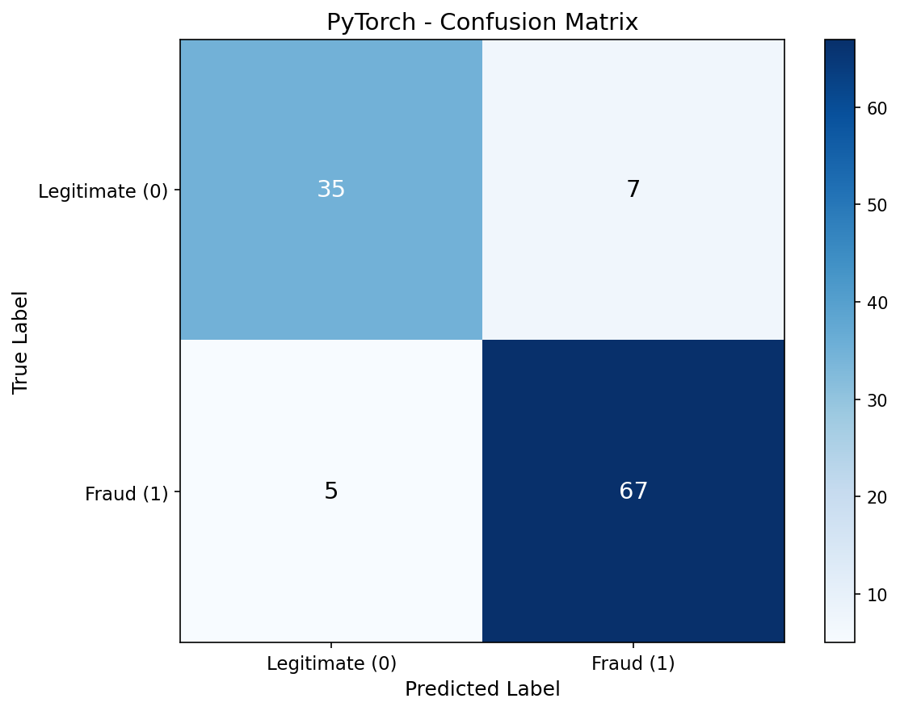
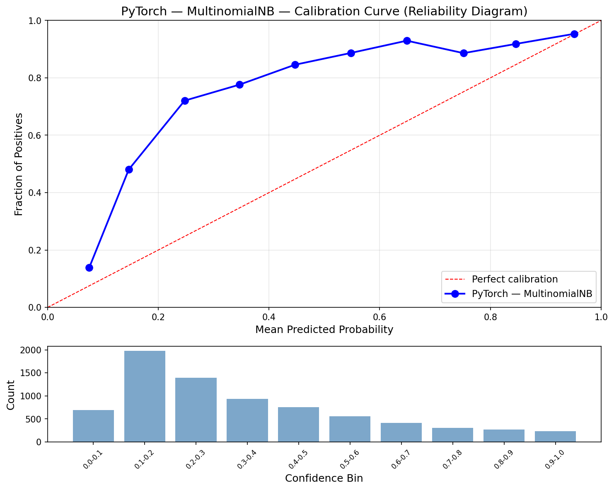
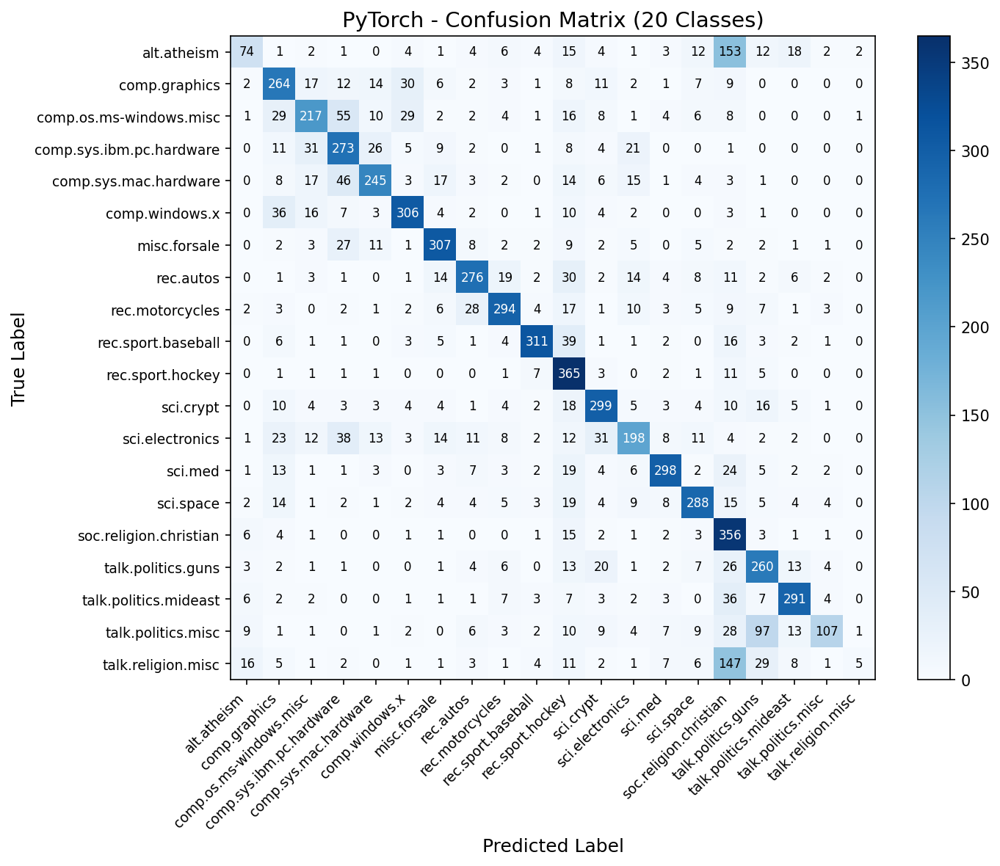

# PyTorch Naive Bayes (GPU-Accelerated)

Both Naive Bayes variants implemented using PyTorch tensors on GPU. All math operations — means, variances, log-probabilities, matrix multiply prediction — run on CUDA via the RTX 4090.

## Overview

Two-part pipeline with GPU-accelerated Naive Bayes:
- **Part 1**: GaussianNB on Breast Cancer (binary classification baseline)
- **Part 2**: MultinomialNB on 20 Newsgroups (text classification main event)
- **Showcase**: CPU vs GPU inference speed — benchmarking the big matmul that dominates prediction

## Datasets

### Breast Cancer Wisconsin (GaussianNB)
- **Samples**: 569 (455 train / 114 test, stratified 80/20 split)
- **Features**: 30 continuous (mean, SE, worst of 10 cell nucleus measurements)
- **Target**: Malignant (0) or Benign (1)
- **Tensor dtype**: float64 (matches numpy precision for exact metric parity)

### 20 Newsgroups (MultinomialNB)
- **Samples**: 18,846 (11,314 train / 7,532 test, published benchmark split)
- **Features**: 10,000 TF-IDF terms
- **Target**: 20 newsgroup categories
- **Tensor dtype**: float32 (GPU speed for the large matmul)

## Configuration

| Parameter | Value | Purpose |
|-----------|-------|---------|
| `RANDOM_STATE` | 113 | Reproducibility |
| `ALPHA` | 1.0 | Laplace smoothing |
| `VAR_SMOOTHING` | 1e-9 | Variance floor for GaussianNB |
| `device` | `cuda` | NVIDIA RTX 4090 (25.8 GB VRAM) |

## Results

### Part 1: GaussianNB (Breast Cancer)

| Metric | Train | Test |
|--------|-------|------|
| Accuracy | 0.9385 | 0.8947 |
| Precision | 0.9509 | 0.9054 |
| Recall | 0.9509 | 0.9306 |
| F1 | 0.9509 | 0.9178 |
| AUC | 0.9592 | 0.9363 |
| Log Loss | 0.7158 | 1.0123 |
| Brier Score | 0.0608 | 0.0983 |
| ECE | 0.3703 | 0.3590 |

### Part 2: MultinomialNB (20 Newsgroups)

| Metric | Train | Test |
|--------|-------|------|
| Accuracy | 0.8367 | 0.6683 |
| Macro F1 | 0.8194 | 0.6394 |
| Log Loss | 1.1388 | 1.5576 |
| Brier Score | 0.4553 | 0.6008 |
| ECE | 0.4015 | 0.3229 |

### Performance

| Metric | Value |
|--------|-------|
| Training Time | 0.028s |
| Inference Speed | 3.50 μs/sample (285,653 samples/sec) |
| Model Size | 0.76 MB |
| Peak Memory | ~0 MB (data already on GPU) |

### Cross-Framework Comparison

| Metric | Scikit-Learn | No-Framework | PyTorch |
|--------|-------------|--------------|---------|
| Accuracy | 0.6683 | 0.6683 | 0.6683 |
| Macro F1 | 0.6394 | 0.6394 | 0.6394 |
| Log Loss | 1.5576 | 1.5576 | 1.5576 |
| Brier Score | 0.6008 | 0.6008 | 0.6008 |
| ECE | 0.3229 | 0.3229 | 0.3229 |
| Training Time | 0.21s | 0.13s | 0.03s |
| Inference | 17.07 μs | 14.66 μs | 3.50 μs |
| Model Size | 3.05 MB | 1.53 MB | 0.76 MB |

All classification and probabilistic metrics are identical across all 3 frameworks. PyTorch is fastest in every performance dimension.

## Showcase: CPU vs GPU Inference Speed

The MultinomialNB prediction is dominated by one matmul: `X_test @ feature_log_prob.T` — shape (7532, 10000) × (10000, 20), or 150 million multiply-accumulate operations.

### Benchmark Results (100 runs, pure matmul + argmax + logsumexp)

| Metric | CPU | GPU |
|--------|-----|-----|
| Time per run | 6.83 ms | 2.47 ms |
| Per sample | 0.91 μs | 0.33 μs |
| Throughput | 1,102,868/s | 3,044,509/s |
| **Speedup** | — | **2.8x** |

The GPU dispatches the matmul to cuBLAS, NVIDIA's optimized linear algebra library. The 2.8x speedup is modest because:
- The matmul output is small (7532 × 20) — GPU parallelism shines more on larger outputs
- CPU is already fast for this shape (single matmul, no memory bottleneck)
- For CNNs/DNNs with many layers, the GPU advantage compounds dramatically

## PyTorch-Specific Lessons

1. **`torch.zeros()` defaults to float32** — Even if input tensors are float64, `torch.zeros(shape, device=X.device)` creates float32 tensors. Must pass `dtype=X.dtype` explicitly, or assignments silently downcast. This caused NaN log-loss and wrong ECE until fixed.

2. **`torch.logsumexp()` is built-in** — No need for manual log-sum-exp implementation. PyTorch provides it as a first-class operation, numerically stable by design.

3. **`unbiased=False` for variance** — PyTorch's `tensor.var()` defaults to Bessel-corrected (sample) variance (`ddof=1`), while NumPy defaults to population variance (`ddof=0`). Must explicitly set `unbiased=False` to match sklearn/numpy.

4. **float32 vs float64 tradeoff** — GaussianNB needs float64 for exact metric parity (30 features, extreme log-likelihood values). MultinomialNB works fine with float32 (the matmul is the bottleneck, not precision).

5. **GPU memory tracking** — `track_performance(gpu=True)` shows ~0 MB because data was already loaded to GPU in the setup cell. Training itself allocates minimal new memory.

## Functions Defined

| Function | Purpose | Key Detail |
|----------|---------|------------|
| `gaussian_nb_train_gpu(X, y)` | Learn means/vars/priors | `dtype=X.dtype` on all tensor creation |
| `gaussian_nb_predict_gpu(model, X)` | Gaussian log-lik + softmax | `torch.logsumexp()` built-in |
| `multinomial_nb_train_gpu(X, y, alpha)` | Smoothed feature log-probs | Same Laplace smoothing math on GPU |
| `multinomial_nb_predict_gpu(model, X)` | Matmul prediction | `X @ feature_log_prob.T` dispatches to cuBLAS |

## Visualizations

### GaussianNB Calibration Curve


### GaussianNB Confusion Matrix


### MultinomialNB Calibration Curve


### MultinomialNB Confusion Matrix (20 Classes)


### Per-Class F1 Scores


## Files

```
PyTorch/05-naive-bayes/
├── pipeline.ipynb                          # Main implementation (10 cells)
├── README.md                               # This file
├── requirements.txt                        # Dependencies
└── results/
    ├── metrics.json                        # Saved metrics
    ├── gaussian_calibration.png            # GaussianNB reliability diagram
    ├── gaussian_confusion_matrix.png       # GaussianNB confusion matrix
    ├── multinomial_calibration.png         # MultinomialNB reliability diagram
    ├── multinomial_confusion_matrix.png    # 20-class confusion matrix
    └── multinomial_per_class_f1.png        # Per-class F1 bar chart
```

## How to Run

```bash
cd PyTorch/05-naive-bayes
jupyter notebook pipeline.ipynb
```

Requires: `numpy`, `matplotlib`, `torch` (with CUDA support)
