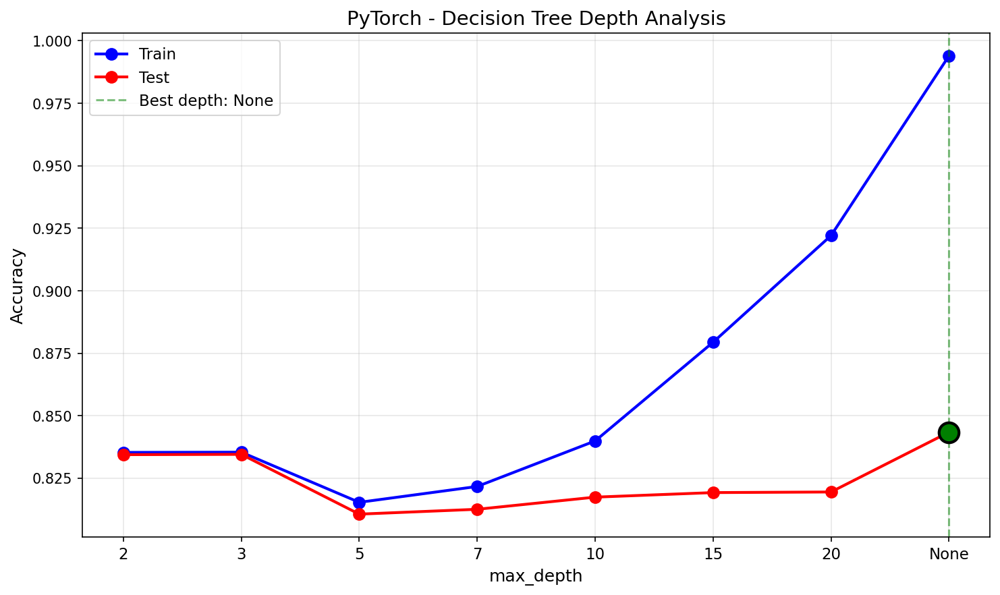
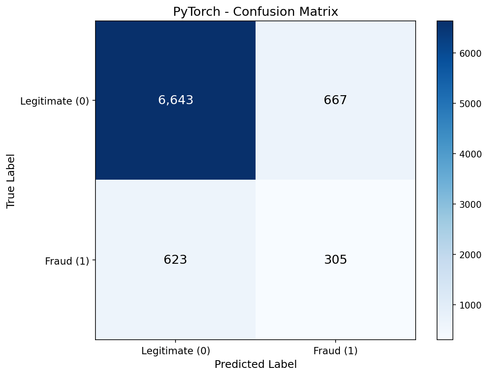
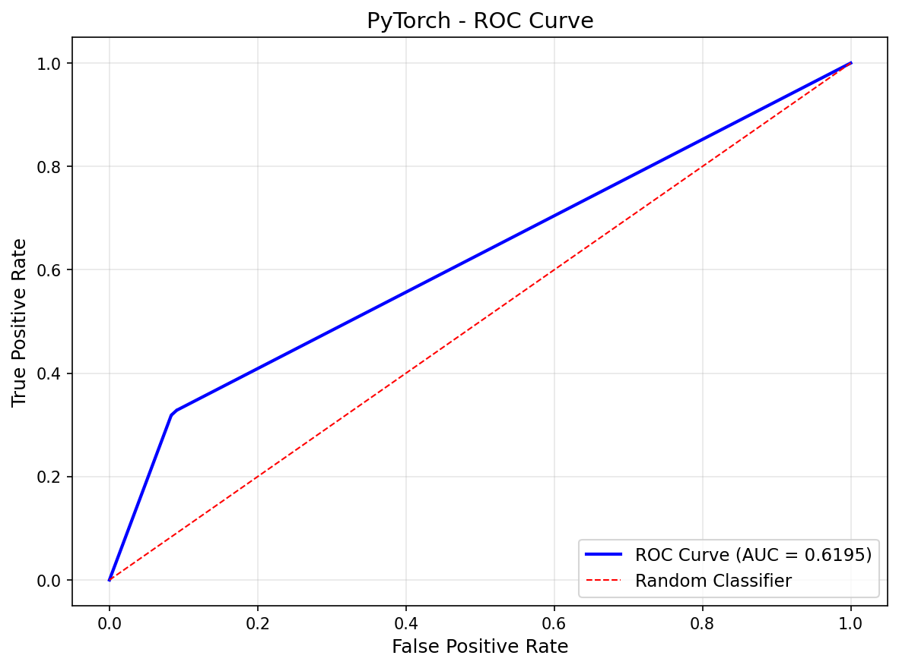
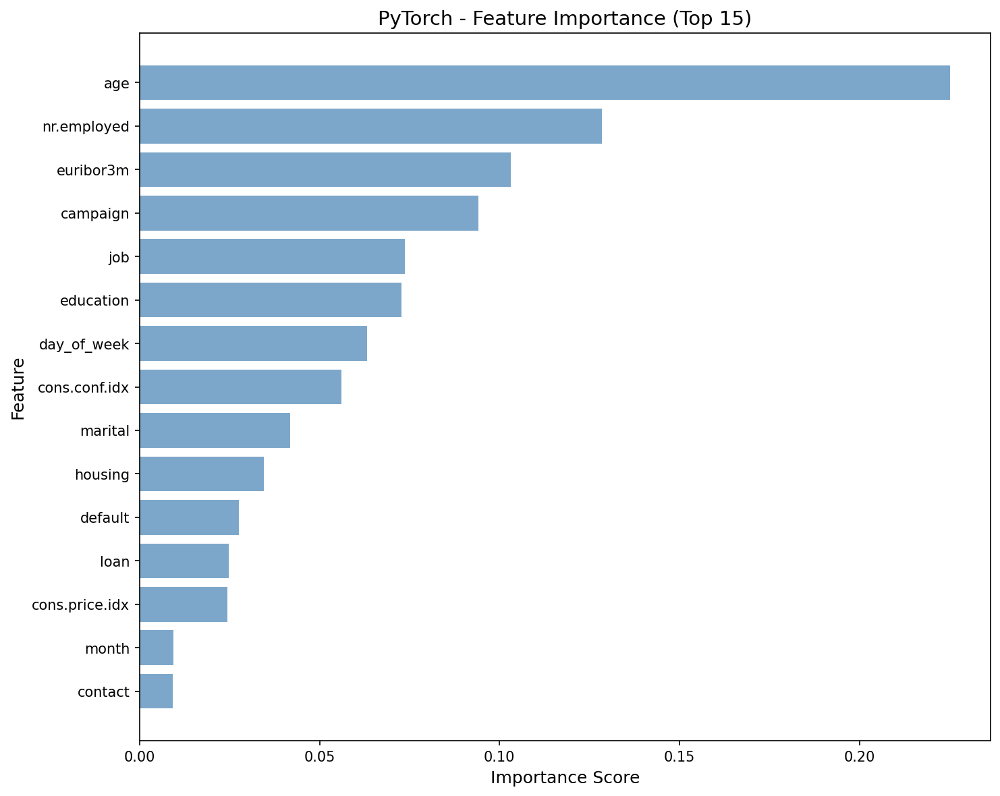
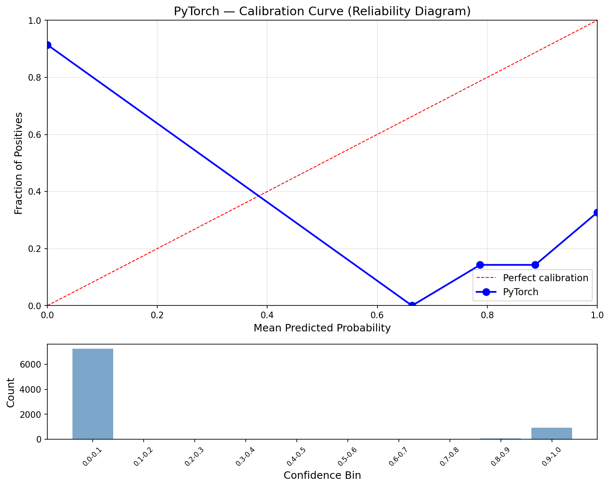
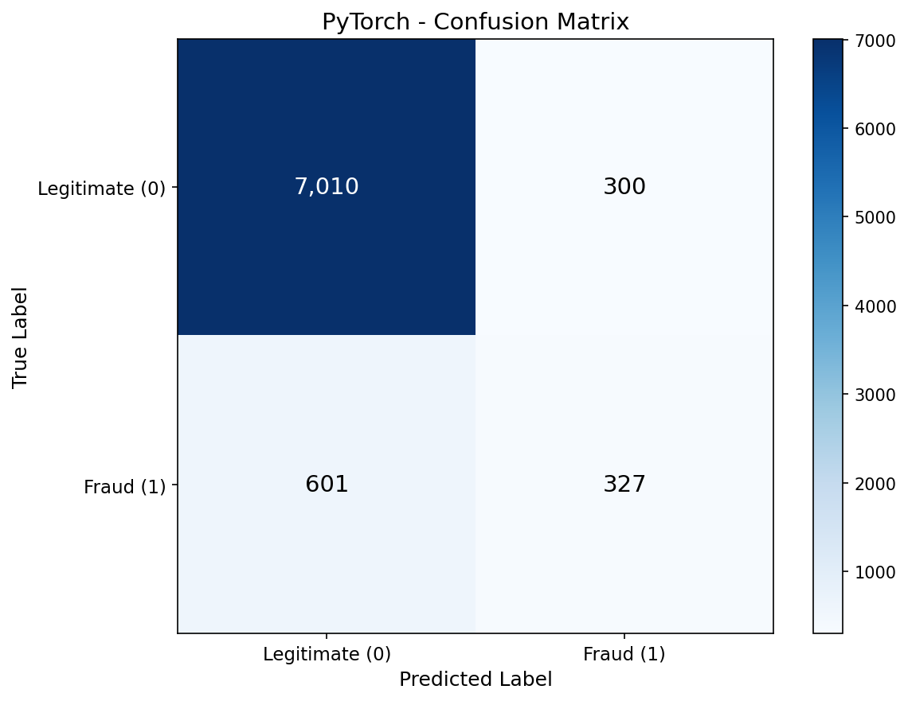
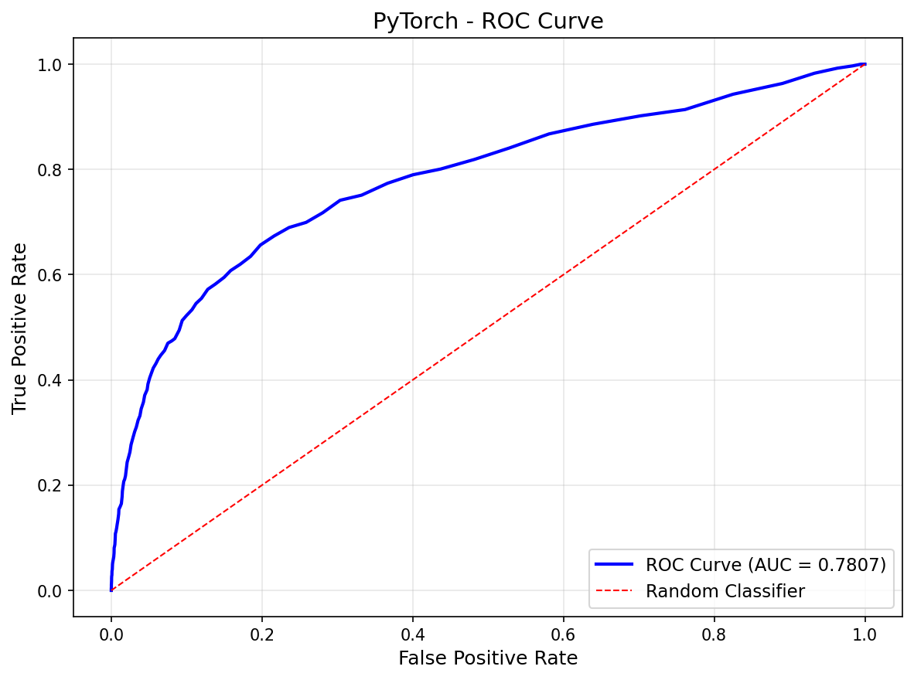
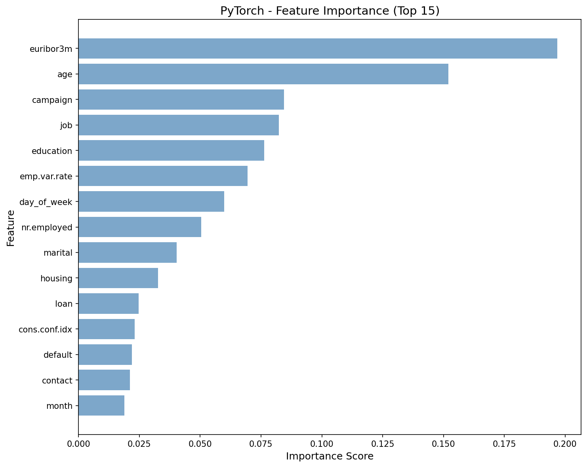
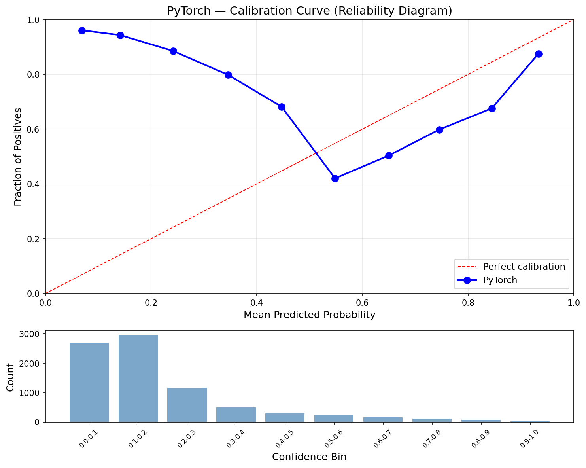
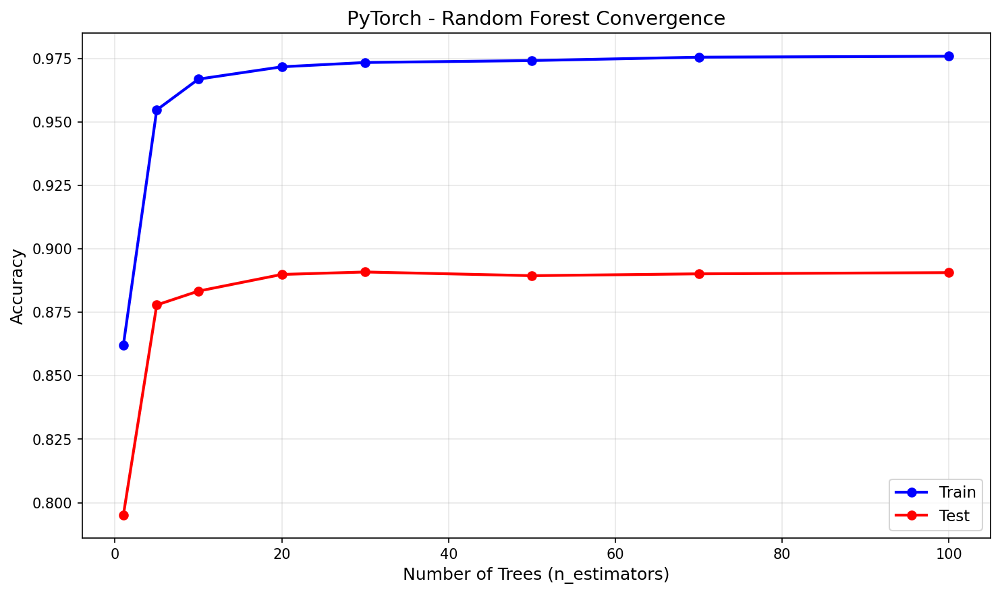

# Decision Trees & Random Forests — PyTorch (GPU-Accelerated)

GPU-accelerated Decision Tree and Random Forest using a **hybrid CPU/GPU approach**: tree structure lives as Python dicts on CPU (recursive by nature), but the computationally expensive **split search** runs on GPU via `torch.sort` + `torch.cumsum`. This vectorizes the sorted-scan algorithm — instead of a Python loop over every threshold, all candidate splits are evaluated simultaneously in a single GPU pass per feature.

## Overview

Two-part pipeline implementing DT and RF with GPU-accelerated split search:
- **Part 1**: Decision Tree with GPU split search + depth analysis sweep (depth 42, 5,378 leaves)
- **Part 2**: Random Forest with 100 bootstrap-aggregated trees, per-node random feature subsets on GPU
- **Showcase**: GPU vs CPU split search benchmark — same `find_best_split_gpu()` on CUDA vs CPU tensors

## Key PyTorch Operations

| Operation | PyTorch Function | Replaces |
|-----------|-----------------|----------|
| Sort features for threshold scan | `torch.sort()` | `np.argsort()` |
| Running class counts (left/right) | `torch.cumsum()` | Python for-loop accumulator |
| Vectorized Gini at all thresholds | Tensor arithmetic | Per-threshold Python calculation |
| Best threshold selection | `torch.argmax()` | Python `max()` tracking |
| Bootstrap sampling | `torch.randint()` | `np.random.choice()` |
| Data partitioning | Boolean tensor masking | NumPy boolean indexing |

## Dataset

### Bank Marketing (UCI)
- **Source**: UCI ML Repository (Moro et al., 2014) — Portuguese banking direct marketing
- **Samples**: 41,188 (32,950 train / 8,238 test, stratified 80/20 split)
- **Features**: 19 (10 categorical ordinal-encoded, 9 continuous)
- **Target**: Term deposit subscription — no (0) / yes (1)
- **Class Imbalance**: 88.7% no / 11.3% yes
- **Dropped**: `duration` (data leakage — only known after call ends)

## Configuration

| Parameter | Value | Purpose |
|-----------|-------|---------|
| `RANDOM_STATE` | 113 | Reproducibility |
| `N_ESTIMATORS` | 100 | Number of trees in forest |
| `MAX_FEATURES` | 'sqrt' | sqrt(19) = 4 random features per split |
| `DEPTH_VALUES` | [2, 3, 5, 7, 10, 15, 20, None] | Depth sweep for analysis |
| `device` | `cuda` (RTX 4090) | GPU for split search |
| `dtype` | `float32` (features), `long` (labels) | Standard PyTorch dtypes |

## Results

### Part 1: Decision Tree (Unrestricted — depth 42, 5,378 leaves)

| Metric | Train | Test |
|--------|-------|------|
| Accuracy | 0.9940 | 0.8434 |
| Precision | 0.9491 | 0.3138 |
| Recall | 1.0000 | 0.3287 |
| F1 | 0.9739 | 0.3211 |
| AUC | 0.9999 | 0.6195 |

Train near 100% vs test 84% — classic overfitting. The tree memorizes noise, not patterns.

### Part 2: Random Forest (100 trees)

| Metric | Train | Test |
|--------|-------|------|
| Accuracy | 0.9758 | 0.8906 |
| Precision | 0.9204 | 0.5215 |
| Recall | 0.8599 | 0.3524 |
| F1 | 0.8891 | 0.4206 |
| AUC | 0.9960 | 0.7807 |

RF improves test accuracy (+4.7%), AUC (+16.1%), and precision (+20.8%) over DT.

### Performance

| Metric | Value |
|--------|-------|
| Training Time | 1473.0s (24.6 min for 100 trees) |
| Inference Speed | 279.79 us/sample (3,574 samples/sec) |
| Model Size | 29.47 MB |
| Peak Memory | 225.15 MB |
| Peak GPU Memory | 25.48 MB |

### Cross-Framework Comparison (3/4)

| Metric | Scikit-Learn | No-Framework | PyTorch |
|--------|-------------|--------------|---------|
| Accuracy | 0.8554 | 0.8897 | 0.8906 |
| F1 | 0.4837 | 0.4101 | 0.4206 |
| AUC | 0.7988 | 0.7801 | 0.7807 |
| Training Time | 21.19s | 1752s (29.2 min) | 1473s (24.6 min) |
| Inference | 3.39 us/sample | 169.46 us/sample | 279.79 us/sample |
| Model Size | 11.50 MB | 55.23 MB | 29.47 MB |
| n_estimators | 200 (GridSearchCV) | 100 | 100 |

PyTorch trains 16% faster than No-Framework (24.6 min vs 29.2 min) thanks to GPU-accelerated split search. Model size is 47% smaller (29.47 MB vs 55.23 MB) — torch tensors in tree value arrays are more compact than numpy arrays with Python dict overhead. Inference is slower because `predict_forest_gpu` must flatten each tree to GPU tensors per call (100 trees x flatten + transfer overhead).

## Showcase: GPU vs CPU Split Search

Benchmarked the same `find_best_split_gpu()` function on CUDA vs CPU tensors (50 runs, 32,950 samples x 19 features):

| Device | Per Split | Total (50 runs) |
|--------|-----------|-----------------|
| GPU (RTX 4090) | 42.09 ms | 2.10 s |
| CPU | 55.30 ms | 2.77 s |
| **Speedup** | **1.31x** | |

The 1.31x speedup is modest at this dataset size (32K samples). GPU kernel launch overhead partially offsets the parallelism gains from `torch.sort` + `torch.cumsum`. The benefit compounds across the full forest — each of 100 trees has hundreds of internal nodes requiring split search, yielding the overall 16% training speedup.

Larger datasets would show greater GPU advantage as the sort/cumsum computation dominates over kernel launch overhead.

## Visualizations

### Decision Tree Depth Analysis


### Decision Tree Confusion Matrix


### Decision Tree ROC Curve


### Decision Tree Feature Importance


### Decision Tree Calibration


### Random Forest Confusion Matrix


### Random Forest ROC Curve


### Random Forest Feature Importance


### Random Forest Calibration


### Random Forest Convergence


## Key Learnings

1. **Hybrid CPU/GPU is the right boundary** — Decision trees are inherently recursive (each split depends on the parent's data partition). The tree dict structure must stay on CPU, but the O(n log n) sort + cumsum at each split node maps naturally to GPU parallelism.

2. **GPU overhead matters at small scale** — At 32K samples, GPU kernel launch overhead consumes much of the `torch.sort` speedup. The 1.31x per-split advantage only compounds to 16% overall training speedup because recursion, data partitioning, and Python dict operations dominate wall time.

3. **`torch.cumsum` is the key vectorization trick** — instead of a Python for-loop accumulating left/right class counts at each threshold position, `torch.cumsum` computes all running sums simultaneously. Combined with `torch.sort`, this evaluates all candidate thresholds in a single GPU pass per feature.

4. **Inference overhead from flatten-per-call** — `predict_forest_gpu` flattens each of 100 trees to GPU tensors on every call. This numpy-to-tensor conversion (100 trees x BFS traversal x dtype conversion) makes PyTorch inference 1.65x slower than No-Framework despite GPU prediction. Caching flat trees would fix this.

5. **float32 precision requires careful clamping** — Probability clamping at `1e-15` had no effect because float32 epsilon is ~1.2e-7. Using `1e-7` prevents log(0) in log-loss without affecting probability quality.

6. **`n_classes` must be global, not local** — Computing `n_classes` from `y_t.max()` inside pure-class leaf nodes produces length-1 value arrays instead of length-2, causing `flatten_tree` to fail with inhomogeneous shape ValueError. Always pass `n_classes` as a parameter.

7. **Model size halves vs No-Framework** — 29.47 MB vs 55.23 MB. The tree dict structure is the same, but PyTorch's forest stores fewer intermediate Python objects per node since the heavy computation happens in-place on GPU tensors.

## Files

```
PyTorch/06-decision-trees-random-forests/
├── pipeline.ipynb                          # Main implementation (12 cells)
├── README.md                               # This file
├── requirements.txt                        # Dependencies
└── results/
    ├── metrics.json                        # Saved metrics
    ├── dt_depth_analysis.png              # Train vs test across max_depth
    ├── dt_confusion_matrix.png            # DT confusion matrix
    ├── dt_roc_curve.png                   # DT ROC curve
    ├── dt_feature_importance.png          # DT Gini importance
    ├── dt_calibration.png                 # DT calibration curve
    ├── rf_confusion_matrix.png            # RF confusion matrix
    ├── rf_roc_curve.png                   # RF ROC curve
    ├── rf_feature_importance.png          # RF averaged Gini importance
    ├── rf_calibration.png                 # RF calibration curve
    └── rf_convergence.png                 # Accuracy vs n_estimators
```

## How to Run

```bash
cd PyTorch/06-decision-trees-random-forests
jupyter notebook pipeline.ipynb
```

**Prerequisites**: Run preprocessing script first:
```bash
cd data-preperation
python preprocess_decision_tree.py
```

Requires: `torch` (CUDA), `numpy`, `matplotlib`
