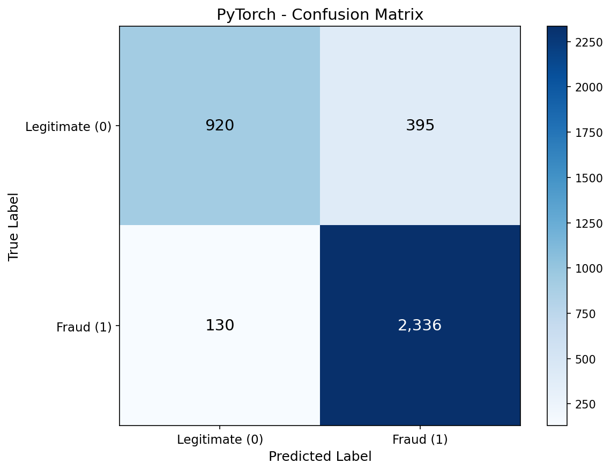
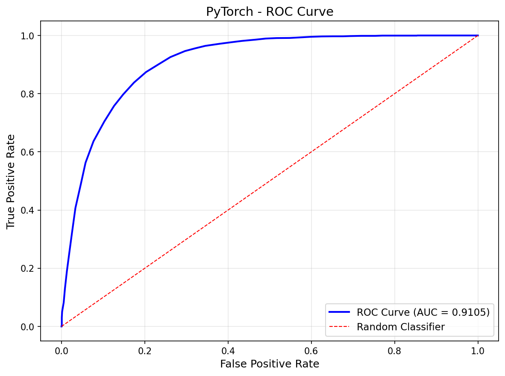
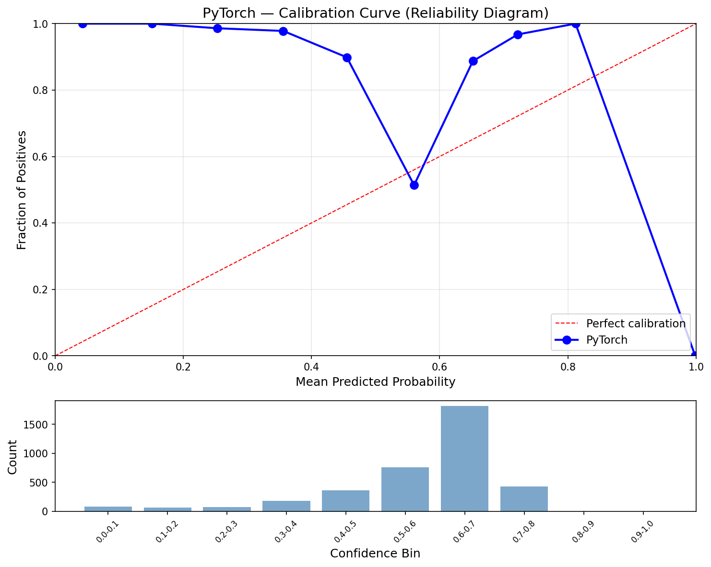
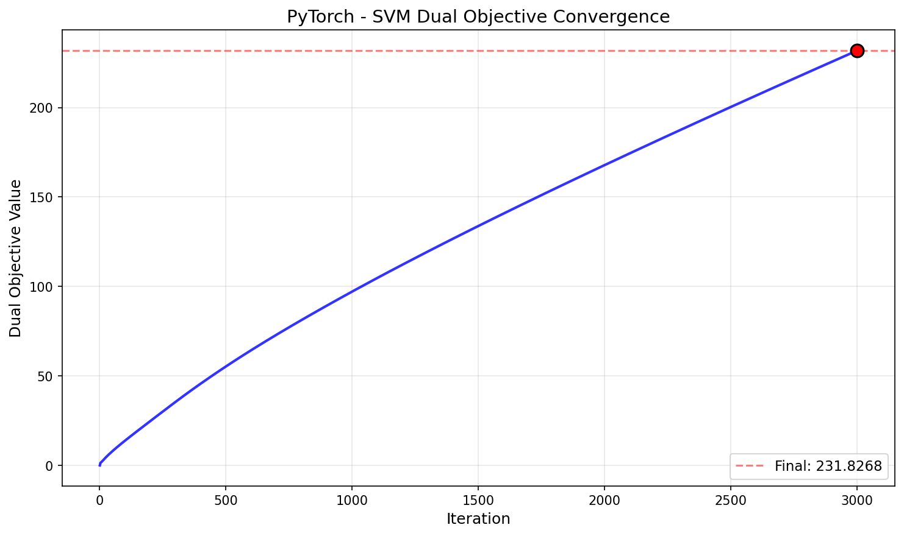
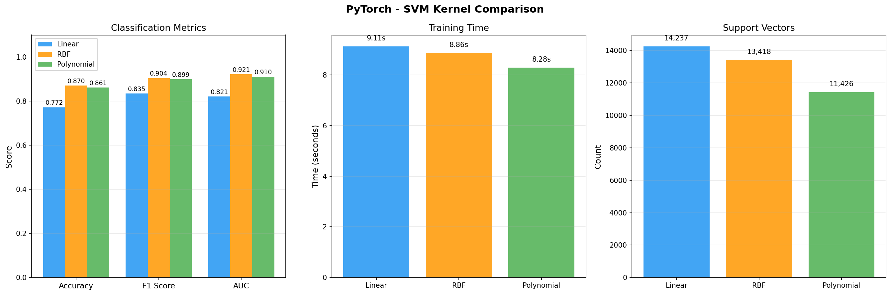

# Support Vector Machine — PyTorch (GPU-Accelerated)

GPU-accelerated SVM using projected gradient ascent on the dual objective with PyTorch CUDA tensors. Same algorithm as No-Framework but the O(n²) kernel matrix computation and gradient matmul dispatch to GPU, yielding 17.7x training speedup. Platt probability calibration on CPU via shared `svm_utils.py`.

## Overview

- Implement 3 GPU kernel functions (linear, RBF, polynomial) using `torch` matmul/exp
- Train SVM via projected gradient ascent on the dual QP — all operations on CUDA tensors
- Predict using support vector expansion on GPU: f(x) = K_new @ (alpha * y) + b
- Platt scaling on CPU (scalar gradient descent, not worth GPU overhead)
- Evaluate with full classification metrics (accuracy, F1, AUC, calibration)
- **Showcase**: Kernel Comparison — linear vs RBF vs polynomial on GPU
- Convergence visualization (dual objective over iterations)
- Inference benchmarks + model size

## What We Build

| Function | Purpose | Key Math |
|----------|---------|----------|
| `linear_kernel_gpu(X1, X2)` | Dot product kernel on GPU | `K = X1 @ X2.T` |
| `rbf_kernel_gpu(X1, X2, gamma)` | Radial basis function on GPU | `K = torch.exp(-gamma * dist_sq)` |
| `poly_kernel_gpu(X1, X2, gamma, degree, coef0)` | Polynomial kernel on GPU | `K = (gamma * X1 @ X2.T + coef0)^d` |
| `train_dual_svm_gpu(K, y, C, n_iters)` | Projected gradient ascent (GPU) | Maximize `L(a) = sum(a) - 0.5 * a^T Q a` |
| `predict_svm_gpu(X_new, X_train, ...)` | SVM decision function (GPU) | `f(x) = K_new @ (alpha * y) + b` |

**From shared `utils/svm_utils.py`** (numpy-only — `.cpu().numpy()` at boundaries): `to_svm_labels`, `to_std_labels`, `platt_calibrate`, `platt_predict_proba`

## Key PyTorch Operations

| PyTorch Operation | NumPy Equivalent | Purpose |
|-------------------|-----------------|---------|
| `torch.zeros(n, device=device)` | `np.zeros(n)` | Initialize alphas on GPU |
| `torch.dot(a, b)` | `np.dot(a, b)` | Dual objective + line search (1D only) |
| `torch.clamp(a, 0, C)` | `np.clip(a, 0, C)` | Box constraint projection |
| `torch.sign(dv)` | `np.sign(dv)` | SVM class prediction |
| `torch.sum(X**2, dim=1).unsqueeze(1)` | `np.sum(X**2, axis=1).reshape(-1,1)` | RBF squared distances |
| `obj.item()` | (native float) | Convert 0-d GPU tensor to Python float |
| `torch.cuda.synchronize()` | — | Wait for GPU ops before timing |
| `tensor.cpu().numpy()` | — | GPU → CPU for numpy-only utils |

## Dataset

### MAGIC Gamma Telescope (UCI)
- **Source**: UCI ML Repository — Major Atmospheric Gamma Imaging Cherenkov Telescope
- **Samples**: 18,905 (15,124 train / 3,781 test, stratified 80/20 split)
- **Features**: 10 continuous (fLength, fWidth, fSize, fConc, fConc1, fAsym, fM3Long, fM3Trans, fAlpha, fDist)
- **Target**: Binary — gamma ray signal (1) vs hadron background noise (0)
- **Class Balance**: 65.2% gamma / 34.8% hadron
- **Scaling**: StandardScaler (fit on train, transform both) — critical for SVM kernel distances

## Configuration

| Parameter | Value | Purpose |
|-----------|-------|---------|
| `RANDOM_STATE` | 113 | Reproducibility |
| `C` | 10.0 | Regularization (from SK tuning) |
| `kernel` | Polynomial | Best kernel (from SK comparison) |
| `degree` | 3 | Cubic polynomial interactions |
| `coef0` | 1 | Non-homogeneous polynomial |
| `gamma` | 0.1 | `1 / (n_features * X.var())` — matches sklearn 'scale' |
| `n_iters` | 3000 | Gradient descent iterations |
| `device` | cuda (RTX 4090) | GPU acceleration |
| `dtype` | float32 | Half memory vs float64, negligible precision loss |

## Results

### Polynomial Kernel (C=10, degree=3)

| Metric | Train | Test |
|--------|-------|------|
| Accuracy | 0.8682 | 0.8611 |
| Precision | 0.8622 | 0.8554 |
| Recall | 0.9496 | 0.9473 |
| F1 | 0.9038 | 0.8990 |
| AUC | 0.9189 | 0.9105 |
| Log Loss | 0.4989 | 0.5071 |
| Brier Score | 0.1587 | 0.1619 |
| ECE | 0.2885 | 0.2732 |

### Performance

| Metric | Value |
|--------|-------|
| Training Time | 9.03s (17.7x faster than NF) |
| Inference Speed | 0.59 us/sample (1,685,314 samples/sec) |
| Model Size | 0.52 MB (11,426 support vectors, float32) |
| Peak Memory (CPU) | 0.10 MB |
| Peak Memory (GPU) | 1,542.18 MB (kernel matrix + intermediates) |

### Cross-Framework Comparison (3/4)

| Metric | Scikit-Learn | No-Framework | PyTorch |
|--------|-------------|--------------|---------|
| Accuracy | 0.8606 | 0.8614 | 0.8611 |
| F1 | 0.8942 | 0.8992 | 0.8990 |
| AUC | 0.9164 | 0.9105 | 0.9105 |
| Training Time | 20.32s | 160.0s | 9.03s |
| Inference | 36.63 us/sample | 153.57 us/sample | 0.59 us/sample |
| Model Size | 523.4 KB | 1.05 MB | 535.6 KB |
| Support Vectors | 5,343 (35.3%) | 11,426 (75.5%) | 11,426 (75.5%) |

PyTorch matches NF accuracy within float32 rounding (~0.0003 difference). Same dual gradient descent produces identical convergence (obj 231.83, 11,426 SVs). GPU acceleration provides 17.7x training speedup and 260x inference speedup over NF. Model size halves vs NF due to float32 (4 bytes) vs float64 (8 bytes) per value.

## Showcase: Kernel Comparison on GPU

Trained 3 SVMs with different kernels on GPU, same hyperparameters (C=10, gamma=0.1):

| Kernel | Accuracy | F1 | AUC | Time | SVs |
|--------|----------|-----|-----|------|-----|
| Linear | 0.7720 | 0.8350 | 0.8213 | 9.0s | 14,237 |
| RBF | 0.8704 | 0.9045 | 0.9212 | 8.8s | 13,418 |
| Polynomial | 0.8611 | 0.8990 | 0.9105 | 8.5s | 11,426 |

All 3 kernels train in ~9s on GPU vs ~160s each on CPU (NF). RBF leads (87.0%), Polynomial close (86.1%). Linear kernel accuracy differs from NF (77.2% vs 62.1%) — float32 changes the convergence path for the underfitting linear model where small numerical differences accumulate over 3000 iterations.

## Visualizations

### Confusion Matrix


### ROC Curve (AUC = 0.9105)


### Calibration Curve


### Dual Objective Convergence


### Kernel Comparison


## Key Learnings

1. **17.7x training speedup from GPU matmul** — the O(n²) kernel matrix-vector product `K @ (alpha * y)` each iteration is perfectly parallelizable. GPU turns 2.7 minutes into 9 seconds for 3000 iterations on 15K samples.

2. **260x inference speedup** — GPU prediction with `K_new @ (sv_alphas * sv_y)` dominates. 0.59 µs/sample vs NF's 153.57 µs/sample. The tensor creation + synchronization overhead is amortized over the batch.

3. **float32 halves model size with negligible accuracy loss** — 0.52 MB vs NF's 1.05 MB for identical 11,426 support vectors. Accuracy differs by only 0.0003. Polynomial kernel values stay in the O(1-10) range with scaled data, well within float32 precision.

4. **Same convergence, same algorithm** — dual objective reaches 231.83 with 11,426 SVs in both NF and PyTorch. The projected gradient ascent algorithm is precision-agnostic at this scale.

5. **Platt calibration stays on CPU** — scalar gradient descent over 200 iterations with 2 parameters (A, B) is not worth GPU overhead. Convert decision values to numpy via `.cpu().numpy()`, calibrate on CPU, done.

6. **GPU memory management matters for kernel comparison** — each 15K × 15K kernel matrix is 0.85 GB (float32). `del K; torch.cuda.empty_cache()` between kernel runs prevents accumulating 2.5 GB of dead matrices on the RTX 4090.

7. **Linear kernel accuracy differs between float32 and float64** — 77.2% (PyTorch) vs 62.1% (NF). For the underfitting linear model where the algorithm never truly converges, small floating-point differences compound over 3000 iterations, leading to different (but both poor) convergence paths.

## Files

```
PyTorch/07-svm/
├── pipeline.ipynb                          # Main implementation (9 cells)
├── README.md                               # This file
├── requirements.txt                        # Dependencies
└── results/
    ├── metrics.json                        # Saved metrics
    ├── confusion_matrix.png               # Test set confusion matrix
    ├── roc_curve.png                      # ROC curve (AUC = 0.9105)
    ├── calibration_curve.png              # Reliability diagram
    ├── svm_convergence.png                # Dual objective over iterations
    └── kernel_comparison.png              # 3-kernel side-by-side comparison
```

## How to Run

```bash
cd PyTorch/07-svm
jupyter notebook pipeline.ipynb
```

**Prerequisites**: Run preprocessing script first:
```bash
cd data-preperation
python preprocess_svm.py
```

Requires: `torch` (CUDA), `numpy`, `matplotlib`
