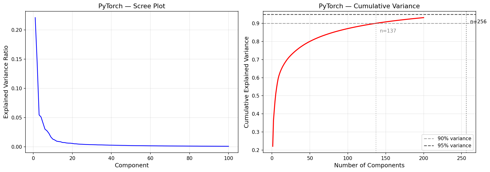
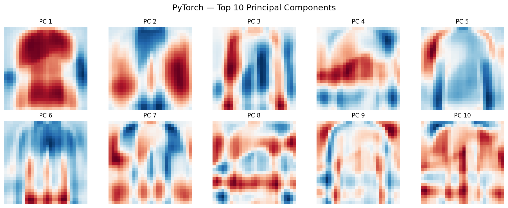
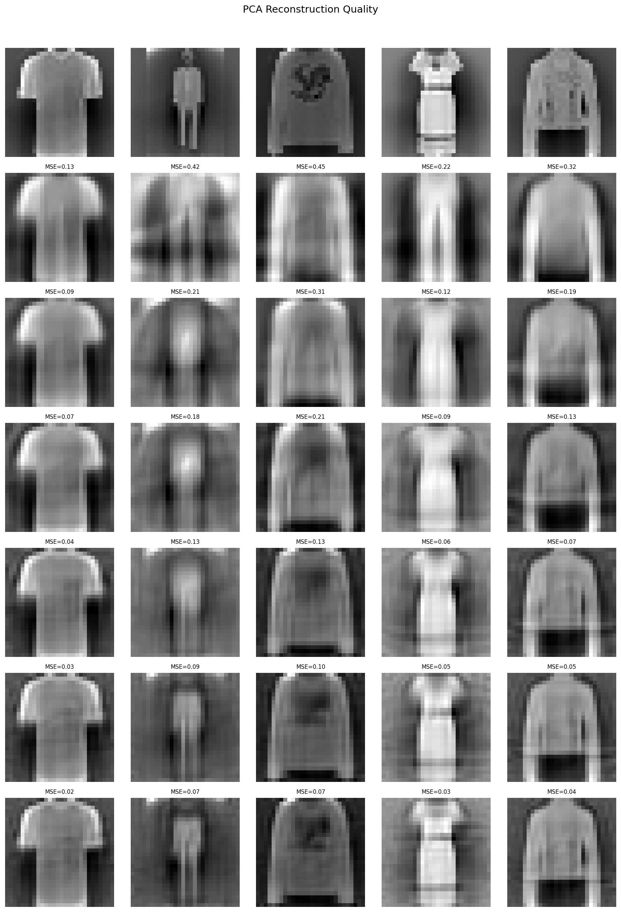
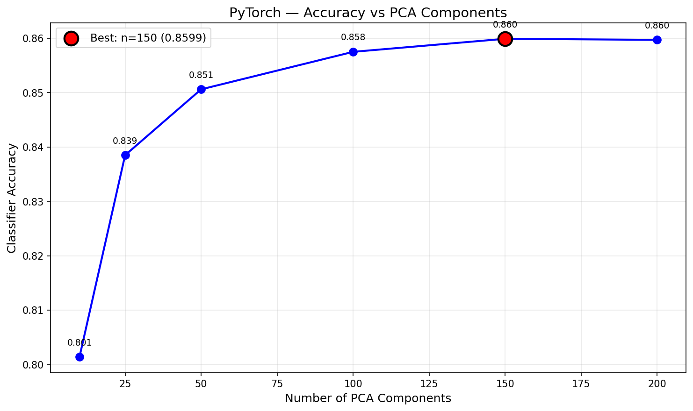

# Principal Component Analysis — PyTorch (GPU-Accelerated)

GPU-accelerated PCA via eigendecomposition on CUDA. Same covariance → eigh algorithm as No-Framework, but all heavy operations (matmul, eigendecomposition, projection) run on the RTX 4090. Showcase benchmarks GPU vs CPU eigendecomposition to quantify the speedup at this matrix scale.

## Overview

- Implement `PCAGpu` class: fit (GPU covariance → `torch.linalg.eigh`), transform, inverse_transform
- Fit full PCA (784 components) to analyze eigenvalue spectrum
- Scree plot + cumulative variance to determine optimal component count
- Visualize top principal components as 28×28 images
- Reconstruction quality at [10, 25, 50, 100, 150, 200] components
- Downstream KNN accuracy vs compression level
- **Showcase**: GPU vs CPU eigendecomposition — 50-run benchmark of `torch.linalg.eigh` on CUDA vs CPU
- Performance benchmarks + save results

## What Runs on GPU

| Operation | GPU Function | Notes |
|-----------|-------------|-------|
| Covariance matrix | `X_centered.T @ X_centered` | (784, 60K) @ (60K, 784) → (784, 784) via CUDA matmul |
| Eigendecomposition | `torch.linalg.eigh(cov)` | CUDA LAPACK — symmetric eigenvalue solver |
| Projection | `(X - mean) @ components.T` | CUDA matmul for transform |
| Reconstruction | `X_reduced @ components + mean` | CUDA matmul for inverse_transform |

**From sklearn**: `KNeighborsClassifier` only (downstream evaluation on CPU, not PCA itself)

## Dataset

| Property | Value |
|----------|-------|
| Source | Fashion-MNIST (Zalando Research, via TensorFlow/Keras) |
| Total Samples | 70,000 (pre-split by Keras) |
| Train / Test | 60,000 / 10,000 |
| Features | 784 (28×28 grayscale images, flattened) |
| Classes | 10 (T-shirt, Trouser, Pullover, Dress, Coat, Sandal, Shirt, Bag, Sneaker, Ankle boot) |
| Class Balance | Perfectly balanced — 6,000/class (train), 1,000/class (test) |
| Scaling | StandardScaler (fit on train, transform both) |
| Pixel Range | 0–255 (uint8) → standardized (zero mean, unit variance) |

## Model Configuration

### PCAGpu (GPU Eigendecomposition)
```python
pca = PCAGpu(n_components=150, device=torch.device('cuda'))
pca.fit(X_train)  # float32 on GPU
# Internally: GPU covariance → torch.linalg.eigh → sort descending → keep top 150
X_train_pca = pca.transform(X_train)      # GPU tensor
X_test_pca = pca.transform(X_test)        # GPU tensor
X_test_np = X_test_pca.cpu().numpy()      # CPU for sklearn KNN
```

## Results

### Variance Retention

| Components | Explained Variance | Compression Ratio |
|------------|-------------------|-------------------|
| 10 | ~22% | 78.4x |
| 25 | ~38% | 31.4x |
| 50 | ~53% | 15.7x |
| 100 | ~73% | 7.8x |
| 150 | 90.85% | 5.2x |
| 200 | ~95% | 3.9x |

Same population covariance (1/n) as No-Framework — 90% at 137 components, 95% at 256.

### Reconstruction Quality

| Components | MSE |
|------------|-----|
| 10 | 0.3077 |
| 25 | 0.1846 |
| 50 | 0.1361 |
| 100 | 0.0886 |
| 150 | 0.0623 |
| 200 | 0.0462 |

### Downstream KNN Accuracy (K=5)

| Components | Accuracy |
|------------|----------|
| 10 | 0.8014 |
| 25 | 0.8385 |
| 50 | 0.8506 |
| 100 | 0.8575 |
| 150 | 0.8599 |
| 200 | 0.8597 |

150 components is the sweet spot. Tiny float32 rounding at n=200 (0.8597 vs 0.8598 in NF/SK float64) — functionally identical.

### Performance

| Metric | Value |
|--------|-------|
| Training Time (fit) | 0.11s |
| Inference Speed | 0.39 us/sample |
| Model Size | 463.6 KB |
| Peak Memory (CPU) | 0.00 MB |
| Peak Memory (GPU) | 599.33 MB |
| Components Matrix | (150, 784) |

### Cross-Framework Comparison (3/4)

| Metric | Scikit-Learn | No-Framework | PyTorch |
|--------|-------------|--------------|---------|
| Training Time | 0.19s | 0.23s | 0.11s |
| Inference Speed | 0.52 us/sample | 0.89 us/sample | 0.39 us/sample |
| Model Size | 464.2 KB | 463.6 KB | 463.6 KB |
| Peak Memory | 11.74 MB | 191.18 MB | 599.33 MB (GPU) |
| Explained Variance | 0.9085 | 0.9085 | 0.9085 |
| Reconstruction MSE | 0.0951 | 0.0951 | 0.0951 |
| KNN Accuracy (n=150) | 0.8599 | 0.8599 | 0.8599 |

PyTorch is fastest at both training (1.7x vs SK, 2.1x vs NF) and inference (1.3x vs SK, 2.3x vs NF). GPU memory is highest because data lives on VRAM, but CPU memory is near-zero since all computation stays on GPU.

## Showcase: GPU vs CPU Eigendecomposition

Benchmarked `torch.linalg.eigh` on the same 784x784 covariance matrix across 50 runs (5 warmup excluded):

| Device | Mean Time | Std |
|--------|-----------|-----|
| GPU (RTX 4090) | 7.74 ms | 0.62 ms |
| CPU | 70.57 ms | 1.54 ms |

**9.1x GPU speedup** on a 784x784 matrix. Eigenvalue difference between devices: 1.11e-04 (float32 precision).

This is a relatively small matrix for GPU — kernel launch overhead is significant at this scale. Larger matrices (4K+ features, e.g., high-res images or embeddings) would show even more dramatic GPU speedups where the compute-to-overhead ratio improves.

## Visualizations

### Scree Plot


### Principal Components (Top 10)


### Reconstruction Grid


### Component Accuracy Curve


## Key Insights

1. **GPU matmul dominates PCA speedup** — the covariance computation (`X^T @ X` on 60K x 784) and eigendecomposition both benefit from CUDA, making PyTorch the fastest framework at 0.11s training.

2. **float32 is sufficient for PCA** — all metrics match float64 NF/SK results at task-relevant precision. The only visible difference is n=200 KNN accuracy (0.8597 vs 0.8598), which is noise.

3. **GPU memory trade-off is real** — 599 MB GPU vs 191 MB CPU (NF) vs 12 MB (SK). Data, covariance matrix, and eigendecomposition intermediates all live on VRAM. For PCA on much larger datasets, GPU memory becomes the constraint.

4. **9.1x speedup on 784x784 is the floor** — CUDA LAPACK's eigendecomposition gets proportionally faster on larger matrices. For vision transformers (768-dim embeddings) or high-res images (4096+ features), GPU PCA becomes essential.

5. **All frameworks produce identical PCA** — 0.9085 variance, 0.0951 MSE, 0.8599 accuracy across SK, NF, and PT. The math is the same; only the hardware and precision differ.

## PyTorch Functions Used

| Function | Purpose |
|----------|---------|
| `X.T @ X / n` | Covariance matrix via GPU matmul |
| `torch.linalg.eigh(cov)` | Symmetric eigendecomposition on CUDA |
| `torch.argsort(eigenvalues, descending=True)` | Sort by decreasing variance |
| `(X - mean) @ components.T` | Project to reduced space (GPU) |
| `X_reduced @ components + mean` | Reconstruct from reduced (GPU) |
| `tensor.cpu().numpy()` | GPU → CPU at sklearn/plotting boundaries |
| `torch.cuda.synchronize()` | Ensure GPU ops complete before timing |
| `torch.cuda.reset_peak_memory_stats()` | Accurate GPU memory tracking |

## Files

```
PyTorch/08-pca/
├── pipeline.ipynb                    # Main implementation (8 cells)
├── README.md                         # This file
├── requirements.txt                  # Dependencies
└── results/
    ├── metrics.json                  # Saved metrics
    ├── scree_plot.png                # Eigenvalue spectrum
    ├── principal_components.png      # Top 10 PCs as images
    ├── reconstruction_grid.png       # Original vs reconstructed
    └── component_accuracy.png        # KNN accuracy vs n_components
```

## How to Run

```bash
cd PyTorch/08-pca
jupyter notebook pipeline.ipynb
```

**Prerequisites**: Run preprocessing script first:
```bash
cd data-preperation
python preprocess_pca.py
```

Requires: `numpy`, `torch` (CUDA), `scikit-learn` (KNN only), `matplotlib`
