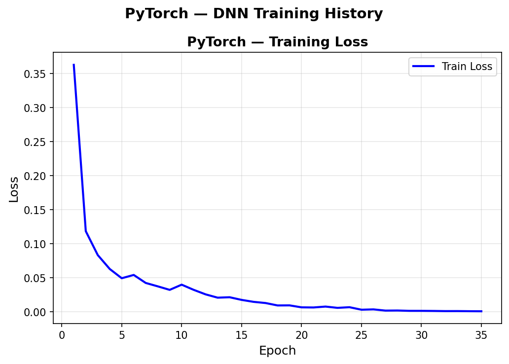
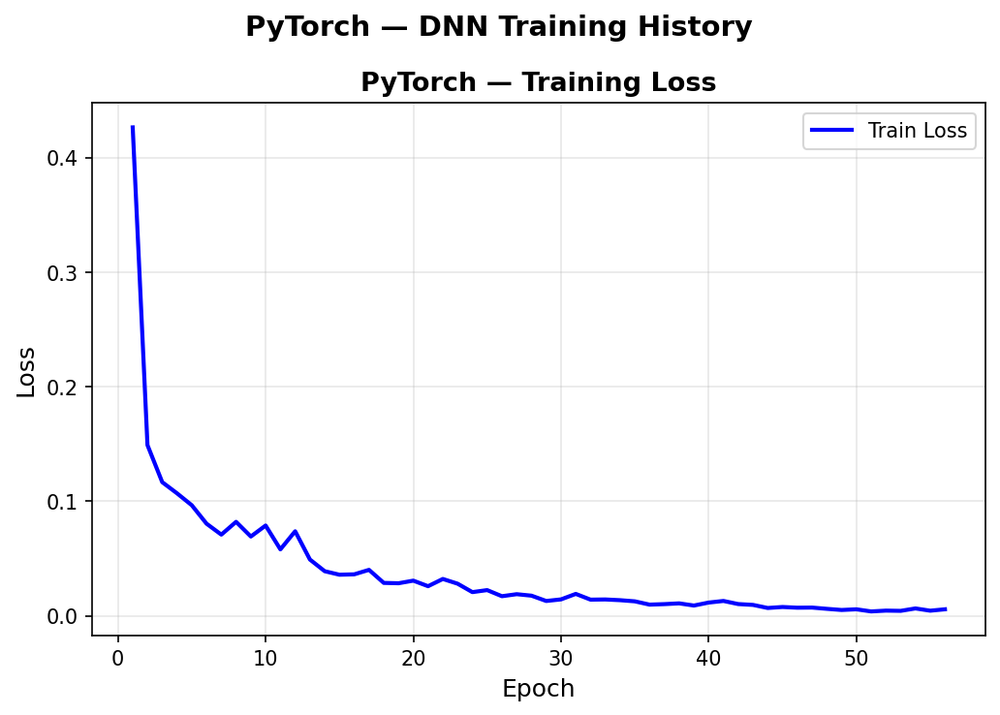
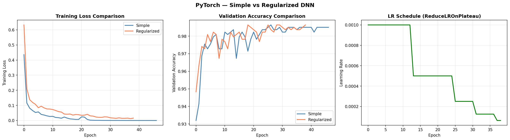
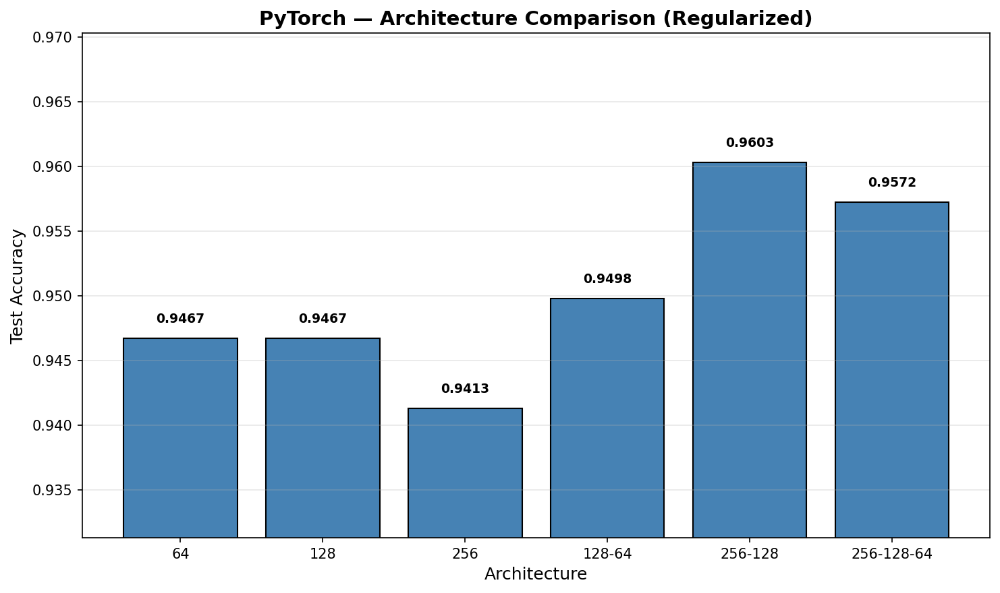
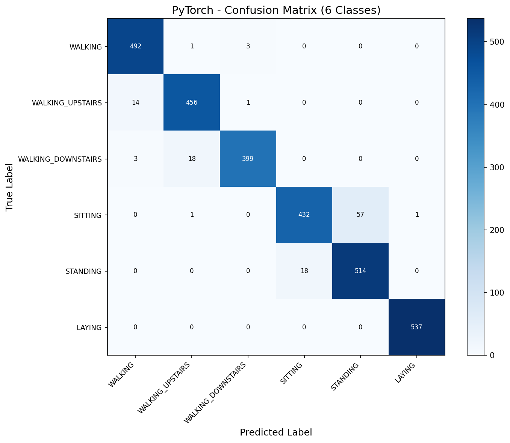
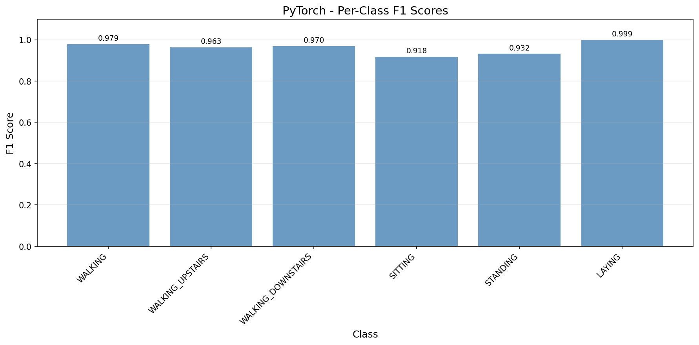

# DNN — PyTorch (GPU-Accelerated)

GPU-accelerated deep neural network with the full PyTorch regularization toolkit: BatchNorm, Dropout, and ReduceLROnPlateau LR scheduling. The 256-128 architecture with regularization achieves 96.03% accuracy on UCI HAR — a 1.12% improvement over Scikit-Learn's best (94.91%), demonstrating how framework-specific features unlock better performance from the same data.

## Overview

- Train single-layer baseline DNN (128 neurons) with early stopping
- Visualize training loss curves
- **Showcase**: Simple vs Regularized DNN — BatchNorm + Dropout + LR scheduling comparison
- Architecture sweep (6 configurations, all regularized)
- Full evaluation on best architecture with confusion matrix + per-class F1
- Performance benchmarks + save results

## What Runs on GPU

| Operation | GPU Function | Notes |
|-----------|-------------|-------|
| Forward pass | `model(X_batch)` | All linear layers, BatchNorm, ReLU, Dropout on CUDA |
| Loss computation | `nn.CrossEntropyLoss()` | Softmax + NLL loss on GPU |
| Backpropagation | `loss.backward()` | Gradient computation on CUDA |
| Parameter update | `optimizer.step()` | Adam optimizer on GPU tensors |
| Inference | `model(X_test).argmax(dim=1)` | Full batch forward pass on GPU |

**From sklearn**: `evaluate_classifier` only (metrics computation on CPU, not training)

## Dataset

| Property | Value |
|----------|-------|
| Source | UCI ML Repository — Human Activity Recognition Using Smartphones |
| Total Samples | 10,299 (pre-split by subject) |
| Train / Test | 7,352 / 2,947 (21 / 9 subjects) |
| Train / Val Split | 6,617 / 735 (90/10 from train set) |
| Features | 561 (sensor-derived, pre-computed from accelerometer + gyroscope) |
| Classes | 6 (WALKING, WALKING_UPSTAIRS, WALKING_DOWNSTAIRS, SITTING, STANDING, LAYING) |
| Class Balance | 1.43x imbalance ratio (acceptable, no weighting needed) |
| Scaling | StandardScaler (fit on train, transform both) |
| Label Encoding | Original 1-6 shifted to 0-5 for softmax |

## Model Configuration

### Baseline (Simple DNN)
```python
class SimpleDNN(nn.Module):
    # 561 → 128 → 6 (Linear + ReLU only)

model = SimpleDNN(561, (128,), 6).to(device)
# Adam optimizer, lr=0.001, patience=15
```

### Best (Regularized DNN)
```python
class RegularizedDNN(nn.Module):
    # 561 → Linear(256) → BatchNorm → ReLU → Dropout(0.3)
    #     → Linear(128) → BatchNorm → ReLU → Dropout(0.3)
    #     → Linear(6)

model = RegularizedDNN(561, (256, 128), 6, dropout=0.3).to(device)
# Adam optimizer, lr=0.001
# ReduceLROnPlateau(mode='max', factor=0.5, patience=5)
# Early stopping patience=20
```

## Results

### Baseline: Simple DNN (128)

| Metric | Value |
|--------|-------|
| Accuracy | 0.9393 |
| Macro F1 | 0.9396 |
| Epochs | 35 (best at 20) |
| Training Time | ~2s |

### Best: Regularized DNN (256-128)

| Metric | Value |
|--------|-------|
| Accuracy | 0.9603 |
| Macro F1 | 0.9602 |
| Epochs | 56 (best at 36) |
| Training Time | 13.62s |
| Inference | 0.74 µs/sample |
| Model Size | 696.52 KB |
| Parameters | 178,310 |
| Peak Memory (GPU) | 63.27 MB |

### Model Architecture (best)
```
RegularizedDNN(
  (net): Sequential(
    (0): Linear(in_features=561, out_features=256, bias=True)
    (1): BatchNorm1d(256, eps=1e-05, momentum=0.1, affine=True, track_running_stats=True)
    (2): ReLU()
    (3): Dropout(p=0.3, inplace=False)
    (4): Linear(in_features=256, out_features=128, bias=True)
    (5): BatchNorm1d(128, eps=1e-05, momentum=0.1, affine=True, track_running_stats=True)
    (6): ReLU()
    (7): Dropout(p=0.3, inplace=False)
    (8): Linear(in_features=128, out_features=6, bias=True)
  )
)
```

## Showcase: Simple vs Regularized DNN

Compared the same 128-64 architecture with and without regularization (BatchNorm + Dropout + LR scheduling):

| Model | Accuracy | Macro F1 | Epochs |
|-------|----------|----------|--------|
| Simple (128-64) | 0.9399 | 0.9403 | 47 |
| Regularized (128-64) | 0.9498 | 0.9501 | 39 |

**Key insights**:
- Regularization adds +1.0% accuracy with fewer epochs
- BatchNorm stabilizes the noisy validation accuracy curve
- Dropout prevents the extra capacity from overfitting
- LR schedule shows 3 step-downs (0.001 → 0.0005 → 0.00025 → 0.000125), each triggered when val accuracy plateaued

## Architecture Sweep (All Regularized)

| Architecture | Accuracy | Macro F1 | Parameters | Epochs |
|-------------|----------|----------|------------|--------|
| 64 | 0.9467 | 0.9481 | 36,486 | 33 |
| 128 | 0.9467 | 0.9478 | 72,966 | 38 |
| 256 | 0.9413 | 0.9417 | 145,926 | 34 |
| 128-64 | 0.9498 | 0.9501 | 80,966 | 39 |
| 256-128 | 0.9603 | 0.9602 | 178,310 | 56 |
| 256-128-64 | 0.9572 | 0.9571 | 186,310 | 41 |

**Best**: 256-128 — wider architecture benefits from regularization preventing overfitting. The 3-layer 256-128-64 scores slightly lower, suggesting extra depth doesn't help on pre-engineered features.

## Per-Class Performance
- Dynamic activities (WALKING variants): F1 0.963–0.979
- Static activities (SITTING/STANDING): F1 0.918–0.932
- LAYING: F1 0.999 — near-perfect (gravity direction is unambiguous)
- SITTING vs STANDING remains the main confusion pair (57 + 18 = 75 misclassifications)

## Visualizations

### Training History (Baseline)


### Training History (Best Model — 256-128)


### Showcase: Simple vs Regularized


### Architecture Sweep


### Confusion Matrix (6 Classes)


### Per-Class F1 Scores


## Key Insights

1. **Regularization is the differentiator** — the same 128-64 architecture jumps from 93.99% to 94.98% with BatchNorm + Dropout + LR scheduling. SK's MLPClassifier can't express this, giving PyTorch a structural advantage.

2. **Wider architectures benefit from regularization** — 256-128 (178K params) hits 96.03% because BatchNorm + Dropout prevent the extra capacity from memorizing training data. Without regularization, wider nets tend to overfit on small datasets like UCI HAR (7.3K train samples).

3. **LR scheduling fine-tunes convergence** — ReduceLROnPlateau cuts the learning rate when validation accuracy plateaus, allowing the optimizer to settle into a better local minimum. Three reductions from 0.001 to 0.000125 during the 56-epoch run.

4. **GPU overhead is visible at this scale** — 13.62s training vs SK's 2.25s. The dataset is small enough (7.3K × 561) that CUDA kernel launch overhead and data transfer dominate. GPU DNN shines on larger datasets and deeper models.

5. **SITTING vs STANDING remains the ceiling** — even with regularization and a wider architecture, the confusion between SITTING and STANDING persists. These activities produce nearly identical sensor signals, representing a fundamental data limitation, not a model limitation.

## PyTorch Features Used

| Feature | Purpose |
|---------|---------|
| `nn.Linear` | Fully connected layers |
| `nn.BatchNorm1d` | Batch normalization — stabilizes training |
| `nn.Dropout` | Regularization — prevents co-adaptation |
| `nn.CrossEntropyLoss` | Softmax + NLL loss (built-in) |
| `optim.Adam` | Adaptive learning rate optimizer |
| `optim.lr_scheduler.ReduceLROnPlateau` | LR decay on val accuracy plateau |
| `DataLoader + TensorDataset` | Mini-batch training (batch_size=64) |
| `model.eval() + torch.no_grad()` | Inference mode (disables Dropout + BN running stats) |
| `torch.cuda.synchronize()` | Accurate GPU timing |

## Files

```
PyTorch/09-dnn/
├── pipeline.ipynb                    # Main implementation (8 cells)
├── README.md                         # This file
├── requirements.txt                  # Dependencies
└── results/
    ├── dnn.json                      # Saved metrics
    ├── training_history_baseline.png # Baseline loss curve
    ├── training_history_best.png     # Best model loss curve
    ├── showcase_regularization.png   # Simple vs Regularized comparison
    ├── architecture_sweep.png        # Width/depth comparison
    ├── confusion_matrix.png          # 6-class confusion matrix
    └── per_class_f1.png              # Per-class F1 scores
```

## How to Run

```bash
cd PyTorch/09-dnn
jupyter notebook pipeline.ipynb
```

**Prerequisites**: Run preprocessing script first:
```bash
cd data-preperation
python preprocess_dnn.py
```

Requires: `numpy`, `torch` (CUDA), `scikit-learn` (metrics only), `matplotlib`
