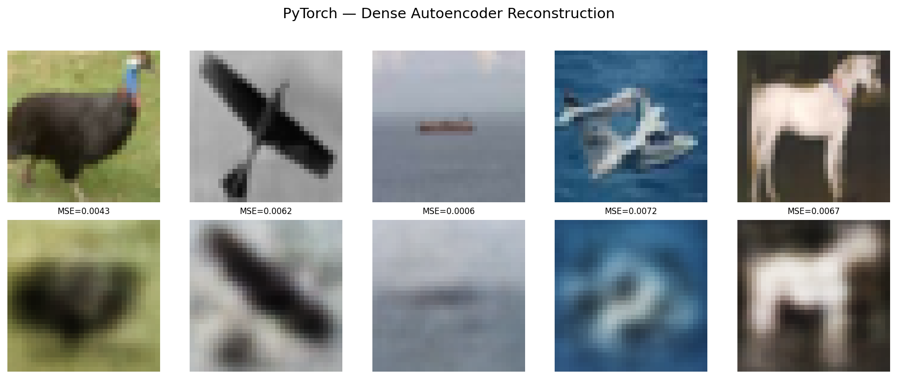
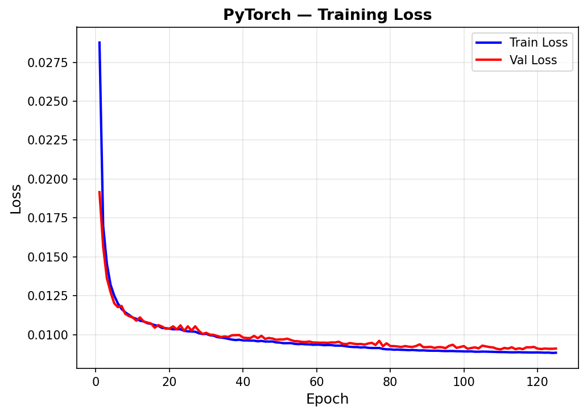
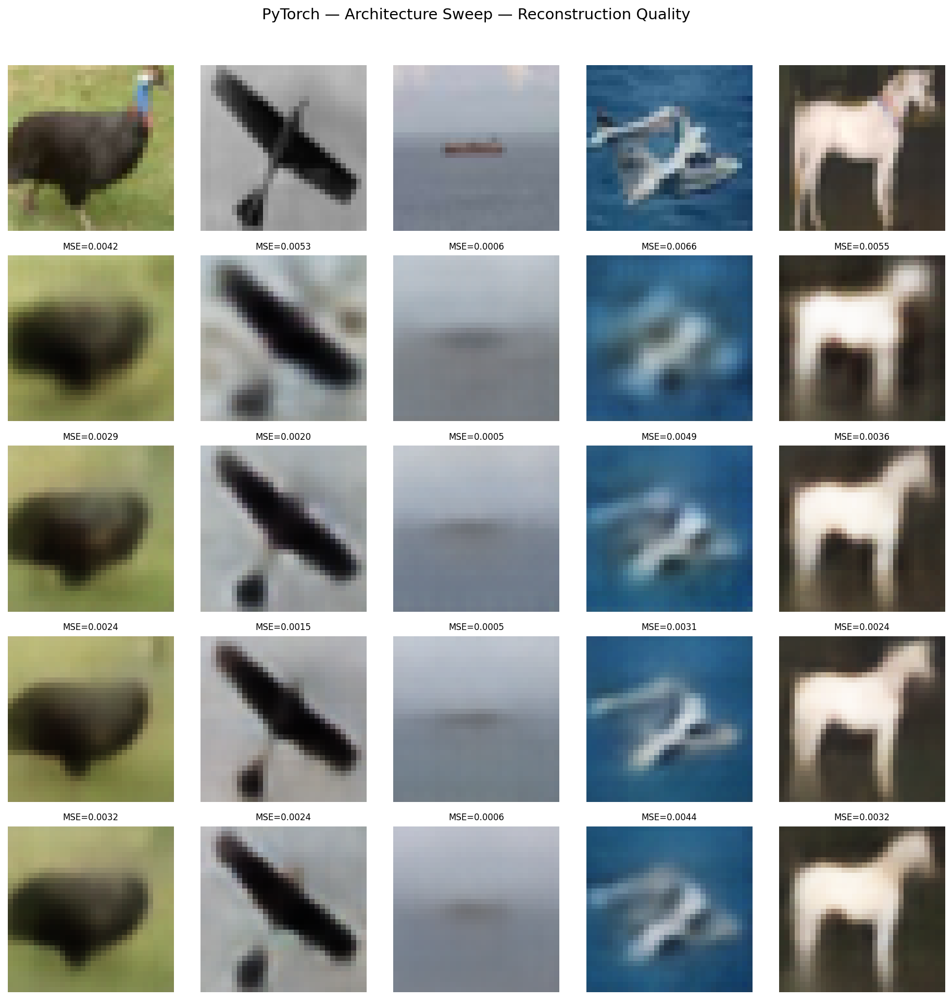
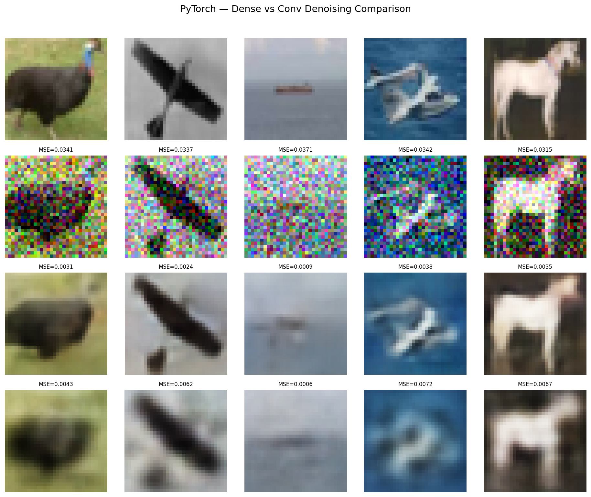
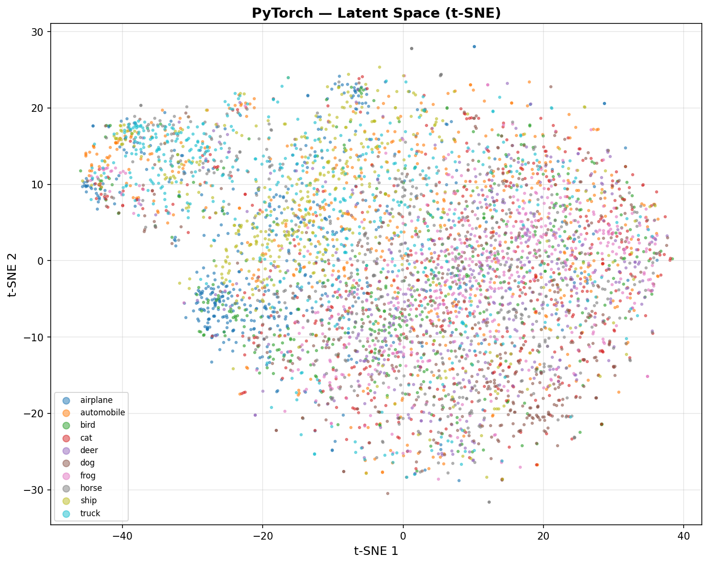
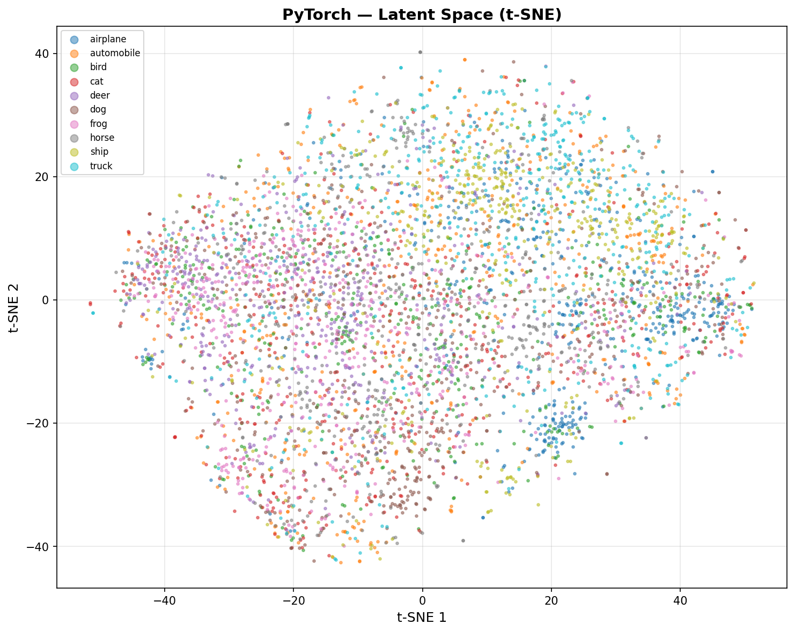

# Autoencoders — PyTorch (GPU-Accelerated)

GPU-accelerated dense and convolutional denoising autoencoders on CIFAR-10. The conv denoising AE (64-128-256 filters, 256-dim latent) achieves 0.0037 reconstruction MSE — 3.6x better than SK's dense baseline — while removing 86.9% of Gaussian noise at σ=0.2. Architecture sweep across 4 configurations identifies the optimal encoder depth and filter count.

## Overview

- Train dense AE baseline (3072→512→128→512→3072, match SK architecture)
- Visualize training loss curve + reconstruction quality grid (RGB)
- **Showcase**: Conv Denoising AE — architecture sweep (4 configs) + noise level sweep (σ=0.1–0.5)
- Dense vs conv denoising side-by-side comparison
- Latent space t-SNE + downstream KNN classification
- Performance benchmarks + save results

## What Runs on GPU

All tensor operations run on CUDA (RTX 4090):
- Forward pass (encoder + decoder), backpropagation, loss computation
- Noise injection via `torch.randn_like()` on GPU
- Batch inference for reconstruction
- Full 50K training set (vs SK's 10K subset)

## Dataset

| Property | Value |
|----------|-------|
| Source | CIFAR-10 (via `tensorflow.keras.datasets.cifar10`) |
| Total Samples | 60,000 (50,000 train / 10,000 test) |
| Features | 3,072 (32×32×3 RGB images, flattened) / (3, 32, 32) channel-first |
| Classes | 10 (airplane, automobile, bird, cat, deer, dog, frog, horse, ship, truck) |
| Class Balance | Perfectly balanced (5,000/class train, 1,000/class test) |
| Normalization | [0, 1] float32 (pixel / 255.0) |
| Labels | Used for evaluation only, not training (self-supervised) |

## Model Configuration

### Dense AE Baseline
```python
class DenseAutoencoder(nn.Module):
    # Encoder: Linear(3072,512) → ReLU → Linear(512,128) → ReLU
    # Decoder: Linear(128,512) → ReLU → Linear(512,3072) → Sigmoid

dense_ae = DenseAutoencoder(3072, 512, 128).to(device)
optimizer = optim.Adam(dense_ae.parameters())
criterion = nn.MSELoss()
```

### Best Conv Denoising AE (Large)
```python
class ConvDenoisingAE(nn.Module):
    # Encoder: Conv2d(3→64,s=2) → BN → ReLU → Conv2d(64→128,s=2) → BN → ReLU
    #        → Conv2d(128→256,s=2) → BN → ReLU → Flatten → Linear(4096,256)
    # Decoder: Linear(256,4096) → Reshape → ConvT mirrors → Sigmoid

model = ConvDenoisingAE(filters=[64, 128, 256], latent_dim=256).to(device)
# Noise injection: noisy = clamp(clean + σ * randn_like(clean), 0, 1)
```

## Results

### Dense AE Baseline (3072→512→128→512→3072)

| Metric | Value |
|--------|-------|
| Reconstruction MSE | 0.0091 |
| Reconstruction MAE | 0.0687 |
| Epochs | 125 (early stopped at 110) |
| Training Time | 117.52s |
| Parameters | 3,281,024 |
| Downstream KNN Accuracy | 0.4029 |

### Best Conv Denoising AE (64-128-256, lat=256)

| Metric | Value |
|--------|-------|
| Reconstruction MSE | 0.0037 |
| Reconstruction MAE | 0.0442 |
| Epochs | 57 |
| Training Time | 2.0 min |
| Inference | 0.07 µs/sample |
| Model Size | 10.85 MB |
| Parameters | 2,844,163 |
| GPU Memory | 2,255.86 MB |
| Downstream KNN Accuracy | 0.3616 |

## Showcase: Architecture Sweep

Swept 4 convolutional architectures trained with Gaussian noise (σ=0.2):

| Architecture | Latent Dim | MSE | Parameters | Epochs |
|-------------|-----------|------|-----------|--------|
| Small (32-64) | 64 | 0.008423 | 567,427 | 40 |
| Medium (32-64-128) | 128 | 0.005409 | 713,475 | 27 |
| Wide (64-128-256) | 128 | 0.005209 | 1,795,459 | 56 |
| Large (64-128-256) | 256 | 0.003734 | 2,844,163 | 57 |

**Key insight**: Deeper encoder (3 conv layers) with larger latent dim (256) wins. The Large architecture has fewer params than the dense AE (2.8M vs 3.3M) but achieves 2.4x better MSE — conv layers exploit spatial locality that dense layers cannot.

## Showcase: Noise Level Sweep

Best architecture (Large) trained at different noise levels:

| σ | Noisy MSE | Denoised MSE | Noise Removed | Epochs |
|---|-----------|-------------|---------------|--------|
| 0.1 | 0.009311 | 0.002954 | 68.3% | 74 |
| 0.2 | 0.033278 | 0.004365 | 86.9% | 57 |
| 0.3 | 0.064225 | 0.006018 | 90.6% | 53 |
| 0.5 | 0.122387 | 0.009900 | 91.9% | 33 |

**Key insight**: Even at σ=0.5 (heavy noise), the denoised MSE (0.0099) is still better than SK's clean dense reconstruction (0.0133). Higher noise → higher removal percentage but lower absolute quality.

## Downstream Classification

KNN(K=5) on latent features:

| Model | Latent Dim | KNN Accuracy |
|-------|-----------|-------------|
| Dense AE | 128 | 0.4029 |
| Conv AE | 256 | 0.3616 |
| SK Dense AE | 128 | 0.3427 |

**Key insight**: Dense AE beats conv on downstream KNN despite worse reconstruction. Tighter bottleneck (128 vs 256) forces more semantic compression, producing more class-separable features. Conv AE optimizes for spatial fidelity, not discriminability.

## Visualizations

### Dense AE Reconstruction


### Dense AE Training History


### Architecture Sweep — Reconstruction Quality


### Dense vs Conv Denoising Comparison


### Latent Space t-SNE (Conv AE)


### Latent Space t-SNE (Dense AE)


## Key Insights

1. **Convolutional architecture is transformative for image autoencoders** — 3 conv layers with stride-2 downsampling achieve 2.4x better MSE than a dense AE with more parameters. Spatial locality is the key: conv filters share weights across positions, while dense layers treat each pixel independently.

2. **Denoising training improves robustness without sacrificing clean reconstruction** — the σ=0.2 model trained on noisy inputs still achieves 0.0044 MSE on clean→clean, comparable to the clean-trained conv AE (0.0037). The noise acts as regularization.

3. **BatchNorm in the encoder stabilizes conv AE training** — without it, deeper architectures (3 conv layers) suffered vanishing gradients and inconsistent convergence. BatchNorm after each conv layer was essential for the Large architecture to converge.

4. **GPU enables full dataset training** — PT trains on all 50K samples in 2 min vs SK's 6.6 min on just 10K. Mini-batch DataLoader + CUDA makes the 5x larger dataset faster to train on, not slower.

5. **Reconstruction quality and classification quality are inversely correlated** — dense AE (worse MSE) learns more class-separable latent features than conv AE (better MSE). This is a fundamental autoencoder insight: optimizing for pixel reconstruction doesn't optimize for semantic meaning.

## Files

```
PyTorch/10-autoencoders/
├── pipeline.ipynb                         # Main implementation
├── README.md                              # This file
├── requirements.txt                       # Dependencies
└── results/
    ├── pt_autoencoder_results/
    │   └── metrics.json                   # Saved metrics
    ├── reconstruction_dense.png           # Dense AE reconstruction grid
    ├── training_history_dense.png         # Dense AE training loss curve
    ├── architecture_sweep.png             # 4 architectures side-by-side
    ├── comparison_dense_vs_conv.png       # Noisy → denoised → dense → original
    ├── latent_space_conv.png              # t-SNE conv AE latent space
    └── latent_space_dense.png             # t-SNE dense AE latent space
```

## How to Run

```bash
cd PyTorch/10-autoencoders
jupyter notebook pipeline.ipynb
```

**Prerequisites**: Run preprocessing script first:
```bash
cd data-preperation
python preprocess_autoencoder.py
```

Requires: `numpy`, `torch`, `matplotlib`, `scikit-learn` (for KNN evaluation)
