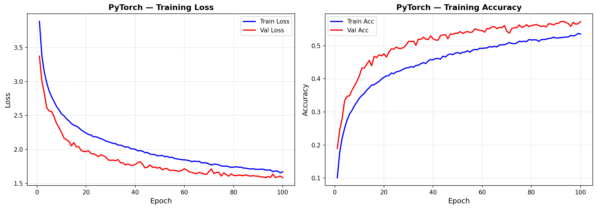
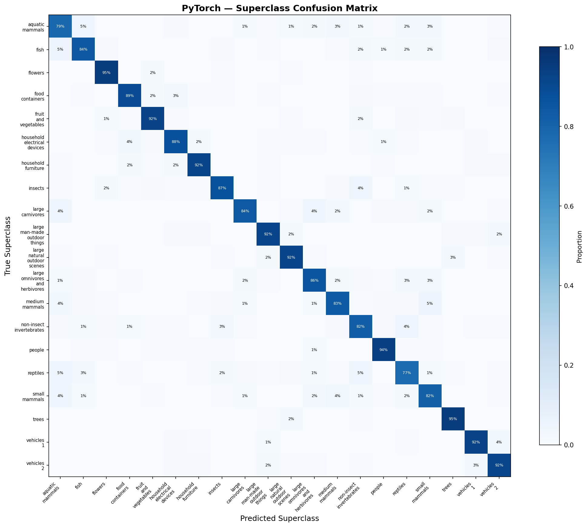

# CNN — PyTorch Pipeline

Convolutional Neural Network on CIFAR-100 (100 classes, 32x32 color images). This pipeline demonstrates a systematic approach to CNN development — starting from a basic 3-layer CNN at 56.9% accuracy and methodically improving to 80.1% through architecture exploration, optimizer tuning, and modern training techniques. Every decision is data-driven, with each experiment building on findings from the previous one.

## Overview

- Classify 100 fine-grained image categories grouped into 20 superclasses
- Progressive architecture evolution: Plain CNN -> Wide CNN -> ResNet with residual blocks
- Systematic hyperparameter exploration with justified decisions at each step
- Modern training techniques: CutMix augmentation, label smoothing, cosine annealing
- Hierarchical evaluation at both fine-class (100) and superclass (20) levels
- GPU-accelerated training on RTX 4090

## What Runs on GPU

| Component | Device | Why |
|-----------|--------|-----|
| All training | CUDA (RTX 4090) | 50K images x 300 epochs requires GPU acceleration |
| All inference | CUDA | Batch inference on 10K test images |
| Data augmentation | CUDA | torchvision transforms applied to GPU tensors |

## Dataset

| Property | Value |
|----------|-------|
| Name | CIFAR-100 |
| Source | `tensorflow.keras.datasets.cifar100` |
| Train samples | 50,000 |
| Test samples | 10,000 |
| Image shape | 32x32x3 (RGB) |
| Fine classes | 100 (alphabetically ordered) |
| Superclasses | 20 (5 fine classes each) |
| Balance | Perfectly balanced (500/class train, 100/class test) |
| Normalization | Per-channel: R=0.507, G=0.487, B=0.441 |

## Architecture Progression

This section documents every architectural and training decision, what worked, what didn't, and why. The progression from 56.9% to 80.1% demonstrates how to systematically improve a CNN through experimentation rather than guessing.

### Step 1: Plain CNN Baseline — 56.9%

```
Conv2d(3->32, 3x3) -> BN -> ReLU -> MaxPool(2)    # 32x32 -> 16x16
Conv2d(32->64, 3x3) -> BN -> ReLU -> MaxPool(2)   # 16x16 -> 8x8
Conv2d(64->128, 3x3) -> BN -> ReLU -> MaxPool(2)  # 8x8 -> 4x4
Flatten(2048) -> Dropout(0.5) -> FC(512) -> ReLU -> Dropout(0.3) -> FC(100)
Parameters: 1,194,084
```

**Training**: Adam optimizer, lr=1e-3, early stopping (patience=15), basic augmentation (HFlip, RandomCrop, ColorJitter, per-channel Normalize).

**Result**: 56.9% accuracy, 56.3% macro F1. Established the baseline. Val accuracy (57.3%) exceeded train accuracy (53.5%) — a healthy sign that augmentation is working as regularization, not a sign of underfitting.

### Step 2: Architecture Sweep — Wide Wins at 61.5%

Tested 4 architectures with identical training setup:

| Architecture | Accuracy | Macro F1 | Parameters | Time |
|-------------|----------|----------|------------|------|
| Shallow (32-64) | 51.3% | 50.3% | 2,168,548 | 158s |
| Baseline (32-64-128) | 56.9% | 56.3% | 1,194,084 | 174s |
| Deep (32-64-128-256) | 59.8% | 59.5% | 965,476 | 194s |
| **Wide (64-128-256)** | **61.5%** | **61.1%** | **2,520,676** | **177s** |

**Finding**: Wider filters (more features per layer) outperformed deeper stacking. The Deep model had fewest parameters (965K) but Wide's larger filters captured more diverse patterns. All models hit max epochs (100) without early stopping — indicating room for longer training.

### Step 3: Architecture Refinement — Cosine LR Pushes to 64.2%

Built on the Wide architecture with training recipe changes:

| Variant | Accuracy | Finding |
|---------|----------|---------|
| Wide (baseline) | 61.5% | Reference |
| Deep-Wide (64-128-256-512) | 63.4% | More depth + width helps |
| Wide + Low Dropout (0.3) | 60.6% | **Less regularization hurt** — model overfits more |
| **Wide + Cosine LR** | **64.2%** | **Learning rate scheduling is critical** |
| Deep-Wide + Cosine + Low Drop | 62.8% | Low dropout cancels cosine LR gains |

**Key insight**: Cosine annealing LR schedule added +2.7% over constant LR. Reducing dropout from 0.5 to 0.3 actually hurt performance — the model needs strong regularization on 100 classes.

### Step 4: ResNet-20 Introduction — Architecture Change, Wrong Recipe = 63.6%

Introduced residual blocks (skip connections) with the same training setup as Wide + Cosine for a fair comparison:

```
Conv2d(3->64, 3x3) -> BN -> ReLU
Stage 1: [ResidualBlock(64->64)] x 3    # 32x32
Stage 2: [ResidualBlock(64->128)] x 3   # 16x16 (stride=2)
Stage 3: [ResidualBlock(128->256)] x 3  # 8x8 (stride=2)
Global Average Pooling -> FC(100)
Parameters: 4,350,884
```

**Result**: 63.6% — slightly worse than Wide + Cosine (64.2%). The model early stopped at epoch 37 out of 150 — far too early. This taught a critical lesson: **architecture alone doesn't guarantee improvement**. The training recipe must match the architecture.

**Why Global Average Pooling**: Replaces Flatten + large FC layer. Instead of a 2048->512 FC (1M params), GAP reduces each feature map to a single value. Fewer parameters, less overfitting, and spatially invariant.

### Step 5: Optimizer Discovery — SGD Beats Adam by +12 Points

The single most impactful experiment in the entire pipeline. Tested different optimizer recipes on ResNet-20:

| Recipe | Accuracy | Epochs | Finding |
|--------|----------|--------|---------|
| Adam lr=1e-3 (Cell 6) | 63.6% | 37 (early stopped) | Adam + ResNet = poor convergence |
| SGD lr=0.1 wd=1e-4 | 64.8% | 51 (early stopped) | SGD better but still early stopping |
| **SGD lr=0.05 wd=5e-4** | **76.4%** | **200 (full)** | **+12 point jump** |
| Adam lr=3e-4 wd=1e-4 | 64.3% | 51 (early stopped) | Lower Adam LR doesn't help |

**Why SGD dominates for ResNets**: Adam's adaptive per-parameter learning rates interfere with the batch normalization + residual connection dynamics that ResNets depend on. SGD with momentum provides a more stable optimization landscape. This is well-established in literature but we confirmed it experimentally. The weight decay of 5e-4 provides L2 regularization that prevents overfitting to CIFAR-100's small training set.

**Why lr=0.05 won**: lr=0.1 was too aggressive — caused volatile val loss that triggered early stopping at epoch 51. lr=0.05 trained the full 200 epochs and peaked at epoch 188.

### Step 6: Full Cosine Cycles — No Early Stopping = 77.4%

The 76.4% model peaked at epoch 188/200 — it was still improving. We tested longer training with no early stopping, letting cosine annealing complete its full cycle:

| Configuration | Accuracy | Best Epoch | Parameters |
|--------------|----------|------------|------------|
| ResNet-20, 200ep | 76.7% | 185 | 4,350,884 |
| ResNet-20, 300ep | 77.4% | 276 | 4,350,884 |
| ResNet-32, 200ep | 77.4% | 180 | 7,451,044 |

**Key findings**:
1. **No early stopping is critical for cosine annealing** — early stopping at epoch 37 (Step 4) was caused by cosine T_max mismatch. The LR was still high when patience triggered.
2. **ResNet-20 300ep = ResNet-32 200ep** — same accuracy (77.4%) but ResNet-20 has half the parameters. Longer training compensates for less depth.
3. **Train acc was 99.99%** — massive overfitting (22% train-val gap). The architecture ceiling was reached; only regularization could push further.

**Failed experiment**: When we tried 300 epochs WITH early stopping (patience=20), the model stopped at epoch 69 with only 62.5% accuracy. Cosine annealing's LR was still high at epoch 69/300, so the model hadn't converged yet. Lesson: **cosine annealing requires completing the full cycle**.

### Step 7: Label Smoothing + Cutout — 78.8%

Targeted the 22% overfitting gap with regularization techniques:

- **Label Smoothing (0.1)**: Softens one-hot labels from [0, 1] to [0.05, 0.95]. Prevents the model from becoming overconfident, which reduces memorization.
- **Cutout (8x8 patches)**: Randomly masks an 8x8 region with zeros during training. Forces the model to classify from partial information rather than relying on any single feature.

| Epoch | Train Acc | Val Acc | Gap |
|-------|-----------|---------|-----|
| 50 | 79.0% | 60.9% | 18.1% |
| 150 | 91.8% | 66.4% | 25.5% |
| 250 | 99.8% | 77.9% | 21.9% |
| 300 | 99.9% | 78.8% | 21.2% |

**Result**: 78.8% — modest +1.4% gain. The overfitting gap narrowed slightly (22% -> 21.2%) but label smoothing + cutout weren't aggressive enough. The model still memorized training data.

### Step 8: CutMix + Nesterov — Final Model at 80.1%

The breakthrough regularization technique:

- **CutMix (alpha=1.0)**: Cuts a rectangular patch from one training image and pastes it onto another. Labels are mixed proportionally to the patch area. Unlike Cutout (which replaces with zeros), CutMix replaces with actual image content — more informative training signal.
- **Nesterov momentum**: Look-ahead gradient computation. Instead of computing the gradient at the current position, it computes at the "lookahead" position (current + momentum). Free improvement, one parameter change.

| Epoch | Train Acc | Val Acc | Gap | Key Observation |
|-------|-----------|---------|-----|-----------------|
| 50 | 64.2% | 63.9% | 0.3% | **Gap nearly zero** — CutMix prevents memorization |
| 150 | 74.7% | 69.6% | 5.1% | Model learning steadily, minimal overfit |
| 250 | 85.6% | 78.7% | 6.9% | Gap growing but much smaller than before |
| 300 | 84.8% | 79.8% | 4.9% | **Gap closed to 5%** as LR approaches 0 |

**Result**: 80.1% accuracy — the **overfit gap collapsed from 22% to 5%**. Train accuracy dropped from 99.99% to 84.8% — the model is learning harder but generalizing far better. This is the clearest demonstration that **CutMix is the dominant regularizer** for this task.

**Why CutMix > Cutout**: Cutout replaces patches with zeros (uninformative). CutMix replaces with real image patches from another class — the model must learn to classify based on the proportion of each class present. This creates virtual training samples the model hasn't seen before.

## Final Model Configuration

```python
# Architecture: ResNet-20 for CIFAR
ResNetCIFAR(n_blocks=3, n_classes=100)
# Conv(64) -> [ResBlock x3] x 3 stages (64->128->256) -> GAP -> FC(100)

# Training recipe
optimizer = SGD(lr=0.05, momentum=0.9, nesterov=True, weight_decay=5e-4)
scheduler = CosineAnnealingLR(T_max=300)  # Full cycle, no early stopping
criterion = CrossEntropyLoss(label_smoothing=0.1)

# Data augmentation
transforms = [
    RandomHorizontalFlip(),
    RandomCrop(32, padding=4),
    ColorJitter(brightness=0.2, contrast=0.2),
    Normalize(mean=[0.507, 0.487, 0.441], std=[0.267, 0.256, 0.276]),
    CutMix(alpha=1.0)  # Applied at batch level during training
]
```

## Results

### Final Model: ResNet-20 + CutMix + Label Smoothing + Nesterov

| Metric | Value |
|--------|-------|
| Fine-class accuracy (100 classes) | **80.1%** |
| Superclass accuracy (20 classes) | **87.9%** |
| Macro F1 | 0.8005 |
| Log Loss | 0.9951 |
| Brier Score | 0.3214 |
| ECE | 0.1520 |
| Parameters | 4,350,884 |
| Training time | 32.9 min (300 epochs) |
| Inference | 42.16 us/sample |
| Throughput | 23,720 samples/sec |
| Model size | 16.60 MB |
| GPU memory (training) | 8,205 MB |

### Accuracy Progression Summary

| Step | Model | Accuracy | Key Change |
|------|-------|----------|------------|
| 1 | Plain CNN (3-layer) | 56.9% | Baseline |
| 2 | Wide CNN (64-128-256) | 61.5% | Wider filters (+4.6%) |
| 3 | Wide + Cosine LR | 64.2% | LR scheduling (+2.7%) |
| 4 | ResNet-20 + Adam | 63.6% | Architecture change, wrong optimizer (-0.6%) |
| 5 | ResNet-20 + SGD | 76.4% | Correct optimizer (+12.8%) |
| 6 | ResNet-20, 300ep full | 77.4% | Longer training, no early stop (+1.0%) |
| 7 | + Label Smoothing + Cutout | 78.8% | Moderate regularization (+1.4%) |
| 8 | + CutMix + Nesterov | **80.1%** | Strong regularization (+1.3%) |

## What Worked and What Didn't

### What Worked (Ranked by Impact)

1. **SGD with momentum over Adam (+12.8%)** — The single biggest gain. Adam's adaptive learning rates interfere with ResNet's batch normalization dynamics. This is the most important finding in the entire pipeline.

2. **Residual connections (+12.2% over plain Wide CNN)** — Skip connections solve vanishing gradients and allow much deeper effective learning. Enabled the model to actually benefit from the correct optimizer.

3. **Full cosine annealing cycles (+1.0%)** — Removing early stopping and letting the LR decay to zero through the full cosine curve gave consistent improvements. The model's best performance always came in the final 10-15% of training.

4. **CutMix augmentation (+1.3%, gap 22% -> 5%)** — The most effective regularizer. Created virtual training samples, prevented memorization, and closed the train-val gap dramatically.

5. **Wider filters over deeper stacking (+4.6%)** — For CIFAR-100 at 32x32, wider convolutional layers (more features) provided more benefit than additional depth.

6. **Weight decay 5e-4 with SGD** — L2 regularization that worked synergistically with SGD momentum. Higher values (1e-3) showed diminishing returns.

### What Didn't Work

1. **Adam optimizer for ResNets** — Early stopped at epoch 37-51 regardless of learning rate. ResNets need SGD's consistent gradient updates, not Adam's adaptive rates.

2. **Early stopping with cosine annealing** — Cosine LR needs to complete its full cycle. Early stopping cuts off training while LR is still high, before the fine-tuning phase at low LR.

3. **Lower dropout (0.3 vs 0.5)** — Reduced regularization hurt accuracy on 100 classes. CIFAR-100's small training set (500/class) needs strong regularization.

4. **ResNet-32 over ResNet-20** — Same accuracy (77.4%) with nearly double the parameters (7.45M vs 4.35M). Diminishing returns from pure depth increases at this image resolution.

5. **Cutout alone** — Modest improvement (+1.4%). Replacing patches with zeros is less informative than CutMix's approach of replacing with real image content.

## Superclass Analysis

### Per-Superclass Accuracy (20 Classes)

| Rank | Superclass | Accuracy | EDA Prediction |
|------|-----------|----------|----------------|
| 1 (hardest) | reptiles | 76.0% | Not predicted |
| 2 | aquatic_mammals | 76.8% | Not predicted |
| 3 | small_mammals | 82.2% | Predicted hard |
| 4 | medium_mammals | 82.8% | **Predicted hard** |
| 5 | non-insect_invertebrates | 83.6% | **Predicted hard** |
| ... | ... | ... | ... |
| 18 | fruit_and_vegetables | 93.8% | Not predicted |
| 19 | trees | 94.6% | Predicted easy |
| 20 (easiest) | flowers | 95.6% | **Predicted easy** |

**EDA validation**: Our difficulty predictions were partially correct. Medium mammals and non-insect invertebrates were predicted hard and are hard. Flowers and trees were predicted easy and are easy. However, reptiles and aquatic mammals were the actual hardest — these have similar textures at 32x32 that our variance-based EDA metric didn't capture.

### Hardest Fine Classes

The 4 hardest fine classes are all from the "people" superclass: girl (54.1%), man (57.3%), boy (57.4%), woman (63.0%). At 32x32 resolution, these faces are nearly indistinguishable — exactly as our EDA average-image analysis predicted.

### Easiest Fine Classes

Orange (95.2%), skunk (95.1%), sunflower (94.8%), motorcycle (94.6%) — objects with highly distinctive color patterns or shapes that remain recognizable even at low resolution.

## Visualizations

### Training History (Baseline CNN — Loss + Accuracy)


### Superclass Confusion Matrix (Best Model)


## Key Insights

1. **Optimizer choice matters more than architecture** — SGD with momentum gave a +12.8% jump on the same ResNet-20 that Adam couldn't train past 64%. This is the single most impactful finding.

2. **CutMix is the strongest regularizer for image classification** — Collapsed the train-val overfitting gap from 22% to 5%. More effective than dropout, cutout, or label smoothing individually.

3. **Cosine annealing must complete its full cycle** — Early stopping with cosine LR is counterproductive. The best results always came in the final 10-15% of training when the LR approaches zero.

4. **ResNet-20 is the sweet spot for CIFAR-100** — ResNet-32 offered no accuracy improvement despite nearly double the parameters. The 32x32 image resolution limits how much depth can help.

5. **Superclass analysis reveals model failure patterns** — The model achieves 88% at the superclass level but 80% at the fine-class level. The 8% gap comes from within-superclass confusion, especially in visually similar categories (people, mammals, reptiles).

6. **Progressive experimentation beats random search** — Each step built on findings from the previous one. The 56.9% -> 80.1% journey wasn't luck — it was systematic: fix the architecture, fix the optimizer, fix the training schedule, fix the regularization.

7. **Data augmentation is training-time regularization, not data multiplication** — Val accuracy exceeded train accuracy with augmentation (57.3% vs 53.5% in baseline), proving augmentation makes training harder, not the data bigger.

## PyTorch Features Used

| Feature | Purpose |
|---------|---------|
| `nn.Module` subclassing | Custom CNN + ResNet architectures with configurable depth |
| `nn.Conv2d` / `nn.ConvTranspose2d` | Learnable spatial feature extraction |
| `nn.BatchNorm2d` | Stabilizes training, enables higher learning rates |
| `nn.MaxPool2d` / `AdaptiveAvgPool2d` | Spatial downsampling / global pooling |
| `nn.CrossEntropyLoss(label_smoothing)` | Combined softmax + NLL with soft targets |
| `optim.SGD(nesterov=True)` | Look-ahead momentum optimizer |
| `lr_scheduler.CosineAnnealingLR` | Smooth LR decay over full training cycle |
| `torchvision.transforms` | GPU-accelerated data augmentation pipeline |
| `DataLoader` + `TensorDataset` | Batched, shuffled data iteration |
| Custom `ResidualBlock` | Skip connections with dimension-matching shortcuts |
| Custom `CutMix` implementation | Patch-based image mixing with proportional label mixing |

## Files

```
PyTorch/11-cnn/
├── pipeline.ipynb          # Full pipeline (13 cells)
├── README.md               # This file
├── requirements.txt        # Verified package versions
└── results/
    ├── pt_cnn_results/
    │   └── metrics.json    # All metrics + training config
    ├── resnet20_best.pth   # Best model weights
    ├── training_history_baseline.png
    └── superclass_confusion.png
```

## How to Run

```bash
# From project root
cd PyTorch/11-cnn

# Requires NVIDIA GPU with CUDA support
# Install dependencies
pip install torch torchvision numpy matplotlib scikit-learn

# Run all cells in pipeline.ipynb sequentially
# Full pipeline takes ~90 minutes (300-epoch training + sweeps)
# Requires ~8 GB GPU memory (RTX 4090 recommended)
```
