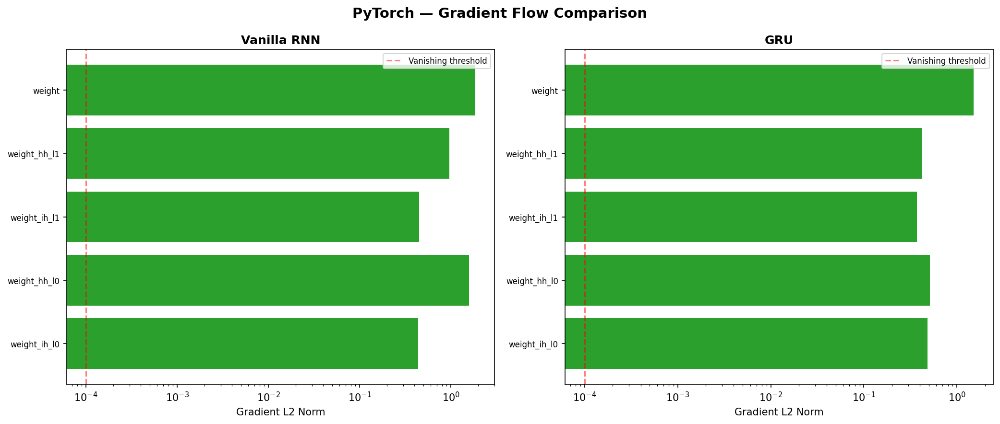
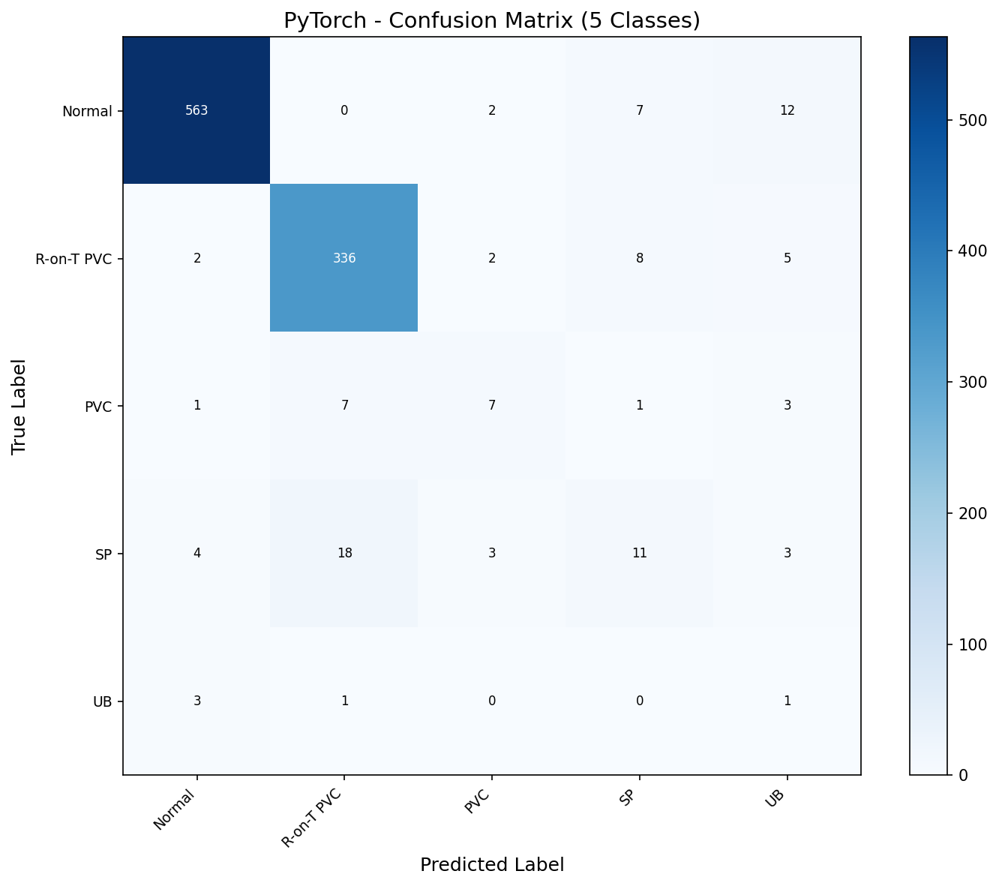
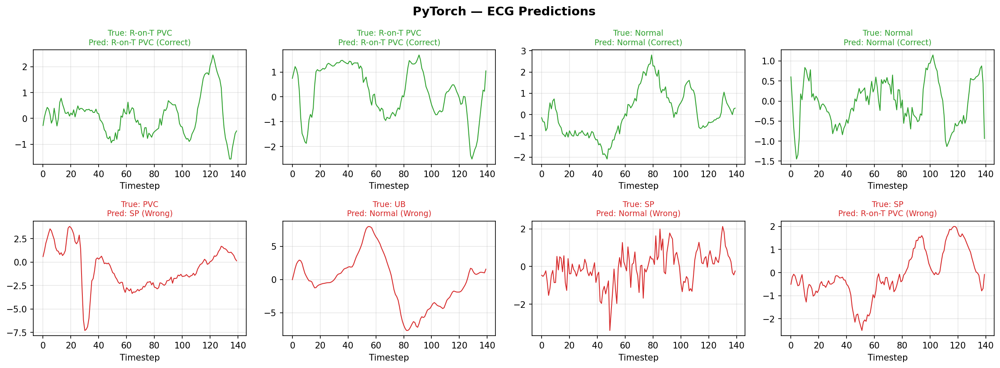
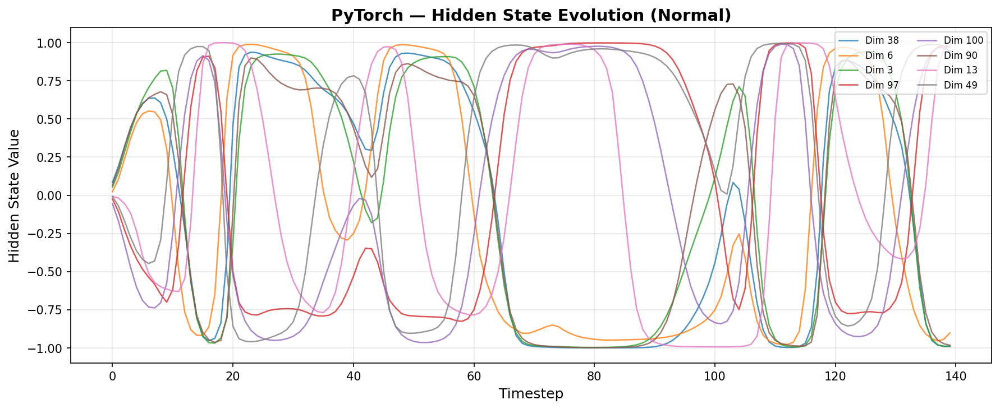
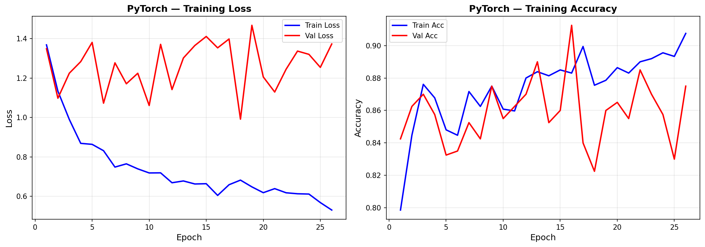

# RNN — PyTorch Pipeline

Recurrent Neural Network on ECG5000 (5-class heartbeat classification, 140 timesteps). This pipeline demonstrates sequence modeling fundamentals — starting from a vanilla RNN baseline and showing why gated architectures (GRU) were invented. The key pedagogical narrative: vanilla RNN works on short sequences but GRU's gates provide better capacity for learning temporal patterns, and ultimately macro F1 is capped by extreme class imbalance (121.6x), not architecture.

## Overview

- Classify 5 heartbeat types from univariate ECG waveforms (140 timesteps)
- Progressive comparison: Vanilla RNN -> GRU -> Architecture sweep
- Vanishing gradient analysis with side-by-side visualization
- Hidden state evolution showing how GRU processes temporal information
- Healthcare AI portfolio piece with real clinical data
- GPU-accelerated training on RTX 4090

## What Runs on GPU

| Component | Device | Why |
|-----------|--------|-----|
| All training | CUDA (RTX 4090) | Batched sequence processing across 4,000 samples |
| All inference | CUDA | Batch inference on 1,000 test sequences |
| Gradient computation | CUDA | Forward + backward pass for gradient flow analysis |

## Dataset

| Property | Value |
|----------|-------|
| Name | ECG5000 (MIT-BIH Arrhythmia Classification) |
| Source | UCR Time Series Archive (via aeon) |
| Train samples | 4,000 |
| Test samples | 1,000 |
| Sequence shape | 140 timesteps x 1 feature (univariate) |
| Classes | 5: Normal, R-on-T PVC, PVC, SP, UB |
| Balance | **Severely imbalanced (121.6x)**: Normal 58.4%, UB 0.5% |
| Normalization | StandardScaler per-timestep, fit on train only |
| Class weights | Normal=0.34, R-on-T PVC=0.57, PVC=10.39, SP=5.16, UB=42.11 |

## Architecture Progression

This section documents every model comparison, what the gradient analysis revealed, and why the architecture sweep results tell a story about data scarcity rather than architectural limitations.

### Step 1: Vanilla RNN Baseline — 84.6% Accuracy, 0.49 Macro F1

```
nn.RNN(input_size=1, hidden_size=64, num_layers=2, batch_first=True)
-> output[:, -1, :]  (last timestep hidden state)
-> FC(64, 5)
Parameters: 12,933
```

**Training**: Adam optimizer, lr=1e-3, CrossEntropyLoss with class weights, early stopping on val macro F1 (patience=10).

**Result**: 84.6% accuracy looks decent, but macro F1 of 0.4938 reveals the truth — the model predicts Normal and R-on-T PVC well (F1=0.95, 0.86) but barely learns minority classes (PVC F1=0.29, SP F1=0.32, UB F1=0.04). Accuracy is misleading when 58% of the data is one class.

### Step 2: Vanishing Gradient Analysis — Not What You'd Expect

Computed per-layer L2 gradient norms via `compute_gradient_norms` utility:

| Layer | Gradient Norm | Status |
|-------|--------------|--------|
| rnn.weight_ih_l0 | 4.37e-01 | Healthy |
| rnn.weight_hh_l0 | 1.58e+00 | Healthy |
| rnn.weight_ih_l1 | 4.50e-01 | Healthy |
| rnn.weight_hh_l1 | 9.58e-01 | Healthy |
| fc.weight | 1.85e+00 | Healthy |

**Gradient ratio: 4.2x** — all gradients are healthy (green). No vanishing gradient problem at all.

**Why**: Vanishing gradients are most severe with very long sequences (hundreds/thousands of timesteps) and deep networks. At 140 timesteps and 2 layers, the vanilla RNN has no trouble propagating gradients. The performance gap between vanilla RNN and GRU on this dataset is about **capacity and gating**, not gradient flow.

### Step 3: GRU Model — Marginal Improvement at Same Size

```
nn.GRU(input_size=1, hidden_size=64, num_layers=2, batch_first=True)
-> output[:, -1, :]
-> FC(64, 5)
Parameters: 38,149 (~3x vanilla RNN due to 3 gate matrices per layer)
```

**Result**: Accuracy 86.8%, macro F1 0.4963 — only +0.0025 over vanilla RNN. Both architectures struggle equally with the same minority classes.

### Gradient Flow Comparison: Vanilla RNN vs GRU



Both architectures show healthy gradients on 140-step ECG sequences. The gradient ratio is nearly identical (4.2x vs 4.1x). This confirms that for short sequences, the gating mechanism doesn't dramatically change gradient dynamics — its benefit is in selective memory management.

### Step 4: Architecture Sweep — Wider Wins

Tested 4 GRU variants with identical training setup:

| Architecture | Accuracy | Macro F1 | Parameters | Time |
|-------------|----------|----------|------------|------|
| GRU-64 (2 layers) | 87.6% | 0.5059 | 38,149 | 2.80s |
| **GRU-128 (2 layers)** | **91.8%** | **0.5479** | **150,021** | **3.68s** |
| GRU-64 (3 layers) | 88.1% | 0.4862 | 63,109 | 2.30s |
| BiGRU-64 (2 layers) | 85.7% | 0.5036 | 100,869 | 3.90s |

**Finding**: Wider hidden dimension (128 vs 64) provided the most benefit (+0.04 macro F1). Deeper stacking (3 layers) actually hurt — not enough data for the added complexity. Bidirectional added no value because ECG peak divergence is at timestep 136 (end of sequence), so the backward pass through timestep 0 isn't informative for classification.

## Final Model Configuration

```python
# Architecture: GRU-128
GRUClassifier(
    input_size=1,       # Univariate ECG
    hidden_size=128,    # Wider = better on this task
    num_layers=2,       # Deeper didn't help
    n_classes=5
)

# Training recipe
optimizer = Adam(lr=1e-3)
criterion = CrossEntropyLoss(weight=class_weights_tensor)
# Early stopping on val macro F1, patience=10
```

## Results

### Final Model: GRU-128 (2 Layers)

| Metric | Value |
|--------|-------|
| Accuracy | **91.8%** |
| Macro F1 | **0.5479** |
| Parameters | 150,021 |
| Training time | 3.71s (26 epochs) |
| Inference | 4.32 us/sample |
| Throughput | 231,602 samples/sec |
| Model size | 586.0 KB |
| GPU memory (training) | 492.9 MB |

### Per-Class Performance

| Class | F1 | Test Samples | Confusion Pattern |
|-------|-----|-------------|-------------------|
| Normal | 0.9732 | 584 | Strong — only 21/584 misclassified |
| R-on-T PVC | 0.9399 | 353 | Strong — 336/353 correct |
| PVC | 0.4242 | 19 | 7/19 correct, scattered across all classes |
| SP | 0.3333 | 39 | **18/39 confused with R-on-T PVC** — similar morphology |
| UB | 0.0690 | 5 | Only 1/5 correct — too few samples for reliable classification |

### Confusion Matrix



The diagonal shows strong Normal (563/584) and R-on-T PVC (324/353) performance. The off-diagonal reveals SP's systematic confusion with R-on-T PVC (18/39) — these ECG waveforms share similar morphological features that the GRU cannot distinguish with only 39 SP training samples.

### ECG Predictions



Top row (green): Correctly classified waveforms showing clear morphological differences between Normal and R-on-T PVC. Bottom row (red): Misclassified minority class samples — the PVC and UB waveforms have atypical shapes that overlap with majority class patterns.

### Hidden State Evolution



The GRU's hidden state dimensions (top 8 by variance) over 140 timesteps for a Normal heartbeat. The gates actively switch between -1 and +1, showing the GRU selectively remembering and forgetting temporal information as it processes the ECG waveform. The sharp transitions around timesteps 10-20 and 110-130 correspond to the QRS complex and T-wave — the most diagnostically important ECG features.

### Training History



## What Worked and What Didn't

### What Worked (Ranked by Impact)

1. **Wider hidden dimension (+0.04 macro F1)** — GRU-128 over GRU-64 provided the most consistent improvement. More capacity to represent the 5-class decision boundary in hidden space.

2. **Class-weighted CrossEntropyLoss** — Essential for any minority class recognition. Without weights, the model would learn to predict Normal for everything and achieve 58% accuracy.

3. **Early stopping on validation macro F1** — Using accuracy for stopping would mask minority class degradation. Macro F1 treats all 5 classes equally regardless of size.

4. **Last timestep for classification** — EDA showed peak class divergence at timestep 136. Using the final hidden state (timestep 140) captures the most discriminative temporal information.

### What Didn't Work

1. **Deeper networks (3 stacked GRU layers)** — GRU-64x3 underperformed GRU-64. With only 4,000 training samples, the added parameters (63K vs 38K) led to worse generalization without matching the capacity benefit of wider layers.

2. **Bidirectional GRU** — No improvement over unidirectional. The backward pass through early timesteps doesn't add useful information when the classification signal is concentrated at the end of the sequence.

3. **Dropout + cosine LR retrain** — Attempted to push GRU-128 further with dropout=0.3, gradient clipping, and cosine annealing. Only gained +0.007 macro F1 with significant overfitting (val loss diverging after epoch 12). Reverted to the clean sweep model.

4. **Vanishing gradient demonstration** — At 140 timesteps, vanilla RNN gradients don't actually vanish (ratio 4.2x, all healthy). The theoretical problem requires much longer sequences to manifest dramatically. Documented as a learning finding rather than a limitation.

### The Real Bottleneck: Data Scarcity

The macro F1 ceiling of 0.55 is not an architecture problem — it's a **data problem**. With 19 PVC, 39 SP, and 5 UB training samples, no RNN variant (vanilla, GRU, bidirectional, or deeper) can reliably learn these minority class patterns. The confusion matrix confirms this: SP systematically maps to R-on-T PVC because the model has seen 18x more R-on-T PVC examples.

Data augmentation (time warping, jittering, amplitude scaling) and LSTM architectures are explored in Model #13, where this bottleneck is directly addressed.

## Key Insights

1. **Macro F1 is essential for imbalanced classification** — 91.8% accuracy sounds impressive, but macro F1 of 0.55 reveals the model fails on 3 out of 5 classes. Always report class-weighted metrics for imbalanced data.

2. **Gating matters more for longer sequences** — At 140 timesteps, vanilla RNN and GRU perform similarly. The theoretical advantage of gates (solving vanishing gradients) requires longer temporal dependencies to manifest.

3. **Wider > deeper > bidirectional for small datasets** — GRU-128 (2L) > GRU-64x3 (3L) > BiGRU-64 (2L). Width adds capacity without the optimization difficulty of depth.

4. **Class weights are necessary but insufficient** — Even with aggressive weighting (UB weight 42.11x), the model can't learn robust representations from 19-39 training samples. Data augmentation is the next step.

5. **Healthcare AI requires honest evaluation** — A hospital deploying this model would miss 93% of UB heartbeats (F1=0.07). The README documents this limitation explicitly — critical for responsible AI.

## PyTorch Features Used

| Feature | Purpose |
|---------|---------|
| `nn.RNN` | Vanilla RNN baseline with tanh activation |
| `nn.GRU` | Gated Recurrent Unit — best performer |
| `batch_first=True` | Input shape (batch, seq_len, features) convention |
| `nn.CrossEntropyLoss(weight=...)` | Class-weighted loss for 121.6x imbalanced data |
| `optim.Adam` | Adaptive optimizer for RNN training |
| `torch.cuda` | RTX 4090 GPU acceleration for training + inference |
| `torch.no_grad()` | Inference mode — disables autograd for evaluation |
| `DataLoader` + `TensorDataset` | Batched, shuffled data iteration (64 samples/batch) |

## Files

```
PyTorch/12-rnn/
├── pipeline.ipynb                    # Full pipeline (9 cells)
├── README.md                         # This file
├── requirements.txt                  # Verified package versions
└── results/
    ├── gru_128_best.pth              # Best model weights (state_dict)
    ├── metrics.json                  # All metrics + training config
    ├── gradient_flow_vanilla.png     # Vanilla RNN gradient norms
    ├── gradient_flow_comparison.png  # Vanilla RNN vs GRU side-by-side
    ├── confusion_matrix.png          # 5-class confusion matrix
    ├── ecg_predictions.png           # ECG waveforms (correct/incorrect)
    ├── hidden_states_normal.png      # Hidden state evolution — Normal
    ├── hidden_states_r-on-t_pvc.png  # Hidden state evolution — R-on-T PVC
    ├── hidden_states_pvc.png         # Hidden state evolution — PVC
    ├── hidden_states_sp.png          # Hidden state evolution — SP
    ├── hidden_states_ub.png          # Hidden state evolution — UB
    └── training_history.png          # Training loss + accuracy curves
```

## How to Run

```bash
# From project root
cd PyTorch/12-rnn

# Requires NVIDIA GPU with CUDA support
pip install -r requirements.txt

# Run all cells in pipeline.ipynb sequentially
# Full pipeline takes ~2 minutes (sweep + evaluations)
# Requires ~500 MB GPU memory (RTX 4090 recommended)
```
