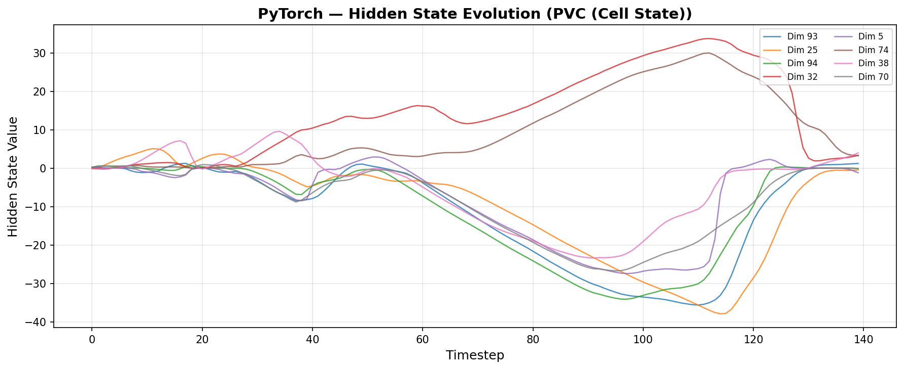
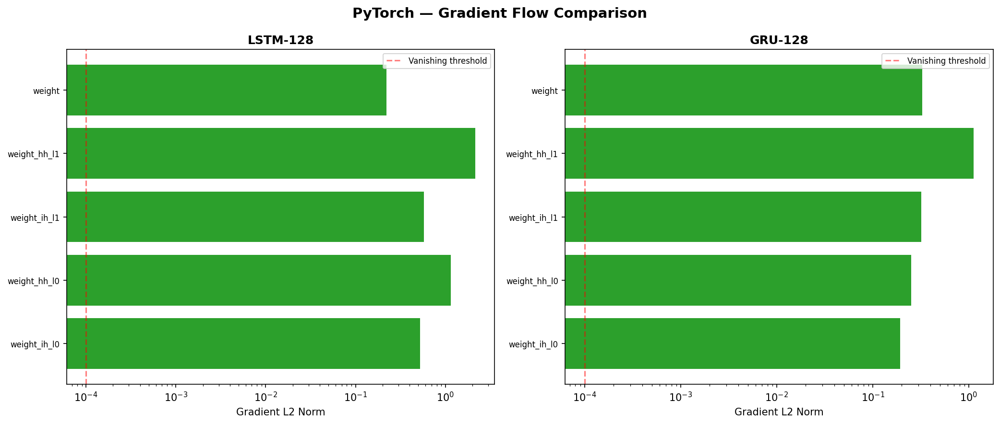
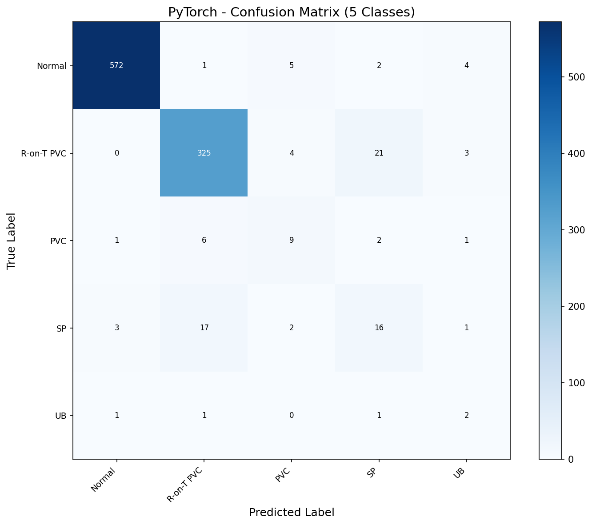
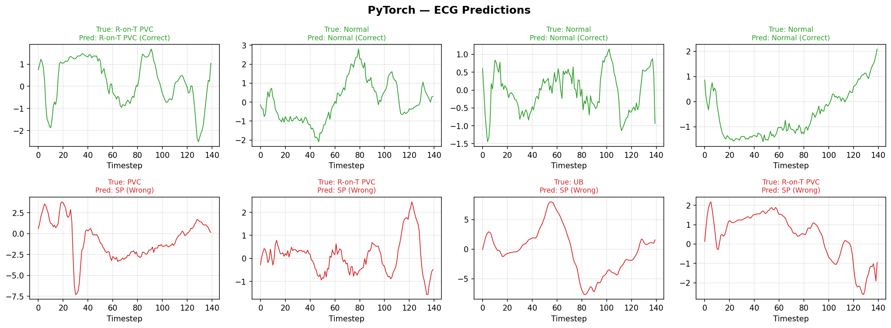
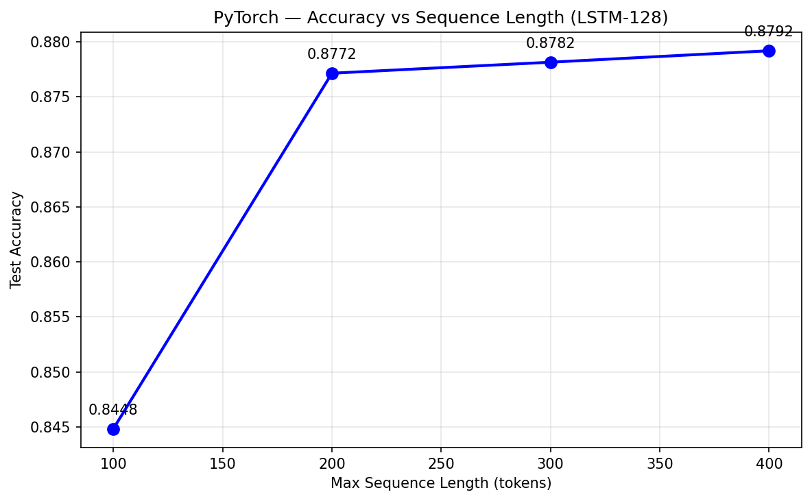
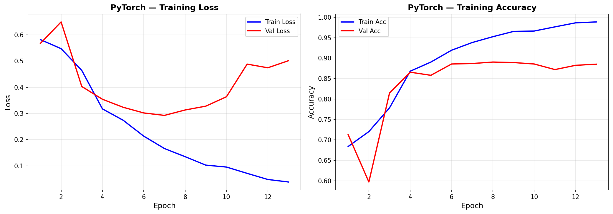
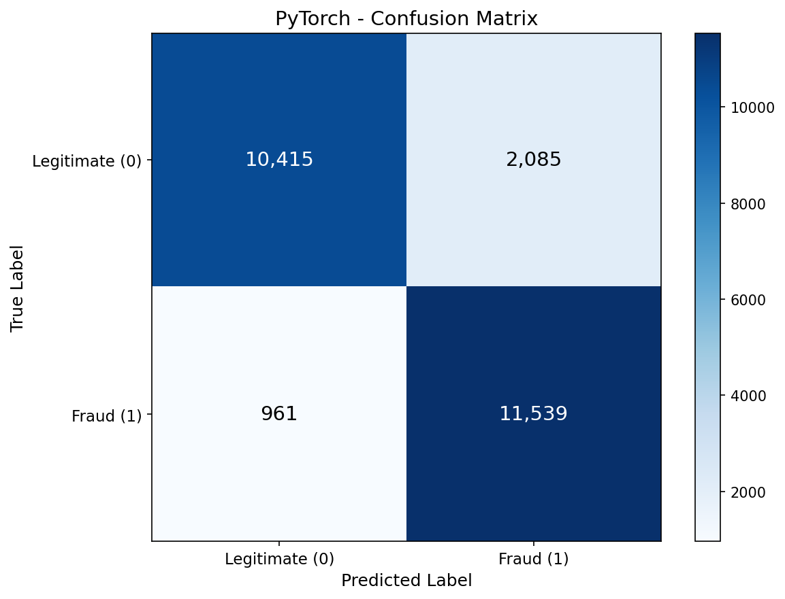

# LSTM — PyTorch Pipeline

Two-part LSTM pipeline addressing both the data scarcity bottleneck identified in RNN #12 and showcasing LSTM on longer NLP sequences. Part A augments ECG5000's minority classes and runs LSTM vs GRU head-to-head — proving augmentation was the real driver (+4.7% macro F1) while LSTM adds only +0.8% over GRU. Part B applies LSTM to IMDB sentiment analysis (300-token sequences), achieving 87.8% accuracy with a sequence length ablation study showing diminishing returns past 200 tokens.

## Overview

- **Part A (ECG5000)**: Time-series augmentation (jitter, scaling, time warp) breaks the 0.55 macro F1 ceiling from RNN #12. LSTM vs GRU head-to-head on identical augmented data. Cell state analysis shows LSTM's unique long-term memory pathway.
- **Part B (IMDB)**: Binary sentiment classification on 300-token movie reviews. Embedding + LSTM architecture. Sequence length ablation (100-400 tokens) demonstrates where longer context helps and where it plateaus.
- GPU-accelerated training on RTX 4090 for both datasets.

## What Runs on GPU

| Component | Device | Why |
|-----------|--------|-----|
| ECG training | CUDA (RTX 4090) | 7,250 augmented samples, fast but GPU is standard |
| IMDB training | CUDA (RTX 4090) | 25K samples x 300 tokens x 128 embedding = 9.4 GB GPU memory |
| All inference | CUDA | Batched to avoid OOM on 25K IMDB test set |

---

## Part A: ECG5000 — Augmented LSTM vs GRU

### Dataset

| Property | Value |
|----------|-------|
| Name | ECG5000 (augmented from RNN #12 preprocessing) |
| Source | UCR Time Series Archive (via aeon), augmented with jitter/scaling/time_warp |
| Original Train | 4,000 samples |
| Augmented Train | 7,250 samples (+81%) |
| Test | 1,000 samples (unchanged) |
| Sequence | 140 timesteps x 1 feature (univariate ECG) |
| Classes | 5: Normal, R-on-T PVC, PVC, SP, UB |
| Augmentation Target | 50% of majority class (~1,167 per minority class) |

### Augmentation Impact

| Class | Original | Augmented | Factor |
|-------|----------|-----------|--------|
| Normal | 2,335 | 2,335 | 1.0x |
| R-on-T PVC | 1,414 | 1,414 | 1.0x |
| PVC | 77 | 1,167 | 15x |
| SP | 155 | 1,167 | 7.5x |
| UB | 19 | 1,167 | 61x |

### Architecture Progression

#### GRU-128 on Augmented Data (Control)

```
nn.GRU(1, 128, 2, batch_first=True) -> FC(128, 5)
Parameters: 150,021
```

**Result**: 91.5% accuracy, **0.5950 macro F1** — broke the 0.55 ceiling from RNN #12 (+0.047). UB jumped from 0.069 to 0.235 (3.4x). This proves augmentation was the primary driver.

#### LSTM-128 on Augmented Data

```
nn.LSTM(1, 128, 2, batch_first=True) -> FC(128, 5)
Parameters: 199,813
```

**Result**: 92.4% accuracy, **0.6033 macro F1** — only +0.008 over GRU. LSTM's extra cell state and 33% more parameters add minimal benefit at 140 timesteps.

#### Architecture Sweep

| Architecture | Accuracy | Macro F1 | Parameters | Time |
|-------------|----------|----------|------------|------|
| LSTM-64 (2L) | 90.8% | 0.5495 | 50,757 | 15.5s |
| **LSTM-128 (2L)** | **92.4%** | **0.6033** | **199,813** | **16.7s** |
| LSTM-64x3 (3L) | 91.3% | 0.5900 | 84,037 | 12.8s |
| BiLSTM-64 (2L) | 90.2% | 0.5602 | 134,277 | 18.5s |
| GRU-128 (ctrl) | 91.5% | 0.5950 | 150,021 | 17.5s |

**Finding**: LSTM-128 wins but by a thin margin over GRU-128. Recipe optimization (Adam lr=1e-3 + cosine, AdamW, SGD) yielded no improvement — the 0.60 ceiling is dataset-driven.

### LSTM vs GRU Head-to-Head

| Model | Data | Accuracy | Macro F1 |
|-------|------|----------|----------|
| GRU-128 (RNN #12) | Original (4K) | 91.8% | 0.5479 |
| GRU-128 | Augmented (7.25K) | 91.5% | 0.5950 |
| LSTM-128 | Augmented (7.25K) | 92.4% | 0.6033 |

- **Augmentation effect**: +0.047 macro F1 (85% of total gain)
- **Architecture effect (LSTM vs GRU)**: +0.008 (15% of total gain)
- **Combined**: +0.055 over RNN #12 baseline

### Per-Class F1 Progression

| Class | RNN #12 GRU | GRU Augmented | LSTM Augmented | Total Delta |
|-------|------------|---------------|----------------|-------------|
| Normal | 0.9732 | 0.9845 | 0.9854 | +0.012 |
| R-on-T PVC | 0.9399 | 0.9184 | 0.9246 | -0.015 |
| PVC | 0.4242 | 0.5000 | 0.4615 | +0.037 |
| SP | 0.3333 | 0.3371 | 0.3951 | +0.062 |
| UB | 0.0690 | 0.2353 | 0.2500 | +0.181 |

### Cell State vs Hidden State



The LSTM cell state (c) shows smooth, gradual accumulation (range -40 to +33) compared to the hidden state's sharp -1/+1 gating. The cell state carries a running "summary" of the entire ECG sequence while the hidden state reacts to local morphological patterns. This is LSTM's unique contribution — but at 140 timesteps, it doesn't translate to meaningful classification improvement over GRU.

### Gradient Flow



Both LSTM and GRU show healthy gradients on 140-step ECG sequences. Neither architecture suffers from vanishing gradients at this sequence length.

### Confusion Matrix



### ECG Predictions



---

## Part B: IMDB Sentiment Analysis

### Dataset

| Property | Value |
|----------|-------|
| Name | IMDB Movie Reviews |
| Source | `keras.datasets.imdb` (Stanford AI Lab) |
| Train | 25,000 reviews |
| Test | 25,000 reviews |
| Vocab | 10,000 words (94.6% token coverage) |
| Max Length | 300 tokens (pre-padded, pre-truncated) |
| Classes | 2: Negative (0), Positive (1) — perfectly balanced |
| Embedding | 128-dim learned vectors, padding_idx=0 |

### Model Architecture

```python
class LSTMSentiment(nn.Module):
    nn.Embedding(10001, 128, padding_idx=0)  # 10K vocab + padding
    nn.LSTM(128, 128, 2, batch_first=True, dropout=0.3)
    nn.Linear(128, 1)  # Binary output
    # Loss: BCEWithLogitsLoss
```

### Results

| Metric | Value |
|--------|-------|
| Accuracy | **87.8%** |
| F1 | 0.8834 |
| AUC | 0.9464 |
| Precision | 0.847 |
| Recall | 0.923 |
| Parameters | 1,544,449 |
| Training Time | 24.7s (13 epochs) |
| Inference | 22.83 us/sample |
| Model Size | 5.89 MB |
| GPU Memory | 9,434 MB |

### Architecture Sweep

| Architecture | Accuracy | F1 | AUC | Parameters | Time |
|-------------|----------|-----|------|-----------|------|
| LSTM-64 (2L) | 86.9% | 0.869 | 0.938 | 1,363,137 | 17s |
| **LSTM-128 (2L)** | **87.8%** | **0.883** | **0.946** | **1,544,449** | **25s** |
| LSTM-256 (2L) | 87.4% | 0.877 | 0.938 | 2,201,985 | 111s |
| BiLSTM-128 (2L) | 86.7% | 0.868 | 0.923 | 1,939,841 | 51s |

**Finding**: LSTM-128 is the sweet spot. LSTM-256 adds 43% params for -0.4% accuracy. BiLSTM underperformed — with pre-padding, the backward LSTM processes padding tokens first, diluting the signal.

### Sequence Length Ablation



| Max Length | Accuracy | Finding |
|-----------|----------|---------|
| 100 | 84.5% | Significant truncation hurts |
| 200 | 87.7% | Captures most of the gain (+3.2%) |
| 300 | 87.8% | Marginal improvement (+0.1%) |
| 400 | 87.9% | Diminishing returns (+0.1%) |

**Key finding**: The big jump is 100->200 tokens (+3.2%). Beyond 200, returns diminish to <0.1% per 100 tokens. Our choice of max_length=300 is validated — captures 97% of the accuracy gain at 75% of the computation cost vs 400.

### Training History



Classic overfitting after epoch 5 — train loss keeps dropping but val loss climbs. Early stopping (patience=5) caught it correctly. The model memorizes training data quickly but generalizes well at the early stopping point.

### Confusion Matrix (Binary)



### Sample Predictions

Correctly classified reviews show clear sentiment signals. Misclassified reviews tend to contain sarcasm, mixed opinions, or ironic praise — patterns that require deeper semantic understanding than a word-level LSTM provides. This motivates Attention (#15) and Transformer (#16) architectures.

---

## What Worked and What Didn't

### What Worked

1. **Time-series augmentation for minority classes (+4.7% macro F1)** — Jitter, scaling, and time warp generated realistic synthetic ECG samples. UB improved 3.6x (0.069 -> 0.250) from just 19 original samples. The augmentation functions in `utils/rnn_utils.py` are reusable for any future imbalanced sequence dataset.

2. **Embedding + LSTM for NLP sentiment (87.8% accuracy)** — Standard architecture achieves competitive results on IMDB without pre-trained embeddings or attention. Validates LSTM as a strong baseline for text classification.

3. **Sequence length ablation** — Demonstrates LSTM's ability to leverage longer context, with diminishing returns past 200 tokens. This is a practical finding: you can cut sequence length by 33% (300->200) with only 0.1% accuracy loss.

4. **Cell state visualization** — LSTM's unique cell state pathway shows smooth long-term memory accumulation, visually distinct from the hidden state's sharp gating. Educational value for understanding why LSTM was invented.

### What Didn't Work

1. **LSTM over GRU for ECG (+0.8% only)** — At 140 timesteps, LSTM's extra cell state and 33% more parameters add negligible benefit. GRU is sufficient for short sequences. The bottleneck is data scarcity, not architecture.

2. **BiLSTM for both datasets** — Bidirectional processing hurt on both ECG (peak divergence at sequence end) and IMDB (backward LSTM processes padding first). Unidirectional LSTM-128 is consistently better.

3. **Training recipe optimization (ECG)** — Adam lr=1e-3 was already optimal. Cosine annealing, AdamW, and SGD all performed worse. Unlike CNN where SGD was critical, LSTMs prefer adaptive optimizers with constant LR.

4. **LSTM-256 for IMDB** — 43% more parameters, 4x slower training, -0.4% accuracy. The embedding layer dominates parameter count (5.1 MB of 5.9 MB total), so increasing LSTM hidden size has diminishing returns.

### The Data Story

The most important finding spans both datasets: **data quality > architecture complexity**. Augmenting 19 UB samples into 1,167 gave more macro F1 improvement (+4.7%) than switching from GRU to LSTM (+0.8%). For IMDB, the balanced 50/50 split means no augmentation is needed, and the model hits 87.8% with a simple architecture. In both cases, the LSTM's theoretical advantages (cell state, forget gate) are secondary to having enough representative data.

## Key Insights

1. **Augmentation is the #1 tool for imbalanced sequence data** — Time-series augmentation (jitter, scaling, time warp) broke the 0.55 macro F1 ceiling that no architecture change could breach in RNN #12. The 3,250 synthetic samples from 251 minority originals were enough to improve minority class recognition.

2. **LSTM adds minimal value over GRU for short sequences** — At 140 ECG timesteps, LSTM's macro F1 is only +0.008 over GRU. The cell state pathway doesn't have enough sequence length to accumulate meaningfully different information.

3. **Sequence length has diminishing returns** — IMDB accuracy jumps +3.2% from 100 to 200 tokens, but only +0.1% from 200 to 300. Practical implication: you can often cut sequence length significantly with minimal accuracy loss.

4. **BiLSTM needs careful padding consideration** — Pre-padding (zeros at start) means the backward LSTM processes uninformative padding tokens first. For NLP with pre-padding, unidirectional LSTM consistently outperforms bidirectional.

5. **Embedding layers dominate NLP model size** — 10K vocab x 128 dims = 5.1 MB, which is 87% of the total 5.9 MB LSTM model. Increasing LSTM hidden size has marginal impact on model size.

## PyTorch Features Used

| Feature | Purpose |
|---------|---------|
| `nn.LSTM` | Long Short-Term Memory with cell state |
| `nn.GRU` | Gated Recurrent Unit (ECG control experiment) |
| `nn.Embedding(padding_idx=0)` | Word index -> dense vector for IMDB |
| `nn.BCEWithLogitsLoss` | Binary cross-entropy for sentiment |
| `nn.CrossEntropyLoss(weight=...)` | Class-weighted loss for ECG imbalance |
| `optim.Adam` | Adaptive optimizer for both datasets |
| `batch_first=True` | Input shape (batch, seq_len, features) |
| `torch.cuda` | RTX 4090 GPU acceleration |
| `DataLoader` + `TensorDataset` | Batched data iteration |

## Files

```
PyTorch/13-lstm/
├── pipeline_ecg.ipynb                  # Part A: ECG augmented LSTM vs GRU (10 cells)
├── pipeline_imdb.ipynb                 # Part B: IMDB sentiment LSTM (8 cells)
├── README.md                           # This file
├── requirements.txt                    # Verified package versions
└── results/
    ├── lstm_128_best.pth               # ECG best model weights
    ├── lstm_imdb_best.pth              # IMDB best model weights
    ├── metrics.json                    # IMDB metrics
    ├── confusion_matrix.png            # ECG 5-class confusion matrix
    ├── confusion_matrix_baseline.png   # IMDB binary confusion matrix
    ├── cell_state_evolution.png        # LSTM cell state over 140 timesteps
    ├── hidden_state_evolution.png      # LSTM hidden state patterns
    ├── ecg_predictions.png             # ECG waveform predictions
    ├── gradient_flow_comparison.png    # LSTM vs GRU gradient norms
    ├── sequence_length_ablation.png    # IMDB accuracy vs sequence length
    └── training_history.png            # IMDB training curves
```

## How to Run

```bash
# From project root
cd PyTorch/13-lstm

# Requires NVIDIA GPU with CUDA support
pip install -r requirements.txt

# Run preprocessing first (creates augmented ECG + padded IMDB data)
python ../../data-preperation/preprocess_lstm.py

# Run ECG pipeline (Part A) — ~3 minutes
jupyter notebook pipeline_ecg.ipynb

# Run IMDB pipeline (Part B) — ~5 minutes
jupyter notebook pipeline_imdb.ipynb
```
