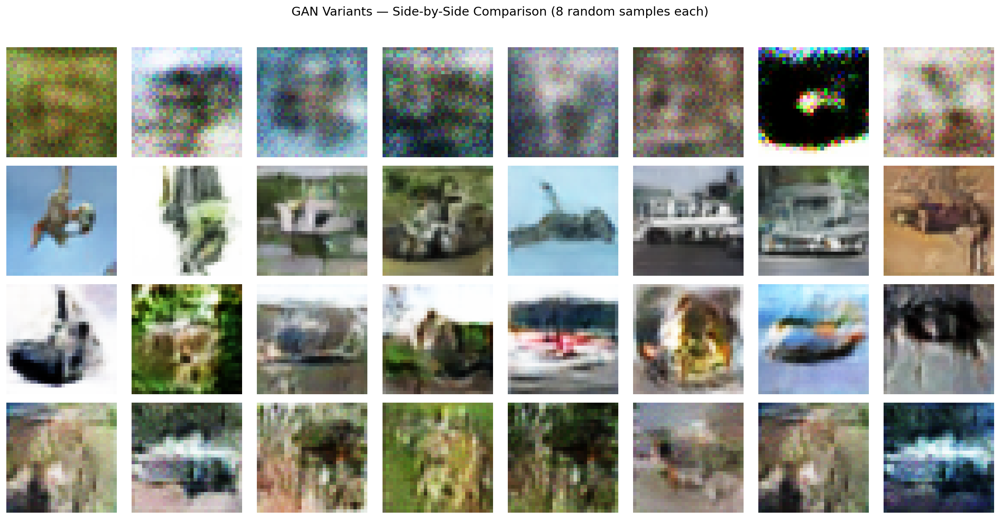
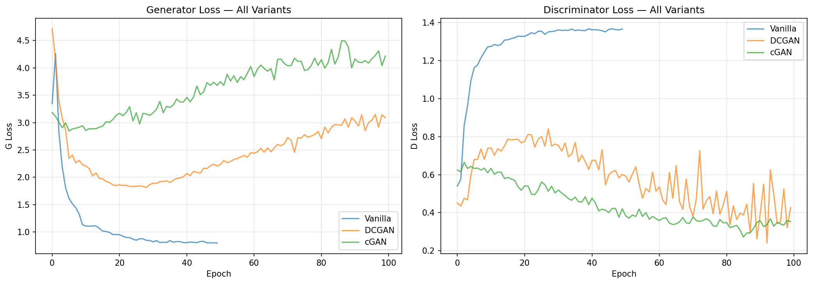
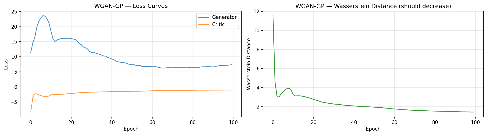
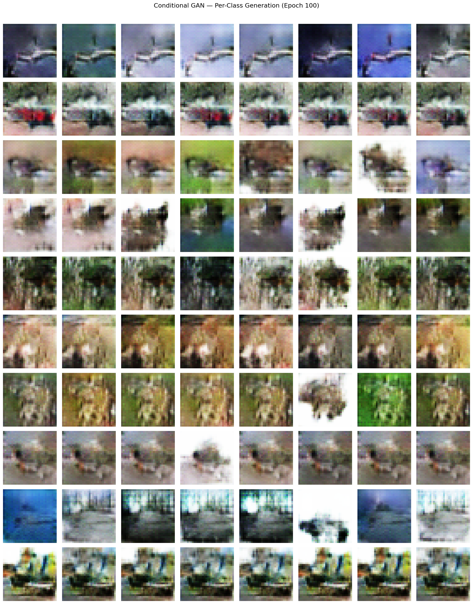

# GANs — PyTorch Pipeline

First generative model in the project. Progressive build from MLP baseline to convolutional to Wasserstein to class-conditional, each variant solving a specific limitation of the previous one. DCGAN achieves FID 30.57 on CIFAR-10 — competitive with published results. The key finding: convolutional architecture is the single biggest quality factor (FID 261 → 31), while loss function choice (BCE vs Wasserstein) primarily affects training stability rather than final quality at 100 epochs.

## Overview

- **4 GAN variants**: Vanilla (MLP) → DCGAN (conv) → WGAN-GP (Wasserstein) → Conditional GAN (class control)
- **Progressive build**: Each variant motivated by the previous one's limitations — not pre-planned
- **Dataset**: CIFAR-10 (50K train, 32x32 RGB) — canonical GAN benchmark, same as Autoencoders #10 but [-1, 1] normalization
- GPU-accelerated training on RTX 4090

## What Runs on GPU

| Component | Device | Why |
|-----------|--------|-----|
| All GAN training | CUDA (RTX 4090) | Conv layers on 50K images, adversarial training |
| FID computation | CUDA | InceptionV3 feature extraction on 10K images |
| All inference | CUDA | Generator forward pass |

---

## Dataset

| Property | Value |
|----------|-------|
| Name | CIFAR-10 |
| Source | `tensorflow.keras.datasets.cifar10` |
| Train | 50,000 images |
| Test | 10,000 images (FID reference only) |
| Shape | 32x32x3 RGB |
| Classes | 10 (airplane, automobile, bird, cat, deer, dog, frog, horse, ship, truck) |
| Balance | Perfect (5,000 per class) |
| Normalization | [-1, 1] via `pixel / 127.5 - 1.0` (tanh generator output) |

---

## Variant Progression

### 1. Vanilla GAN (MLP Baseline) — FID 261.47

```
Generator:  Linear(100→256→512→1024→3072) + BN + ReLU + Tanh
Discriminator: Linear(3072→512→256→1) + LeakyReLU + Dropout + Sigmoid
G params: 3,835,136 | D params: 1,704,961
Training: BCE loss, Adam(lr=0.0002, betas=(0.5, 0.999)), 50 epochs
```

**Result**: Blurry blobs with pixel noise. No recognizable objects. MLP treats each pixel independently — no spatial awareness. Training stable (D loss ~1.37 near theoretical optimum), but architecture is the bottleneck.

**Motivated DCGAN**: Need convolutional layers for spatial structure.

### 2. DCGAN (Deep Convolutional GAN) — FID 30.57

```
Generator:  z(100,1,1) → ConvT(256,4x4) → ConvT(128,8x8) → ConvT(64,16x16) → ConvT(3,32x32) + Tanh
Discriminator: Conv(64,16x16) → Conv(128,8x8) → Conv(256,4x4) → Conv(1,1x1) + Sigmoid
G params: 1,068,928 | D params: 663,296
Training: BCE loss, Adam(lr=0.0002, betas=(0.5, 0.999)), weight init N(0, 0.02), 100 epochs
```

**Result**: Massive quality jump — recognizable animals, vehicles, planes, boats. FID dropped 8.5x (261 → 31). Good diversity, no mode collapse. However, training curves show D winning (loss dropping to 0.44) while G diverges (loss rising to 3.04) — classic BCE instability.

**Motivated WGAN-GP**: D-winning collapse → need loss that correlates with quality.

### 3. WGAN-GP (Wasserstein + Gradient Penalty) — FID 55.35

```
Generator:  Same conv architecture as DCGAN
Critic: Same conv but LayerNorm (not BN), no sigmoid → raw score
G params: 1,068,928 | Critic params: 687,104
Training: Wasserstein loss + GP(λ=10), n_critic=5, Adam(lr=0.0001, betas=(0.0, 0.9)), 100 epochs
```

**Result**: Wasserstein distance smoothly decreasing (11.5 → 1.4) — a meaningful training metric. No D-winning collapse. Training fundamentally healthier than DCGAN. However, FID is higher (55 vs 31) at 100 epochs — n_critic=5 means only ~20 effective G updates per 100 D updates. More training would likely close this gap.

**Motivated cGAN**: Quality is good, now add class control.

### 4. Conditional GAN (cGAN) — FID 147.90

```
Generator:  Embedding(10, 100) concat with z → same ConvT pipeline (input: 200 channels)
Discriminator: Embedding(10, 1024) as extra spatial channel → same Conv pipeline (input: 4 channels)
G params: 1,479,528 | D params: 674,560
Training: BCE loss, Adam(lr=0.0002, betas=(0.5, 0.999)), 100 epochs
```

**Result**: Class conditioning works — each class generates visually distinct images (airplanes have sky, ships have water, deer have green backgrounds). Some within-class mode collapse (horse row repetitive). Same D-winning instability as DCGAN (D loss 0.30, G loss 4.28). Higher FID due to the added complexity of conditional discrimination.

---

## FID Comparison

| Variant | FID | G Params | Training | Key Showcase |
|---------|-----|----------|----------|-------------|
| Vanilla GAN | 261.47 | 3,835,136 | BCE, 50ep | Why MLPs fail for images |
| **DCGAN** | **30.57** | **1,068,928** | **BCE, 100ep** | **Conv architecture = quality** |
| WGAN-GP | 55.35 | 1,068,928 | Wass, 100ep | Stable training, meaningful loss |
| Conditional GAN | 147.90 | 1,479,528 | BCE, 100ep | Class-specific generation |

### Generated Samples



### Training Curves



### WGAN-GP Wasserstein Distance



### Conditional GAN Per-Class Generation



---

## Performance Benchmarks (DCGAN — Best Variant)

| Metric | Value |
|--------|-------|
| FID | 30.57 |
| Training Time | 319s (5.3 min, 100 epochs) |
| Per-Epoch Time | 3.19s |
| Inference Speed | 6.01 us/sample (166K samples/sec) |
| GPU Memory Peak | 345 MB |
| Generator Size | 4,176 KB (1.07M params) |
| Discriminator Size | 2,591 KB (663K params) |

---

## What Worked and What Didn't

### What Worked

1. **DCGAN architecture guidelines (FID 261 → 31)** — The DCGAN paper's recipes (ConvTranspose2d for G, strided Conv2d for D, BN everywhere except D input/G output, weight init N(0, 0.02)) proved critical. Following established architecture guidelines matters more than clever loss engineering.

2. **Progressive variant exploration** — Starting with vanilla GAN exposed MLP limitations, motivating DCGAN. DCGAN's D-winning problem motivated WGAN-GP. Each step was data-driven, not pre-planned.

3. **WGAN-GP Wasserstein distance as training metric** — Smoothly decreasing W-distance (11.5 → 1.4) correlates with image quality, unlike BCE loss which oscillates meaninglessly. Essential for diagnosing training health.

4. **Conditional GAN class control** — Label embedding successfully conditions generation. Airplanes produce sky scenes, ships produce water scenes, consistent with EDA class characteristics.

### What Didn't Work

1. **WGAN-GP quality at 100 epochs (FID 55 vs DCGAN's 31)** — The n_critic=5 ratio means the generator gets 5x fewer updates. WGAN-GP trades training speed for stability — more epochs would likely close the gap, but at our 100-epoch budget, DCGAN wins on quality.

2. **cGAN training stability** — Adding class conditioning didn't fix the D-winning BCE instability. D loss still dropped to 0.30 while G diverged to 4.28. A cGAN + WGAN-GP combination would address both class control and stability.

3. **Vanilla GAN as MLP (FID 261)** — Expected failure, but useful baseline. The 3.8M G parameters (3.6x DCGAN's 1.1M) couldn't compensate for the lack of spatial inductive bias.

### The Architecture Story

The single biggest finding: **convolutional architecture is the dominant factor in GAN image quality**. The jump from MLP to conv (FID 261 → 31) dwarfs the impact of loss function choice (BCE vs Wasserstein: 31 vs 55 at 100 epochs) or conditional generation (31 → 148 from added complexity). For deployment, DCGAN with simple BCE loss is the pragmatic choice — it's fast, simple, and produces the best results at a reasonable training budget.

## Key Insights

1. **Conv architecture >> loss function for image quality** — DCGAN's FID (30.57) beats WGAN-GP (55.35) at 100 epochs despite WGAN-GP having theoretically superior training dynamics. The inductive bias of convolutions matters more than the loss landscape.

2. **BCE loss instability is real but manageable** — DCGAN's D-winning problem (D: 0.44, G: 3.04) is visible in training curves but doesn't prevent good generation. WGAN-GP eliminates this at the cost of slower convergence.

3. **Wasserstein distance is the only meaningful GAN training metric** — BCE losses oscillate and don't correlate with quality. W-distance smoothly decreasing from 11.5 to 1.4 directly tracks improvement.

4. **Conditional generation adds complexity and reduces quality** — cGAN's FID (147.90) is 5x worse than DCGAN (30.57). The discriminator must learn both real/fake AND class consistency, splitting its capacity.

5. **GANs need far fewer parameters than classification models** — DCGAN's generator (1.07M params) produces recognizable 32x32 images. Compare to CNN's ResNet-20 (4.35M params) for 80.1% classification accuracy on the same resolution.

## PyTorch Features Used

| Feature | Purpose |
|---------|---------|
| `nn.ConvTranspose2d` | Generator upsampling (fractional-strided convolutions) |
| `nn.Conv2d` with stride | Discriminator downsampling |
| `nn.BatchNorm2d` / `nn.LayerNorm` | Stabilize training (BN for G/D, LN for WGAN critic) |
| `nn.Embedding` | Class label embedding for conditional GAN |
| `torch.autograd.grad` | Gradient penalty computation (WGAN-GP) |
| `nn.BCELoss` | Standard GAN adversarial loss |
| `optim.Adam` | Adaptive optimizer with DCGAN betas (0.5, 0.999) |
| `DataLoader` + `TensorDataset` | Batched shuffled training data |
| `torch.cuda` | RTX 4090 GPU acceleration |

## Files

```
PyTorch/14-gans/
├── pipeline.ipynb                      # Full pipeline (8 cells)
├── README.md                           # This file
├── requirements.txt                    # Verified package versions
└── results/
    ├── dcgan_generator.pth             # Best model (DCGAN generator weights)
    ├── dcgan_discriminator.pth         # DCGAN discriminator weights
    ├── metrics.json                    # DCGAN benchmark metrics
    ├── vanilla_gan_samples.png         # Vanilla GAN generated images
    ├── vanilla_gan_curves.png          # Vanilla GAN training curves
    ├── dcgan_samples.png               # DCGAN generated images
    ├── dcgan_curves.png                # DCGAN training curves
    ├── wgan_gp_samples.png             # WGAN-GP generated images
    ├── wgan_gp_curves.png              # WGAN-GP training + W-distance curves
    ├── cgan_per_class.png              # Conditional GAN per-class generation
    ├── cgan_curves.png                 # Conditional GAN training curves
    ├── variant_comparison.png          # Side-by-side 4-variant comparison
    └── all_training_curves.png         # G/D loss overlay all BCE variants
```

## How to Run

```bash
# From project root
cd PyTorch/14-gans

# Requires NVIDIA GPU with CUDA support
pip install -r requirements.txt

# Run preprocessing first (creates [-1,1] normalized CIFAR-10)
python ../../data-preperation/preprocess_gans.py

# Run pipeline — ~25 minutes total (4 variants)
jupyter notebook pipeline.ipynb
```
