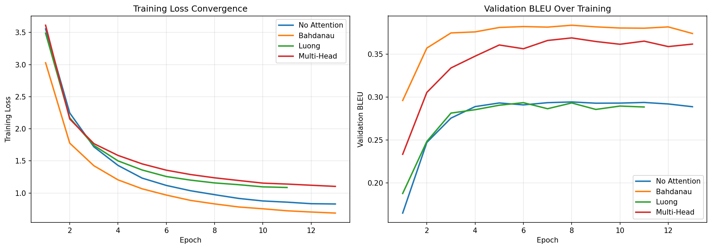
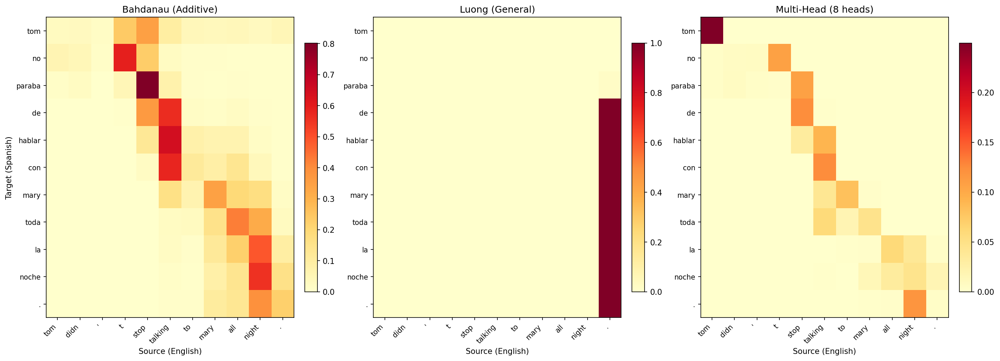

# Attention Mechanisms — PyTorch Pipeline

First sequence-to-sequence model in the project. Progressive build from no-attention baseline through three attention mechanisms, each addressing specific limitations of the previous architecture. Bahdanau attention achieves BLEU 0.3803 on Tatoeba EN→ES — a 29% improvement over the bottleneck baseline. The key finding: where context enters the decoder matters more than how it's computed. Bahdanau's pre-GRU context injection with full 1024-dim encoder output beats both Luong's post-GRU compressed approach and Multi-Head's parallel attention patterns on short-sentence translation.

## Overview

- **4 seq2seq variants**: No-Attention (bottleneck) → Bahdanau (additive) → Luong (multiplicative) → Multi-Head (scaled dot-product)
- **Progressive build**: Each variant motivated by architectural analysis — not pre-planned
- **Dataset**: Tatoeba EN→ES (114K train / 14K val / 14K test) — word-level machine translation
- GPU-accelerated training on RTX 4090

## What Runs on GPU

| Component | Device | Why |
|-----------|--------|-----|
| All seq2seq training | CUDA (RTX 4090) | Encoder-decoder with attention over 114K sentence pairs |
| All inference/decoding | CUDA | Greedy decode with attention computation |
| BLEU evaluation | CUDA + CPU | GPU for decoding, CPU for nltk BLEU scoring |

---

## Dataset

| Property | Value |
|----------|-------|
| Name | Tatoeba EN→ES |
| Source | `spa.txt` (Tab-separated EN/ES pairs) |
| Train | 114,478 pairs |
| Val | 14,309 pairs |
| Test | 14,311 pairs |
| EN Vocab | 10,000 (97.4% coverage) |
| ES Vocab | 10,004 (92.7% coverage) |
| Max Length | 15 tokens (P95=11) |
| Tokenization | Word-level, preserving Spanish accented characters |
| Special Tokens | PAD=0, SOS=1, EOS=2, UNK=3 |

---

## Variant Progression

### 1. No-Attention Baseline — BLEU 0.2942

```
Encoder:  Bidirectional GRU(256→512) + Linear(1024→512)
Decoder:  GRU(256→512) + Linear(512→vocab)
Params: 14,327,060
Training: Adam(lr=0.001), teacher forcing 50%, 13 epochs
```

**Result**: The information bottleneck in action. Encoder compresses the entire source sentence into a single 512-dim vector. Short sentences translate well ("mi novia estaba llorando" = perfect), but longer sentences lose detail. BLEU drops 27% from short (0.340) to long (0.248) sentences.

**Motivated Bahdanau**: Need the decoder to look back at individual source positions.

### 2. Bahdanau (Additive) Attention — BLEU 0.3803

```
Encoder:  Same bidirectional GRU (shared architecture)
Attention: score = V·tanh(W1·s + W2·h) — additive scoring
Decoder:  GRU([embed; context_1024], 512) + Linear(512→vocab)
           Context computed BEFORE GRU step, full 1024-dim encoder output
Params: 16,686,868
Training: Same hyperparameters, 13 epochs
```

**Result**: 29% BLEU improvement over baseline. The decoder now attends to every encoder position at each step. Context is injected directly into the GRU — the decoder sees the full 1024-dim bidirectional encoder output at every timestep. BLEU only drops 8% on long sentences (0.387→0.357) vs baseline's 27% drop.

**Motivated Luong**: Can we simplify the scoring function?

### 3. Luong (Multiplicative) Attention — BLEU 0.2966

```
Encoder:  Same bidirectional GRU
Attention: score = s^T·W·h — bilinear (general) scoring
Decoder:  GRU([embed; h_tilde_prev], 512) + Luong Eq.5: h̃=tanh(W_c·[s;c]) + Linear(512→vocab)
           Attention computed AFTER GRU step, compressed 512-dim h̃ via input feeding
Params: 16,424,212
Training: Same hyperparameters, 11 epochs (early stop)
```

**Result**: Underperforms Bahdanau despite correct implementation of both Eq. 5 (tanh attentional layer) and Section 3.3 (input feeding). The structural difference: Luong computes attention AFTER the GRU, so the GRU only sees a compressed 512-dim h̃ from the previous step. Bahdanau's GRU sees the full 1024-dim context directly. On short sentences (avg 6 tokens), Bahdanau's direct injection wins. Literature confirms this pattern on small/short-sentence datasets.

**Motivated Multi-Head**: Can parallel attention heads recover quality?

### 4. Multi-Head Attention (8 heads) — BLEU 0.3682

```
Encoder:  Same bidirectional GRU
Attention: 8 parallel heads, Q·K^T/√d_k scaled dot-product
           W_Q, W_K, W_V, W_O projections (d_k=64 per head)
Decoder:  GRU(embed, 512) + MultiHead(512→512) + tanh(W_c·[s;c]) + Linear(512→vocab)
           Post-GRU attention (like Luong), but 8 independent attention patterns
Params: 16,424,212
Training: Same hyperparameters, 13 epochs
```

**Result**: Strong second place — 8 parallel attention heads nearly close the gap with Bahdanau. Each head can specialize (subject alignment, adjective agreement, word reordering). Only 9% BLEU drop on long sentences (0.376→0.342). This IS the Transformer's core mechanism — Model #16 removes the GRU entirely.

---

## Test BLEU Comparison

| Variant | Test BLEU | Params | Train Time | GPU Memory |
|---------|-----------|--------|------------|------------|
| No Attention | 0.2942 | 14.3M | 679s | 475 MB |
| **Bahdanau** | **0.3803** | **16.7M** | **970s** | **874 MB** |
| Luong | 0.2966 | 16.4M | 791s | 1,154 MB |
| Multi-Head | 0.3682 | 16.4M | 1,151s | 1,431 MB |

### BLEU by Sentence Length

| Variant | Short (2-6) | Medium (6-7) | Long (7-9) | Longest (9-18) | Drop |
|---------|-------------|-------------|------------|----------------|------|
| No Attention | 0.340 | 0.359 | 0.329 | 0.248 | -27% |
| Bahdanau | 0.387 | 0.410 | 0.405 | 0.357 | -8% |
| Luong | 0.352 | 0.375 | 0.331 | 0.245 | -30% |
| Multi-Head | 0.376 | 0.409 | 0.395 | 0.342 | -9% |

### Training Curves



### Attention Comparison



---

## Performance Benchmarks (Bahdanau — Best Variant)

| Metric | Value |
|--------|-------|
| Test BLEU | 0.3803 |
| Val BLEU | 0.3836 |
| Training Time | 970s (16.2 min, 13 epochs) |
| Inference Speed | 21.59 µs/sentence |
| GPU Memory Peak | 874 MB |
| Model Size | 63.66 MB (16.7M params) |

---

## What Worked and What Didn't

### What Worked

1. **Bahdanau's pre-GRU context injection (+29% over baseline)** — Feeding the full 1024-dim bidirectional encoder context directly into the GRU gives the decoder maximum information at each step. This architectural choice matters more than the scoring function.

2. **Multi-Head parallel attention patterns (+25% over baseline)** — 8 independent heads nearly match Bahdanau despite the post-GRU disadvantage. Each head specializes in different alignment patterns, providing richer context than single-head approaches.

3. **Eq. 5 tanh compression for Luong and Multi-Head** — Separating context fusion (W_c + tanh) from vocabulary projection (fc_out) prevents one matrix from doing two jobs. Without this, Luong had 25.1M params doing fusion+projection; with it, 16.4M with cleaner separation.

4. **Per-length BLEU analysis** — The clearest evidence for attention: baseline loses 27% quality on long sentences, attention variants lose only 8-9%. This is the information bottleneck visualized.

### What Didn't Work

1. **Luong attention on short sentences (BLEU 0.2966)** — Post-GRU attention with compressed 512-dim h̃ via input feeding can't match Bahdanau's direct 1024-dim injection. The GRU makes its update before seeing attention context — a fundamental architectural limitation for short sequences where every token matters.

2. **Input feeding didn't save Luong** — Section 3.3 feeds h̃_{t-1} back into the GRU, giving memory of previous attention. Paper reports +1.0-1.3 BLEU on WMT data. On our short Tatoeba sentences, the benefit is marginal — there aren't enough decoding steps for attention history to accumulate.

### The Architecture Story

Where context enters the decoder is the dominant factor for translation quality on short-sentence datasets. Bahdanau feeds full encoder context INTO the GRU (pre-attention), while Luong and Multi-Head compute attention AFTER the GRU (post-attention). On Tatoeba's average 6-token sentences, the GRU needs maximum context at every step. Multi-Head partially compensates with 8 parallel attention patterns, but can't fully overcome the post-GRU bottleneck. For deployment, Bahdanau is the clear winner — best BLEU, moderate memory, and the simplest attention mechanism to debug.

## Key Insights

1. **Pre-GRU vs post-GRU context injection is the biggest quality factor** — Bahdanau (0.3803) vs Luong (0.2966) on the same data with similar parameters. Where attention happens matters more than how scores are computed.

2. **Multi-Head attention is the bridge to Transformers** — 8 parallel heads with Q·K^T/√d_k scoring achieve 0.3682 BLEU. Model #16 removes the GRU entirely and uses ONLY this mechanism with positional encoding.

3. **Attention eliminates the length penalty** — No-attention BLEU drops 27% on long sentences; attention drops only 8-9%. This is the core argument from Bahdanau et al. (2014) reproduced on our data.

4. **Correct paper implementation matters** — Luong without Eq. 5 had 25.1M params (fc_out doing fusion+projection). Adding the tanh W_c layer dropped to 16.4M with cleaner architecture. Always read the full paper, not just the attention equation.

5. **BLEU 0.38 is "gist quality" not "deployment quality"** — Understandable translations with visible errors. Production MT needs subword tokenization, deeper models, beam search, and 100x more data. This pipeline demonstrates the attention mechanism, not production translation.

## PyTorch Features Used

| Feature | Purpose |
|---------|---------|
| `nn.GRU` (bidirectional) | Encoder reads source left-to-right and right-to-left |
| `nn.Embedding` | Token → dense vector lookup for both languages |
| `torch.bmm` | Batched matrix multiply for attention scoring |
| `torch.softmax` | Attention weight normalization |
| `nn.utils.clip_grad_norm_` | Gradient clipping for seq2seq stability |
| `torch.no_grad` | Inference-time memory optimization |
| `DataLoader` + `TensorDataset` | Batched shuffled training |
| `torch.cuda` | RTX 4090 GPU acceleration |

## Files

```
PyTorch/15-attention/
├── pipeline.ipynb                      # Full pipeline (9 cells)
├── README.md                           # This file
├── requirements.txt                    # Verified package versions
└── results/
    ├── best_model_state.pt             # Bahdanau model weights
    ├── metrics.json                    # Bahdanau benchmark metrics
    ├── training_curves.png             # Loss + BLEU curves (all 4 variants)
    ├── attention_comparison.png        # Side-by-side heatmaps (3 attention types)
    ├── bahdanau_attention_heatmap.png  # Bahdanau word alignment
    ├── luong_attention_heatmap.png     # Luong word alignment
    ├── multihead_attention_heatmap.png # Multi-Head word alignment
    └── bleu_by_length.png             # BLEU by sentence length (key insight)
```

## How to Run

```bash
# From project root
cd PyTorch/15-attention

# Requires NVIDIA GPU with CUDA support
pip install -r requirements.txt

# Run preprocessing first (creates vocab + train/val/test splits)
python ../../data-preperation/preprocess_attention.py

# Run pipeline — ~60 minutes total (4 variants)
jupyter notebook pipeline.ipynb
```
