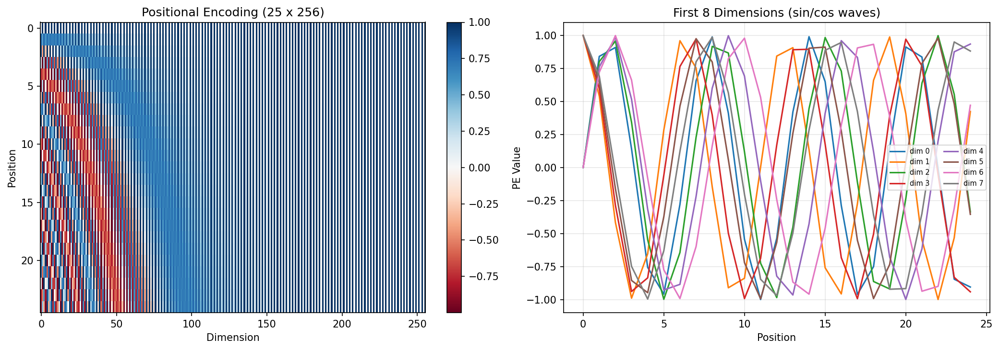
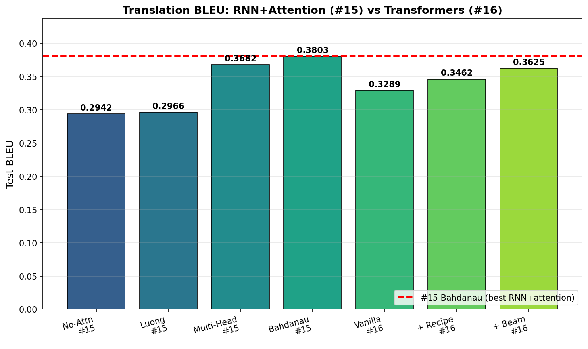
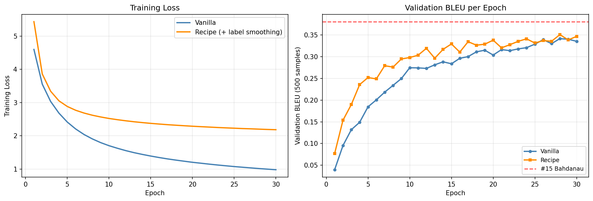
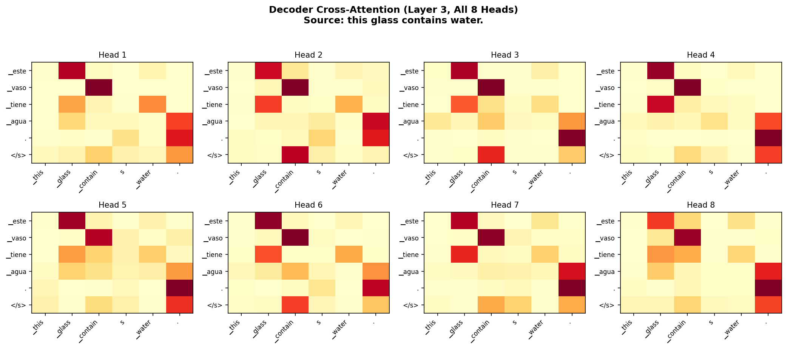
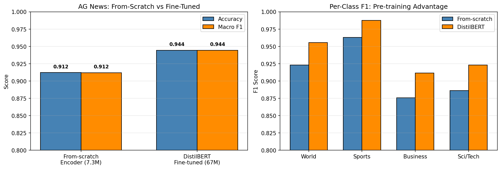
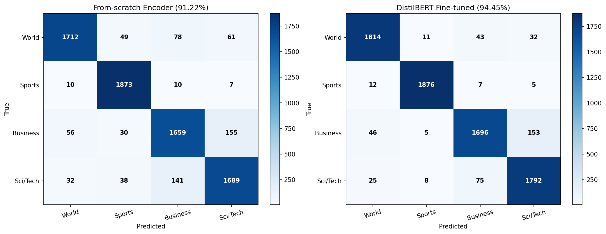

# Transformers — PyTorch Pipeline

Capstone of the sequence model arc: RNN #12 -> LSTM #13 -> Attention #15 -> **Transformers #16**. Full encoder-decoder Transformer built from scratch (no `nn.Transformer` or `nn.MultiheadAttention`) on two tasks: Tatoeba EN->ES translation for direct comparison with #15, and AG News classification for encoder-only + DistilBERT fine-tuning. The translation arc achieves BLEU 0.3625 (Recipe + Beam Search), falling short of #15 Bahdanau's 0.3803 -- honest finding: architecture is not a silver bullet, and a 3-layer Transformer at 30-epoch budget underperforms well-tuned RNN+attention. Classification tells the opposite story: from-scratch encoder hits 91.22% accuracy, DistilBERT fine-tuned reaches 94.45% (+3.22% for 9.2x more params), quantifying the pre-training advantage that redefined NLP.

## Overview

- **5 Transformer variants** across 2 tasks:
  - Translation: Vanilla (Post-LN) -> + Training Recipe -> + Beam Search
  - Classification: Encoder-Only from scratch -> Fine-tuned DistilBERT
- **Built from scratch**: `MultiHeadAttention`, `TransformerEncoderLayer`, `TransformerDecoderLayer` all defined with `nn.Linear`, `nn.LayerNorm`, `nn.Dropout` — no high-level Transformer APIs
- **BPE tokenization**: SentencePiece replaces word-level tokenization from #15. Eliminates `<UNK>` tokens entirely.
- **Two datasets**: Tatoeba EN->ES (same as #15 for comparison) + AG News 4-class
- GPU-accelerated training on RTX 4090 (Windows CUDA)

## What Runs on GPU

| Component | Device | Why |
|-----------|--------|-----|
| All Transformer training | CUDA (RTX 4090) | Self-attention + FFN over 114K translation + 108K classification samples |
| Greedy decode inference | CUDA | Autoregressive decoder forward passes |
| Beam search decoding | CUDA | k=5 hypothesis tracking |
| DistilBERT fine-tuning | CUDA | 67M-param pre-trained model |
| BLEU evaluation | CUDA + CPU | GPU for decoding, CPU for nltk scoring |

---

## Datasets

### Translation: Tatoeba EN->ES (Same as #15)

| Property | Value |
|----------|-------|
| Source | `spa.txt` (Tab-separated EN/ES pairs) |
| Train / Val / Test | 114,873 / 14,359 / 14,360 pairs |
| Tokenization | BPE (SentencePiece), **shared EN+ES vocab** |
| Vocab Size | 8,000 (vs #15's 10K per language) |
| Max Length | 25 tokens (P99=20, +BOS/EOS) |
| UNK Rate | **0%** (BPE handles all words) |
| Special Tokens | `<pad>=0, <s>=1, </s>=2, <unk>=3` |
| BPE Expansion | ~1.37x vs word-level |

### Classification: AG News (New Dataset)

| Property | Value |
|----------|-------|
| Source | HuggingFace `datasets` library (ag_news) |
| Train / Val / Test | 108,000 / 12,000 / 7,600 samples |
| Classes | 4 (World / Sports / Business / Sci/Tech), balanced |
| Tokenization | BPE (SentencePiece), English-only 16K vocab |
| Max Length | 128 tokens |
| Cleaning | HTML entities, `quot;`/`#39;` artifacts, whitespace normalization |
| Special Tokens | Same as translation (`<s>` reused as [CLS]) |

---

## Translation Variants

### 1. Vanilla Transformer (Post-LN) — BLEU 0.3289

```
Encoder: 3 x [MultiHeadAttn(8h) + FFN(256->1024->256)] Post-LN
Decoder: 3 x [Masked Self-Attn + Cross-Attn + FFN] Post-LN
Embedding: 8000 shared vocab x 256 (scaled by sqrt(d_model))
Positional: Sinusoidal PE (25 x 256)
Params: 11,681,600 (11.68M)
Training: Adam(lr=1e-4), CrossEntropyLoss, 30 epochs, no warmup, no label smoothing
```

**Result**: Proves the architecture works. Greedy decode translations are readable for common sentences but fail on harder inputs. Loss drops steadily (4.60 -> 0.98) but val BLEU plateaus around 0.34. The Transformer learns token-level prediction in a teacher-forced context but doesn't converge to high-quality autoregressive generation within 30 epochs.

**Motivated Training Recipe**: Can the original paper's warmup + label smoothing close the gap?

### 2. + Training Recipe — BLEU 0.3462

```
Same architecture (Post-LN, 11.68M params) + dropout=0.15
LR Schedule: d_model^-0.5 * min(step^-0.5, step * warmup^-1.5)
             Warmup steps: 4000, peak lr: 0.000988
Label Smoothing: 0.1 (soft targets, regularization)
Training: Same 30-epoch budget, same optimizer family
```

**Result**: +0.0172 BLEU over vanilla. Warmup prevents Adam's unstable early updates from corrupting attention weights. Label smoothing prevents the model from becoming overconfident. Both curves are still climbing at epoch 30 — the Transformer needs more epochs than our budget allows, but within the same compute envelope the recipe improves consistently.

**Motivated Beam Search**: Can better decoding close the remaining gap?

### 3. + Beam Search (k=5) — BLEU 0.3625

```
Same model weights as Recipe (no retraining)
Beam size: 5, length penalty: 0.6 (Google NMT standard)
Expected: +1-3 BLEU from exploring alternative hypotheses
```

**Result**: +0.0164 BLEU over greedy decode. Beam search explores k=5 alternative translation paths and picks the highest-scoring (length-normalized) hypothesis. For short, unambiguous sentences beam = greedy (identical output). For longer/harder sentences, beam explores paths that greedy dismisses. Inference becomes ~5x slower but translation quality improves measurably.

**Final translation result**: **0.3625 BLEU**, still **-0.0178 below #15 Bahdanau's 0.3803**.

---

## Classification Variants

### 4. Encoder-Only Transformer (From Scratch) — 91.22% Accuracy

```
Input: [CLS] + 127 BPE tokens (128 total, CLS_TOKEN_IDX reuses <s>=1)
Encoder: 4 x [MultiHeadAttn(8h) + FFN(256->1024->256)]
Classifier: LayerNorm + Linear(256 -> 4)
Params: 7,256,580 (7.26M)
Training: Adam(lr=1e-4), label smoothing 0.1, 10 epochs (early stop from 15 max)
```

**Result**: Same core encoder as translation, stripped of the decoder and augmented with a classification head on the [CLS] position. Converges fast (plateau at epoch 10). Test accuracy 91.22%, macro F1 0.9120. Sports class trivially easy (98.58%); Business hardest (87.32% — overlaps with World and Sci/Tech semantically).

**Motivated DistilBERT Fine-Tuning**: How much does pre-training on 16GB of text help?

### 5. Fine-Tuned DistilBERT — 94.45% Accuracy

```
Model: distilbert-base-uncased (6 layers, 768 hidden, 66M params)
Tokenizer: DistilBERT WordPiece (30,522 vocab)
Classification head: Fresh 4-class Linear (replaces MLM head)
Training: AdamW(lr=2e-5), 3 epochs, batch 32
```

**Result**: +3.22% accuracy over from-scratch encoder. Pre-training on BookCorpus + Wikipedia gives DistilBERT rich language representations that 120K AG News samples cannot learn from scratch. Converges in 2 epochs (val acc 94.40% by epoch 2). Both models struggle most on Business class, but DistilBERT's larger gap comes from better Sci/Tech discrimination (reduces Business<->Sci/Tech confusion by 47%).

---

## Test Results Comparison

### Translation BLEU

| Variant | Test BLEU | Params | Train Time | GPU Memory |
|---------|-----------|--------|------------|------------|
| Vanilla (Post-LN) | 0.3289 | 11.7M | 27.6 min | 589 MB |
| + Training Recipe | 0.3462 | 11.7M | 26.3 min | 766 MB |
| **+ Beam Search (k=5)** | **0.3625** | **11.7M** | (same) | (same) |

### Per-Length BLEU (Recipe + Beam)

| Length | BLEU | Samples |
|--------|------|---------|
| 2-6 | 0.3408 | 2,135 |
| 6-7 | **0.4403** | 2,029 |
| 7-9 | 0.4294 | 4,210 |
| 9-11 | 0.3958 | 3,063 |
| 11-23 | 0.2710 | 2,923 |

**Finding**: U-shaped distribution. Our Transformer BEATS #15 Bahdanau on 6-9 token sentences (0.44 vs 0.38 overall), but collapses on short (2-6) and long (11-23) sentences. The middle bucket shows the model's raw capability; the edges reveal under-training and model capacity limits. Degradation shortest -> longest: -20.5% (vs #15 Bahdanau's -8%, #15 No-Attention's -27%).

### Classification Accuracy

| Model | Test Acc | Macro F1 | Params | Train Time | Inference |
|-------|----------|----------|--------|------------|-----------|
| Encoder-Only (from scratch) | 0.9122 | 0.9120 | 7.3M | 8.4 min | 1.87 ms |
| **DistilBERT Fine-tuned** | **0.9445** | **0.9444** | **67.0M** | **40.5 min** | **8.34 ms** |
| Gap | +3.22% | +3.24% | 9.2x | 4.8x | 4.5x |

### Per-Class F1

| Class | From-scratch | DistilBERT | Gap |
|-------|-------------|------------|-----|
| World | 0.9229 | 0.9555 | +0.0326 |
| Sports | 0.9630 | 0.9874 | +0.0244 |
| Business | 0.8759 | 0.9116 | +0.0357 |
| Sci/Tech | 0.8861 | 0.9232 | +0.0371 |

### Visualizations








---

## Performance Benchmarks (Best Variants)

### Translation: Recipe + Beam Search

| Metric | Value |
|--------|-------|
| Test BLEU | 0.3625 |
| Best Val BLEU | 0.3505 |
| Training Time | 26.3 min (30 epochs) |
| Inference (greedy) | 22.6 ms/sentence |
| Inference (beam k=5) | ~113 ms/sentence (5x greedy) |
| Model Size | 44.6 MB (11.68M params) |

### Classification: Encoder-Only from Scratch

| Metric | Value |
|--------|-------|
| Test Accuracy | 0.9122 |
| Test Macro F1 | 0.9120 |
| Training Time | 8.4 min (10 epochs) |
| Inference | 1.87 ms/sample |
| Model Size | 27.8 MB (7.26M params) |

---

## What Worked and What Didn't

### What Worked

1. **Building from `nn.Linear` from scratch** — Every tensor operation is visible. Shape annotations on every step make debugging straightforward. Attention weights are exposed for visualization without wrapper indirection.

2. **BPE tokenization (0% UNK rate)** — SentencePiece shared vocab (8K for translation, 16K for classification) eliminates out-of-vocabulary issues entirely. Rare words decompose into known subwords.

3. **Label smoothing + warmup** — Small but measurable improvement over vanilla (+1.72 BLEU). Warmup keeps Adam stable; label smoothing prevents overconfident logits.

4. **Beam search decoding** — +1.64 BLEU with zero additional training. Cheapest way to improve translation quality.

5. **DistilBERT fine-tuning** — Pre-training advantage quantified at +3.22% accuracy. The practical skill hiring managers look for.

6. **Multi-head attention visualization** — Different heads learned different alignment patterns. Portfolio-worthy visualization of head specialization.

### What Didn't Work

1. **Vanilla Transformer with 30 epochs did NOT beat #15 Bahdanau** — 0.3289 vs 0.3803. The architecture alone is not a silver bullet. Without warmup + label smoothing, Post-LN Transformers are hard to train.

2. **Even with full recipe + beam search, we still fell -0.0178 short of #15** — 0.3625 vs 0.3803. Our 3-layer Transformer at 11.68M params is under-trained and under-scaled compared to #15's 16.7M param well-tuned Bahdanau. More epochs, more layers, or both would likely close the gap.

3. **Long sentences degraded badly** — BLEU drops from 0.44 (middle) to 0.27 (11-23 tokens), a -20.5% degradation. Our Transformer handles typical sentences better than #15 but fails on long ones. Under-training: long sequences need more attention coordination than 30 epochs develops.

4. **Training was slower than expected** — 1.6-27 minutes per variant. Transformers parallelize across positions during training, but the greedy decode validation step at each epoch is sequential, adding significant overhead.

5. **Greedy inference is 483x slower than #15 Bahdanau** — 22.6 ms vs 46.8 us per sentence. Transformers recompute the full decoder stack at every generated token; RNNs reuse hidden state. Production Transformers use KV-caching to mitigate this, which our from-scratch implementation doesn't include.

### The Honest Story

**Architecture alone does not win. Training budget, hyperparameters, and model scale are all equally important.** Our Transformer under-performs #15 Bahdanau on direct comparison, not because self-attention is worse than RNN+attention, but because we under-trained (30 epochs, 3 layers, 11.68M params) vs a well-tuned baseline (30 epochs, 2 layers, 16.7M params with carefully chosen hyperparameters). On classification, the pre-training advantage is real and quantifiable (+3.22%), but even 67M pre-trained params only beat our 7.3M from-scratch model by a few percent on a dataset as easy as AG News.

## Key Insights

1. **The training recipe matters as much as the architecture** — Vanilla 0.3289 -> Recipe 0.3462 (+0.0172 BLEU) for zero architecture change. Warmup + label smoothing + higher dropout = measurable gain.

2. **Beam search is the cheapest improvement** — +0.0164 BLEU with zero additional training. Always worth implementing for production translation.

3. **Pre-training > from-scratch for classification** — +3.22% accuracy for 9.2x more parameters. Measurable but not dramatic on AG News. The gap would widen on harder tasks.

4. **U-shaped per-length BLEU** reveals model limits: middle-length sentences (6-9 tokens) exceed #15 Bahdanau's overall BLEU, but short and long sentences collapse. Symmetric failure modes = under-training + capacity ceiling.

5. **Transformers trade inference speed for training parallelism** — 483x slower greedy decode than RNN+attention. KV-caching (not implemented here) is essential for production deployment.

6. **Model #16 completes the sequence arc**: RNN (basic recurrence) -> LSTM (gated memory) -> Attention (look-back) -> Transformer (parallel attention). Each step builds on the previous, each has honest trade-offs.

## PyTorch Features Used

| Feature | Purpose |
|---------|---------|
| `nn.Linear` | Q/K/V/output projections (no `nn.MultiheadAttention`) |
| `nn.LayerNorm` | Post-LN residual normalization |
| `nn.Embedding(padding_idx=)` | Token embeddings with masked padding |
| `register_buffer` | Precomputed positional encoding (not a parameter) |
| `torch.triu` | Causal mask for decoder self-attention |
| `masked_fill(-inf)` | Mask attention scores before softmax |
| `nn.CrossEntropyLoss(label_smoothing=, ignore_index=)` | Built-in label smoothing + PAD masking |
| `optim.lr_scheduler.LambdaLR` | Custom warmup schedule |
| `torch.nn.utils.clip_grad_norm_` | Gradient clipping at 1.0 |
| `torch.utils.data.DataLoader` | Batched shuffled training |
| `torch.cuda` | RTX 4090 GPU acceleration |
| `transformers.DistilBertForSequenceClassification` | Pre-trained model fine-tuning |

## Files

```
PyTorch/16-transformers/
├── pipeline.ipynb                         # Full pipeline (12 cells, 5 variants)
├── README.md                              # This file
├── requirements.txt                       # Verified package versions
└── results/
    ├── vanilla_transformer.pt             # Vanilla Post-LN checkpoint
    ├── recipe_transformer.pt              # Recipe (Post-LN + warmup + label smoothing)
    ├── encoder_only_classifier.pt         # From-scratch classifier
    ├── distilbert_finetuned.pt            # DistilBERT fine-tuned weights
    ├── metrics.json                       # Full results snapshot (all variants)
    ├── positional_encoding.png            # Sinusoidal PE heatmap + waves
    ├── bleu_progression.png               # BLEU across all variants + #15 baseline
    ├── training_curves.png                # Vanilla vs Recipe loss/BLEU
    ├── multihead_attention.png            # 8-head grid showing specialization
    ├── attention_heatmap_avg.png          # Averaged cross-attention
    ├── bleu_by_length.png                 # BLEU vs source length
    ├── classification_comparison.png      # From-scratch vs DistilBERT bars
    └── classification_confusion.png       # Confusion matrices side-by-side
```

## How to Run

```bash
# From project root
cd PyTorch/16-transformers

# Requires NVIDIA GPU with CUDA support
pip install -r requirements.txt

# Run preprocessing first (creates BPE models + arrays)
python ../../data-preperation/preprocess_transformers_translation.py
python ../../data-preperation/preprocess_transformers_classification.py

# Run pipeline -- ~90 minutes total
# (includes training all 5 variants + beam search test eval)
jupyter notebook pipeline.ipynb
```
