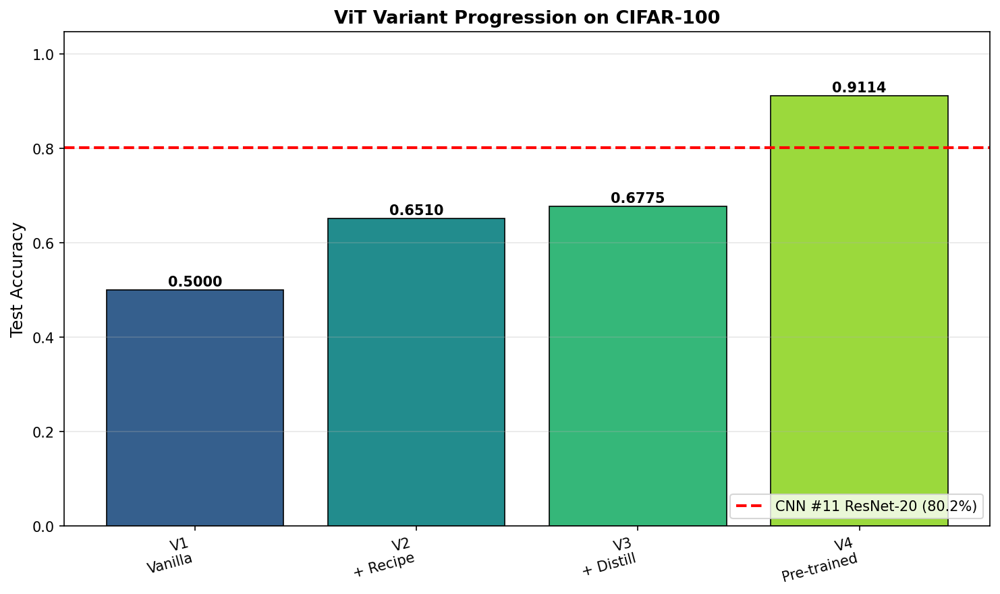
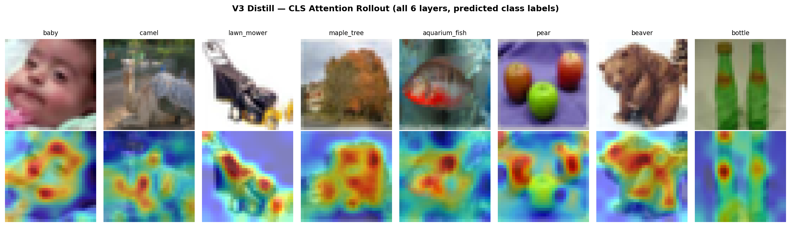
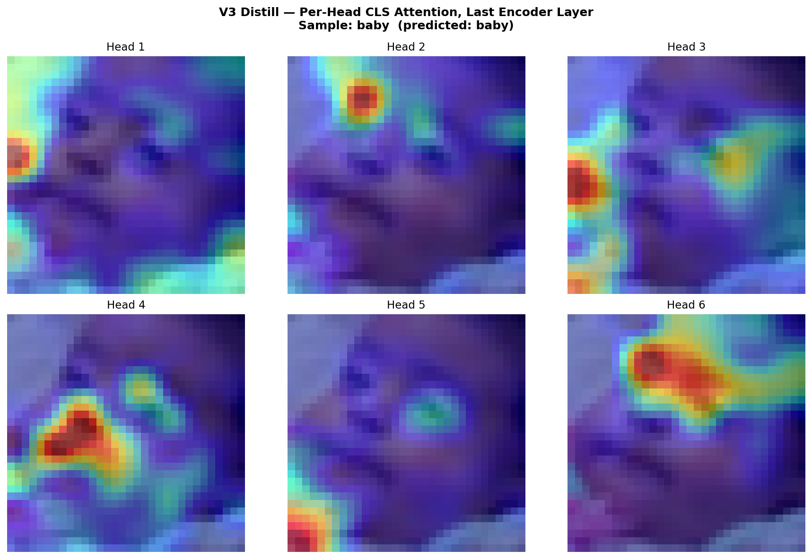
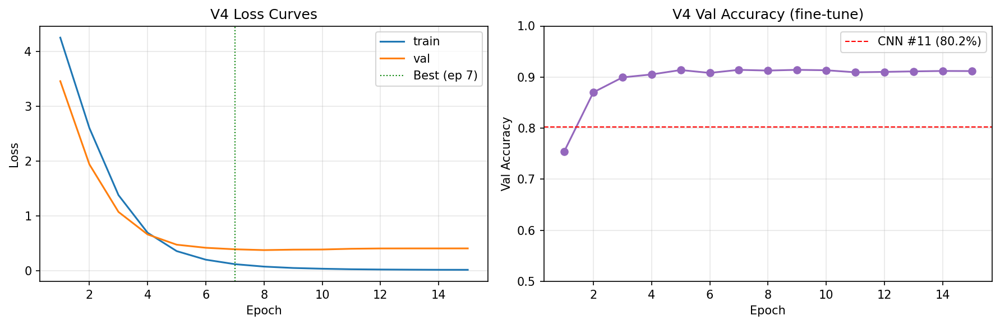
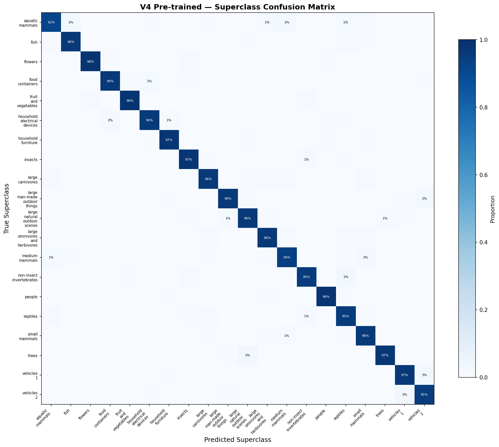

# Vision Transformers — PyTorch Pipeline

Closes the vision arc opened by CNN #11. Full ViT built from scratch (no `nn.TransformerEncoder` or `nn.MultiheadAttention`) with four variants isolating distinct levers: Vanilla (50.33%) -> DeiT Recipe (64.45%) -> DeiT Distillation with CNN #11 ResNet-20 as teacher (67.48%) -> Fine-tune Pre-trained ViT-B/16 (91.16%). The portfolio finding: **pre-training dominates** on small data — V4 beats CNN #11 (80.23%) by +10.93pp while V3 from-scratch lands -12.75pp below. Each lever's contribution is cleanly quantified: Recipe +14.12pp, Distillation +3.03pp, Pre-training +23.68pp. Same CIFAR-100 data (45K train / 5K val / 10K test) reused from CNN #11 for direct architecture comparison.

## Overview

- **4 ViT variants** isolating distinct improvement levers on identical CIFAR-100 data
- **Built from `nn.Linear`, `nn.LayerNorm`, `nn.Conv2d`** — `MultiHeadSelfAttention`, `EncoderBlock`, `ViT`, `ViTDistill` all defined from primitives
- **DeiT distillation with own CNN teacher** — reuses CNN #11's 80.23% ResNet-20 as teacher (rare portfolio self-reference loop)
- **Pre-trained variant**: HuggingFace `google/vit-base-patch16-224-in21k` fine-tuned at 224x224 with ImageNet normalization
- GPU-accelerated training on RTX 4090 (Windows CUDA)

## What Runs on GPU

| Component | Device | Why |
|-----------|--------|-----|
| ViT training (V1-V3) | CUDA (RTX 4090) | Self-attention + FFN over 45K CIFAR images x hundreds of epochs |
| Teacher forward (V3) | CUDA | ResNet-20 inference per training batch (~5% overhead) |
| ViT-B/16 fine-tune (V4) | CUDA | 86M params at 224x224 resolution |
| Attention rollout + viz | CUDA | Batched matmul across 6 encoder layers |
| Test evaluation | CUDA | 10K-sample test passes + per-class F1 |

---

## Dataset

CIFAR-100 (reused from CNN #11 preprocessing)

| Property | Value |
|----------|-------|
| Source | `data/processed/cnn/` (TF Keras CIFAR-100 via EDA) |
| Train / Val / Test | 45,000 / 5,000 / 10,000 (val carved from 50K train with seed 113) |
| Image Shape | 32 x 32 x 3 RGB, float32 [0, 1] |
| Classes | 100 fine / 20 coarse superclasses, perfectly balanced |
| Augmentation (V1) | RandomCrop(32, pad=4) + RandomHorizontalFlip |
| Augmentation (V2/V3) | + RandAugment(N=2, M=9) + MixUp(alpha=0.8) + CutMix(alpha=1.0) + RandomErasing(p=0.25) |
| Augmentation (V4) | Resize 32 -> 224 (bicubic) + RandomHorizontalFlip + ImageNet normalize |

**Key preprocessing note**: student (V1-V3) trained on raw `[0, 1]` input matching CIFAR-100 scale. CNN #11 teacher (V3) requires `(x - CIFAR_MEAN) / CIFAR_STD` per-channel normalization. Teacher returns 43% accuracy without this normalization, 80.23% with it — a diagnosis caught and fixed during V3 setup.

---

## Variants

### 1. Vanilla ViT-Small — 50.33% Test Accuracy

```
Architecture:
    Input: (B, 3, 32, 32)
    -> PatchEmbed: Conv2d(3, 384, kernel=4, stride=4) + flatten
    -> Prepend [CLS] token, add learnable Positional Embedding (1, 65, 384)
    -> 6 x EncoderBlock (Pre-LN): MHSA(6 heads) + MLP(384 -> 1536 -> 384, GELU)
    -> LayerNorm + Linear(384, 100)
Params: 10.73M
Training: AdamW(lr=5e-4, wd=0.05), cosine schedule with 10-ep warmup,
          label smoothing 0.1, gradient clip 1.0, 100 epochs
Augmentation: basic (crop + flip only)
```

**Result**: Test accuracy 50.33%, macro F1 0.4984. Overfitting signature is severe — train_loss drops to 0.85 while val_loss plateaus at 2.70 (+1.86 gap). This is the expected vanilla-ViT failure mode on small data: ViT lacks convolutional inductive bias, and basic aug + 45K images isn't enough.

**Motivated DeiT Recipe**: can heavy augmentation + longer training close the gap?

### 2. ViT + DeiT Training Recipe — 64.45% Test Accuracy

```
Same architecture + stochastic depth (drop_path=0.1)
Augmentation: RandAugment(N=2, M=9) + MixUp(alpha=0.8) + CutMix(alpha=1.0)
              + RandomErasing(p=0.25), switching MixUp/CutMix per batch
Training: AdamW(lr=5e-4, wd=0.05), cosine schedule with 10-ep warmup,
          EMA shadow model (decay 0.99996), 300 epochs
Loss: soft-target CE (MixUp produces soft labels)
```

**Result**: +14.12pp over vanilla (50.33% -> 64.45%). Val loss drops from 2.70 (V1) to 1.33 (V2), confirming overfitting is addressed. Model still improves at epoch 300 (val_acc climbing ~0.04pp/epoch) — the cosine schedule is exhausted but capacity ceiling hasn't been reached.

**Plan vs reality**: expected 72-78% per DeiT paper. Landed at 64.45% due to structural scope choices: our ViT-Small is 6 layers (DeiT-S is 12), batch 128 (DeiT 1024), no Repeated Augmentation, 300 epochs at reduced effective compute budget. Recipe contribution is real (+14pp) but doesn't scale to paper numbers without paper-scale compute.

**Motivated Distillation**: can CNN teacher knowledge close more of the gap?

### 3. + DeiT Distillation (CNN #11 teacher) — 67.48% Test Accuracy

```
Same architecture + extra [DIST] token at position 1 (alongside [CLS])
Two classification heads: cls_head for ground truth, dist_head for teacher
Teacher: CNN #11 ResNet-20 (4.35M params, 80.23% on CIFAR-100)
Teacher input: normalize_for_teacher(mixed_images) -- ImageNet-style norm
Student input: raw [0, 1] (same as V1/V2 contract)
Loss: 0.5 * soft_CE(cls_logits, y_soft) + 0.5 * CE(dist_logits, argmax(teacher))
Inference: (cls_logits + dist_logits) / 2 averaged
Training: 300 epochs, same schedule as V2
```

**Result**: +3.03pp over V2 (64.45% -> 67.48%). Student absorbed ~57% of the teacher's advantage over vanilla ViT. Honest upper bound visible: teacher is at 80.23% and hard distillation caps at teacher's knowledge. ViT student can't exceed what the teacher signals during training.

**Notable finding**: worst class moved from seal (F1=0.241) in V1 to lizard (F1=0.360) in V3 — whole distribution shifted up, not just mean accuracy.

**Motivated Pre-trained**: what does ImageNet-21k pre-training do?

### 4. Fine-tune Pre-trained ViT-B/16 — 91.16% Test Accuracy

```
Model: google/vit-base-patch16-224-in21k (ImageNet-21k, 14M images)
        ViT-Base: 12 layers, d=768, 12 heads, patch=16, 86M params
Classifier: Linear(768, 100) [re-initialized from 1000-class pre-training head]
Input: Resize 32 -> 224 (bicubic) + ImageNet mean/std normalize
Training: AdamW(lr=2e-5, wd=0.01), cosine with 1-ep warmup,
          15 epochs, batch 64, RandomHorizontalFlip only (mild aug)
```

**Result**: +23.68pp over V3. Beats CNN #11 by +10.93pp. Pre-training dominance is crystal clear: epoch 1 already at 75.46% (above V1's final 50%), epoch 2 at 87.02% (above V2's final 64%), epoch 3 at 89.94% (above V3's final 67%). Best at epoch 7 (91.42% val); mild overfitting kicks in after — val_loss rises while train_loss continues dropping to 0.017.

**Cost**: 86M params (8x more), 327.6 MB model size, 1117 us/sample inference (29x slower than CNN #11). Pre-training is the clear winner on accuracy if latency budget permits.

---

## Test Results Comparison

### Cross-Variant Metrics

| Variant | Test Acc | Macro F1 | Coarse Acc | Fine->Coarse Lift | Params |
|---------|----------|----------|------------|:-----------------:|--------|
| V1 Vanilla | 0.5033 | 0.4984 | 0.6232 | +0.1199 | 10.7M |
| V2 Recipe | 0.6445 | 0.6411 | 0.7567 | +0.1122 | 10.7M |
| V3 Distill | 0.6748 | 0.6732 | 0.7831 | +0.1083 | 10.8M |
| **V4 Pre-trained** | **0.9116** | **0.9115** | **0.9616** | +0.0500 | **85.9M** |
| CNN #11 (ref) | 0.8023 | 0.8013 | 0.8828 | +0.0805 | 4.4M |

**Hierarchical insight**: fine->coarse lift shrinks as accuracy improves — V1 has 12pp lift (many errors are within-superclass, semantically sensible), V4 has 5pp lift (so accurate that remaining errors are already fine-grained within the correct superclass).

### Per-Lever Contribution (Cumulative)

| Step | Delta | Lever |
|------|-------|-------|
| V1 -> V2 | +14.12pp | DeiT training recipe (heavy aug + stochastic depth + 3x epochs) |
| V2 -> V3 | +3.03pp | CNN teacher distillation |
| V3 -> V4 | +23.68pp | ImageNet-21k pre-training |
| V4 vs CNN #11 | +10.93pp | ViT pre-training exceeds CNN baseline |

### Per-Class F1 Extremes

| Variant | Best Class | Best F1 | Worst Class | Worst F1 | Median |
|---------|-----------|---------|-------------|----------|--------|
| V1 Vanilla | sunflower | 0.822 | seal | 0.241 | 0.492 |
| V2 Recipe | road | 0.885 | lizard | 0.289 | 0.652 |
| V3 Distill | lawn_mower | 0.899 | seal | 0.360 | 0.676 |
| V4 Pre-trained | pickup_truck | 0.990 | oak_tree | 0.667 | 0.934 |

### Visualizations

The portfolio centerpiece: 4 variants progressively closing the gap to (and exceeding) the CNN #11 baseline.



V3's attention rollout (Abnar & Zuidema 2020, combining all 6 layers with residual accounting) overlaid on 8 diverse test samples — ViT learns to attend to class-relevant regions despite zero explicit spatial bias.



Per-head attention specialization in V3's last encoder layer. On the baby sample, Head 5 clearly learned "facial features" (two bright focal points where eyes are), Head 6 attends to face center, Head 3 to background context — emergent structure without supervision.



V4 fine-tune shows dramatic pre-training advantage: epoch 1 already at 75% (above V1's 100-epoch final), epoch 2 at 87% (above V2's 300-epoch final), peak at epoch 7.



Hierarchical error pattern: V1 has widespread off-diagonal confusion (reptiles 40%, small_mammals 47% — basic spatial discrimination failing). V4's near-perfect diagonal (91-98% per superclass) contrasts sharply.



Additional artifacts in `results/`:
- `v1/v2/v3_training_curves.png` — per-variant loss/accuracy/LR over training
- `superclass_confusion_v1_vanilla.png` / `cnn_11.png` — error pattern extremes

---

## Performance Benchmarks

### Inference (256 samples x 20 runs, GPU-synced)

| Variant | Params | Size (MB) | Train Time | us/sample | samples/s |
|---------|--------|-----------|------------|:---------:|:---------:|
| V1 Vanilla | 10.7M | 40.9 | 27.5 min | 73.6 | 13,583 |
| V2 Recipe | 10.7M | 40.9 | 227.6 min | 74.9 | 13,347 |
| V3 Distill | 10.8M | 41.1 | 234.7 min | 76.1 | 13,138 |
| V4 Pre-trained | 85.9M | 327.6 | 55.9 min | 1,117.4 | 895 |
| CNN #11 | 4.4M | 16.6 | pre-trained | 38.9 | 25,698 |

**Observations**:
- V1/V2/V3 all ~74 us/sample (same architecture, drop_path is a no-op at eval time)
- V4 is 29x slower than CNN #11 (86M vs 4.4M params + 224x224 vs 32x32 input)
- CNN #11 is Pareto-optimal for low-latency deployment; V4 wins on accuracy at 29x inference cost

---

## What Worked and What Didn't

### What Worked

1. **Cell-by-cell collaborative workflow** — each variant's training/eval split into sub-cells (4a setup / 4b train / 4c eval) prevented losing multi-hour training to eval-code bugs.

2. **DeiT training recipe (V2)** — +14.12pp over vanilla for the same architecture. RandAugment + MixUp/CutMix + stochastic depth + long training combined address ViT's data hunger.

3. **Distillation from own CNN teacher (V3)** — +3.03pp over V2. Teacher's 80.23% knowledge supplemented augmentation. Student absorbed 57% of teacher's advantage over vanilla.

4. **Pre-training transfer (V4)** — +23.68pp over V3 in 15 epochs. Epoch 1 already beats V1's 100-epoch result. Quantifies why pre-training redefined vision ML.

5. **Attention rollout visualization** — Abnar & Zuidema 2020 formula yields interpretable heatmaps; per-head viz shows clear specialization (e.g., one head clearly learned "face features" on the baby sample).

6. **Teacher normalization diagnosis** — teacher at 43% without CIFAR per-channel normalization vs 80.23% with it. Caught and fixed in V3 setup before burning 4 hours on broken training.

### What Didn't Work (or Underperformed Plan)

1. **V2 below DeiT paper target** — hit 64.45% vs expected 72-78%. Root cause: scope-constrained compute (6L ViT vs 12L, batch 128 vs 1024, no Repeated Augmentation). The DeiT recipe works; our compute budget doesn't match the paper's.

2. **V3 still below CNN baseline** — 67.48% vs 80.23% (-12.75pp). Distillation closes part of the from-scratch gap but can't match pre-training. Hard distillation is capped at teacher's knowledge.

3. **V1 below plan expectation** — 50.33% vs expected 55-65%. Overfitting after ~50 epochs; 100 more epochs wouldn't meaningfully help (cosine already exhausted).

4. **V3 sample prediction**: 2/8 MISS cases are honest (apple->pear with 3 fruits in scene, bear->beaver at 32x32 both brown furry mammals). Not a failure; CIFAR-100 at 32x32 has genuinely confusable classes.

### The Honest Story

**ViT on small data from scratch underperforms CNN — as expected and documented in the literature.** Without ImageNet-scale pre-training, even the best from-scratch ViT (V3 Distill at 67.48%) lands 12.75pp below a straightforward ResNet-20 (CNN #11 at 80.23%). Pre-training is the dominant lever, worth more than architecture + recipe + distillation combined (+23.68pp from V3->V4 vs +17.15pp V1->V3). For deployment on CIFAR-like domains: use a pre-trained ViT if latency budget permits, or stick with CNN if inference speed matters. The architecture comparison story ("ViT vs CNN") is incomplete without naming the data regime.

## Key Insights

1. **Pre-training >>> everything else for ViT on small data** — +23.68pp from pre-training alone, more than recipe + distillation combined.

2. **CNN is Pareto-optimal at small scale** — ResNet-20 (4.4M params, 38.9us/sample) beats from-scratch ViT-Small (10.7M, 74us/sample) on both accuracy AND speed.

3. **DeiT distillation works, capped at teacher** — +3.03pp from distillation, but hard distillation can't exceed teacher. Our student absorbed 57% of teacher's advantage.

4. **Training recipe matters but has structural limits** — +14.12pp from augmentation + long training. DeiT paper's 72%+ targets require paper-scale compute (1024 batch, 12 layers, Repeated Augmentation) we didn't match.

5. **Per-head specialization is real and visible** — different attention heads in V3's last layer clearly attend to different regions (faces, edges, centers, context) without explicit supervision.

6. **Hierarchical error analysis reveals model quality** — V1's +12pp fine->coarse lift shows semantically sensible errors; V4's +5pp lift shows remaining errors are within-superclass refinement.

## PyTorch Features Used

| Feature | Purpose |
|---------|---------|
| `nn.Conv2d(k=4, s=4)` | Patch embedding (patch-as-conv trick) |
| `nn.Parameter` | Learnable [CLS] + [DIST] tokens, positional embedding |
| `nn.Linear` / `nn.LayerNorm` / `nn.Dropout` | Attention Q/K/V/output, Pre-LN normalization |
| `nn.GELU` | Activation inside MLP blocks (not ReLU) |
| `nn.init.trunc_normal_(std=0.02)` | Parameter initialization (ViT/DeiT standard) |
| `torch.randperm` | Per-batch MixUp/CutMix sample permutation |
| `F.one_hot`, `F.log_softmax` | Soft-label cross-entropy for MixUp/CutMix targets |
| `F.interpolate(mode='bicubic')` | Attention heatmap upsample 8x8 -> 32x32 |
| `torch.optim.lr_scheduler.LambdaLR` | Custom warmup + cosine decay |
| `torch.optim.AdamW` | Decoupled weight decay (DeiT standard) |
| `torch.nn.utils.clip_grad_norm_` | Gradient clipping at 1.0 |
| `torchvision.transforms.v2` | RandAugment, RandomErasing, Resize, Normalize (tensor-native) |
| `transformers.ViTForImageClassification.from_pretrained` | Pre-trained ViT-B/16 loading |
| `torch.cuda.synchronize()` | Accurate GPU-timed inference benchmarks |

## Files

```
PyTorch/17-vit/
|-- pipeline.ipynb                           # 12 code cells (V1/V2/V3/V4 + eval/viz/save)
|-- README.md                                # This file
|-- requirements.txt                         # Exact package versions
`-- results/
    |-- v1_vanilla_best.pth                  # V1 state_dict (40.9 MB)
    |-- v2_recipe_best.pth                   # V2 EMA state_dict (40.9 MB)
    |-- v3_distill_best.pth                  # V3 EMA state_dict w/ dual heads (41.1 MB)
    |-- v4_finetune_best.pth                 # V4 HF state_dict (327.6 MB)
    |-- metrics.json                         # All 4 variants + CNN baseline + config
    |-- variant_progression.png              # Portfolio centerpiece chart
    |-- v1/v2/v3/v4_training_curves.png      # Per-variant curves
    |-- v3_attention_rollout.png             # CLS attention overlays
    |-- v3_multihead_attention.png           # Per-head CLS attention specialization
    `-- superclass_confusion_*.png           # V1 / V4 / CNN hierarchical errors
```

## How to Run

```bash
# From project root (assumes data/processed/cnn/ exists from CNN #11 preprocessing)
cd PyTorch/17-vit

# Requires NVIDIA GPU with CUDA support
pip install -r requirements.txt

# CNN #11 teacher checkpoint must exist at PyTorch/11-cnn/results/resnet20_best.pth
# If missing, re-run CNN #11 save cell to persist weights.

# Run pipeline -- ~9 hours total on RTX 4090
#   V1 Vanilla:     ~30 min  (100 epochs)
#   V2 Recipe:      ~4 hours (300 epochs, heavy aug)
#   V3 Distill:     ~4 hours (300 epochs, teacher forward)
#   V4 Pre-trained: ~1 hour  (15 epochs at 224x224)
jupyter notebook pipeline.ipynb
```
