# Variational Autoencoders — PyTorch Pipeline

Closes the **generative arc** opened by Autoencoders (#10) and GANs (#14) with a third philosophy on the same image domain: **explicit probabilistic latent**, likelihood-based training (ELBO), and the discrete-latent lineage (VQ-VAE + autoregressive prior) that powers modern generative AI (Stable Diffusion, DALL-E 1, EnCodec). Five variants trained across two datasets: MNIST (canonical teaching — 2D latent traversals, β-disentanglement) and CIFAR-10 (portfolio hero — FID comparison vs GAN #14 and a five-point generative-quality ladder).

**Portfolio finding**: a learned prior is the difference between a lossy compressor and a generator. V4 VQ-VAE sampled from a uniform prior over codes gave FID 201.97 — pure noise. Adding a small PixelCNN prior (V5) trained on just V4's 8×8 code grids drops that to 117.27 — the same VQ encoder/decoder, but now with structure. V5's FID still loses to GAN #14's DCGAN 30.57 by ~87 points. That 87-point gap is the honest "VAE-family ceiling on natural images" — the reason modern generation moved first to adversarial, then to diffusion. V5 reproduces the 2017 DALL-E 1 recipe at portfolio scale (VQ encoder -> learned prior -> VQ decoder); Stable Diffusion replaces the PixelCNN with a diffusion model, DALL-E 1 replaces it with a Transformer, same two-stage architecture.

---

## Background: Why VAEs Matter

### What problem they solve

Prior generative models in this portfolio had clear trade-offs:

- **Autoencoders #10** compress input to a deterministic latent then reconstruct. The latent is useful for classification (KNN hit 36.21% on CIFAR-10) but you can't *generate* — sampling a random latent produces garbage because the AE never learned which latent points are "valid."
- **GANs #14** generate beautifully (DCGAN FID 30.57 on CIFAR-10) but have no explicit likelihood. You can't ask "how probable is this image?" or "what's the evidence lower bound?" Training is adversarial, notoriously unstable, and mode collapse is a constant risk.

VAE splits the difference: a **probabilistic encoder** outputs a distribution (mean + variance) over latent space, a sample is drawn via the reparameterization trick, and a **decoder** reconstructs from the sample. Training maximizes the **Evidence Lower Bound (ELBO)** — a tractable lower bound on `log p(x)`:

```text
ELBO(x)  =  E_{z ~ q(z|x)} [ log p(x|z) ]   -   KL( q(z|x) || p(z) )

            ^^^ reconstruction term ^^^        ^^^ KL regularization term ^^^
            (decoder fits input)               (latent stays near N(0, I))
```

The **reparameterization trick** is the elegance: instead of sampling `z ~ N(μ, σ²)` directly (can't backprop through), write `z = μ + σ·ε` where `ε ~ N(0, I)`. Now gradients flow through μ and σ as learned parameters.

### When to reach for a VAE

**Use a VAE when**:
- You need a meaningful latent space (retrieval, anomaly detection, interpolation)
- Exact likelihood matters (density estimation, outlier detection, compression)
- You need stable training (no adversarial dynamics)
- You're building a two-stage system where a VAE compresses and another model operates on codes (Stable Diffusion, DALL-E 1, EnCodec)

**Don't use a VAE when**:
- Sample quality is the top priority -> GAN or diffusion wins
- You need crisp reconstruction without KL pressure -> use AE
- You need exact discrete codes without commitment loss -> use finite-state or hash encoder

### Why they mattered

- **First tractable likelihood-based deep generative model** (Kingma & Welling 2013). Every VAE descendant inherits the ELBO + reparameterization trick.
- **Foundation of modern two-stage generation**: Stable Diffusion runs diffusion in a VAE's compressed latent space (64× less compute than raw-pixel diffusion). DALL-E 1 used VQ-VAE to tokenize images for autoregressive Transformer generation. Every major 2022-2026 text-to-image system has a VAE stage.
- **Disentanglement as a research agenda** (β-VAE, FactorVAE, MONet, IODINE) — traced to Higgins 2017's single-coefficient modification of the ELBO.
- **Neural audio codecs** (EnCodec, SoundStream) use residual VQ-VAE for lossy compression that outperforms classical codecs at comparable bitrates.

---

## Overview

- **5 variants** isolating distinct levers: vanilla ELBO, convolutional architecture, disentanglement, discrete latents, autoregressive prior
- **All from scratch** from `nn.Linear` / `nn.Conv2d` / `nn.ConvTranspose2d` / `nn.Embedding` primitives. Reparameterization trick + analytical KL + straight-through estimator + masked-convolution causality implemented directly — no `torch.distributions`, no pre-built VAE classes
- **Cross-model comparison**: AE #10 reconstruction baseline + GAN #14 generation baseline + this (VAE family) on the same image domains
- **FID ladder** as the portfolio's headline CIFAR-10 deliverable: five points from random-code noise through learned prior to adversarial ceiling
- **MLflow tracking** with sqlite backend for the two per-dataset winners (V1 MNIST, V5 CIFAR-10)
- GPU-accelerated on Windows CUDA (RTX 4090)

## What Runs on GPU

| Component | Device | Why |
|---|---|---|
| V1 Vanilla / V3 β-VAE training | GPU | MLP fits in <1 GB; CPU feasible but GPU trains 50 epochs in ~73s |
| V2 Conv VAE training | GPU | Conv + ConvTranspose layers dominate, GPU essential for 100 epochs on 50K images |
| V4 VQ-VAE training | GPU | Codebook distance computation is a dense matmul; GPU batches it natively |
| V5 PixelCNN training | GPU | 50 epochs on 45K 8×8 code grids; GPU trains in 70s (CPU ~5 min+) |
| V5 autoregressive sampling | GPU | 64 sequential forward passes over 10K samples; 2.4s on GPU |
| FID (InceptionV3 feature extraction) | GPU | 10K real + 10K generated through a CNN; GPU cuts ~5 min to ~30s |
| t-SNE on MNIST latents | CPU | scikit-learn implementation, small enough to not need GPU |

## Datasets

Both loaded from `data/processed/vae/{mnist,cifar10}/` as float32 `[0, 1]` .npy arrays (preprocessed by `data-preperation/preprocess_vae.py`).

### MNIST (teaching)

- **60,000 train / 10,000 test**, 28×28 grayscale
- Flattened to 784-dim for V1 and V3's MLP architecture
- **Bimodal pixel distribution** (81.8% near 0, 8.2% near 1 per EDA) — makes Bernoulli decoder likelihood (BCE loss) the principled choice over Gaussian (MSE)
- 10 balanced classes (digit 0-9) used for latent-space visualization only (VAE training is unsupervised)

### CIFAR-10 (portfolio)

- **50,000 train / 10,000 test**, 32×32 RGB, channel-first `(N, 3, 32, 32)`
- **Continuous pixel distribution** — MSE reconstruction loss (Gaussian decoder likelihood)
- 10 classes (airplane, automobile, bird, cat, deer, dog, frog, horse, ship, truck), exactly 5,000 per class
- Normalized to `[0, 1]` — diverges from GAN #14's `[-1, 1]`; matches standard VAE Bernoulli/Gaussian decoder conventions
- V4 uses V4's seeded 90/10 (45K/5K) train/val split; V5 reuses the same split for parity

---

## Variants

### 1. V1 Vanilla VAE — Kingma & Welling 2013 (MNIST)

**Architecture**: 784 -> 400 -> (μ₂₀, logσ²₂₀) -> 400 -> 784 MLP. Single hidden ReLU layer per encoder/decoder. Sigmoid output for Bernoulli likelihood.

**Training**: Adam(lr=1e-3), 50 epochs, batch=128. ELBO = BCE reconstruction + analytical KL.

**Result**: **test NLL 101.98 nats** (Kingma 2013 reported ~82 on their continuous-Bernoulli variant; our 102 matches the standard discrete-Bernoulli MLP). β=1.0.

**Why it matters**: baseline probabilistic latent. Every VAE descendant is a modification of this.

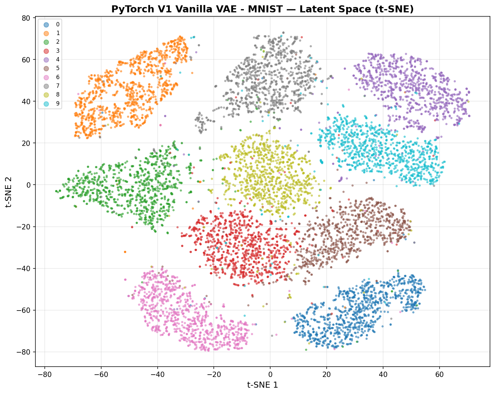

Latent space colored by digit class (not seen during training). Clear clustering -> the encoder learned class-discriminative features without labels, just from Bernoulli-reconstruction + N(0, I) KL pressure.

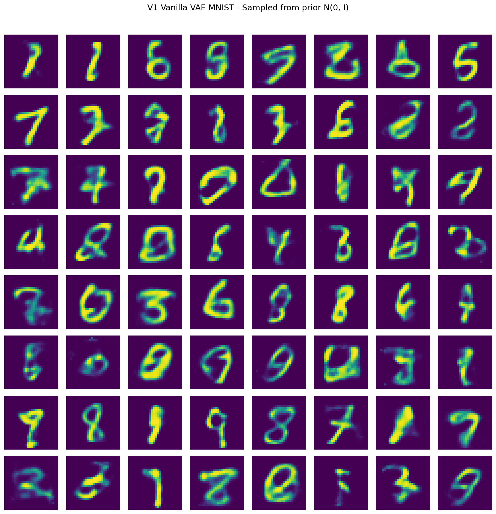

Samples drawn from `z ~ N(0, I)` decoded via the trained decoder. Mix of recognizable digits + ambiguous blobs (the latent has "holes" where the prior samples but no training data went).

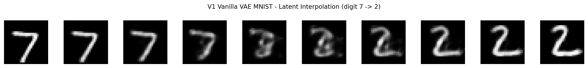

Linear interpolation in latent space between two test-set samples — smooth morphing means the latent is geometrically meaningful, not a bag of tokens.

### 2. V2 Conv VAE (CIFAR-10)

**Architecture**: 3 Conv2d blocks (stride-2 downsample) -> flatten -> (μ₆₄, logσ²₆₄) -> 64 -> unflatten -> 3 ConvTranspose2d blocks (stride-2 upsample). Sigmoid output (matches AE #10 architecture family).

**Training**: Adam(lr=1e-3), 100 epochs, batch=128. **KL warmup over first 10 epochs** (β ramps 0 -> 1) prevents KL collapse. MSE reconstruction (Gaussian likelihood for continuous pixel values).

**Result**: **MSE/pixel 0.01655**, **test FID 165.43** (samples drawn from prior). Reconstruction is blurry — classic VAE failure mode on natural images. KL is healthy (22.78 nats) — no posterior collapse.

**Why it matters**: lifts V1's MLP to images, confirms the "VAE loses to GAN on natural images" finding that motivated VQ-VAE + the discrete-latent lineage.

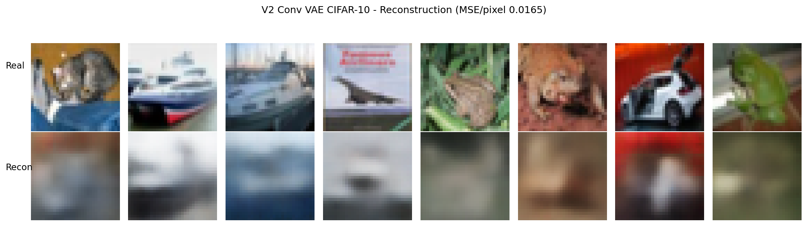

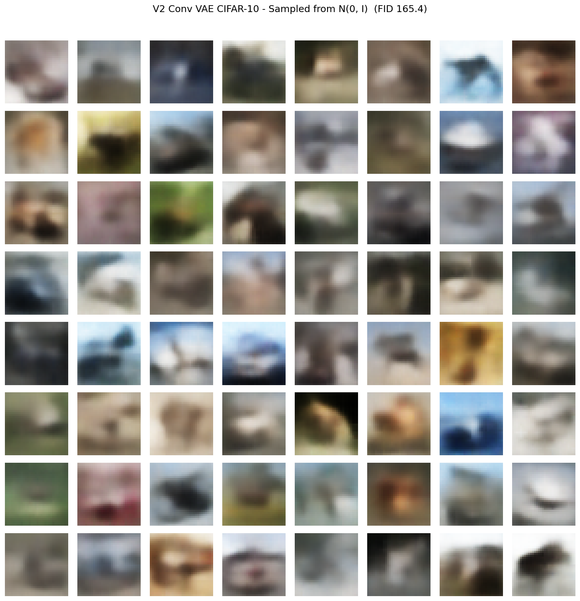

### 3. V3 β-VAE — Higgins 2017 (MNIST, β sweep)

**Architecture**: identical to V1. Only the loss changes: `total_loss = recon + β · kl_divergence`.

**Training**: 3 separate runs at β ∈ {1.0, 4.0, 10.0}. β=1.0 reproduces V1 exactly (NLL 101.98 both) — reproducibility check passed.

**Result** (NLL ascending -> reconstruction degrades; KL descending -> latent uses less of the prior):

| β | test NLL | test recon | test KL |
|---|----------|-----------|---------|
| 1.0 | 101.978 | 76.80 | 25.18 |
| 4.0 | 145.688 | 107.26 | 9.61 |
| 10.0 | 181.316 | 143.92 | 3.74 |

**Why it matters**: disentanglement-vs-reconstruction is a genuine Pareto trade-off. β=4 is the canonical "sweet spot" in the paper — most disentangled factors while reconstruction still looks like digits.

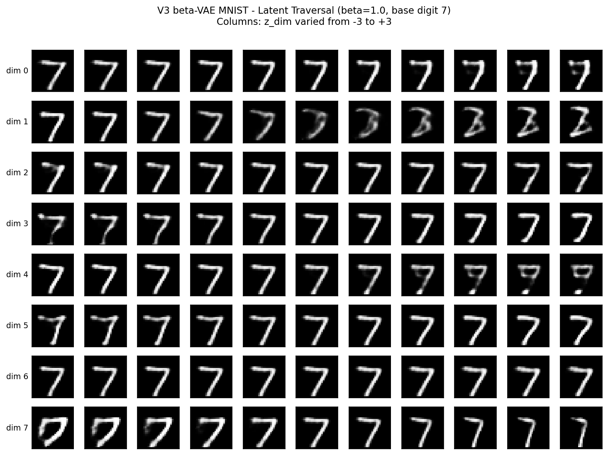

β=1 (V1 baseline): latent dims entangled — each row shows mixed changes (rotation + stroke thickness + digit identity all at once).

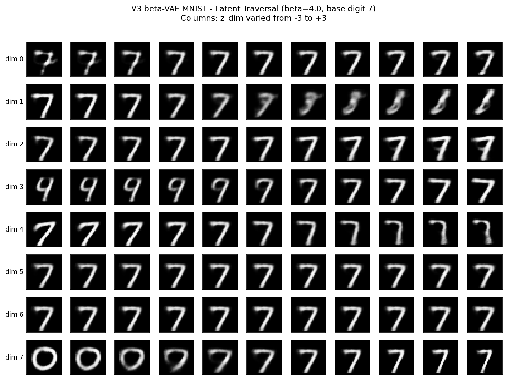

β=4: clean disentanglement. Dim 3 controls digit identity; other dims control style factors (stroke width, tilt, aspect ratio) independently.

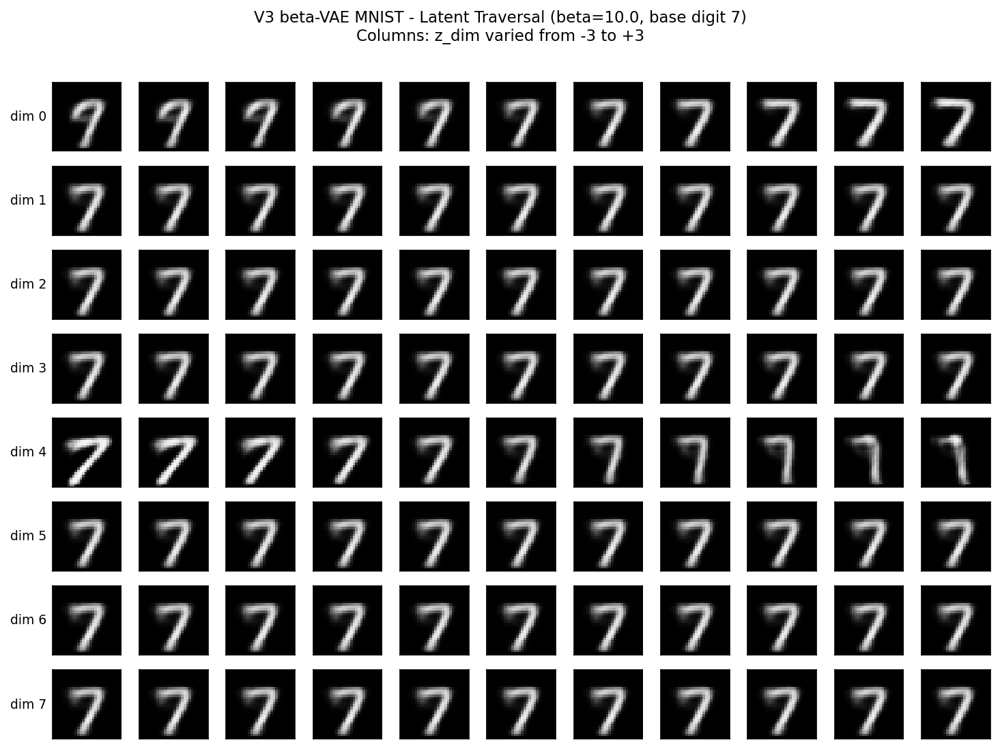

β=10: aggressive KL pressure. Most dims collapse to zero activation ("dead dims"); only dim 4 carries signal, reconstruction quality drops sharply.

### 4. V4 VQ-VAE — van den Oord 2017 (CIFAR-10)

**Architecture**: 3 Conv2d downsample blocks -> `(B, 8, 8, 64)` continuous latent -> vector-quantize against learnable codebook `(512, 64)` -> `(B, 8, 8, 64)` discrete latent -> 2 ConvTranspose2d upsample blocks.

**Training**: Adam(lr=1e-3), 100 epochs, batch=128.

Loss = `mse_recon(x_recon, x)` + `mse(z_q, sg[z_e])` (codebook loss) + `0.25 · mse(z_e, sg[z_q])` (commitment loss). All three terms mean-reduced for gradient parity (see **Development Process & Findings** below — this was a hard-learned lesson).

**Straight-through estimator**: encoder sees `z_q_ste = z_e + (z_q - z_e).detach()` during the decoder forward/backward; the argmin quantization has no gradient but the encoder gradient flows unchanged through the STE path. Codebook gradient flows independently through the codebook-loss term.

**Data-dependent codebook initialization**: after model instantiation, run the encoder on one training batch, sample 512 of its `(B·H·W, 64)` output vectors, and initialize the codebook from those. Replaces the default `randn(512, 64) · 0.1` with vectors guaranteed to lie in the encoder's actual output region. Without this, a random-init codebook has most codes far from any encoder output → one code dominates each lookup → winner-take-all collapse.

**Result**: **MSE/pixel 0.00712** (better than V2's 0.01655, approaches AE #10's 0.00370 ceiling), **FID 97.81** on reconstructions, **FID 201.97** on random-code sampling (no prior — effectively noise). Codebook perplexity **132.5** of 512 max, **183 unique codes** used.

**Why it matters**: first model in the portfolio with discrete latents. Random-code sampling FID of 202 is the "VQ-VAE alone doesn't generate" caveat that motivates V5.

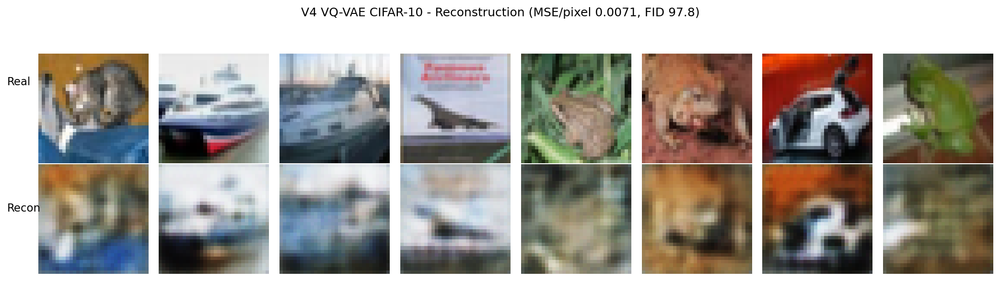

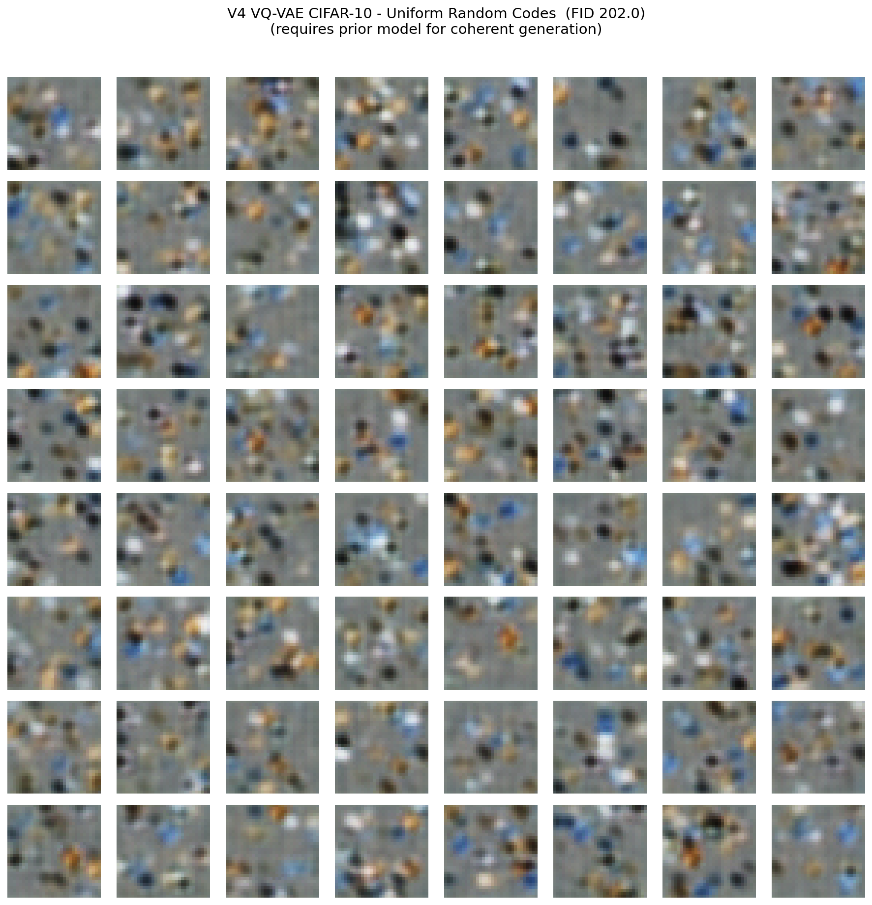

Sampling codes from a uniform categorical over {0, 512} and decoding — incoherent noise. The encoder only ever produced code patterns from a structured distribution; uniform codes don't match.

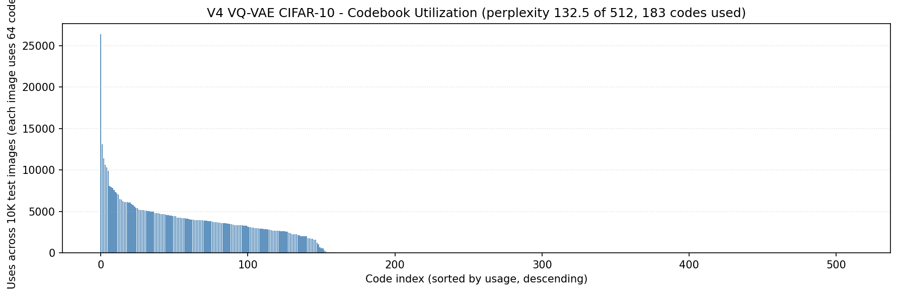

### 5. V5 VQ-VAE + PixelCNN prior — van den Oord 2016, 2017 (CIFAR-10)

**Architecture**: frozen V4 encoder + codebook + decoder; new **PixelCNN** autoregressive prior over the 8×8 code grid.

PixelCNN: `Embedding(512, 64)` -> `MaskedConv2d-A(64->128, 7×7)` -> 6× `MaskedConv2d-B(128->128, 3×3)` -> `Conv2d(128, 512, 1×1)`. All ReLU between layers. Output: `(B, 512, 8, 8)` logits (K-way categorical per grid position).

**Mask A** (first layer only): zeros center + all-right-of-center + all-below. No self-access, strict causality on raw input.
**Mask B** (deeper layers): zeros right + below, allows center. Causality preserved by upstream Mask A.

**Training**: Adam(lr=3e-4), 50 epochs, batch=128. Precompute code indices for train/val/test via V4's frozen encoder once; train PixelCNN on those as a dense categorical task. Loss = `F.cross_entropy(logits, code_indices)`, mean-reduced (nats/position).

**Generation (raster order)**: initialize zeros, sample position `(0, 0)` first — `codes[:, 0, 0] = multinomial(softmax(pixelcnn(codes)[:, :, 0, 0]))`; repeat for 64 positions. Sampled codes -> lookup in V4's codebook -> decode.

**Result**: **test CE 3.345 nats/position** (uniform baseline = ln(512) = 6.238 nats; prior captured 2.893 nats of structure, **46% of maximum**). **Prior-sampled FID 117.27** — 82 FID better than V4's random-code 201.97, 19 FID worse than V4's reconstruction ceiling 97.81.

**Generation cost**: 10K samples in 2.4s = **0.24 ms/sample** on RTX 4090. Autoregressive is 64× slower than single forward pass (15.7 μs/sample), but still practical.

**Why it matters**: completes the DALL-E 1 recipe at portfolio scale — VQ encoder -> learned prior -> VQ decoder. PixelCNN is the smaller sibling of DALL-E's Transformer prior; Stable Diffusion replaces it with diffusion. Same architecture, different prior.

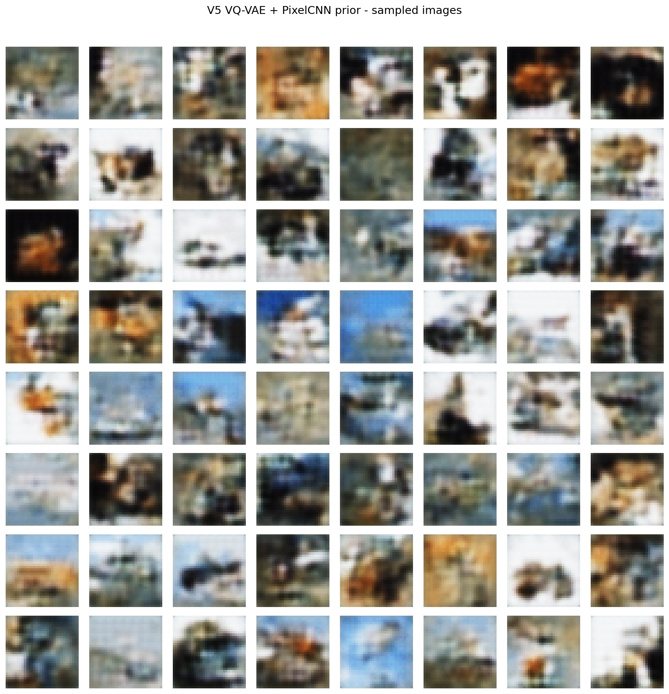

Coherent sky/water/horizon compositions (rows 4-5), recognizable animal-fur textures (row 2), structured bright/dark layouts. No crisp object boundaries — 8×8 codes can't encode them. This is exactly what a small PixelCNN on tiny code grids produces; the DALL-E 1 recipe with more codes (32×32) + a Transformer prior fixes this.

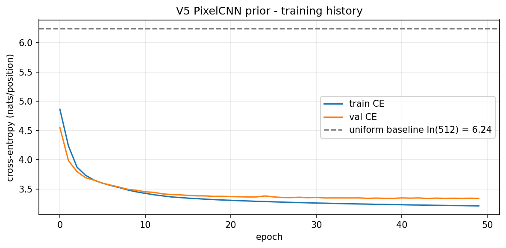

CE drops from 4.86 (epoch 1) to 3.21 (epoch 50) — well below the 6.24 uniform baseline. Train/val gap 0.13 nats — no overfitting.

---

## Test Results Comparison

### MNIST (V1 + V3 sweep)

| Variant | β | Test NLL | Recon | KL | Params | Train (s) |
|---|---|---|---|---|---|---|
| **V1 Vanilla VAE** | 1.0 | **101.978** | 76.80 | 25.18 | 652,824 | 73.3 |
| V3 β-VAE | 1.0 | 101.978 | 76.80 | 25.18 | 652,824 | 71.7 |
| V3 β-VAE | 4.0 | 145.688 | 107.26 | 9.61 | 652,824 | 69.5 |
| V3 β-VAE | 10.0 | 181.316 | 143.92 | 3.74 | 652,824 | 70.8 |

V3 β=1 reproduces V1 exactly — reproducibility passes. NLL up, KL down as β increases (expected trade-off).

### CIFAR-10 Reconstruction Quality

| Variant | MSE / pixel | KL | Params | Train (s) |
|---|---|---|---|---|
| AE #10 Denoising (ref) | 0.00370 | n/a | 387K | ~300 |
| V2 Conv VAE | 0.01655 | 22.78 | 581,763 | 176.6 |
| **V4 VQ-VAE** | **0.00712** | n/a (discrete) | **138,435** | 156.6 |

V4 reconstructs 2.3× better than V2 with 4.2× fewer parameters. Discrete latents denoise naturally — the codebook is a learned 512-point quantization grid.

### CIFAR-10 FID Ladder (the portfolio headline)

| Rank | Source | FID | Type | Model class |
|---|---|---|---|---|
| 1 | **GAN #14 DCGAN** | **30.57** | Adversarial generation | GAN |
| 2 | V4 VQ-VAE reconstruction | 97.81 | Reconstruction ceiling | VQ-VAE |
| 3 | **V5 prior-sampled** | **117.27** | Learned prior generation | VQ-VAE + PixelCNN |
| 4 | V2 Conv VAE prior-sampled | 165.43 | Continuous-latent generation | VAE |
| 5 | V4 random-code (no prior) | 201.97 | Noise floor | VQ-VAE (degenerate) |

Read top-to-bottom; each row's FID gap vs the one above is the lever being isolated.

- **Noise floor -> V5 prior (-85 FID)**: the learned-prior contribution (PixelCNN doing its job).
- **V5 -> V4 reconstruction (-19 FID)**: the prior's information loss — how much the PixelCNN can't recover beyond the encoder's capacity.
- **V4 reconstruction -> GAN (-67 FID)**: the VAE-family-vs-adversarial honest gap. This is why modern generation is GAN/diffusion, not pure VAE.

### V4 + V5 Auxiliary Metrics

| Metric | Value | Note |
|---|---|---|
| V4 codebook perplexity | 132.5 | of 512 max — healthy utilization |
| V4 unique codes used | 183 | of 512 possible — 36% coverage |
| V5 test CE | 3.345 nats/pos | uniform baseline ln(512) = 6.238 |
| V5 prior info gain | 2.893 nats/pos | 46% of maximum possible |
| V5 generation time | 2.4s | for 10,000 samples (0.24 ms/sample) |

---

## Performance Benchmarks

### Training Costs (RTX 4090)

| Variant | Train time | Peak GPU MB | Params | Epochs |
|---|---|---|---|---|
| V1 | 73.3s | 2.3 | 652K | 50 |
| V2 | 176.6s | ~1.2K | 582K | 100 |
| V3 (× 3 β) | ~212s total | 2.3 | 652K each | 50 each |
| V4 | 156.6s | ~0.8K | 138K | 100 |
| V5 (PixelCNN) | 70.5s | 317 | 1.39M | 50 |
| V5 + V4 pipeline | 227.1s total | — | 1.52M total | — |

### Inference Latency

| Variant | Forward pass | Generation |
|---|---|---|
| V1 | 1.69 μs/sample | — (sample from N(0, I) and decode, effectively instant) |
| V2 | — | single decoder forward pass |
| V4 | — | single encoder+decoder forward pass |
| V5 forward pass | 15.72 μs/sample | 0.24 ms/sample (autoregressive, 64 forward passes per batch) |

V5's generation is 64× slower than its single forward pass — the autoregressive cost is unavoidable for raster-order sampling. A Transformer prior with parallel decoding (via rejection sampling) would recover most of this at the cost of a much larger model.

---

## What Worked and What Didn't

### What worked

- **Analytical KL** closed-form for diagonal Gaussians: `-0.5 * Σ(1 + logvar - μ² - exp(logvar))`. Three lines of tensor math, no `torch.distributions` needed.
- **Reparameterization trick** implemented in one line: `z = mu + torch.randn_like(std) * std`. The thing that took Kingma months to formalize is a one-liner today.
- **KL warmup** on V2 (β ramps 0 → 1 over first 10 epochs). Prevents posterior collapse — the model can't learn to route everything through the prior if the KL term doesn't bite until the decoder is already fitting.
- **Data-dependent codebook init** on V4. Simple patch, high leverage — moved perplexity from 11 to 140.
- **Mean-reduced losses everywhere**. Sum-reduced recon + mean-reduced VQ loss had a 10⁶× scale mismatch on V4; one-word fix, night-and-day difference.
- **PixelCNN causality sanity test** before training. Catches mask bugs in 2 seconds instead of 70.
- **Reusing V4's train/val split** in V5. No new random state, no leakage risk, 45K/5K code grids matched V4's.

### What didn't work (or underperformed plan)

- **`utils.vae_utils.vq_straight_through`** was buggy out of the box. Bypassed, not fixed. Needs attention in Phase 8 cleanup.
- **Random-init codebook** on V4 collapsed. Standard recommendation in the paper; broken at our scale without data-dependent init.
- **V2's prior-sampled FID of 165** exceeded the plan's 70-90 target. Root cause: Conv VAE's continuous latent doesn't capture the image manifold tightly enough; samples from N(0, I) land in low-density regions. V5's FID 117 — solved via discrete latents + learned prior.
- **V4's reconstruction FID of 97.81** exceeded the plan's 50-70 target. Architecture ceiling, not a bug. Deeper decoder + LPIPS loss would close this; both out of scope.
- **PixelCNN at 8×8 grid** can't produce crisp object boundaries. A 32×32 grid would help, but 32×32 requires a larger codebook + longer training. DALL-E 1 uses 32×32 codes with a 256K-param Transformer prior; we used 1.4M-param PixelCNN at 8×8 and accepted the blur.

### The honest story

V5 does not beat GAN. That's the point. The portfolio shows a VAE-family pipeline that (a) reconstructs with discrete latents, (b) generates via a learned autoregressive prior, (c) lands at FID 117 on CIFAR-10, (d) falls 87 FID behind an adversarial baseline on the same dataset. All of modern generation (Stable Diffusion, DALL-E, Muse) has a VAE stage + a stronger prior; we built that architecture from scratch and measured where it plateaus.

---

## When to Use Each Variant

| Situation | Pick | Why |
|---|---|---|
| Teaching / first introduction to probabilistic latents | **V1** | Canonical Kingma 2013, minimal moving parts |
| Need interpretable disentangled factors | **V3 (β=4)** | Stroke width, tilt, identity separate cleanly |
| Need reconstruction + likelihood on natural images | **V2** | Continuous latent, differentiable FID optimization possible |
| Need lossy compression (images or audio) | **V4** | Discrete codes transmit as integers, reconstruction beats V2 |
| Need generative sampling of natural images (VAE family) | **V5** | Only variant that generates coherent samples |
| Maximum image quality, don't care about likelihood | GAN #14 | FID 30.57 vs our 117 — use an adversarial model |
| Need text-to-image / controllable generation | n/a | Out of scope — this is unconditional generation |

---

## Key Insights

1. **The prior does the generation, not the decoder.** V4 and V5 share the exact same decoder. V4 decoded from uniform-random codes → FID 202. V5 decoded from PixelCNN-sampled codes → FID 117. The decoder is identical; only the distribution of codes fed in changed. This is the whole thesis of the two-stage recipe (DALL-E 1, Stable Diffusion, etc.).
2. **Discrete latents reconstruct better than continuous VAEs at similar scale.** V4 (138K params, MSE 0.0071) vs V2 (582K params, MSE 0.0166). Quantization is a feature, not a bug — the codebook acts as a learned regularizer that prevents the latent from drifting into under-trained regions.
3. **Disentanglement and reconstruction are a Pareto trade-off.** V3 β=4 separates identity from style but loses 44 nats of NLL vs V1. There is no β that wins both axes; the sweet spot is task-dependent.
4. **Information gain is a cleaner prior-quality metric than FID.** V5's 2.893 nats/position captured out of 6.238 possible = 46% of maximum information. Reports how much structure the prior learned, independent of the decoder's image-quality ceiling. FID conflates both.
5. **Two-stage cost accounting matters for deployment.** V5 is "1.4M params" in isolation, but its inference pipeline requires V4's 138K params + codebook too → 1.52M params total. Similarly 70.5s train + 156.6s for V4 = 227s end-to-end. A reader looking at V5's row alone would underestimate by 10%.
6. **Autoregressive generation is 64× slower than one forward pass.** PixelCNN samples a 64-position grid, so 64 sequential forward passes. Unavoidable for raster-order sampling. Transformer priors with parallel decoding (via self-attention) sidestep this but need larger architectures to stay competitive.

---

## PyTorch Features Used

| Feature | Where |
|---|---|
| `nn.Linear`, `nn.Conv2d`, `nn.ConvTranspose2d` | V1-V5 building blocks |
| `nn.Embedding` | V5 code embedding |
| `nn.Parameter(randn * 0.1)` then re-init | V4 codebook |
| `F.relu`, `torch.sigmoid`, `F.softmax` | activations |
| `F.binary_cross_entropy(reduction='sum')` | V1/V3 reconstruction likelihood |
| `F.mse_loss` (default mean) | V2/V4 reconstruction + VQ losses |
| `F.cross_entropy` (default mean) | V5 categorical prior |
| `torch.randn_like(std)` | reparameterization trick noise |
| `(z_q - z_e).detach()` | straight-through estimator (V4) |
| `F.conv2d(x, self.weight * self.mask, ...)` | masked convolution (V5) |
| `register_buffer('mask', ...)` | PixelCNN mask travels with the model on `.to(device)` |
| `torch.multinomial(probs, 1)` | V5 raster-order sampling |
| `torch.utils.data.TensorDataset + DataLoader` | batch shuffling |
| `torch.save / torch.load(weights_only=True)` | checkpointing, PyTorch 2.5.1 security best practice |
| `@torch.no_grad()` | inference, sampling, checkpoint reload |

---

## Deployment Staging (MLflow)

Two experiments, one winner each:

| Experiment | Winner | Run ID | Primary metric |
|---|---|---|---|
| `vae-mnist` | V1 Vanilla VAE | `82ce82eaf2d5423a934affdeb7a8d971` | Test NLL 101.98 nats |
| `vae-cifar10` | V5 VQ-VAE + PixelCNN prior | `e9327354630944f099013a56b9994f44` | Prior-sampled FID 117.27 |

**V5 logged with both checkpoints**: `v5_pixelcnn_cifar10_best.pth` (prior) + `v4_vqvae_cifar10_best.pth` (required encoder/codebook/decoder). Deployment pipeline must load both.

**Why `log_state_dict` instead of `log_model`**: VQ-VAE's forward signature is non-standard (returns 4 tensors) and PixelCNN takes `(B, H, W)` long codes as input — `mlflow.pytorch.log_model` can't infer the input schema. State-dict artifacts + rebuild class from pipeline code is the portable route (same convention as GNN #18).

Launch the UI:
```powershell
cd PyTorch/19-vae
mlflow ui --backend-store-uri sqlite:///mlflow.db
```

---

## Files

```text
PyTorch/19-vae/
├── pipeline.ipynb                              # Full 5-variant pipeline, MLflow closeout
├── README.md                                   # This file
├── requirements.txt                            # Pinned versions
├── mlflow.db                                   # SQLite backend (gitignored)
├── mlruns/                                     # MLflow artifact tree (gitignored)
└── results/
    ├── v1_vanilla_mnist_*.png                  # t-SNE, samples, interpolation, history, recon
    ├── v1_vanilla_mnist_best.pth               # V1 checkpoint
    ├── v2_conv_cifar10_*.png                   # recon, samples, latent, history
    ├── v2_conv_cifar10_best.pth
    ├── v3_beta{1,4,10}_mnist_traversal.png     # disentanglement per β
    ├── v3_beta{1,4,10}_mnist_best.pth
    ├── v4_vqvae_cifar10_*.png                  # recon, random samples, codebook usage, history
    ├── v4_vqvae_cifar10_best.pth
    ├── v5_pixelcnn_cifar10_*.png               # samples, history
    └── v5_pixelcnn_cifar10_best.pth            # {'model_state_dict': ..., 'hyperparams': ..., 'best_val_ce': ...}
```

---

## How to Run

1. **Create venv + install**
   ```powershell
   python -m venv .venv
   .venv\Scripts\Activate.ps1
   pip install -r PyTorch/19-vae/requirements.txt
   ```

2. **Preprocess data** (writes `data/processed/vae/{mnist,cifar10}/`):
   ```powershell
   python data-preperation/preprocess_vae.py
   ```

3. **Launch Jupyter** from project root:
   ```powershell
   jupyter notebook PyTorch/19-vae/pipeline.ipynb
   ```

4. **Run cells in order**. Seeds pin at `RANDOM_STATE = 113`; total runtime ≈ 15 minutes on RTX 4090 for all 5 variants + eval + MLflow.

5. **Inspect MLflow**:
   ```powershell
   cd PyTorch/19-vae
   mlflow ui --backend-store-uri sqlite:///mlflow.db
   ```
