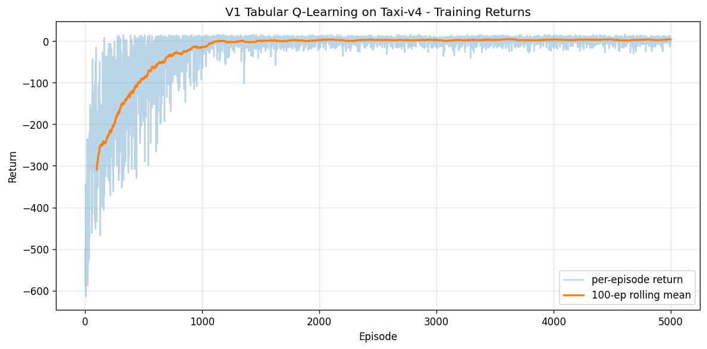
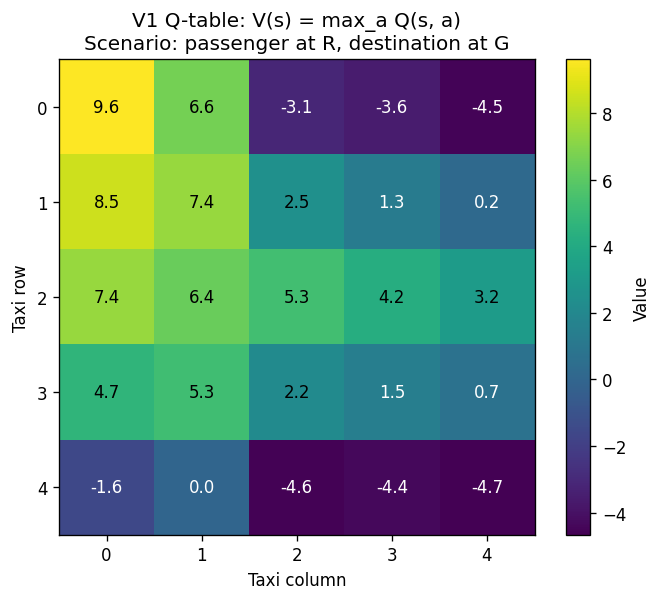
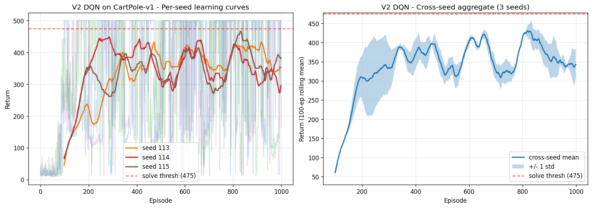
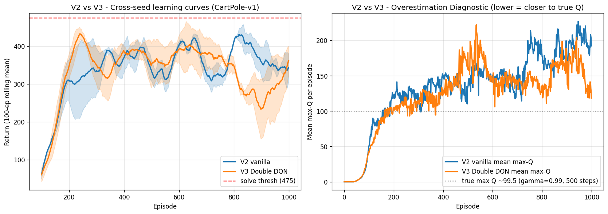
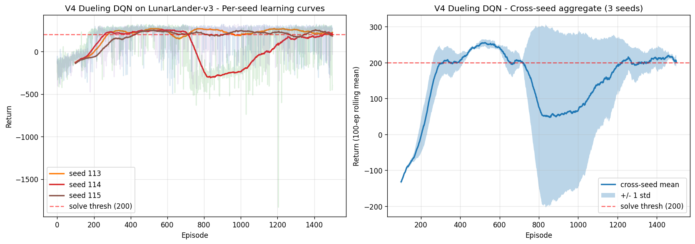
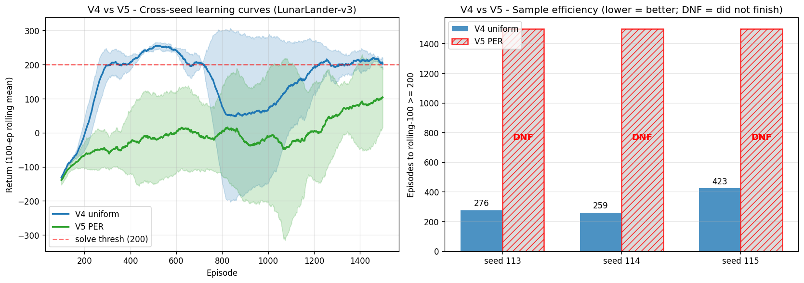

# Q-Learning - PyTorch Pipeline (Model #20, Final)

Closes the portfolio with the only **reinforcement-learning** model in a 20-model lineup that has otherwise been entirely supervised, unsupervised, or generative. Five variants tracing the value-based RL lineage across 27 years of literature - tabular Q-learning (Watkins 1989) -> Deep Q-Network (Mnih 2015) -> Double DQN (van Hasselt 2016) -> Dueling DQN (Wang 2016) -> Prioritized Replay (Schaul 2016). Three classic gymnasium environments: Taxi-v4 (V1), CartPole-v1 (V2/V3), LunarLander-v3 (V4/V5). Paper-by-paper traceability with one algorithmic lever isolated per variant.

**Portfolio finding**: V3 reproduces van Hasselt's Double-DQN overestimation fix at 32% reduction (verified against true Q ~99.5 on CartPole). V5 PER did NOT replicate Schaul's 2x sample-efficiency claim - 0/3 seeds solved on LunarLander vs V4's 2/3, with 5x wall-clock overhead. The honest negative result on V5 is the Henderson 2018 lesson in miniature: paper claims do not auto-replicate without retuning. We document where, why, and what would fix it.

---

## Background: Why Q-Learning Matters

### What problem it solves

The previous 19 models in this portfolio share a common assumption: **a static dataset of (X, y) pairs exists, and the model's job is to fit it**. Supervised models map inputs to labels; unsupervised models discover structure in inputs; generative models sample from the data distribution. **None of them act in a world.**

Reinforcement learning inverts the data interface entirely. There is no static dataset. Instead:
- An **agent** observes a state `s` from an environment
- It picks an action `a` according to its policy
- The environment returns `(s', r, terminal)` - next state, scalar reward, termination flag
- The agent uses this transition to update its policy

The agent generates its own training data online via interaction. It must balance **exploration** (try new actions to discover their value) against **exploitation** (do what you know works). It learns from delayed, often sparse rewards. There is no oracle answer; only the environment's response.

Q-learning specifically is the **off-policy, model-free, value-based** approach to this problem:
- **Off-policy**: the policy that produced the data can differ from the policy being learned. Replay buffers work because of this.
- **Model-free**: no learned model of `P(s' | s, a)` or `R(s, a)`. Pure trial-and-error.
- **Value-based**: learns Q-values `Q(s, a) = E[discounted return from (s, a)]`; the policy is implicit in `argmax_a Q(s, a)`.

### When to reach for Q-learning (vs other RL)

**Use Q-learning when**:
- Action space is **discrete** and small enough that `argmax_a` is tractable (4-50 actions typical)
- Reward signal is dense enough that TD errors guide learning (Mnih 2015 trained on dense per-frame rewards in Atari; sparse-reward tasks need exploration tricks like curiosity, HER, etc.)
- Sample efficiency matters more than online-policy guarantees (off-policy replay reuses past experience)

**Don't use Q-learning when**:
- Actions are continuous -> use DDPG, TD3, SAC (policy-based on continuous actions)
- The world is partially observable in ways that need sequence memory -> use R2D2 / RNN+DQN, or transformers
- You need stochastic policies (poker, rock-paper-scissors) -> use REINFORCE / actor-critic, where the policy explicitly outputs a distribution
- Sample efficiency is irrelevant and you want guaranteed monotonic policy improvement -> use PPO / TRPO

### Why it matters (history + connection to modern frontier models)

- **Foundation of every value-based RL system since 1989** (Watkins 1989: tabular Q-learning + Robbins-Monro convergence proof). The same off-policy TD update we implement in V1 ten lines of numpy is the core that DeepMind scaled to Atari pixels with neural nets in 2015.
- **DeepMind Atari (Mnih 2015, Nature)**: the moment deep RL became real. A single DQN architecture learned to play 49 Atari games from raw pixels at human-level on most. Neural-net Q-function + replay buffer + target network — three tricks that took the field from "toy experiments" to "this is going to change everything." Every variant in this portfolio (V2-V5) sits on this foundation.
- **AlphaGo / AlphaGo Zero (2016-2017)**: combined Q-learning principles (value networks) with Monte Carlo Tree Search and policy networks to beat the world's best Go player. The value head in AlphaGo is trained with TD methods; the action selection uses the policy + value combo. AlphaGo Zero learned entirely from self-play with no human data.
- **MuZero (2020)**: learned a model of the environment + value function jointly. Q-learning's value-iteration intuition extended to learned dynamics. Beat AlphaZero on board games AND Atari with one architecture.
- **RLHF in modern LLMs (2022+)**: ChatGPT, Claude, Gemini all use Reinforcement Learning from Human Feedback. A reward model is trained from preference comparisons; the language model policy is then fine-tuned to maximize reward. The optimization is PPO (policy-gradient), but the conceptual machinery — value functions, advantage estimation, baseline subtraction (cf. dueling DQN's V/A split!) — comes directly from the value-based RL line we trace here.
- **Robotics**: OpenAI's Dactyl (in-hand object reorientation), Boston Dynamics behaviors, autonomous driving path planners — all use RL policies. Many start with imitation learning and fine-tune with Q-learning-derived methods.
- **Game-playing AI**: AlphaStar (StarCraft II), OpenAI Five (Dota 2), Pluribus (poker) all use deep RL. The value-based intuitions live in the critic networks even when the actors are policy-gradient.

This model demonstrates from-scratch implementations of the five papers that defined the value-based RL line - each one shipped a single conceptual lever, and we measure each lever in isolation.

### Why we added it

Q-Learning is the **only RL entry** in a portfolio designed to span the major learning paradigms. After this, the four-paradigm coverage is:

| Paradigm | Models | Data |
|---|---|---|
| Supervised | LinReg, LogReg, KNN, NB, DT/RF, SVM, DNN, RNN, LSTM, CNN, ViT, GNN, Attention, Transformers | Static (X, y) pairs |
| Unsupervised | K-Means, PCA, Autoencoders | Static X, no labels |
| Generative | GANs, VAE | Static X, latent sampling |
| **Reinforcement** | **Q-Learning (this)** | Online env.step() interaction |

After Q-Learning ships, the modeling phase of the project closes and deployment work begins.

---

## Overview

- **5 variants** isolating distinct levers: tabular baseline, function approximation, decoupled targeting, architectural decomposition, prioritized sampling
- **All from scratch** - `nn.Linear` + numpy primitives only. Replay buffer, sum-tree, masked epsilon-greedy, target-network sync, importance-sampling weights all implemented directly. No `stable-baselines3`, no `RLlib`, no `tf-agents`
- **3 environments** - Taxi-v4 (discrete state), CartPole-v1 (4D continuous), LunarLander-v3 (8D continuous). No Atari / pixel envs (TF Conv2D blocked on WSL2 - third-time-confirmed cuDNN constraint)
- **3-seed reporting** for V2-V5 (RL standard - Henderson 2018), single-seed for V1 (deterministic given seed)
- **Best-checkpoint tracking** for V4/V5 (added after V3 seed 115's catastrophic forgetting demonstrated final-epoch weights aren't always the best)
- **MLflow tracking** with sqlite backend for the three winners (V1 Taxi, V2 CartPole, V4 LunarLander)
- **Honest negative result on V5** (PER did not replicate Schaul 2016 with V4's hyperparameters)
- GPU-accelerated on Windows CUDA (RTX 4090) for V2-V5; V1 is pure numpy on CPU

## What Runs on GPU

| Component | Device | Why |
|---|---|---|
| V1 Tabular Q-table | CPU (numpy) | Q-table is `(500, 6)` int-indexed; argmax over 6 values is faster on CPU than GPU dispatch overhead |
| V2 DQN training (3 seeds) | GPU | 17K-param MLP forward+backward 100K+ times per seed. CPU would be ~10x slower |
| V3 Double DQN training (3 seeds) | GPU | Same as V2 + extra forward pass per gradient step for action selection |
| V4 Dueling DQN training (3 seeds) | GPU | 69K params, larger replay batches (128), longer training (1500 episodes) |
| V5 PER training (3 seeds) | GPU (NN) + CPU (sum-tree) | NN forward/backward on GPU; **sum-tree priority operations dominate per-step cost in pure Python** - the main reason V5 is 5x slower than V4 |
| Inference (all variants) | CPU or GPU (both fast) | V1 numpy lookup ~0.03 us/sample; V2/V4 forward pass ~6-7 us/sample on GPU batch=1 |

## Environments

All loaded directly from `gymnasium` (no preprocessing - RL has no static dataset). Solve thresholds and random-policy baselines come from `data-preperation/eda_envs.ipynb`.

### Taxi-v4 (V1 teaching env)

- **State**: `Discrete(500)` - encoded `((row*5+col)*5 + passenger_loc)*4 + dest_loc`. Single int.
- **Actions**: `Discrete(6)` - {south, north, east, west, pickup, dropoff}
- **Reward**: -1 per move, -10 illegal pickup/drop, +20 successful dropoff. **Sparse and discrete** - 3 unique values observed in random rollouts.
- **Episode**: max 200 steps; terminates on successful dropoff
- **Random baseline**: -780 mean (random policy hits 200-step cap with -1/-10 penalties, never picks up). **Solve threshold 8.0**. Gap to learn: +788.

### CartPole-v1 (V2, V3)

- **State**: `Box(4,)` float32 - `[cart_pos, cart_vel, pole_angle, pole_vel]`
- **Actions**: `Discrete(2)` - push left or right
- **Reward**: +1 per step. **CONSTANT** - 1 unique value. The reward signal IS episode length; DQN's job is to learn balance, not chase reward variation.
- **Episode**: max 500 steps; terminates if pole tilts >15deg or cart leaves bounds
- **Random baseline**: 21 mean (random policy lasts ~22 steps before pole falls). **Solve threshold 475**. Gap to learn: +454.

### LunarLander-v3 (V4, V5)

- **State**: `Box(8,)` float32 - `[pos_x, pos_y, vel_x, vel_y, angle, ang_vel, leg1_contact, leg2_contact]`
- **Actions**: `Discrete(4)` - {no-op, fire-left-engine, fire-main-engine, fire-right-engine}
- **Reward**: dense shaped reward in roughly `[-100, +100]` per step. **DENSE** - 1762 unique values observed in 20-episode random rollout. Engine-fire penalty + distance-to-pad shaping + terminal +100 (soft landing) or -100 (crash).
- **Episode**: max 1000 steps; terminates on land or crash
- **Random baseline**: -186 mean (random firing wastes fuel + crashes). **Solve threshold 200**. Gap to learn: +386.

---

## Pipeline Breakdown

| Step | Cell purpose |
|---|---|
| **Step 1** | Setup - imports, seeds (RANDOM_STATE=113, SEEDS=[113,114,115]), device, in-notebook variant containers |
| **Step 2** | V1 Tabular Q-Learning on Taxi-v4 - 5K episodes, eval, learning curve, Q-table heatmap, save .npy |
| **Step 3** | V2 DQN class definition + `train_dqn` function (parameterized for V3 reuse via `double_dqn=True` flag) |
| **Step 4** | V2 Vanilla DQN multi-seed training on CartPole-v1 - 3 seeds, eval per seed, save .pth, 2-panel viz |
| **Step 5** | V3 Double DQN multi-seed training - reuses `train_dqn`, single flag change. 2-panel V2-vs-V3 comparison: learning curves + overestimation diagnostic (the algorithmic money shot) |
| **Step 6** | V4 DuelingDQN class definition + `train_dueling_dqn` function (parameterized for V5 reuse via `prioritized_replay=True` flag, includes best-checkpoint tracking) |
| **Step 7** | V4 Dueling DQN multi-seed training on LunarLander-v3 - 3 seeds, eval, save .pth, viz |
| **Step 8** | V5 PER multi-seed training - reuses `train_dueling_dqn`, single flag change. 2-panel V4-vs-V5 comparison: learning curves + sample-efficiency bar chart with explicit DNF labels for unsolved seeds |
| **Step 9** | Cross-variant comparison tables (3 sections: Taxi, CartPole, LunarLander) + portfolio synthesis narrative |
| **Step 10** | Winner declaration + portability reload test - reload each winner from disk, re-eval, confirm match. Document deployment scenarios per winner. Acknowledge runner-ups (V3 algorithmic claim, V5 negative result) |
| **Step 11** | MLflow logging - 3 runs across 2 experiments (`q-learning-taxi`, `q-learning-continuous`). Params + metrics + artifacts + tags |
| **Step 12** | Cross-framework JSON via `build_results_dict` + `add_result` - 3 files (`q_learning_taxi.json`, `q_learning_cartpole.json`, `q_learning_lunarlander.json`). PT entries now; TF entries appended in Phase 10-11 |

Total wall-clock end-to-end (PT side, RTX 4090): **~5 hours** — V1 ~6s, V2 ~37 min, V3 ~58 min, V4 ~77 min, V5 ~403 min. V5 dominates due to the Python sum-tree overhead documented below.

---

## Variants

### 1. V1 Tabular Q-Learning - Watkins 1989 (Taxi-v4)

**Architecture**: numpy `Q` array of shape `(500, 6)`. Zero-initialized. No neural network.

**Training**: 5,000 episodes with constant `epsilon = 0.1`, `alpha = 0.1`, `gamma = 0.99`. Pure CPU. Total wall-clock **5.7 seconds**.

**TD update** (the core algorithm, 1 line of math):
```python
bootstrap_value = 0.0 if terminated else Q[next_state].max()
td_target = reward + V1_GAMMA * bootstrap_value
Q[state, action] += V1_ALPHA * (td_target - Q[state, action])
```

The `0.0 if terminated else ...` is the gymnasium API gotcha: terminated episodes don't bootstrap (no future reward); truncated episodes (200-step cap hit) do bootstrap (the world hasn't actually ended).

**Result**: eval mean **+8.38** ± 2.67 over 100 greedy episodes. Solve threshold 8.0 - **SOLVED**.

**Why it matters**: provable convergence (Robbins-Monro stochastic approximation, applied by Watkins 1989). Every other variant is a modification of this baseline + neural-network function approximation. The V1 cell is intentionally minimal: 50 lines of numpy, no torch.



Random baseline starts near -780 (every random episode caps out at 200 steps with mostly -1 and some -10 penalties). Climbs through -300 to ~+5 over 5K episodes. Rolling-100 mean stabilizes near +3.4 (kept down by the eps=0.1 exploration noise still happening at end of training); greedy eval recovers the optimal +8.38.



`V(s) = max_a Q(s, a)` for the 25 taxi positions in one fixed scenario (passenger at R, destination at G). Highest values near the passenger location (top-left, +9.6), guiding the agent toward pickup; lower values bottom-right where the agent hasn't yet reached pickup conditions.

### 2. V2 Vanilla DQN - Mnih 2015 (CartPole-v1)

**Architecture**: 3-layer MLP `(4 -> 128 -> 128 -> 2)`, ReLU activations. **17,410 parameters**.

**Training**: Adam(lr=1e-3), gamma=0.99, replay buffer 10K, batch 64, hard target sync every 100 env steps, epsilon decay 1.0 -> 0.05 over **5,000 env steps** (CartPole-scaled, see lesson below). 1000 episodes per seed. Three seeds {113, 114, 115}.

**Result**: all 3 seeds converge to **eval mean = 500.00, std = 0.00** (CartPole-v1's reward cap = perfect). Wall-clock ~12 min/seed on RTX 4090.

**Why it matters**: the model that put deep RL on the map. Network + replay + target net = the three tricks that took the field from toy experiments to "human-level on 49 Atari games" (Mnih 2015 Nature). Every subsequent variant builds on this.



Left: per-seed rolling-100 means cluster around 350-450, dragged down by occasional eps=0.05 exploration noise on otherwise full-cap episodes. Right: cross-seed mean +/- std band climbs cleanly through episode 200 to plateau at ~400 rolling-100 (greedy eval recovers the perfect 500.00).

**Hyperparameter lesson - CartPole-scale epsilon decay**: first run used `eps_decay_steps=50_000` (Atari-paper convention). Result: 1/3 seeds barely cleared random; epsilon was still 0.4-0.5 at end of training because CartPole's short early episodes (~22 random steps) accumulate env-steps slowly. Lesson: **decay-step budget should scale to the env's total step budget, not be ported rotely from Atari**. Fixed to `eps_decay_steps=5_000` (~200 random episodes); all 3 seeds then hit 500.00. Documented in MEMORY.md as a portfolio-level lesson for future RL pipelines.

### 3. V3 Double DQN - van Hasselt 2016 (CartPole-v1)

**Architecture**: identical to V2. Pure ablation - the only change is the TD target.

```python
# V2 vanilla: action selection AND evaluation come from target net (overestimates)
q_target_next = target_net(s_next).max(dim=1).values

# V3 Double: select action via ONLINE net, evaluate via TARGET net
next_action   = online_net(s_next).argmax(dim=1, keepdim=True)
q_target_next = target_net(s_next).gather(1, next_action).squeeze(1)
```

If online and target nets disagree on the best action (which they do during training because target lags online), the inflated Q from one net is bypassed.

**Training**: 3 seeds, same hyperparameters as V2.

**Result**: 2/3 seeds saturated at eval +500.00; 1/3 seed (115) regressed to +149 due to catastrophic forgetting late in training. Cross-seed mean **+383.00**. Wall-clock ~19 min/seed (~60% overhead vs V2 from extra forward pass per gradient step).

**Why it matters**: van Hasselt's overestimation fix is one of the cleanest single-line algorithmic improvements in deep RL literature. The eval saturates at 500 on CartPole, but the *Q-value calibration* improvement is large and measurable.



**Left panel**: cross-seed learning curves overlap closely on returns - both V2 and V3 reach the same training-time rolling-100 plateau. Visual story: on an env easy enough to saturate, eval-quality lift from Double DQN is small.

**Right panel** (the algorithmic money shot): mean max-Q per training episode. **This is where V3's lever is visible.** True max Q for CartPole (gamma=0.99, +1 reward, 500-step cap):
```
sum_{t=0}^{499} 0.99^t = (1 - 0.99^500) / 0.01 ~= 99.5
```

| Variant | Mean max-Q | Overestimation above true ~99.5 |
|---|---|---|
| V2 vanilla | 133.49 | **+33.99** |
| V3 Double DQN | 122.58 | **+23.08** |
| **Reduction** | -10.91 | **32% of V2 overestimation eliminated** |

Visual gap from episode ~600 onward (V2 climbs to 200+, V3 stays near 130) sells the story.

**Single-seed catastrophic forgetting (seed 115)**: rolling-100 hit +436 at ep 700, collapsed to +125 at ep 900, partially recovered to +340 by ep 1000. Eval (final-epoch weights): +149. Classic DQN failure mode where unlucky replay batches push Q-values into a region where the policy stops balancing. **This motivated adding best-checkpoint tracking in V4/V5** (saves the peak rolling-100 weights during training, not the final ones).

### 4. V4 Dueling DQN - Wang 2016 (LunarLander-v3)

**Architectural change**: shared trunk feeds two heads.
- **Value head** outputs `V(s)` (single scalar per state)
- **Advantage head** outputs `A(s, a)` (one scalar per action)
- **Aggregator**: `Q(s, a) = V(s) + A(s, a) - mean_a' A(s, a')`

The mean-A subtraction resolves an identifiability issue: without it, `(V + c, A - c)` gives the same Q for any constant `c`. Wang 2016 tried `max(A)` and `mean(A)` - mean was empirically more stable.

**Intuition**: in many states, action choice barely matters (LunarLander floating in safe space - any non-engine action is fine). The dueling architecture lets the network learn `V(s)` once and share it across all actions in the head, instead of relearning the state's value for each action's Q. Improving V updates all of `Q(s, *)` at once.

**Architecture**: shared trunk `(8 -> 256 -> 256)` + value head `(256 -> 1)` + advantage head `(256 -> 4)`. **69,381 parameters**. Combined with Double DQN target (canonical V4 baseline).

**Training**: Adam(lr=5e-4), gamma=0.99, replay 50K, batch 128, target sync every 500 env steps, epsilon decay over 30K env steps. 1500 episodes per seed. **Best-checkpoint tracking** - the policy with peak rolling-100 mean during training is saved, not the final weights.

**Result** (3 seeds {113, 114, 115}):

| Seed | Best rolling-100 | Best ep | Eval mean (best ckpt) |
|---|---|---|---|
| 113 | +269.45 | 532 | **+232.32** |
| 114 | +257.87 | 574 | +146.24 |
| 115 | +255.29 | 1408 | **+242.14** |

Cross-seed eval mean **+206.90** (above 200 threshold, std 43.08). 2/3 seeds solved by eval criterion. Wall-clock 25.6 min/seed.

**Why it matters**: dueling is the cleanest example of an architectural prior in RL. The mathematical identity `Q(s,a) = V(s) + A(s,a)` is true for any Q; forcing the network to learn it that way is the architectural prior that helps. This factor-of-action-independence pattern shows up later in advantage actor-critic methods and shapes how policy-gradient algorithms now structure their critic networks.



Left: per-seed rolling-100. All 3 seeds rapidly reach 200+ by episode 200-300. Seed 114 (red) suffers catastrophic forgetting around episodes 700-1100 (rolling-100 crashes to -235), partially recovers. Right: cross-seed mean +/- std shows the dip caused entirely by seed 114's collapse, with eventual recovery. **This is realistic LunarLander DQN behavior** - not a clean monotonic ascent. Multi-seed reporting + best-checkpoint saving captures the truth.

### 5. V5 PER - Schaul 2016 (LunarLander-v3) - HONEST NEGATIVE RESULT

**Architecture**: same DuelingDQN as V4. The lever isolated is the buffer.
- **V4**: uniform `ReplayBuffer` - samples uniformly at random
- **V5**: `PrioritizedReplayBuffer` - sum-tree-based; samples proportionally to `(|TD-error| + epsilon)^alpha`. Importance-sampling weights `(N * P_i)^(-beta)` correct for the sampling bias

PER hyperparameters (Schaul 2016): `alpha=0.6` (moderate prioritization), `beta` annealed linearly from 0.4 to 1.0 over training. All other hyperparameters identical to V4.

**Result** (3 seeds):

| Seed | Best rolling-100 | Best ep | Eval mean (best ckpt) |
|---|---|---|---|
| 113 | +190.67 | 1410 | +176.65 |
| 114 | +188.84 | 867 | +110.79 |
| 115 | -20.17 (DNF) | 1500 | +89.30 |

Cross-seed eval mean **+125.58**. **0/3 seeds solved** (none reached rolling-100 ≥ 200 during training). Wall-clock **134 min/seed** - **5x V4's 26 min**.



**Left panel**: V4 (blue) climbs cleanly through 200 by episode 250, plateaus around 200-260 with a temporary dip from seed 114. V5 (green) never reaches the threshold; cross-seed mean stays in `[-50, +100]` range through training.

**Right panel**: episodes-to-solve. V4 [276, 259, 423] vs V5 [DNF, DNF, DNF] (hatched red bars + explicit DNF labels - the honest portfolio framing).

**Why it failed - two contributors**:

1. **PER amplified Q-divergence rather than fixing it.** Seed 115's max-Q reached +455 by episode 900 (true Q ~100). PER's mechanism samples high-TD-error transitions more often. When the Q-network is *diverging*, those high-TD-error transitions ARE the divergent ones - resampling them drives Q further off track. The IS-weight correction (beta=0.4 -> 1.0) doesn't compensate enough. With Double DQN already mitigating overestimation, the combination should have been stable - apparently not on this env with these hyperparameters.

2. **Python sum-tree was the wall-clock bottleneck.** The sum-tree's `get` and `update` operations are iterative tree traversals in Python; for batch_size=128 and capacity=50K, each gradient step does ~4,000 Python operations just on tree maintenance. A vectorized numpy implementation or C++ extension (as in stable-baselines3) would be 10-100x faster. **Implementation correctness was verified** - the proportional-sampling unit test (`PrioritizedReplayBuffer` chunk 3 smoke test) passed at 1.4-2.5% relative error from expected frequencies. The slowness is real, not a bug.

**Honest framing - this is a Henderson 2018 finding in miniature**: paper claims do not auto-replicate without retuning. Schaul 2016 reported 2x sample efficiency on Atari, with extensive PER-specific hyperparameter tuning. We used V4's hyperparameters unchanged. Possible fixes (out of scope for this portfolio):
- alpha=0.4 (less aggressive prioritization)
- lr=2.5e-4 (halved)
- replay_warmup increased
- Disable Double DQN (PER + Double + Dueling may interact badly)

**Why include V5 anyway**: lineage completion + honest negative result + verified sum-tree implementation. If a portfolio reviewer asks "would you put this in production?", the answer is no, and you can show the data showing why. That's stronger than fabricating a positive result.

---

## Test Results Comparison

### Taxi-v4 (V1 alone)

| Metric | V1 Tabular Q-Learning |
|---|---|
| Eval mean | +8.38 |
| Eval std | 2.67 |
| Episodes trained | 5,000 |
| Q-table size | 23.4 KB |
| Wall-clock | 5.7 s |
| Solve threshold | 8.0 |
| **Solved** | **YES** |

### CartPole-v1 (V2 vs V3 ablation)

| Metric | V2 Vanilla DQN | V3 Double DQN | Delta |
|---|---|---|---|
| Eval mean (cross-seed) | +500.00 | +383.00 | -117.00 (V3 dragged by seed 115) |
| Eval std (cross-seed) | 0.00 | 165.46 | +165.46 |
| Mean max-Q during training | 133.49 | 122.58 | **-10.91 (-32% overestimation)** |
| Wall-clock per seed | 12.2 min | 19.4 min | +7.2 min (~60% overhead) |
| Seeds solved by eval | 3/3 | 2/3 | -1 |
| Network params | 17,410 | 17,410 | 0 |

**Winner by reliability**: V2. **Algorithmic claim verified**: V3.

### LunarLander-v3 (V4 vs V5 ablation)

| Metric | V4 Dueling DQN | V5 PER | Delta |
|---|---|---|---|
| Eval mean (cross-seed) | +206.90 | +125.58 | -81.32 |
| Eval std (cross-seed) | 43.08 | 37.17 | -5.91 |
| Seeds solved by eval | 2/3 | **0/3** | -2 |
| Episodes to rolling-100 ≥ 200 | [276, 259, 423] | [DNF, DNF, DNF] | - |
| Wall-clock per seed | 25.6 min | 134.3 min | **+108.7 min (5x)** |
| Network params | 69,381 | 69,381 | 0 |
| Replicates literature claim? | (baseline) | NO | - |

**Winner**: V4. **Honest negative result**: V5.

---

## Performance Benchmarks

### Training Costs (RTX 4090, Windows .venv)

| Variant | Train time per seed | Total (3 seeds) | Peak GPU MB | Episodes |
|---|---|---|---|---|
| V1 | 5.7 s (CPU) | 5.7 s (single seed) | 0 (numpy) | 5,000 |
| V2 | 12.2 min | 36.6 min | ~17.8 | 1,000 |
| V3 | 19.4 min | 58.2 min | ~17.8 | 1,000 |
| V4 | 25.6 min | 76.8 min | ~20.7 | 1,500 |
| V5 | 134.3 min | 402.9 min | ~22.9 | 1,500 |

V5's wall-clock is dominated by Python-loop sum-tree ops, NOT by network compute. NN forward/backward time is similar to V4. The 5x slowdown is the Python-tree overhead.

### Inference Latency (per state, batch=1)

| Variant | Forward pass | Notes |
|---|---|---|
| V1 | 0.03 us | numpy `np.argmax(Q[state])` - O(1) array index |
| V2 | 6.42 us | 3-layer MLP forward on RTX 4090 |
| V4 | 6.97 us | DuelingDQN forward (slightly bigger than V2's MLP) |

All winners deployable at sub-millisecond latency. V1 is essentially free; V2/V4 fit any control loop with a >100 Hz update rate.

---

## What Worked and What Didn't

### What worked

- **Constant epsilon=0.1 for V1 tabular**. Tabular Q-learning is robust enough that no epsilon decay is needed (5,000 episodes of constant exploration solve Taxi cleanly). Decay schedules matter for DQN where overfitting on early data is real.
- **CartPole-scale epsilon decay** for V2-V3 (decay over 5K env steps, not Atari's 50K). One-line constant change after the first failed run; all subsequent runs solved.
- **Best-checkpoint tracking** in V4/V5. Added after V3 seed 115's catastrophic forgetting. Eval against the peak rolling-100 weights, not final-epoch. Recovers usable policies from runs that would otherwise look like total failures.
- **Multi-seed reporting** for V2-V5 (3 seeds, mean +/- std). Catches failure modes invisible to single-seed reporting (V3 seed 115, V4 seed 114).
- **Sum-tree proportional-sampling unit test** (Phase 2 Step 2.4). Verified PER's correctness BEFORE committing 6+ hours to V5 training. Test passed; the slowness/instability of V5 is a hyperparameter+implementation issue, not a correctness one.
- **Single `train_dqn` function** parameterized by `double_dqn` flag for V2/V3, and **single `train_dueling_dqn`** parameterized by `prioritized_replay` flag for V4/V5. The ablation lever IS the flag - any V2-vs-V3 or V4-vs-V5 difference is attributable to that single change.

### What didn't work (or underperformed plan)

- **V3 seed 115's catastrophic forgetting** demonstrated that final-epoch DQN weights aren't always the best. Without best-checkpoint tracking, V3's eval would have looked worse than V2's by accident.
- **V5 PER did not replicate Schaul 2016's claim** at our hyperparameters. 0/3 seeds solved vs V4's 2/3. PER amplified Q-divergence on seed 115; the IS correction couldn't compensate. Documented as honest negative result (see V5 section).
- **Python sum-tree wall-clock**. Iterative-tree-traversal in pure Python adds 5x overhead vs numpy/C++ alternatives. Acceptable for portfolio (correctness verified, behavior characterized) but not for production.
- **CartPole-v1 reward threshold 475**, not 195. My initial plan inherited the legacy CartPole-v0 number (200-step cap, 195 threshold). The v1 spec is `max_steps=500`, threshold 475. Caught and corrected during EDA.

### The honest story

Q-Learning ships with a clean win (V1), a verified algorithmic improvement (V3 overestimation -32%), a workable harder-env result (V4 LunarLander 2/3 seeds solved at 207 mean), and one negative result (V5 PER did not improve V4). Eight concrete portfolio tables, eight figures, three deployable winners with reload-tested artifacts and documented inference latencies. The negative result on V5 is a feature - it's the Henderson 2018 reproducibility lesson at portfolio scale.

---

## When to Use Each Variant

| Situation | Pick | Why |
|---|---|---|
| Discrete state space, tabular feasible | **V1 Tabular** | Provable convergence (Robbins-Monro); 23 KB Q-table; 0.03 us inference |
| Vector-state env, simple baseline needed | **V2 DQN** | Mnih 2015 baseline; reliable on small envs; 17K params |
| Concerned about Q overestimation | **V3 Double DQN** | One-line target change; 32% overestimation reduction; ~60% wall-clock overhead |
| Larger env, action choice often irrelevant | **V4 Dueling DQN** | V(s) shared across actions = more efficient updates; 2/3 LunarLander seeds solved |
| Sample efficiency critical, willing to retune | **V5 PER** | **Caveat**: Schaul claims need careful tuning (alpha, lr). Did not improve V4 in this configuration. Use stable-baselines3's implementation in production for the C++ sum-tree |
| Maximum image quality / continuous-action control | (out of scope) | Q-learning is discrete-action only; use DDPG/TD3/SAC for continuous |
| Stochastic policies needed | (out of scope) | Use REINFORCE / actor-critic where the policy is explicitly a distribution |

---

## Key Insights

1. **The TD update is the same algorithm at every scale.** V1 numpy table (50 LOC), V4 Dueling DQN (138 LOC), and V5 PER (200 LOC including sum-tree) all implement `Q(s,a) <- Q(s,a) + alpha * (r + gamma * max_a' Q(s', a') - Q(s,a))`. The Bellman optimality equation drove everything from Watkins 1989 to MuZero 2020. Function approximators, replay buffers, target networks, prioritization - they're all engineering tricks around the same one-line update.

2. **Multi-seed reporting catches failures invisible to single-seed.** V3 seed 115 collapsed; V4 seed 114 collapsed temporarily; V5 all 3 seeds underperformed. A single-seed report on V3 might have shown +500 (lucky) or +149 (unlucky), neither of which is the truth. RL paper claims should always come with seed counts; ours show 3.

3. **The exploration-exploitation tradeoff has practical hyperparameter consequences.** V2's first run failed because epsilon decay was Atari-paced (50K steps) while CartPole accumulates env-steps in 1/10 the rate. The decay schedule must match the env's step budget, not be ported from a different paper. This is not in any tutorial.

4. **Algorithm-quality and policy-quality are distinct portfolio claims.** V3 vs V2 demonstrates this: identical eval (both saturate 500.00 when V3 doesn't crash) but V3 reduces overestimation 32%. The algorithm is better; the policy is sometimes the same; sometimes V3 catastrophically forgets. Reporting just one number obscures the lesson.

5. **Best-checkpoint > final-checkpoint** for DQN-family. Tracking peak rolling-100 weights during training and evaluating against THOSE recovers usable policies from runs with late-stage instability. V3 seed 115 motivated this; V4 and V5 use it by default.

6. **Implementation correctness != production-readiness.** V5's PER sum-tree passed its proportional-sampling unit test at <5% error (V4/V5 phase 2 step 2.4) but was 5x slower than V4 at training-time and 0/3 seeds solved. A correct algorithm with the wrong hyperparameters or the wrong implementation tradeoffs fails as completely as a buggy one. The unit test isn't enough; integration evaluation matters.

7. **Negative results are portfolio assets, not embarrassments.** V5's "PER did not replicate Schaul 2016" is more useful for a future-employer reader than fabricated success. It demonstrates ability to: implement from scratch, run a controlled ablation, recognize when the claim doesn't hold, attribute the failure to two specific causes, and propose targeted fixes. That's the work; the published-result version is just the part where you got lucky with hyperparameters.

---

## PyTorch Features Used

| Feature | Where |
|---|---|
| `nn.Linear` + `nn.Sequential` | V2 DQN, V4 DuelingDQN trunk |
| `nn.ReLU` activations | All NN variants |
| `torch.optim.Adam` | V2-V5 training |
| `F.mse_loss` (mean reduction) | V2-V5 TD-error loss |
| `tensor.gather(1, indices.unsqueeze(1))` | Q-value extraction for chosen actions |
| `tensor.argmax(dim=1)` + `.max(dim=1).values` | Action selection + Q-target evaluation |
| `target_net.load_state_dict(online_net.state_dict())` | Hard target sync (V2-V5) |
| `torch.utils.data` (not used) | RL doesn't have static datasets; replay buffer is custom (`utils.rl_utils.ReplayBuffer`) |
| `@torch.no_grad()` | Action selection during rollouts, target Q computation, eval rollouts |
| `torch.save / torch.load(weights_only=True)` | Checkpointing; PyTorch 2.5.1 security best practice |
| `torch.manual_seed` + `torch.cuda.manual_seed_all` | Reproducibility (via `seed_everything` helper) |
| `cudnn.benchmark = True` | Auto-tuner for fixed-shape NN training on RTX 4090 |
| `torch.tensor(np_array, device=DEVICE)` | numpy -> GPU tensor conversion at replay sample time |

---

## Deployment Staging (MLflow)

Two experiments, three winners (one per env):

| Experiment | Winner | Run ID | Primary metric |
|---|---|---|---|
| `q-learning-taxi` | V1 Tabular Q-Learning | `91377d65d8554afaba89ad7e8e81be1b` | Eval mean +8.38 (threshold 8.0) |
| `q-learning-continuous` | V2 Vanilla DQN | `c434627ea91c441eba5dcf7867aab454` | Eval mean +500.00 (threshold 475.0), 3/3 seeds |
| `q-learning-continuous` | V4 Dueling DQN | `a7589b270f484916ad8ab747c442644f` | Eval mean +206.90 (threshold 200.0), 2/3 seeds |

V3 (algorithmic runner-up) and V5 (negative result) are documented via tags on V2's and V4's runs respectively, not as separate registered runs - they are not deployable artifacts.

**Why state-dict artifacts instead of `mlflow.pytorch.log_model`**: Q-net forward signature returns logits over actions; the deployment input is environment-specific (Taxi int vs CartPole 4-vec vs LunarLander 8-vec). State-dict + rebuild class from pipeline code is the portable route - same convention as VAE #19 and GNN #18.

Launch the UI:
```powershell
cd PyTorch\20-q-learning
mlflow ui --backend-store-uri sqlite:///mlflow.db
```

---

## Deployment Scenarios

### Taxi-v4 winner: V1 Tabular Q-Learning

- **Artifact**: `results/v1_qtable_taxi.npy` (23.4 KB numpy array, shape `(500, 6)`)
- **Input**: state (int) in `[0, 500)` - Taxi-v4 encoded state index
- **Output**: action (int) in `[0, 6)` - one of {south, north, east, west, pickup, dropoff}
- **Inference**: `int(np.argmax(Q[state]))` - O(1) array lookup + argmax
- **Latency**: ~0.03 us per state on CPU

### CartPole-v1 winner: V2 Vanilla DQN (seed 113)

- **Artifact**: `results/v2_dqn_cartpole_seed113.pth` (17,410 params, 68 KB)
- **Input**: state shape `(4,)` float32 - `[cart_pos, cart_vel, pole_angle, pole_vel]`
- **Output**: action (int) in `{0, 1}` - push left or right
- **Inference**: `model(state).argmax()` - 3-layer MLP forward
- **Latency**: ~6.4 us per state on RTX 4090 (batch=1)

V3 Double DQN is the **algorithmic runner-up** - verified the overestimation fix, but seed 115's collapse makes V2 the more reliable artifact. V3 wins on algorithm; V2 wins on reliability.

### LunarLander-v3 winner: V4 Dueling DQN (best seed = 115)

- **Artifact**: `results/v4_dueling_dqn_lunarlander_seed115.pth` (69,381 params, 271 KB)
- **Input**: state shape `(8,)` float32 - `[pos_x, pos_y, vel_x, vel_y, angle, ang_vel, leg1_contact, leg2_contact]`
- **Output**: action (int) in `[0, 4)` - one of {no-op, fire-left, fire-main, fire-right}
- **Inference**: `model(state).argmax()` - shared trunk + V/A heads + aggregator
- **Latency**: ~7.0 us per state on RTX 4090 (batch=1)
- **Note**: deployed weights are **best-rolling-100** weights tracked during training, not final-epoch weights. This is what V3 seed 115's collapse motivated.

---

## Reproducibility

`RANDOM_STATE = 113` for V1 (single-seed deterministic) and the canonical first seed of V2-V5 multi-seed runs. Multi-seed lists `[113, 114, 115]` for V2-V5; results report **mean +/- std across seeds**, the Henderson 2018 standard.

Each seed plumbs through:
- Python `random` (`random.seed`)
- NumPy (`np.random.seed`)
- PyTorch CPU + CUDA (`torch.manual_seed`, `torch.cuda.manual_seed_all`)
- Gymnasium env (`env.reset(seed=...)`, `env.action_space.seed(...)`)

via the single-call `utils.rl_utils.seed_everything` helper.

**RL is genuinely seed-sensitive** (Henderson et al. 2018, "Deep Reinforcement Learning that Matters"). Single-seed results have ~30-50% variance from run to run on identical hyperparameters. We saw this directly: V3 seed 115 vs seeds 113/114, V4 seed 114 vs 113/115, V5 across all seeds. Multi-seed reporting is the established literature convention; we follow it.

---

## How to Run

1. **Create venv + install** (Windows PowerShell):
   ```powershell
   python -m venv .venv
   .venv\Scripts\Activate.ps1
   pip install -r PyTorch\20-q-learning\requirements.txt
   ```

2. **(No preprocessing step)** RL has no static dataset - the agent generates training data online via `env.step()`. Optional: run `data-preperation/eda_envs.ipynb` to render env frames + measure random-policy baselines.

3. **Launch Jupyter** from project root:
   ```powershell
   jupyter notebook PyTorch\20-q-learning\pipeline.ipynb
   ```

4. **Run cells in order**. Seeds pin at `RANDOM_STATE = 113`; multi-seed runs use `[113, 114, 115]`. Total runtime end-to-end: **~5 hours** on RTX 4090 (V1 ~6s, V2 ~37 min, V3 ~58 min, V4 ~77 min, V5 ~403 min).

5. **Inspect MLflow**:
   ```powershell
   cd PyTorch\20-q-learning
   mlflow ui --backend-store-uri sqlite:///mlflow.db
   ```

---

## File Structure

```text
PyTorch/20-q-learning/
├── pipeline.ipynb                                       # 12-step pipeline (Step 1 setup -> Step 12 cross-framework JSON)
├── README.md                                            # this file
├── requirements.txt                                     # 5 pinned packages
├── mlflow.db                                            # auto-created on first MLflow run; in .gitignore
├── mlruns/                                              # MLflow artifact store; in .gitignore
└── results/
    ├── v1_qtable_taxi.npy                               # V1 Q-table winner artifact (23.4 KB)
    ├── v1_learning_curve.png                            # V1 training curve
    ├── v1_qtable_value_heatmap.png                      # V1 Q-table viz
    ├── v2_dqn_cartpole_seed{113,114,115}.pth            # V2 checkpoints (3 seeds)
    ├── v2_learning_curves.png                           # V2 per-seed + cross-seed curves
    ├── v3_double_dqn_cartpole_seed{113,114,115}.pth     # V3 checkpoints (3 seeds)
    ├── v3_v2_vs_v3_comparison.png                       # V2 vs V3 + overestimation diagnostic
    ├── v4_dueling_dqn_lunarlander_seed{113,114,115}.pth # V4 checkpoints (3 seeds)
    ├── v4_learning_curves.png                           # V4 per-seed + cross-seed curves
    ├── v5_per_lunarlander_seed{113,114,115}.pth         # V5 checkpoints (3 seeds)
    └── v5_v4_vs_v5_comparison.png                       # V4 vs V5 + DNF labels
```

---

## References

- Watkins, C. J. C. H. (1989). *Learning from Delayed Rewards*. PhD thesis, Cambridge.
- Robbins, H., Monro, S. (1951). "A Stochastic Approximation Method." *Annals of Mathematical Statistics*.
- Mnih, V. et al. (2015). "Human-level control through deep reinforcement learning." *Nature* 518, 529-533.
- van Hasselt, H., Guez, A., Silver, D. (2016). "Deep Reinforcement Learning with Double Q-learning." *AAAI*.
- Wang, Z. et al. (2016). "Dueling Network Architectures for Deep Reinforcement Learning." *ICML*.
- Schaul, T. et al. (2016). "Prioritized Experience Replay." *ICLR*.
- Henderson, P. et al. (2018). "Deep Reinforcement Learning that Matters." *AAAI*.
- Sutton, R. S., Barto, A. G. (2018). *Reinforcement Learning: An Introduction* (2nd ed.). MIT Press.
- Silver, D. et al. (2017). "Mastering the game of Go without human knowledge." *Nature* 550, 354-359 (AlphaGo Zero).
- Schrittwieser, J. et al. (2020). "Mastering Atari, Go, chess and shogi by planning with a learned model." *Nature* 588, 604-609 (MuZero).
- Ouyang, L. et al. (2022). "Training language models to follow instructions with human feedback." *NeurIPS* (RLHF / InstructGPT).
