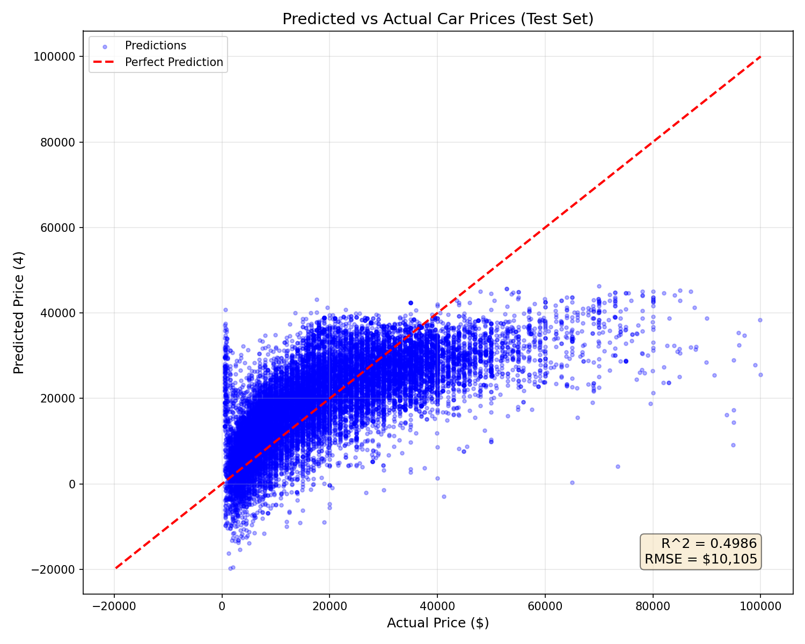
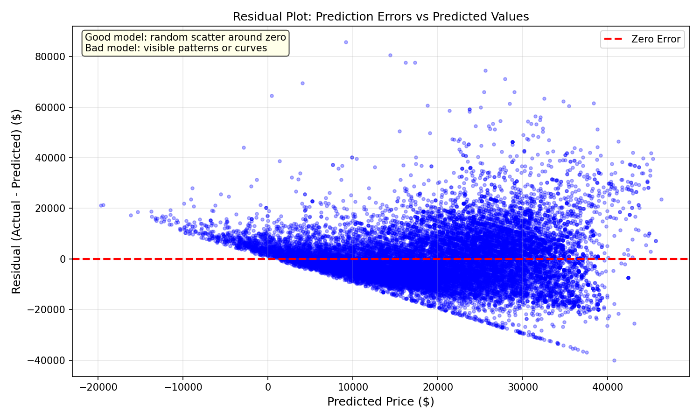
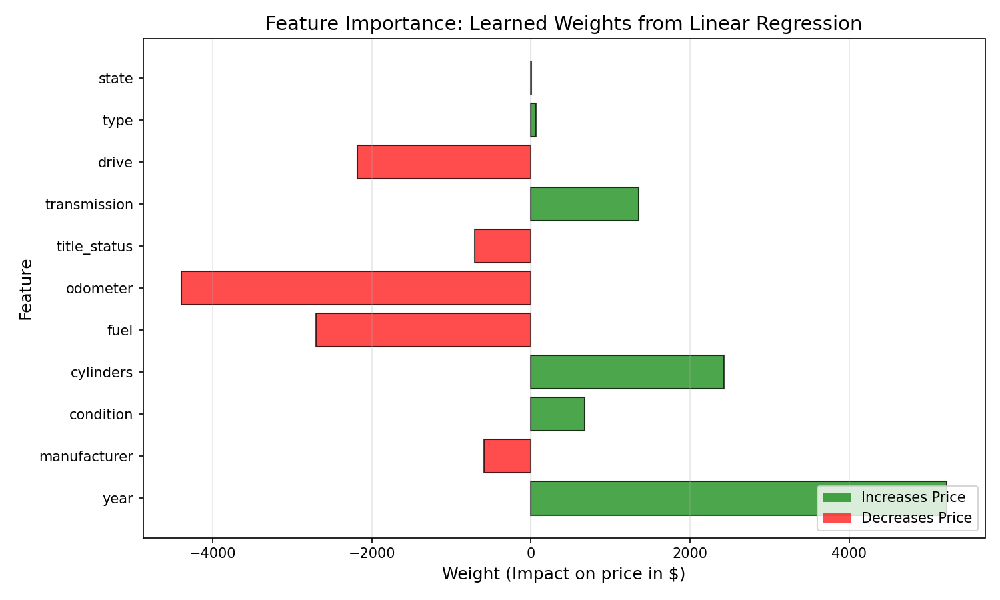

# Scikit-Learn Linear Regression

Scikit-Learn implementation of linear regression using the Normal Equation.

## Overview

This implementation predicts used car prices using Scikit-Learn's LinearRegression. It serves as a comparison to the No-Framework implementation, demonstrating how much sklearn abstracts away while achieving identical results.

## Dataset

- **Source**: [Craigslist Cars/Trucks Dataset](https://www.kaggle.com/datasets/austinreese/craigslist-carstrucks-data)
- **Samples**: 100,000 (sampled from ~350k cleaned rows)
- **Features**: 11 (year, manufacturer, condition, cylinders, fuel, odometer, title_status, transmission, drive, type, state)
- **Target**: Price ($500 - $100,000)

## Key Difference: Normal Equation vs Gradient Descent

| Aspect | No-Framework (Gradient Descent) | Scikit-Learn (Normal Equation) |
|--------|--------------------------------|-------------------------------|
| Method | Iterative optimization | Closed-form solution |
| Formula | `weights -= lr * gradient` | `weights = (X.T @ X)^(-1) @ X.T @ y` |
| Hyperparameters | Learning rate, iterations | None |
| Speed | Slower (many iterations) | Faster (one calculation) |
| Scalability | Better for huge datasets | O(n³) matrix inversion |

## Results

| Metric | Training Set | Test Set |
|--------|--------------|----------|
| MSE    | 101,652,942  | 102,115,067 |
| RMSE   | $10,082      | $10,105  |
| R²     | 0.4933       | 0.4986   |

**Interpretation**: The model explains ~50% of price variance with an average prediction error of ~$10,100. No overfitting detected (R² gap: -0.005).

## Comparison with No-Framework

| Metric | No-Framework | Scikit-Learn | Difference |
|--------|--------------|--------------|------------|
| Test RMSE | $10,058 | $10,105 | +$47 |
| Test R² | 0.4983 | 0.4986 | +0.0003 |
| Lines of Code | ~200 | ~20 | -90% |

**Key Insight**: Nearly identical performance with 90% less code!

## Learned Weights (Feature Importance)

| Feature | Weight | Impact on Price |
|---------|--------|-----------------|
| year | +$5,226 | Newer cars cost more |
| odometer | -$4,392 | Higher mileage = lower price |
| cylinders | +$2,429 | Larger engines cost more |
| fuel | -$2,696 | Diesel costs more than gas |
| drive | -$2,182 | 4WD costs more than FWD/RWD |
| transmission | +$1,352 | Manual slightly higher value |
| title_status | -$710 | Clean titles worth more |
| condition | +$679 | Better condition = higher price |
| manufacturer | -$586 | Brand effect (limited by encoding) |
| type | +$68 | Minimal body type effect |
| state | +$3 | Minimal geographic effect |

## Sklearn Functions Used

| Sklearn Function | No-Framework Equivalent |
|------------------|------------------------|
| `train_test_split()` | Manual index shuffling and slicing |
| `StandardScaler.fit_transform()` | `compute_scaling_params()` + `scale_features()` |
| `LinearRegression.fit()` | `forward()` + `compute_gradients()` + `train()` loop |
| `model.predict()` | `forward()` |
| `mean_squared_error()` | `mean_squared_error()` |
| `r2_score()` | `r_squared()` |

## Visualizations

### Predicted vs Actual


### Residual Plot


**Residual Analysis**: The fan-shaped pattern (heteroscedasticity) shows that expensive cars have more price variability. Linear regression assumes constant variance, which is violated here. Non-linear models may perform better.

### Feature Importance


## Key Learnings

1. **Sklearn drastically reduces code** — 200 lines → 20 lines for same result

2. **Normal Equation gives exact solution** — No hyperparameter tuning needed (learning rate, iterations)

3. **Same preprocessing matters** — Still need to scale features for numerical stability

4. **fit() vs transform() is critical** — Always fit on training data only to prevent data leakage

5. **Results are nearly identical** — Validates that our No-Framework implementation was correct

## Files

```
Scikit-Learn/01-linear-regression/
├── pipeline.ipynb              # Main implementation
├── README.md                   # This file
├── requirements.txt            # Dependencies
└── results/
    ├── predictions_vs_actual.png
    ├── residual_plot.png
    └── feature_importance.png
```

## How to Run

```bash
cd Scikit-Learn/01-linear-regression
jupyter notebook pipeline.ipynb
```

Requires: `numpy`, `pandas`, `matplotlib`, `scikit-learn`
