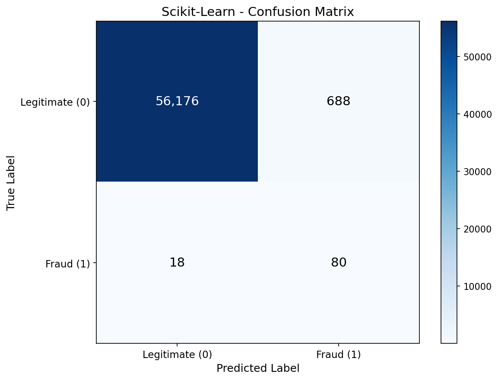
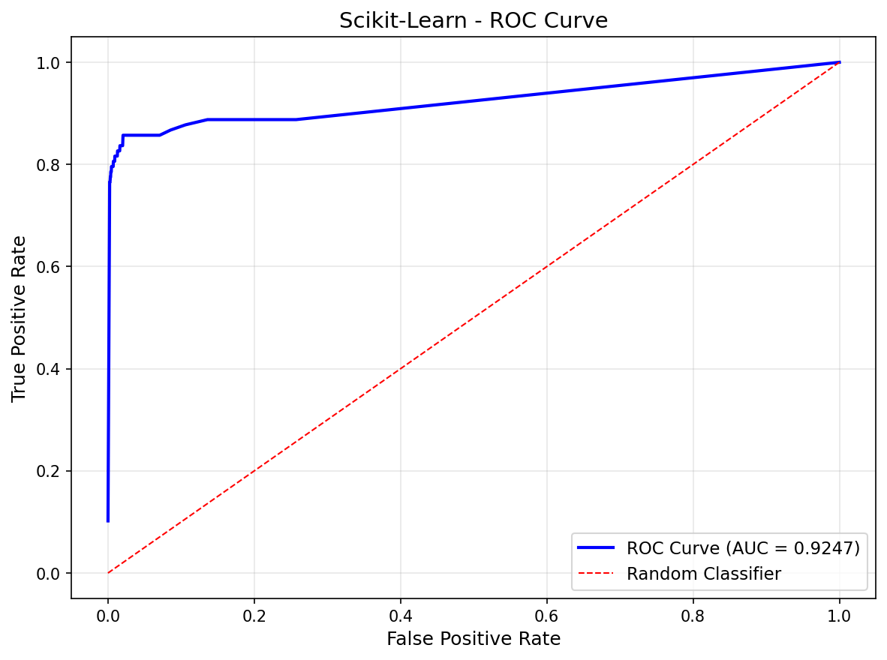
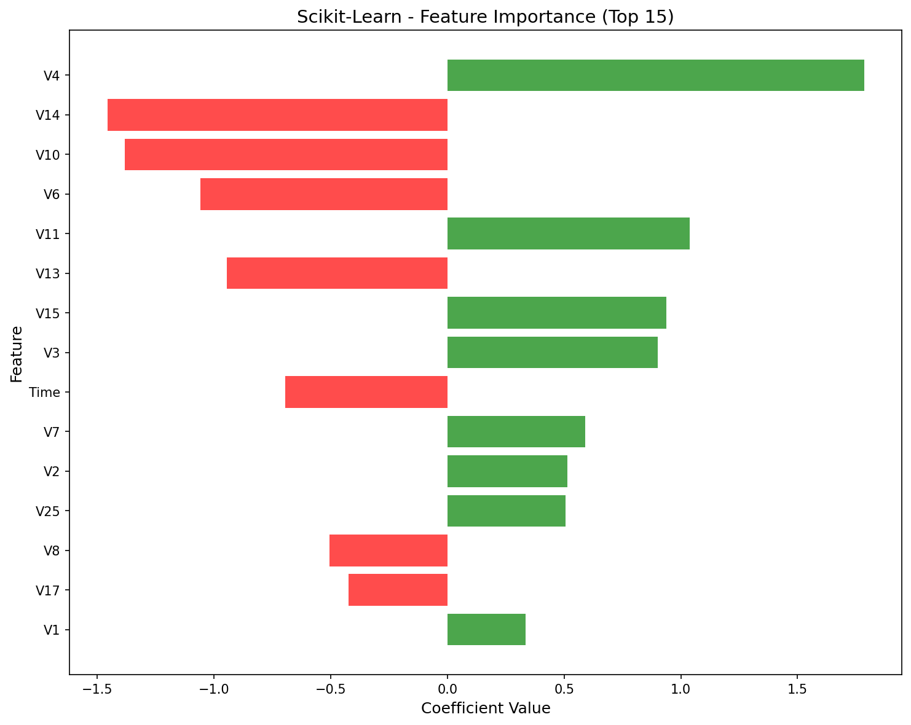

# Scikit-Learn Logistic Regression

Scikit-Learn implementation of logistic regression for fraud detection using the optimized L-BFGS solver.

## Overview

This implementation classifies credit card transactions as legitimate or fraudulent using Scikit-Learn's `LogisticRegression`. The L-BFGS solver (Limited-memory Broyden–Fletcher–Goldfarb–Shanno) is a quasi-Newton optimization method that converges much faster than manual gradient descent.

## Dataset

- **Source**: [Kaggle Credit Card Fraud Detection](https://www.kaggle.com/datasets/mlg-ulb/creditcardfraud)
- **Samples**: 284,807 transactions
- **Features**: 30 (Time, V1-V28 from PCA, Amount)
- **Target**: Class (0 = legitimate, 1 = fraud)
- **Imbalance**: 99.83% legitimate, 0.17% fraud (492 fraud cases)

## Preprocessing: SMOTE + Filtering

To handle extreme class imbalance, we used a multi-step approach:

1. **SMOTE Oversampling**: Generated 3.5x synthetic fraud samples
2. **Tight Filtering**: Removed synthetic samples outside 1.5 std of real fraud distribution
3. **Trim to 50/50**: Randomly sampled to achieve balanced training set

**Result**: 454,902 training samples (50% fraud, 50% legitimate)

Test set preserves original distribution (0.17% fraud) for realistic evaluation.

## Scikit-Learn Approach

### Model Configuration
```python
model = LogisticRegression(
    max_iter=1000,
    solver='lbfgs',
    random_state=113
)
```

### Key Differences from No-Framework
| Aspect | No-Framework | Scikit-Learn |
|--------|--------------|--------------|
| Optimizer | Manual gradient descent | L-BFGS (quasi-Newton) |
| Iterations | 1000 (full dataset each) | 22 (converged early) |
| Code lines | ~50 lines | 3 lines |
| Training time | 18.34 sec | 0.32 sec |

## Results

| Metric | Test Set |
|--------|----------|
| Accuracy | 98.76% |
| Precision | 10.42% |
| Recall | 81.63% |
| F1 Score | 18.48% |
| AUC-ROC | 89.72% |

### Confusion Matrix Breakdown

| | Predicted Legit | Predicted Fraud |
|---|---|---|
| **Actual Legit** | 56,176 (TN) | 688 (FP) |
| **Actual Fraud** | 18 (FN) | 80 (TP) |

**Interpretation**:
- Very similar results to No-Framework — proves both implementations are correct
- Slight differences due to different optimization paths (L-BFGS vs gradient descent)
- High recall (82%) maintained for catching fraud

## Performance

- **Training Time**: 0.32 sec
- **Peak Memory**: 14.38 MB
- **Iterations to converge**: 22

### Comparison to No-Framework

| Metric | No-Framework | Scikit-Learn | Difference |
|--------|--------------|--------------|------------|
| Training Time | 18.34 sec | 0.32 sec | **57x faster** |
| Peak Memory | 27.87 MB | 14.38 MB | **48% less** |
| Recall | 82.65% | 81.63% | ~1% lower |
| AUC-ROC | 90.34% | 89.72% | ~0.6% lower |

## Components Used

- [x] `LogisticRegression` with L-BFGS solver
- [x] `model.fit()` for training
- [x] `model.predict()` for binary predictions
- [x] `model.predict_proba()` for probability outputs
- [x] `model.coef_` for feature weights

## Visualizations

### Confusion Matrix


### ROC Curve


### Feature Importance


## Key Learnings

1. **L-BFGS is dramatically faster** — 57x speedup over manual gradient descent by using second-order optimization (approximates Hessian matrix).

2. **Same results, less code** — 3 lines of Scikit-Learn achieves what took 50+ lines manually, with nearly identical metrics.

3. **Early convergence** — L-BFGS converged in just 22 iterations vs our 1000 gradient descent steps, showing the power of quasi-Newton methods.

4. **Memory efficient** — Scikit-Learn uses 48% less memory despite its abstractions.

5. **Feature coefficients match** — V4 and V14 remain the top predictors, confirming both implementations learned the same patterns.

## Files

```
Scikit-Learn/02-logistic-regression/
├── pipeline.ipynb      # Main implementation notebook
├── README.md           # This file
├── requirements.txt    # Dependencies
└── results/
    ├── confusion_matrix.png
    ├── roc_curve.png
    └── feature_importance.png
```

## How to Run

```bash
cd Scikit-Learn/02-logistic-regression
jupyter notebook pipeline.ipynb
```

**Prerequisites**: Run preprocessing script first:
```bash
cd data-preperation
python preprocess_logistic.py
```

Requires: `numpy`, `matplotlib`, `scikit-learn`
