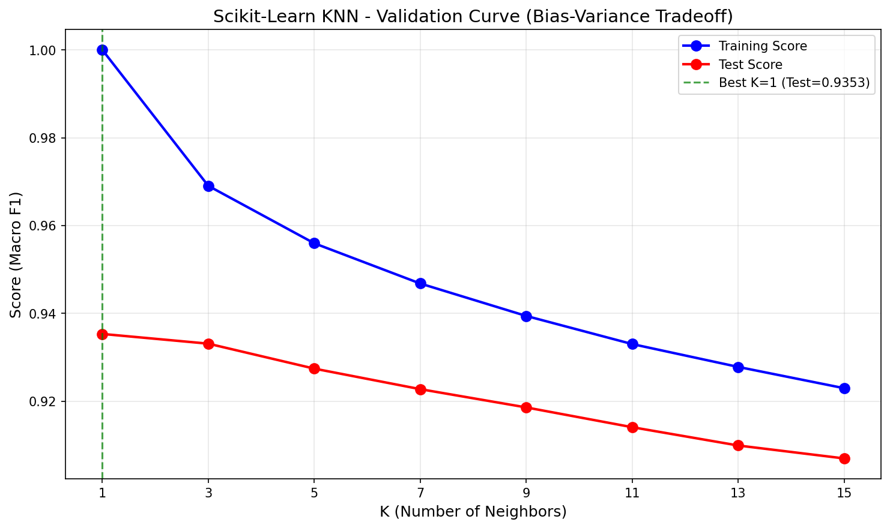
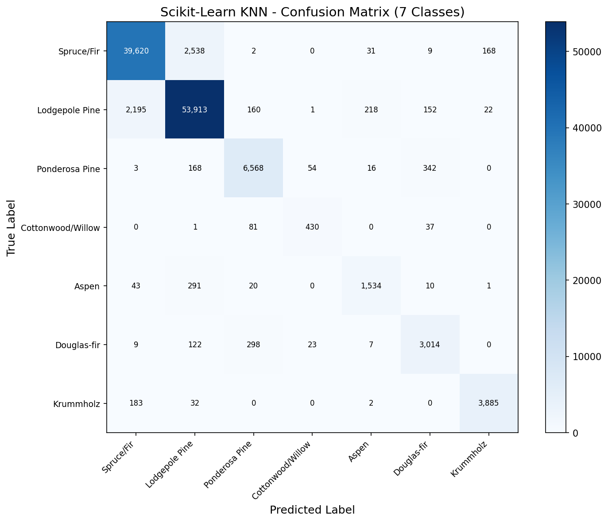
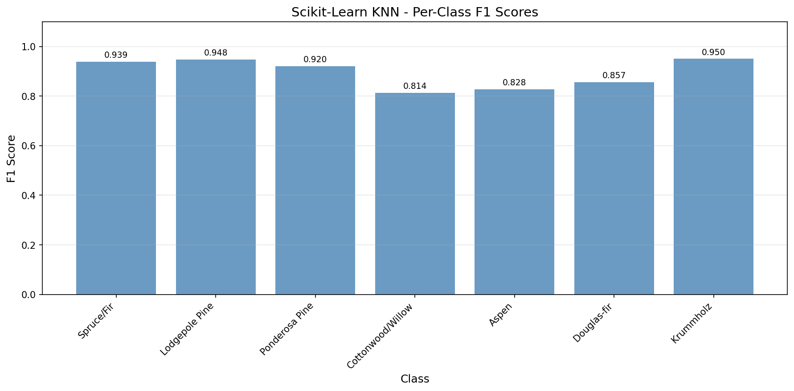

# K-Nearest Neighbors (KNN) - Scikit-Learn

Multi-class classification on the **Covertype (Forest Cover Type)** dataset using Scikit-Learn's `KNeighborsClassifier`.

## Overview

This implementation classifies forest cover types using Scikit-Learn's `KNeighborsClassifier`. KNN is a **lazy learner** - it doesn't learn parameters during training. Instead, it stores the entire training set and computes predictions at inference time by finding the K nearest neighbors and taking a majority vote.

**Trade-off**: Fast to train (just stores data), slow to predict (O(n) per sample).

## Dataset

| Property | Value |
|----------|-------|
| Source | UCI ML Repository / `sklearn.datasets.fetch_covtype` |
| Total Samples | 581,012 |
| Train / Test | 464,809 / 116,203 (80/20 split) |
| Features | 54 (elevation, slope, soil types, wilderness areas) |
| Classes | 7 forest cover types |
| Preprocessing | StandardScaler (fit on train only) |

### Forest Cover Types
1. Spruce/Fir (36.46%)
2. Lodgepole Pine (48.76%)
3. Ponderosa Pine (6.15%)
4. Cottonwood/Willow (0.47%)
5. Aspen (1.63%)
6. Douglas-fir (2.99%)
7. Krummholz (3.53%)

## Scikit-Learn Approach

### Model Configuration
```python
model = KNeighborsClassifier(
    n_neighbors=3,
    metric='manhattan',
    weights='distance',
    algorithm='auto',
    n_jobs=-1
)
```

### Components Used

- `KNeighborsClassifier` with auto algorithm selection (KD-tree/Ball-tree)
- `GridSearchCV` for 5-fold cross-validation hyperparameter tuning
- `n_jobs=-1` for parallel prediction across all CPU cores
- `model.fit()` for storing training data
- `model.predict()` for distance-based classification

## Results & Performance

| Metric | Value |
|--------|-------|
| Test Accuracy | 93.77% |
| Macro F1 Score | 0.8935 |
| Prediction Time | 57 seconds (116K samples) |
| Peak Memory | 19.40 MB
| Predictions/Second | 2,000 |

### Best Hyperparameters (via GridSearchCV)
- `n_neighbors`: 3
- `metric`: manhattan
- `weights`: distance

### Per-Class F1 Scores
| Class | F1 Score |
|-------|----------|
| Spruce/Fir | 0.9386 |
| Lodgepole Pine | 0.9481 |
| Ponderosa Pine | 0.9199 |
| Cottonwood/Willow | 0.8136 |
| Aspen | 0.8276 |
| Douglas-fir | 0.8566 |
| Krummholz | 0.9501 |


## Visualizations

### Validation Curve (K-Value Tuning)


### Confusion Matrix


### Per-Class F1 Scores


## Key Insights

1. **Manhattan distance outperformed Euclidean** — For this high-dimensional dataset (54 features), L1 distance works better than L2.

2. **Distance weighting improved predictions** — Closer neighbors have more influence on the final vote.

3. **Rare classes struggle** — Cottonwood/Willow (0.47% of data) has lowest F1 at 0.81, showing class imbalance affects KNN.

4. **Macro F1 < Accuracy** — Because rare classes drag down the average F1, while accuracy is dominated by common classes.

5. **Prediction is expensive** — 2,000 predictions/second due to computing distances to all 464K training samples.

## Files

```
Scikit-Learn/03-knn/
├── pipeline.ipynb      # Main implementation notebook
├── README.md           # This file
├── requirements.txt    # Dependencies
└── results/
    ├── validation_curve.png
    ├── confusion_matrix.png
    ├── per_class_f1.png
    └── metrics.json
```

## How to Run

```bash
cd Scikit-Learn/03-knn
jupyter notebook pipeline.ipynb
```

**Prerequisites**: Run preprocessing script first:
```bash
cd data-preperation
python preprocess_knn.py
```

Requires: `numpy`, `matplotlib`, `scikit-learn`
