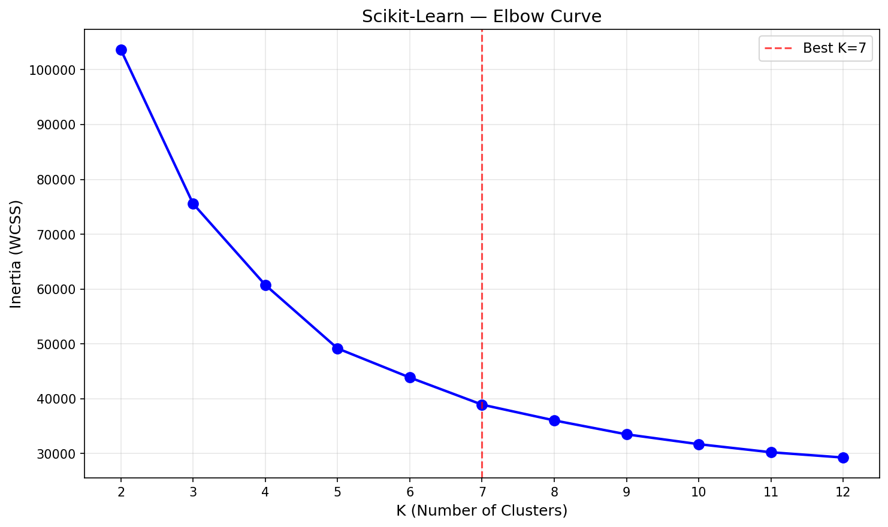
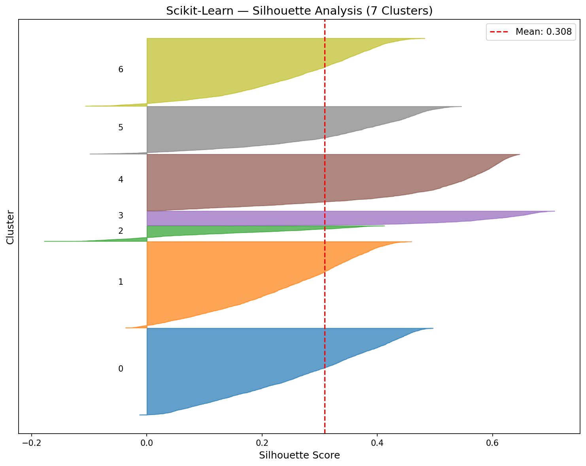
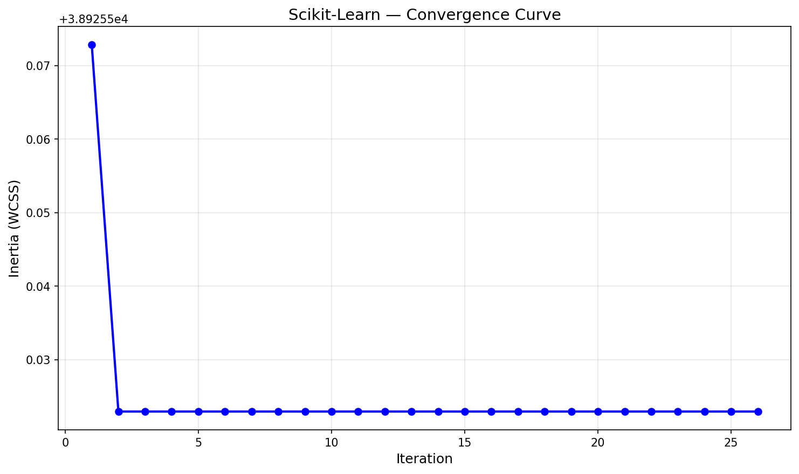

# K-Means Clustering — Scikit-Learn

First unsupervised model in the project. K-Means groups data into K clusters by iteratively refining centroids — no labels used during training. We evaluate using inertia (WCSS), silhouette score, and ARI (comparing clusters to ground truth bean types).

## Overview

This implementation uses Scikit-Learn's `KMeans` with K-Means++ initialization. Unlike supervised models, K-Means discovers structure without labels — evaluation requires different metrics (inertia, silhouette, ARI) and different visualizations (elbow curve, silhouette analysis).

**Scikit-Learn showcase**: MiniBatchKMeans comparison — processes random mini-batches instead of full data, demonstrating a built-in optimization unique to sklearn.

## Dataset

| Property | Value |
|----------|-------|
| Source | UCI ML Repository / `sklearn.datasets.fetch_openml('dry-bean')` |
| Total Samples | 13,611 (13,543 after deduplication) |
| Train / Test | 10,834 / 2,709 (80/20 stratified split) |
| Features | 16 geometric measurements |
| Classes | 7 bean types |
| Preprocessing | StandardScaler (fit on train only) |

### Bean Types
| Class | Percentage |
|-------|-----------|
| DERMASON | 26.0% |
| SIRA | 19.0% |
| SEKER | 15.2% |
| HOROZ | 13.0% |
| BARBUNYA | 10.1% |
| CALI | 12.7% |
| BOMBAY | 3.8% |

## Scikit-Learn Approach

### Model Configuration
```python
model = KMeans(
    n_clusters=7,
    init='k-means++',
    n_init=5,
    max_iter=300,
    tol=1e-4,
    random_state=113
)
```

### Components Used
- `KMeans` with K-Means++ initialization (smart centroid seeding)
- K-tuning loop (K=2 through K=12) with elbow + silhouette analysis
- `MiniBatchKMeans` for speed comparison (batch_size=1024)
- Custom utils for evaluation: `inertia()`, `silhouette_score()`, `adjusted_rand_index()`

## Results

### K-Tuning Decision
- **K=3**: Highest silhouette score (0.4034) — geometric optimum
- **K=7**: Matches actual bean class count — selected for ARI evaluation

### Performance (K=7)

| Metric | Train | Test |
|--------|-------|------|
| Inertia | 38,925.66 | 9,981.06 |
| Silhouette | 0.3083 | 0.3061 |
| ARI | 0.6655 | 0.6686 |

| Runtime Metric | Value |
|---------------|-------|
| Iterations | 26 |
| Training Time | 0.0614s |
| Peak Memory | 2.71 MB |

### MiniBatchKMeans Comparison

| Metric | KMeans | MiniBatchKMeans |
|--------|--------|-----------------|
| Inertia | 38,925.66 | 44,921.94 |
| Test Silhouette | 0.3061 | 0.2596 |
| Test ARI | 0.6686 | 0.5691 |
| Training Time | 0.0614s | 0.1338s |
| Peak Memory | 2.71 MB | 1.39 MB |

MiniBatch used half the memory but was slower and produced lower quality clusters. With only ~10K samples, standard KMeans is fast enough that batching overhead doesn't pay off. MiniBatch shines on 100K+ sample datasets.

## Visualizations

### Elbow Curve (K-Tuning)


### Silhouette Comparison (K-Tuning)


### Silhouette Analysis (K=7)


### Convergence Curve


## Key Insights

1. **K=3 vs K=7 tradeoff** — Silhouette peaks at K=3 (3 natural geometric groupings), but K=7 matches ground truth. K-Means merges geometrically similar bean types when given fewer clusters.

2. **ARI of 0.67 is solid for unsupervised** — K-Means recovers about two-thirds of the true class structure using only geometry, with no label information during training.

3. **Train/test consistency** — Silhouette nearly identical (0.3083 vs 0.3061), proving clusters generalize to unseen data.

4. **MiniBatch not worth it at this scale** — Standard KMeans at 0.06s is already fast. MiniBatch adds overhead for batch sampling that only pays off with much larger datasets.

5. **Fast convergence** — Most inertia reduction happens in first 2-3 iterations out of 26 total.

## Files

```
Scikit-Learn/04-k-means/
├── pipeline.ipynb      # Main implementation notebook
├── README.md           # This file
├── requirements.txt    # Dependencies
└── results/
    ├── elbow_curve.png
    ├── silhouette_comparison.png
    ├── silhouette_analysis.png
    ├── convergence_curve.png
    └── metrics.json
```

## How to Run

```bash
cd Scikit-Learn/04-k-means
jupyter notebook pipeline.ipynb
```

**Prerequisites**: Run preprocessing script first:
```bash
cd data-preperation
python preprocess_kmeans.py
```

Requires: `numpy`, `matplotlib`, `scikit-learn`
