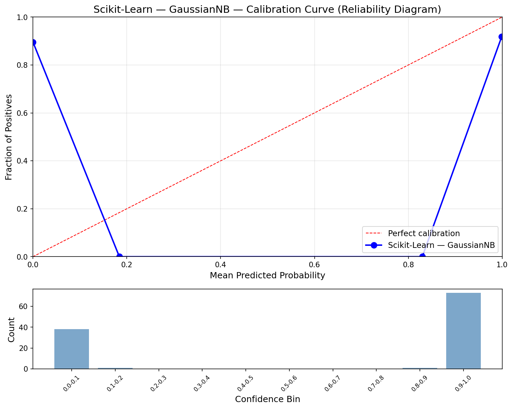
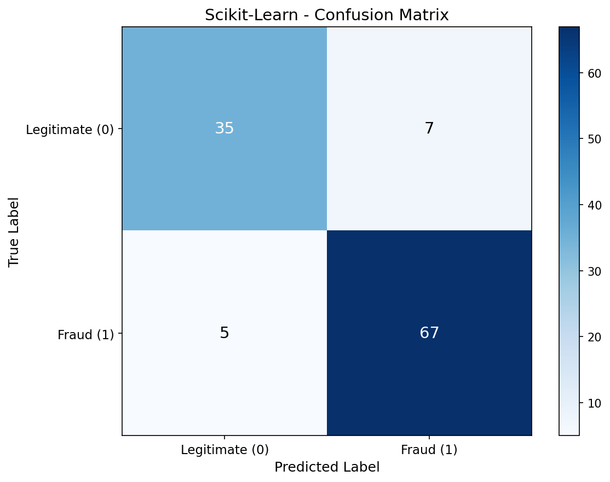
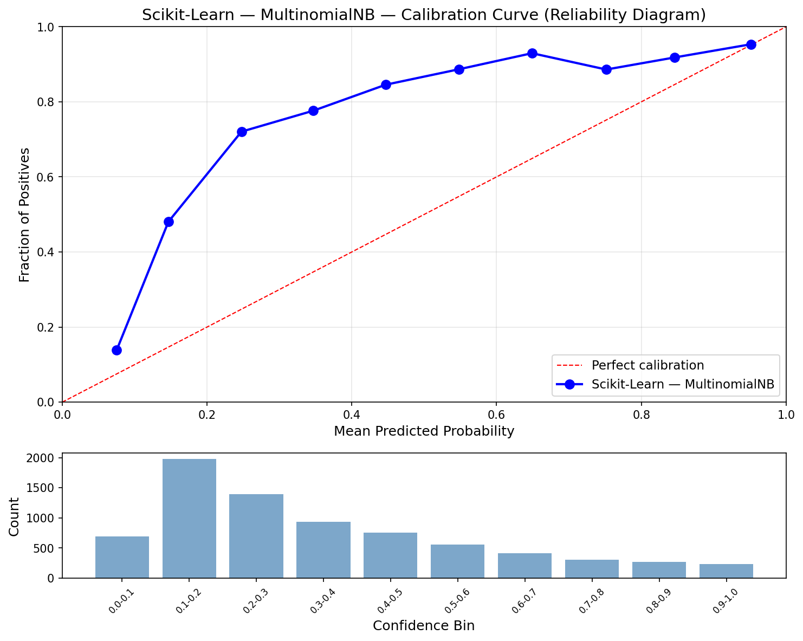
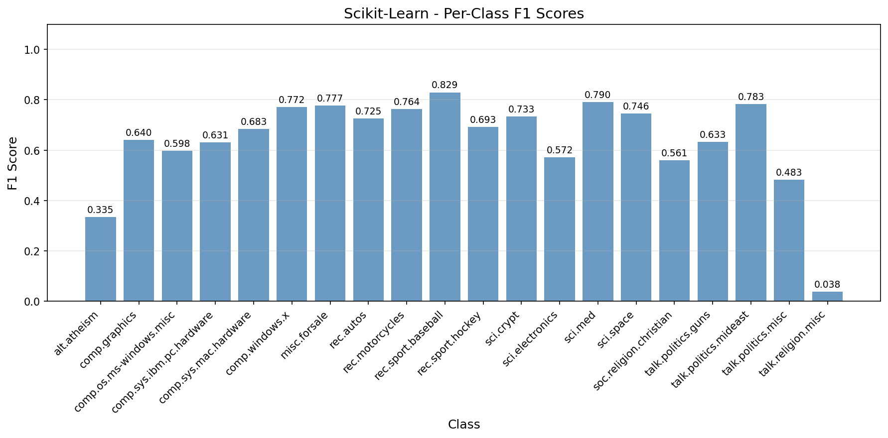
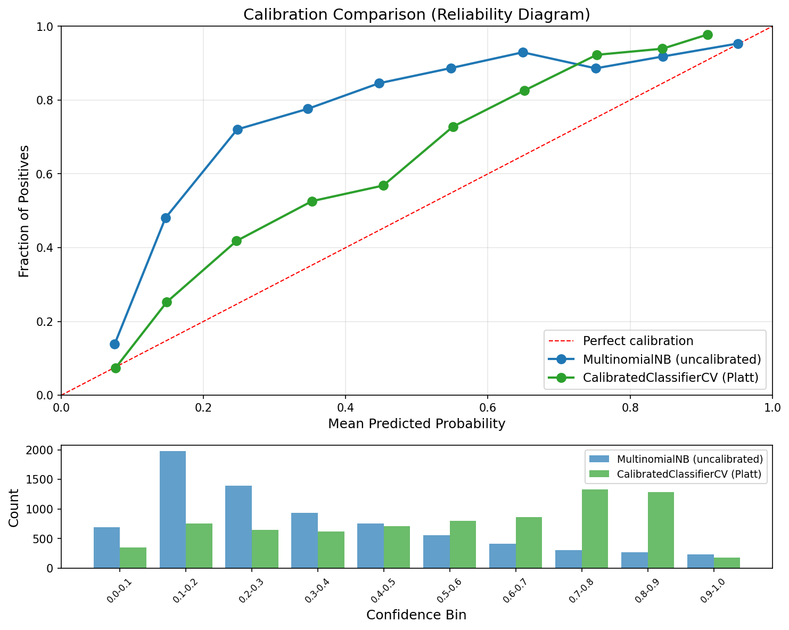

# Scikit-Learn Naive Bayes

Scikit-Learn implementation of Naive Bayes with two variants: GaussianNB for continuous features and MultinomialNB for text classification.

## Overview

Two-part pipeline demonstrating both Naive Bayes variants on their natural domains:
- **Part 1**: GaussianNB on Breast Cancer (binary classification baseline)
- **Part 2**: MultinomialNB on 20 Newsgroups (text classification main event)
- **Showcase**: `CalibratedClassifierCV` with Platt scaling to fix NB's poor probability calibration

## Datasets

### Breast Cancer Wisconsin (GaussianNB)
- **Source**: `sklearn.datasets.load_breast_cancer()`
- **Samples**: 569 (455 train / 114 test, stratified 80/20 split)
- **Features**: 30 continuous (mean, SE, worst of 10 cell nucleus measurements)
- **Target**: Malignant (0) or Benign (1)

### 20 Newsgroups (MultinomialNB)
- **Source**: `sklearn.datasets.fetch_20newsgroups()` with headers/footers/quotes removed
- **Samples**: 18,846 (11,314 train / 7,532 test, published benchmark split)
- **Features**: 10,000 TF-IDF terms (`max_features=10000, sublinear_tf=True`)
- **Target**: 20 newsgroup categories

## Configuration

| Parameter | Value | Purpose |
|-----------|-------|---------|
| `RANDOM_STATE` | 113 | Reproducibility |
| `ALPHA` | 1.0 | Laplace smoothing (prevents zero probabilities) |

## Results

### Part 1: GaussianNB (Breast Cancer)

| Metric | Train | Test |
|--------|-------|------|
| Accuracy | 0.9385 | 0.8947 |
| Precision | 0.9509 | 0.9054 |
| Recall | 0.9509 | 0.9306 |
| F1 | 0.9509 | 0.9178 |
| AUC | 0.9591 | 0.9363 |
| Log Loss | 0.7158 | 1.0123 |
| Brier Score | 0.0608 | 0.0983 |
| ECE | 0.3703 | 0.3590 |

### Part 2: MultinomialNB (20 Newsgroups)

| Metric | Train | Test |
|--------|-------|------|
| Accuracy | 0.8367 | 0.6683 |
| Macro F1 | 0.8194 | 0.6394 |
| Log Loss | 1.1388 | 1.5576 |
| Brier Score | 0.4553 | 0.6008 |
| ECE | 0.4015 | 0.3229 |

### Performance

| Metric | Value |
|--------|-------|
| Training Time | 0.21s |
| Inference Speed | 17.07 us/sample (58,593 samples/sec) |
| Model Size | 3.05 MB |
| Peak Memory | 869.71 MB |

## Showcase: CalibratedClassifierCV (Platt Scaling)

NB produces poorly calibrated probabilities (high ECE). Scikit-Learn's `CalibratedClassifierCV` wraps any classifier and learns a calibration mapping via cross-validation. Platt scaling fits a logistic regression on NB's raw scores to produce well-calibrated probabilities.

### Calibration Improvement

| Metric | Before | After | Change |
|--------|--------|-------|--------|
| ECE | 0.3229 | 0.1367 | -57.7% |
| Log Loss | 1.5576 | 1.2030 | -22.8% |
| Brier Score | 0.6008 | 0.4581 | -23.7% |
| Accuracy | 0.6683 | 0.6795 | +1.7% |
| Macro F1 | 0.6394 | 0.6737 | +5.4% |

All probabilistic metrics improved substantially, and even classification accuracy got a boost.

### Per-Class Performance

Best performing categories:
- `rec.sport.baseball` (F1: 0.829) — distinct vocabulary
- `sci.med` (F1: 0.790) — specialized medical terms
- `talk.politics.mideast` (F1: 0.783) — geopolitical terms

Worst performing categories:
- `talk.religion.misc` (F1: 0.038) — cannibalized by `soc.religion.christian` and `alt.atheism`
- `alt.atheism` (F1: 0.335) — heavy overlap with religion/politics groups
- `talk.politics.misc` (F1: 0.483) — overlaps with other politics categories

## Visualizations

### GaussianNB Calibration Curve


### GaussianNB Confusion Matrix


### MultinomialNB Calibration Curve


### MultinomialNB Confusion Matrix (20 Classes)


### Per-Class F1 Scores


### Calibration Comparison (Before vs After Platt Scaling)


## Key Learnings

1. **NB works surprisingly well on text** — 66.8% accuracy across 20 classes (random baseline: 5%) despite the clearly violated independence assumption

2. **Calibration is NB's Achilles heel** — ECE of 0.32 means predicted probabilities are unreliable. The confusion matrix is decent but the probability estimates are not

3. **Platt scaling is a powerful fix** — `CalibratedClassifierCV` reduced ECE by 58% while also improving accuracy and F1, demonstrating that better-calibrated probabilities lead to better decisions

4. **Related categories confuse NB** — Categories sharing vocabulary (religion groups, comp.* groups) see significant cross-prediction. NB's bag-of-words approach can't distinguish topical nuance

5. **Sklearn makes calibration trivial** — 3 lines of code to wrap, fit, and predict with calibrated probabilities. This is the kind of practical tooling that makes sklearn valuable

## Sklearn Functions Used

| Sklearn Function | Purpose |
|------------------|---------|
| `GaussianNB()` | Gaussian distribution assumption for continuous features |
| `MultinomialNB(alpha=1.0)` | Multinomial distribution with Laplace smoothing for text |
| `CalibratedClassifierCV(method='sigmoid', cv=5)` | Platt scaling post-hoc calibration |
| `model.predict_proba()` | Full probability matrix for probabilistic metrics |

## Files

```
Scikit-Learn/05-naive-bayes/
├── pipeline.ipynb                          # Main implementation (11 cells)
├── README.md                               # This file
├── requirements.txt                        # Dependencies
└── results/
    ├── metrics.json                        # Saved metrics
    ├── gaussian_calibration.png            # GaussianNB reliability diagram
    ├── gaussian_confusion_matrix.png       # GaussianNB confusion matrix
    ├── multinomial_calibration.png         # MultinomialNB reliability diagram
    ├── multinomial_confusion_matrix.png    # 20-class confusion matrix
    ├── multinomial_per_class_f1.png        # Per-class F1 bar chart
    └── calibration_comparison.png          # Before/after Platt scaling overlay
```

## How to Run

```bash
cd Scikit-Learn/05-naive-bayes
jupyter notebook pipeline.ipynb
```

Requires: `numpy`, `matplotlib`, `scikit-learn`
