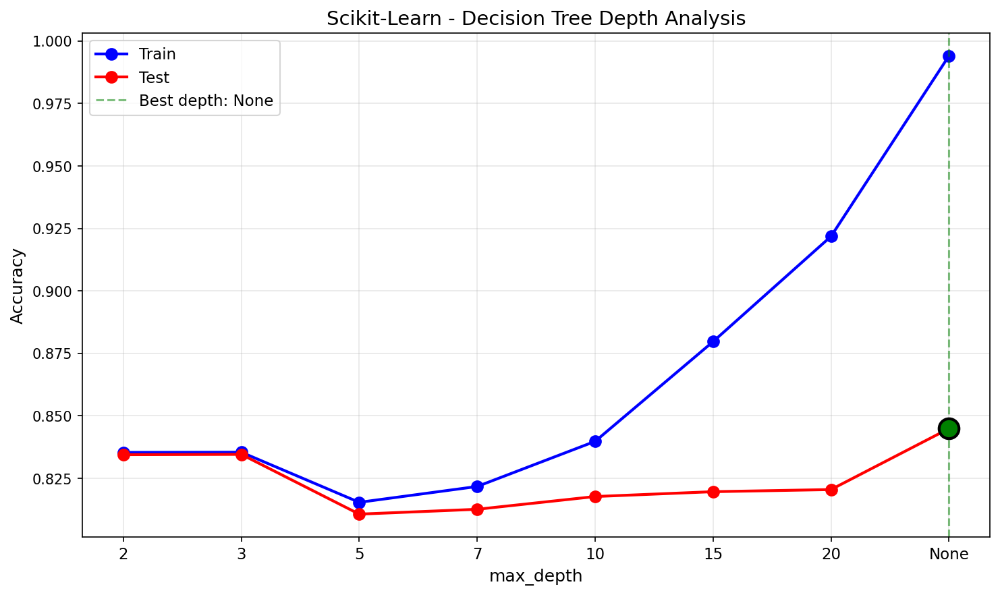
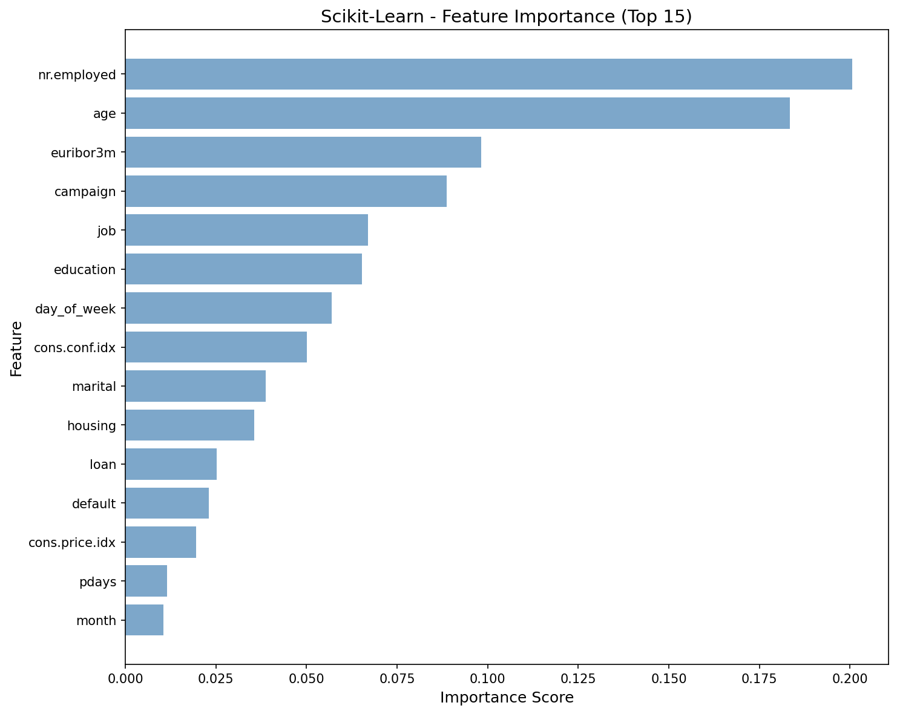
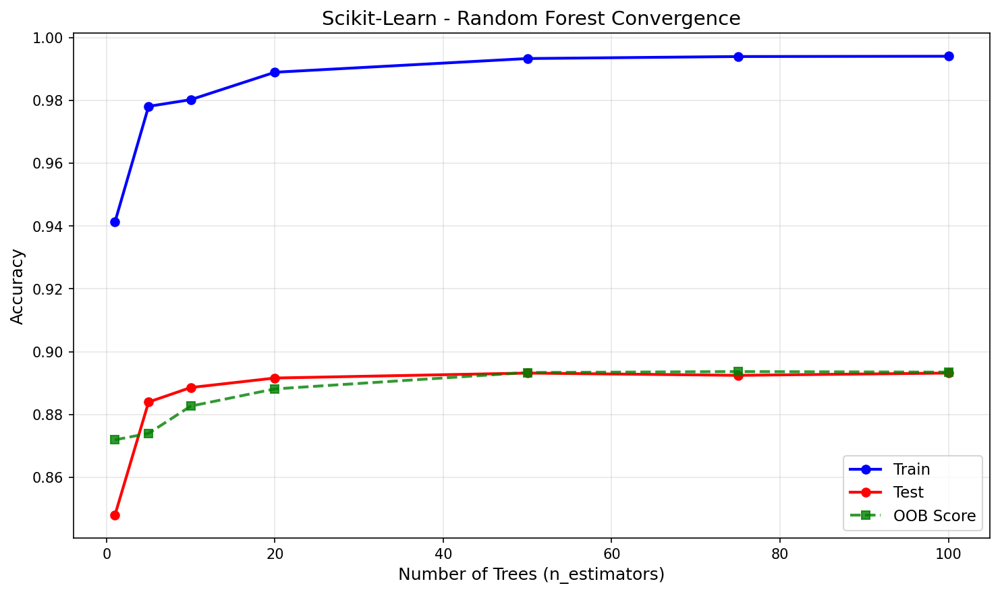
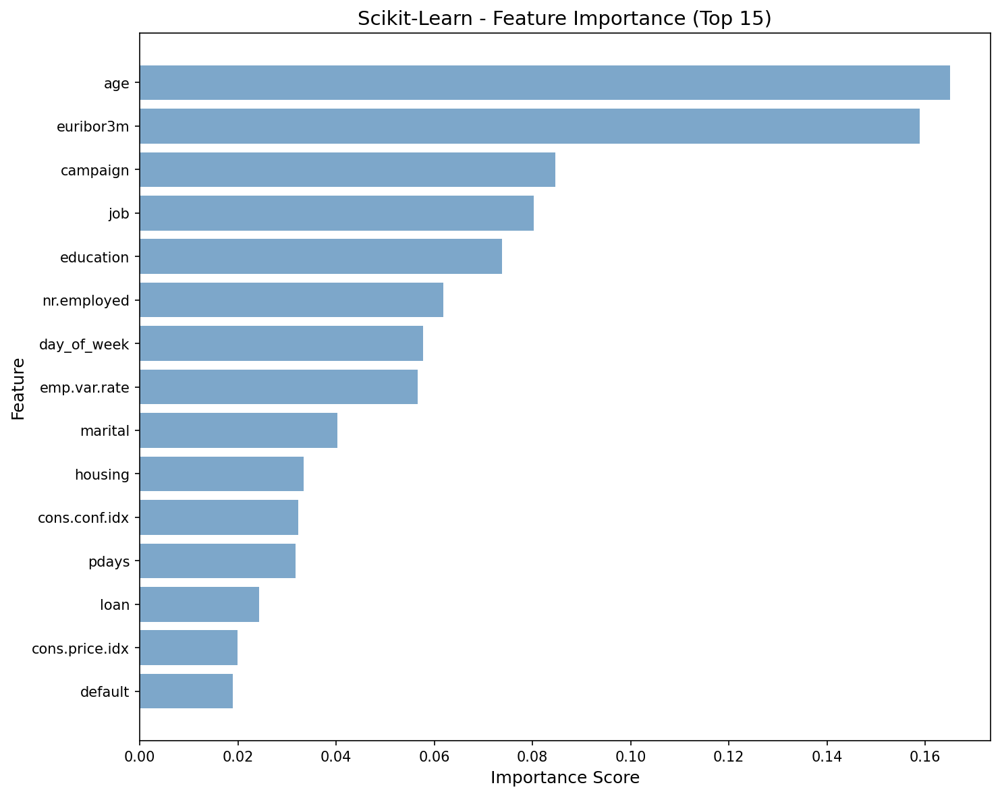

# Decision Trees & Random Forests — Scikit-Learn

First ensemble method in the project. A single Decision Tree memorizes training data (depth 43, 6,211 leaves, 99.4% train accuracy) while a Random Forest of 100 bagged trees fixes overfitting through variance reduction — without any manual pruning. GridSearchCV tunes the final model, and Partial Dependence Plots reveal which economic indicators drive term deposit subscriptions.

## Overview

Two-part pipeline demonstrating the DT overfitting → RF ensemble fix narrative:
- **Part 1**: DecisionTreeClassifier with no depth limit (demonstrates overfitting)
- **Part 2**: RandomForestClassifier with 100 bagged trees (fixes overfitting via variance reduction)
- **Showcase**: GridSearchCV hyperparameter tuning + Partial Dependence Plots for model interpretability
- **MLflow**: Experiment tracking + model export for FastAPI deployment (first model with deployment pipeline)

## Dataset

| Property | Value |
|----------|-------|
| Source | UCI ML Repository (Moro et al., 2014) — Portuguese banking direct marketing |
| Total Samples | 41,188 |
| Train / Test | 32,950 / 8,238 (80/20 stratified split) |
| Features | 19 (10 categorical ordinal-encoded, 9 continuous) |
| Target | Term deposit subscription — no (0) / yes (1) |
| Class Imbalance | 88.7% no / 11.3% yes |
| Dropped | `duration` (data leakage — only known after call ends) |
| Scaling | None (trees are scale-invariant) |
| Encoding | OrdinalEncoder for categoricals (trees split on thresholds) |

## Model Configuration

### Decision Tree (Part 1)
```python
model = DecisionTreeClassifier(
    random_state=113,
    class_weight='balanced'  # adjusts for 88.7/11.3 imbalance
)
```

### Random Forest (Part 2)
```python
model = RandomForestClassifier(
    n_estimators=100,
    max_features='sqrt',     # sqrt(19) ≈ 4 random features per split
    random_state=113,
    class_weight='balanced',
    oob_score=True,          # free validation via out-of-bag samples
    n_jobs=-1                # parallel tree building
)
```

## Results

### Part 1: Decision Tree (Unrestricted — depth 43, 6,211 leaves)

| Metric | Train | Test |
|--------|-------|------|
| Accuracy | 0.9940 | 0.8449 |
| Precision | 0.9496 | 0.3196 |
| Recall | 1.0000 | 0.3341 |
| F1 | 0.9742 | 0.3267 |
| AUC | 0.9999 | 0.6095 |

Train ≈ 100% vs test 84% — classic overfitting. The tree memorizes noise, not patterns.

### Part 2: Random Forest (100 trees, OOB 0.8935)

| Metric | Train | Test |
|--------|-------|------|
| Accuracy | 0.9941 | 0.8932 |
| Precision | 0.9522 | 0.5513 |
| Recall | 0.9981 | 0.2780 |
| F1 | 0.9746 | 0.3696 |
| AUC | 0.9992 | 0.7773 |

RF improves test accuracy (+4.8%), AUC (+16.8%), and precision (+23.2%) over DT.

### GridSearchCV Tuned RF (Best Model — 200 trees)

Best params: `n_estimators=200, max_depth=10, max_features='sqrt', min_samples_split=5`
Best CV F1: 0.4932

| Metric | Value |
|--------|-------|
| Accuracy | 0.8554 |
| Precision | 0.4046 |
| Recall | 0.6013 |
| F1 | 0.4837 |
| AUC | 0.7988 |
| Log Loss | 0.4598 |
| Brier Score | 0.1411 |
| ECE | 0.6164 |

### Performance

| Metric | Value |
|--------|-------|
| Training Time | 21.19s (GridSearchCV: 54 combos x 5 folds = 270 fits) |
| Inference Speed | 3.39 us/sample (302,522 samples/sec) |
| Model Size | 11.50 MB |
| Peak Memory | 62.17 MB |

## Showcase: GridSearchCV + Partial Dependence Plots

### GridSearchCV

Automated hyperparameter tuning over 54 parameter combinations with 5-fold cross-validation (270 total fits). Optimized for F1 score — not accuracy — because accuracy is misleading with 88.7/11.3 class imbalance.

Parameter grid searched:
- `n_estimators`: [50, 100, 200]
- `max_depth`: [10, 20, None]
- `max_features`: ['sqrt', 'log2']
- `min_samples_split`: [2, 5, 10]

### Partial Dependence Plots

Show the marginal effect of the top 3 features on subscription probability:
- **euribor3m**: Lower Euribor 3-month rate → higher subscription probability
- **nr.employed**: Fewer employees → higher subscription probability
- **emp.var.rate**: Lower employment variation → higher subscription probability

All three economic indicators show clear negative relationships — clients subscribe more during economic downturns.

## MLflow Integration

First model in the project with experiment tracking. Logged to `decision-tree-rf` experiment:
- All hyperparameters from GridSearchCV best estimator
- All test metrics (accuracy, F1, AUC, log-loss, Brier, ECE)
- Model artifact with input/output signature
- All visualizations as artifacts
- Model exported as `rf_model.joblib` for FastAPI serving

## Visualizations

### Decision Tree Depth Analysis


### Decision Tree Confusion Matrix


### Decision Tree ROC Curve


### Decision Tree Feature Importance


### Random Forest Convergence


### Random Forest Confusion Matrix


### Random Forest ROC Curve


### Random Forest Feature Importance


### Partial Dependence Plots (Top 3 Features)


## Key Insights

1. **Unrestricted DTs are useless in practice** — depth 43 with 6,211 leaves achieves 99.4% train but only 84.5% test accuracy. The tree memorizes noise, not patterns.

2. **RF fixes DT's variance problem** — bagging + random feature subsets reduce overfitting without manual pruning. Test AUC jumps from 0.61 to 0.78.

3. **F1 > accuracy for imbalanced data** — 85.5% accuracy sounds good but the tuned model's recall of 60.1% means we still miss 40% of subscribers. GridSearchCV with F1 scoring produces a better-balanced model than accuracy would.

4. **Economic indicators dominate** — euribor3m, nr.employed, and emp.var.rate consistently rank as top features across both DT and RF. Client demographics matter less than macroeconomic conditions for predicting term deposit subscriptions.

5. **OOB score is free validation** — RF's 0.894 OOB score closely matches the 0.893 test accuracy, confirming that OOB is a reliable estimate without needing a separate validation set.

## Files

```
Scikit-Learn/06-decision-trees-random-forests/
├── pipeline.ipynb                          # Main implementation
├── README.md                               # This file
├── requirements.txt                        # Dependencies
├── mlflow.db                               # MLflow experiment database
├── mlruns/                                 # MLflow run artifacts
└── results/
    ├── metrics.json                        # Saved metrics
    ├── rf_model.joblib                     # Serialized model for deployment
    ├── dt_depth_analysis.png               # Train vs test across max_depth
    ├── dt_confusion_matrix.png             # DT confusion matrix
    ├── dt_roc_curve.png                    # DT ROC curve
    ├── dt_feature_importance.png           # DT Gini importance
    ├── dt_calibration.png                  # DT calibration curve
    ├── rf_convergence.png                  # Accuracy vs n_estimators
    ├── rf_confusion_matrix.png             # RF confusion matrix
    ├── rf_roc_curve.png                    # RF ROC curve
    ├── rf_feature_importance.png           # RF averaged Gini importance
    ├── rf_calibration.png                  # RF calibration curve
    └── rf_partial_dependence.png           # PDP for top 3 features
```

## How to Run

```bash
cd Scikit-Learn/06-decision-trees-random-forests
jupyter notebook pipeline.ipynb
```

**Prerequisites**: Run preprocessing script first:
```bash
cd data-preperation
python preprocess_decision_tree.py
```

Requires: `numpy`, `matplotlib`, `scikit-learn`, `mlflow`, `joblib`
