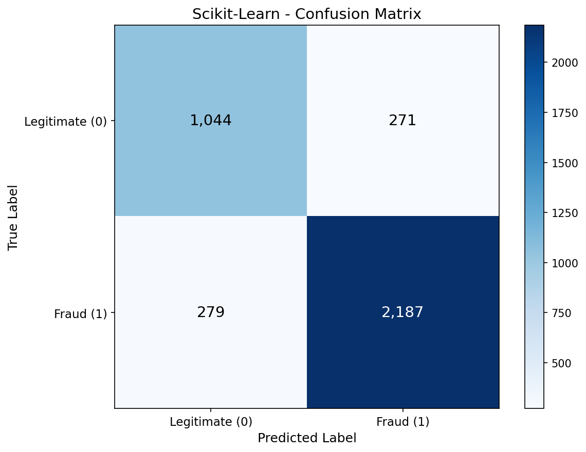
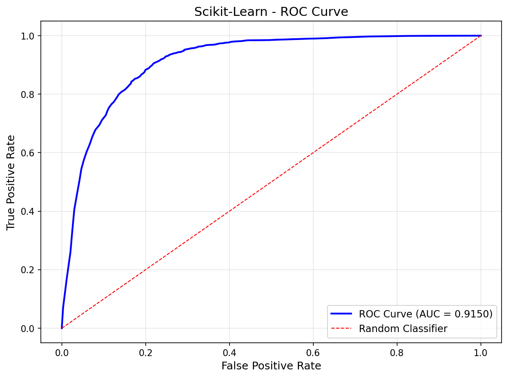
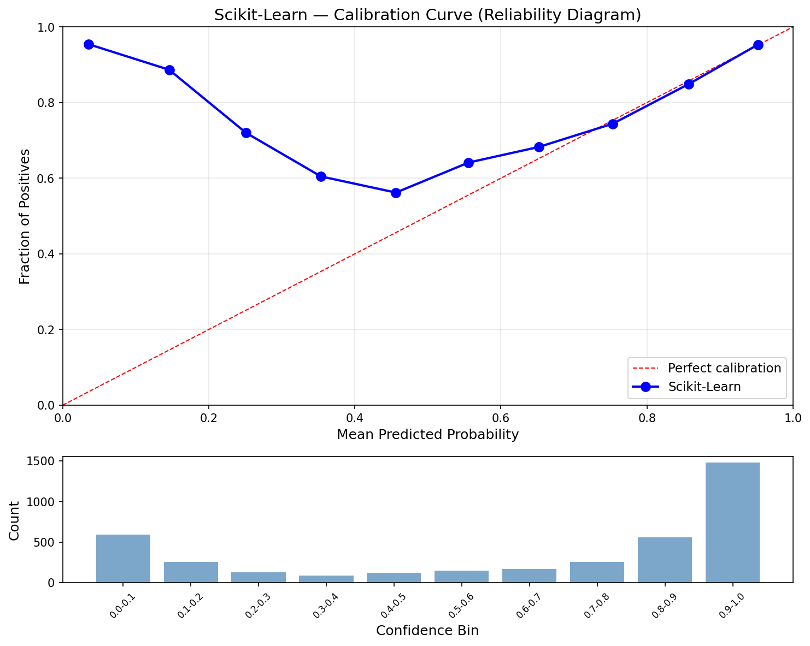
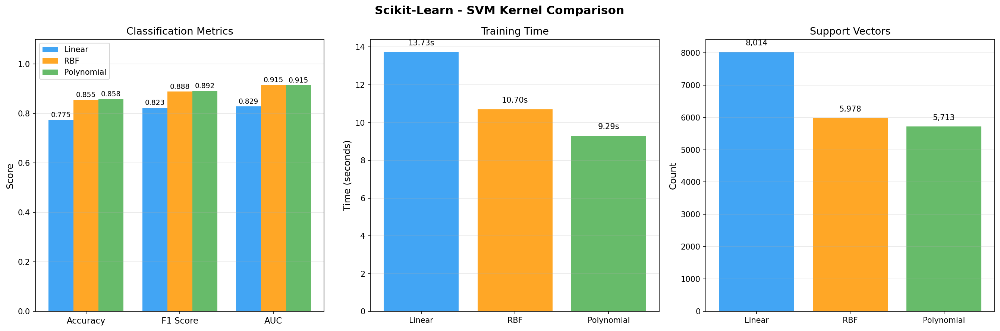

# Support Vector Machine — Scikit-Learn

First kernel-based model in the project. SVC with polynomial kernel achieves 86.1% accuracy on the MAGIC Gamma Telescope dataset — a physics classification task where gamma rays must be distinguished from hadron background noise using telescope image parameters. Kernel comparison showcase demonstrates how linear, RBF, and polynomial kernels handle the non-linear decision boundary differently.

## Overview

- Train SVC with RBF kernel as baseline (sklearn's default)
- Visualizations (confusion matrix, ROC curve, calibration curve)
- **Showcase**: Kernel Comparison — linear vs RBF vs polynomial side-by-side
- Hyperparameter tuning (C sweep on best kernel)
- MLflow tracking + model export for deployment staging
- Inference benchmarks + model size

## Dataset

| Property | Value |
|----------|-------|
| Source | UCI ML Repository — MAGIC Gamma Telescope (Bock et al., 2004) |
| Total Samples | 18,905 (after removing 115 duplicates) |
| Train / Test | 15,124 / 3,781 (80/20 stratified split) |
| Features | 10 (all continuous — telescope image parameters) |
| Target | Gamma ray signal (1) vs hadron background (0) |
| Class Balance | 65.2% gamma / 34.8% hadron |
| Scaling | StandardScaler (fit on train, transform both) |
| Encoding | g → 1, h → 0 |

## Model Configuration

### Baseline (RBF Kernel)
```python
model = SVC(
    kernel='rbf',
    C=1.0,
    gamma='scale',              # 1 / (n_features * X.var())
    class_weight='balanced',    # adjusts C per class for 65/35 imbalance
    probability=True,           # enables Platt scaling for probabilities
    random_state=113
)
```

### Tuned (Polynomial Kernel, C=10)
```python
model = SVC(
    kernel='poly',
    degree=3,
    coef0=1,
    C=10.0,
    class_weight='balanced',
    probability=True,
    random_state=113
)
```

## Results

### Baseline: RBF Kernel (C=1.0)

| Metric | Train | Test |
|--------|-------|------|
| Accuracy | 0.8690 | 0.8545 |
| F1 | 0.8998 | 0.8883 |
| AUC | 0.9247 | 0.9150 |
| Support Vectors | — | 5,978 (39.5%) |

Minimal overfitting — train/test gap is small. Good baseline.

### Tuned: Polynomial Kernel (C=10)

| Metric | Train | Test |
|--------|-------|------|
| Accuracy | 0.8820 | 0.8606 |
| Precision | 0.8999 | 0.8855 |
| Recall | 0.9217 | 0.9031 |
| F1 | 0.9106 | 0.8942 |
| AUC | 0.9363 | 0.9164 |
| Log Loss | 0.3002 | 0.3426 |
| Brier Score | 0.0896 | 0.0994 |
| ECE | 0.2422 | 0.2267 |

### Performance

| Metric | Value |
|--------|-------|
| Training Time | 20.32s |
| Inference Speed | 36.63 µs/sample (27,297 samples/sec) |
| Model Size | 523.4 KB |
| Peak Memory | 1.30 MB |
| Support Vectors | 5,343 (35.3% of training data) |

## Showcase: Kernel Comparison

Trained 3 SVMs with different kernel functions on the same data:

| Kernel | Accuracy | F1 | AUC | Time (s) | Support Vectors |
|--------|----------|-----|-----|----------|-----------------|
| Linear | 0.7747 | 0.8232 | 0.8289 | 13.73 | 8,014 |
| RBF | 0.8545 | 0.8883 | 0.9150 | 10.70 | 5,978 |
| Polynomial | 0.8582 | 0.8920 | 0.9146 | 9.29 | 5,713 |

**Findings**: Linear kernel underperforms — confirms the decision boundary is non-linear. RBF and Polynomial are nearly identical, with Poly having a slight F1 edge. Linear needs the most support vectors (8,014) because it struggles to separate classes with just a hyperplane.

### C Sweep on Polynomial Kernel

| C | Accuracy | F1 | AUC | SVs | Time (s) |
|---|----------|-----|-----|-----|----------|
| 0.01 | 0.8347 | 0.8727 | 0.8985 | 7,752 | 8.59 |
| 0.10 | 0.8490 | 0.8847 | 0.9093 | 6,310 | 7.38 |
| 1.00 | 0.8582 | 0.8920 | 0.9146 | 5,713 | 8.93 |
| 10.00 | 0.8606 | 0.8942 | 0.9164 | 5,343 | 20.46 |
| 100.00 | 0.8606 | 0.8943 | 0.9178 | 5,138 | 124.75 |

C=10 chosen as practical best — nearly identical to C=100 but 6x faster.

## MLflow Integration

Logged to `svm` experiment:
- All hyperparameters (kernel, C, degree, coef0, gamma, class_weight)
- All test metrics (accuracy, F1, AUC, log-loss, Brier, ECE)
- Model artifact with input/output signature
- All visualizations as artifacts
- Model exported as `svm_model.joblib` for deployment staging

## Visualizations

### Confusion Matrix


### ROC Curve


### Calibration Curve


### Kernel Comparison


## Key Insights

1. **Non-linear kernels are essential** — Linear SVM achieves only 77.5% accuracy vs 86% for RBF/Poly. The gamma vs hadron decision boundary is fundamentally non-linear, as expected from the overlapping feature distributions seen in EDA.

2. **RBF vs Poly is a wash** — F1 differs by 0.004 (0.888 vs 0.892). For practical purposes, either kernel works. We chose Poly for the slight edge, but RBF's `gamma='scale'` auto-tuning makes it the safer default.

3. **C has diminishing returns** — Going from C=1 to C=10 improves F1 by 0.002, while C=10 to C=100 improves by 0.0001 but takes 6x longer. The margin is already well-placed at moderate C values.

4. **Support vector count reveals complexity** — Linear needs 8,014 SVs (53%) to approximate a non-linear boundary, while Poly needs only 5,713 (38%). More SVs = model is struggling to find a good boundary.

5. **SVM inference is slower than trees** — 36.6 µs/sample vs 3.4 µs for Random Forest. Each prediction computes kernel distances to 5,343 support vectors. This is the cost of kernel-based methods.

## Hyperparameters for Other Frameworks

The following tuned hyperparameters carry forward to No-Framework, PyTorch, and TensorFlow:
- **Kernel**: Polynomial (degree=3, coef0=1)
- **C**: 10.0
- **gamma**: 'scale' = 1 / (n_features × X.var())

## Files

```
Scikit-Learn/07-svm/
├── pipeline.ipynb                    # Main implementation
├── README.md                         # This file
├── requirements.txt                  # Dependencies
├── mlflow.db                         # MLflow experiment database
├── mlruns/                           # MLflow run artifacts
└── results/
    ├── metrics.json                  # Saved metrics
    ├── svm_model.joblib              # Serialized model for deployment
    ├── confusion_matrix.png          # Confusion matrix
    ├── roc_curve.png                 # ROC curve
    ├── calibration_curve.png         # Calibration curve
    └── kernel_comparison.png         # Kernel comparison showcase
```

## How to Run

```bash
cd Scikit-Learn/07-svm
jupyter notebook pipeline.ipynb
```

**Prerequisites**: Run preprocessing script first:
```bash
cd data-preperation
python preprocess_svm.py
```

Requires: `numpy`, `scikit-learn`, `matplotlib`, `mlflow`, `joblib`
