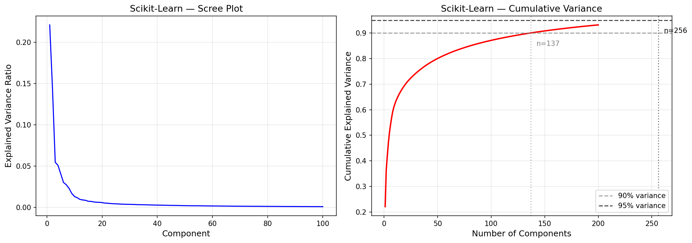
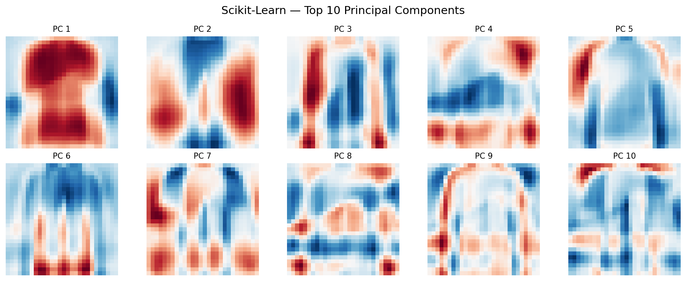
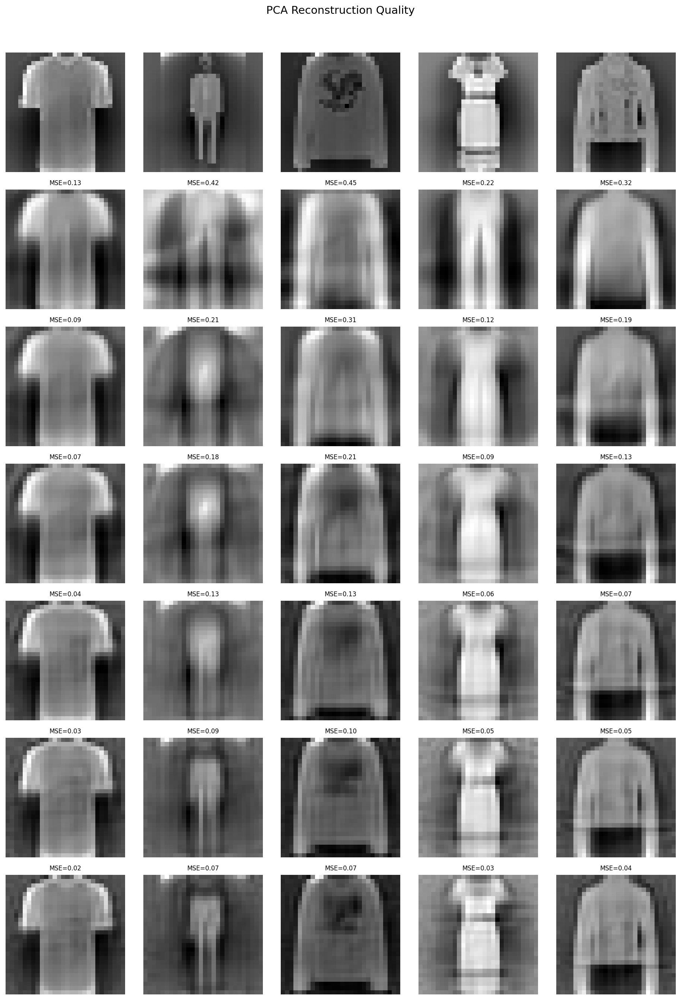
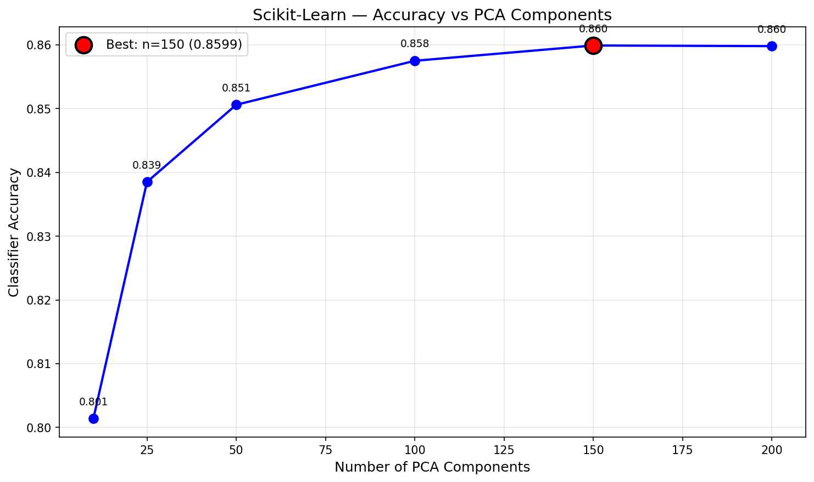

# Principal Component Analysis — Scikit-Learn

First dimensionality reduction model in the project. PCA compresses Fashion-MNIST from 784 features to 150 components while retaining 90.85% of variance — downstream KNN accuracy drops only 1.3% (87.32% → 85.99%). IncrementalPCA showcase demonstrates batch-based SVD for datasets that don't fit in memory.

## Overview

- Fit full PCA (784 components) to analyze eigenvalue spectrum
- Scree plot + cumulative variance to determine optimal component count
- Visualize top principal components as 28×28 images
- Reconstruction quality at [10, 25, 50, 100, 150, 200] components
- Downstream KNN accuracy vs compression level
- **Showcase**: IncrementalPCA — batch-based PCA for out-of-core datasets
- Performance benchmarks + save results

## Dataset

| Property | Value |
|----------|-------|
| Source | Fashion-MNIST (Zalando Research, via TensorFlow/Keras) |
| Total Samples | 70,000 (pre-split by Keras) |
| Train / Test | 60,000 / 10,000 |
| Features | 784 (28×28 grayscale images, flattened) |
| Classes | 10 (T-shirt, Trouser, Pullover, Dress, Coat, Sandal, Shirt, Bag, Sneaker, Ankle boot) |
| Class Balance | Perfectly balanced — 6,000/class (train), 1,000/class (test) |
| Scaling | StandardScaler (fit on train, transform both) |
| Pixel Range | 0–255 (uint8) → standardized (zero mean, unit variance) |

## Model Configuration

### Full PCA (Variance Analysis)
```python
pca_full = PCA(random_state=113)
pca_full.fit(X_train)
# All 784 components → explained_variance_ratio_ for scree plot
```

### Truncated PCA (150 Components)
```python
pca = PCA(n_components=150, random_state=113)
X_train_pca = pca.fit_transform(X_train)
X_test_pca = pca.transform(X_test)
```

## Results

### Variance Retention

| Components | Explained Variance | Compression Ratio |
|------------|-------------------|-------------------|
| 10 | ~28% | 78.4× |
| 25 | ~48% | 31.4× |
| 50 | ~66% | 15.7× |
| 100 | ~82% | 7.8× |
| 150 | 90.85% | 5.2× |
| 200 | ~95% | 3.9× |

### Reconstruction Quality

| Components | MSE |
|------------|-----|
| 10 | 0.7342 |
| 25 | 0.5292 |
| 50 | 0.3501 |
| 100 | 0.1873 |
| 150 | 0.0951 |
| 200 | 0.0528 |

### Downstream KNN Accuracy (K=5)

| Components | Accuracy | Retention vs Full (784) |
|------------|----------|------------------------|
| 10 | 0.7622 | 87.5% |
| 25 | 0.8150 | 93.6% |
| 50 | 0.8476 | 97.3% |
| 100 | 0.8571 | 98.4% |
| 150 | 0.8599 | 98.7% |
| 200 | 0.8599 | 98.7% |

150 components is the sweet spot — same accuracy as 200 with fewer dimensions.

### Performance

| Metric | Value |
|--------|-------|
| Training Time (fit) | 0.19s |
| Inference Speed | 0.52 µs/sample |
| Model Size | 464.2 KB |
| Peak Memory | 11.74 MB |
| Components Matrix | (150, 784) |

## Showcase: IncrementalPCA

Processes data in batches of 5,000 (12 batches for 60K samples) — doesn't need the full dataset in memory at once. Fashion-MNIST fits in RAM easily, but this demonstrates the API for larger datasets.

| Metric | Standard PCA | IncrementalPCA |
|--------|-------------|----------------|
| KNN Accuracy (n=150) | 0.8599 | 0.8609 |
| Explained Variance | 0.9085 | 0.9076 |
| Difference | — | 0.0010 accuracy |

Near-identical results. The small accuracy difference comes from batch-based SVD approximation — mathematically equivalent when all batches are seen, but floating-point order of operations introduces minor variance.

## Visualizations

### Scree Plot


### Principal Components (Top 10)


### Reconstruction Grid


### Component Accuracy Curve


## Key Insights

1. **StandardScaler is non-negotiable for PCA** — without it, PCA just finds the brightest pixels (high variance center) rather than structural patterns. After scaling, variance is equalized so PCA captures spatial structure.

2. **Diminishing returns after 150 components** — going from 150 to 200 adds ~4% more variance but zero improvement in downstream accuracy. The last 634 components are mostly noise.

3. **PCA preserves classification quality** — 85.99% KNN accuracy at 150 components vs 87.32% at full 784. A 5.2× compression ratio for only 1.3% accuracy loss is an excellent trade-off.

4. **IncrementalPCA matches standard PCA** — 0.001 accuracy difference proves batch-based SVD is viable for datasets too large for RAM, with negligible quality loss.

5. **Top components capture garment structure** — PC1 captures overall brightness/silhouette, PC2-5 capture vertical/horizontal edges, later components capture fine details like collars and straps.

## Files

```
Scikit-Learn/08-pca/
├── pipeline.ipynb                    # Main implementation
├── README.md                         # This file
├── requirements.txt                  # Dependencies
└── results/
    ├── metrics.json                  # Saved metrics
    ├── scree_plot.png                # Eigenvalue spectrum
    ├── principal_components.png      # Top 10 PCs as images
    ├── reconstruction_grid.png       # Original vs reconstructed
    └── component_accuracy.png        # KNN accuracy vs n_components
```

## How to Run

```bash
cd Scikit-Learn/08-pca
jupyter notebook pipeline.ipynb
```

**Prerequisites**: Run preprocessing script first:
```bash
cd data-preperation
python preprocess_pca.py
```

Requires: `numpy`, `scikit-learn`, `matplotlib`, `tensorflow` (for dataset loading only)
