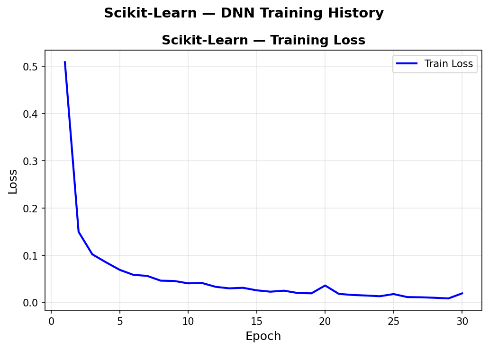
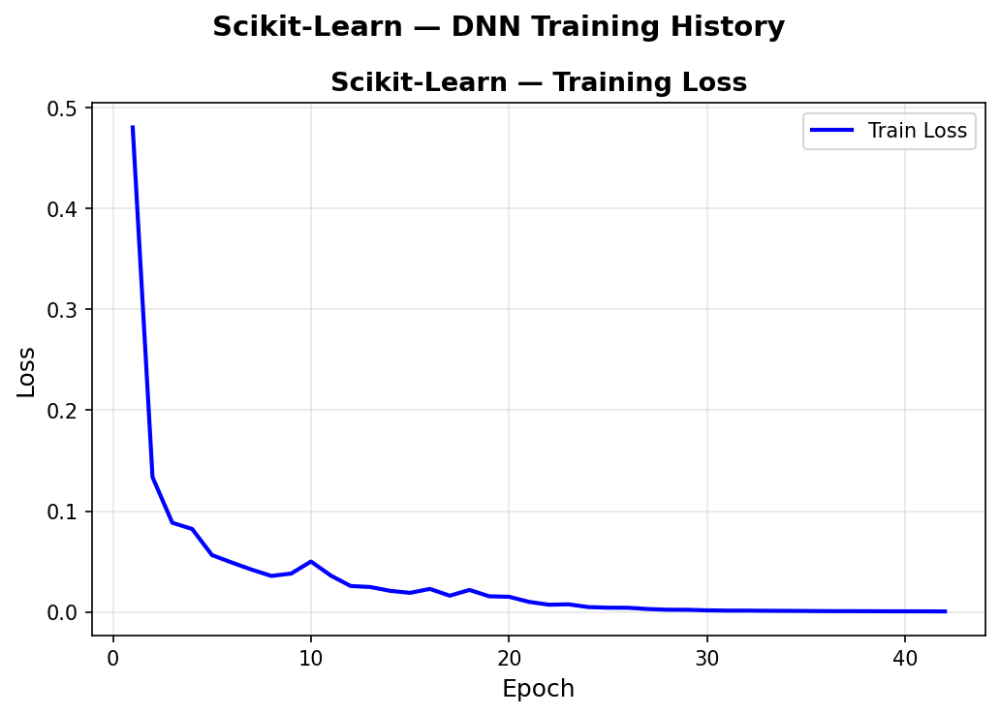
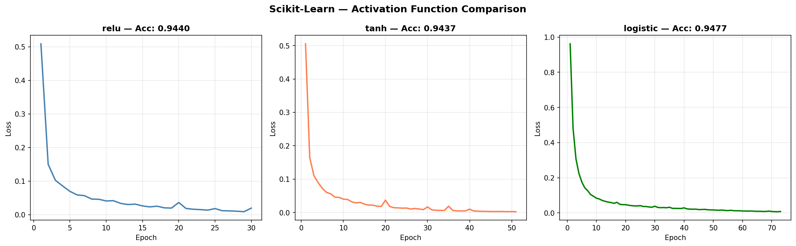
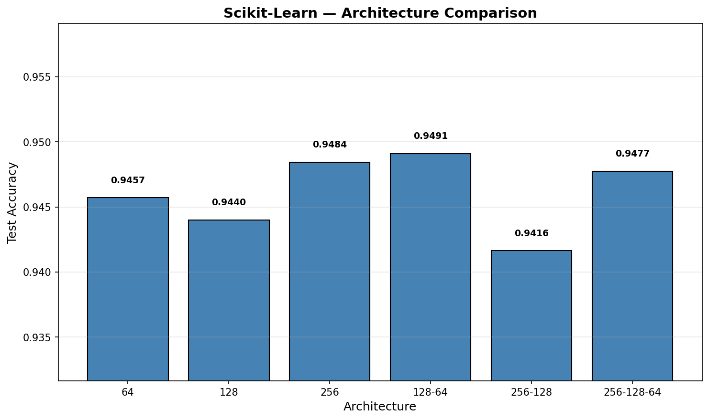
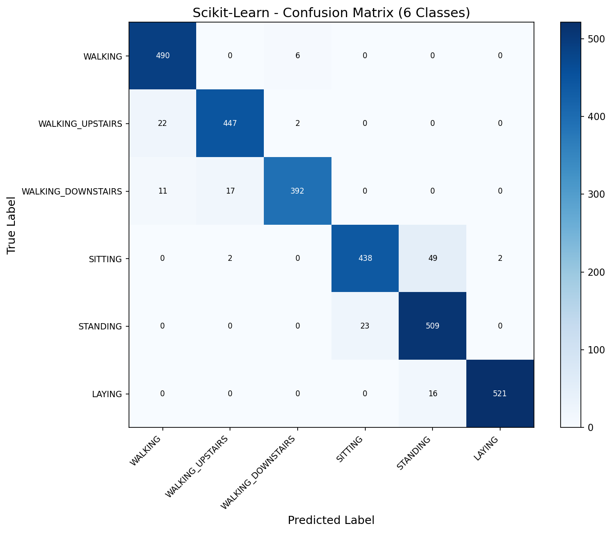
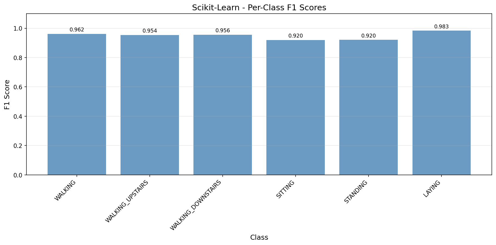

# DNN — Scikit-Learn

First neural network model in the project. MLPClassifier with a 128-64 bottleneck architecture achieves 94.91% accuracy on the UCI HAR dataset — a 6-class human activity recognition task from smartphone sensor data. Activation function comparison showcase demonstrates how ReLU, Tanh, and Logistic handle the same architecture with different convergence behaviors.

## Overview

- Train single-layer baseline DNN (128 neurons) with early stopping
- Visualize training loss + validation accuracy curves
- **Showcase**: Activation Function Comparison — ReLU vs Tanh vs Logistic side-by-side
- Architecture sweep (shallow/wide to deep/narrow)
- Full evaluation on best architecture with confusion matrix + per-class F1
- Performance benchmarks + save results

## Dataset

| Property | Value |
|----------|-------|
| Source | UCI ML Repository — Human Activity Recognition Using Smartphones |
| Total Samples | 10,299 (pre-split by subject) |
| Train / Test | 7,352 / 2,947 (21 / 9 subjects) |
| Features | 561 (sensor-derived, pre-computed from accelerometer + gyroscope) |
| Classes | 6 (WALKING, WALKING_UPSTAIRS, WALKING_DOWNSTAIRS, SITTING, STANDING, LAYING) |
| Class Balance | 1.43x imbalance ratio (acceptable, no weighting needed) |
| Scaling | StandardScaler (fit on train, transform both) |
| Label Encoding | Original 1-6 shifted to 0-5 for softmax |

## Model Configuration

### Baseline (Single Layer)
```python
model = MLPClassifier(
    hidden_layer_sizes=(128,),
    activation='relu',
    solver='adam',
    max_iter=200,
    random_state=113,
    early_stopping=True,
    validation_fraction=0.1,
    n_iter_no_change=15
)
```

### Best (Bottleneck Architecture)
```python
model = MLPClassifier(
    hidden_layer_sizes=(128, 64),
    activation='relu',
    solver='adam',
    max_iter=200,
    random_state=113,
    early_stopping=True,
    validation_fraction=0.1,
    n_iter_no_change=15
)
```

## Results

### Baseline: Single Layer (128)

| Metric | Value |
|--------|-------|
| Accuracy | 0.9440 |
| Macro F1 | 0.9442 |
| Epochs | 30 (early stopped) |
| Training Time | 1.21s |

### Best: Bottleneck (128-64)

| Metric | Value |
|--------|-------|
| Accuracy | 0.9491 |
| Macro F1 | 0.9493 |
| Epochs | 42 (early stopped) |
| Training Time | 2.25s |
| Inference | 0.61 µs/sample |
| Model Size | 314.77 KB |
| Parameters | 80,582 |
| Peak Memory | 19.60 MB |

## Showcase: Activation Function Comparison

Compared ReLU, Tanh, and Logistic (sigmoid) activations on the same 128-neuron architecture:

| Activation | Accuracy | Macro F1 | Epochs | Final Loss |
|-----------|----------|----------|--------|------------|
| ReLU | 0.9440 | 0.9442 | 30 | 0.0196 |
| Tanh | 0.9437 | 0.9440 | 51 | 0.0022 |
| Logistic | 0.9477 | 0.9481 | 73 | 0.0075 |

**Key insight**: All three land within 0.4% accuracy — the dataset is activation-agnostic at this scale. ReLU's non-saturating gradient converges 2.4x faster than logistic.

## Architecture Sweep

| Architecture | Accuracy | Macro F1 | Parameters | Epochs |
|-------------|----------|----------|------------|--------|
| 64 | 0.9457 | 0.9459 | 36,358 | 58 |
| 128 | 0.9440 | 0.9442 | 72,710 | 30 |
| 256 | 0.9484 | 0.9485 | 145,414 | 50 |
| 128-64 | 0.9491 | 0.9493 | 80,582 | 42 |
| 256-128 | 0.9416 | 0.9413 | 177,542 | 31 |
| 256-128-64 | 0.9477 | 0.9471 | 185,414 | 38 |

**Best**: 128-64 (bottleneck shape) — outperforms architectures with 2.3x more parameters.

## Per-Class Performance
- Dynamic activities (WALKING variants): F1 0.954–0.962
- Static activities (SITTING/STANDING): F1 0.920 — main confusion pair
- LAYING: F1 0.983 — gravity direction is a clear signal

## Visualizations

### Training History (Baseline)


### Training History (Best Model — 128-64)


### Activation Function Comparison


### Architecture Sweep


### Confusion Matrix (6 Classes)


### Per-Class F1 Scores


## Key Insights

1. **UCI HAR is well-separated enough that even a single 64-neuron layer hits 94.57%** — the 561 pre-engineered sensor features do most of the heavy lifting. The DNN's job is mostly combining them, not extracting patterns from raw data.

2. **Bottleneck architecture wins** — 128-64 (80K params) outperforms 256-128-64 (185K params). The compression forces the network to learn a compact representation, acting as implicit regularization.

3. **Diminishing returns on architecture complexity** — 36K → 185K parameters only gains 0.34% accuracy. For pre-engineered features, model capacity matters far less than feature quality.

4. **SITTING vs STANDING is the performance ceiling** — 49 SITTING misclassified as STANDING (and 23 vice versa). These activities produce nearly identical sensor signals when the phone is in a pocket. This confusion persists regardless of architecture.

5. **Early stopping consistently triggers at 30–50 epochs** — fast convergence on pre-engineered features. No need for hundreds of epochs or complex learning rate schedules with MLPClassifier.

## Files

```
Scikit-Learn/09-dnn/
├── pipeline.ipynb                    # Main implementation
├── README.md                         # This file
├── requirements.txt                  # Dependencies
└── results/
    ├── dnn.json/metrics.json         # Saved metrics
    ├── training_history_baseline.png # Baseline loss curve
    ├── training_history_best.png     # Best model loss curve
    ├── activation_comparison.png     # ReLU vs Tanh vs Logistic
    ├── architecture_sweep.png        # Width/depth comparison
    ├── confusion_matrix.png          # 6-class confusion matrix
    └── per_class_f1.png              # Per-class F1 scores
```

## How to Run

```bash
cd Scikit-Learn/09-dnn
jupyter notebook pipeline.ipynb
```

**Prerequisites**: Run preprocessing script first:
```bash
cd data-preperation
python preprocess_dnn.py
```

Requires: `numpy`, `scikit-learn`, `matplotlib`
