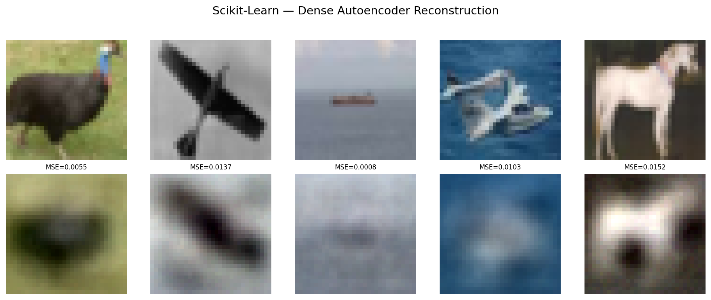
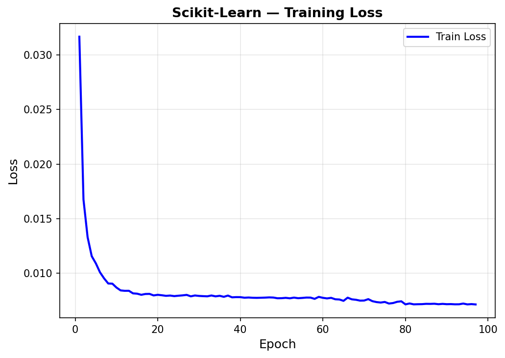
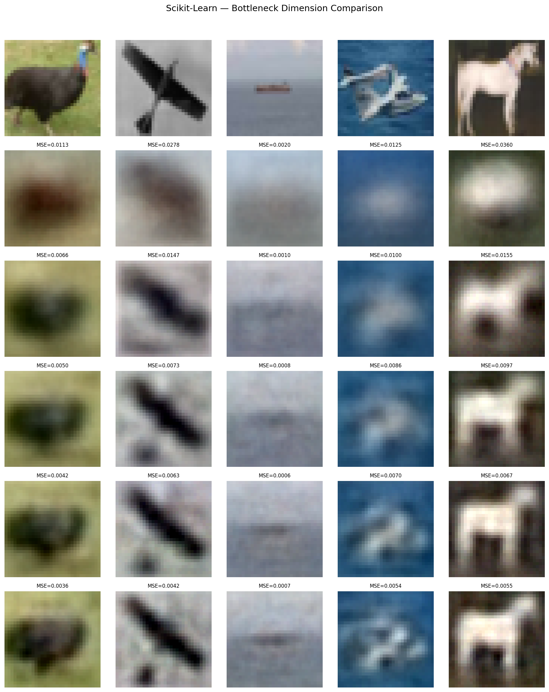
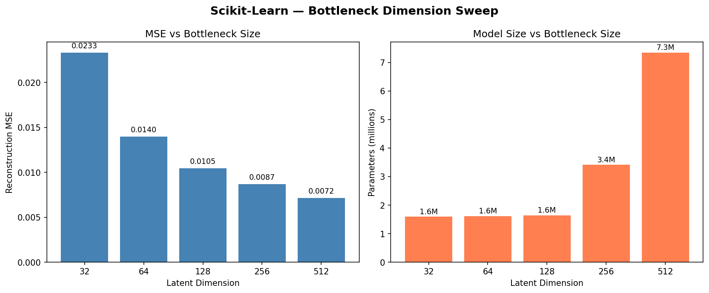
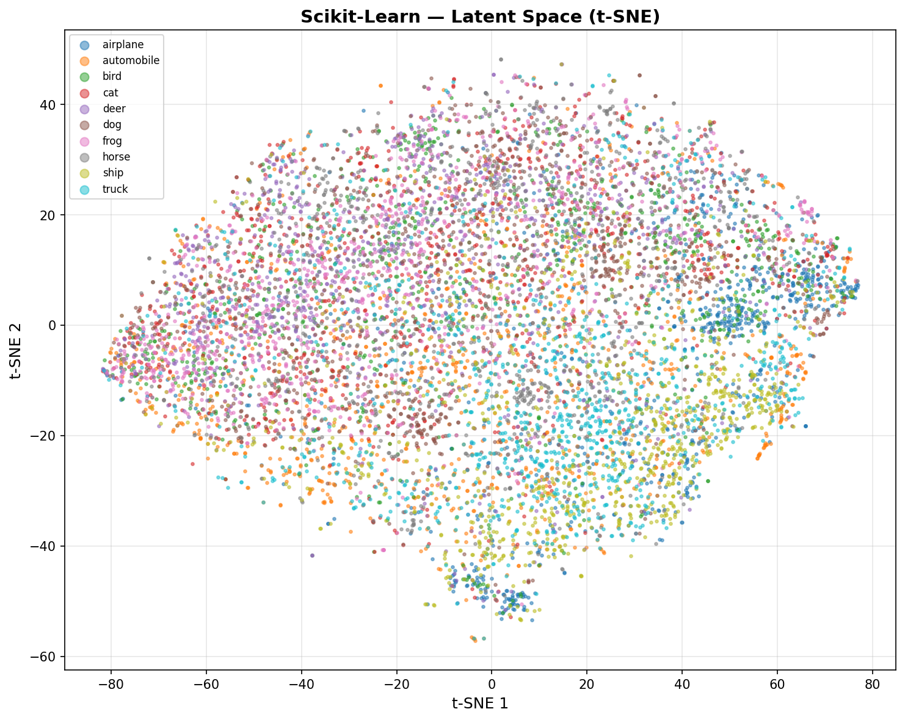
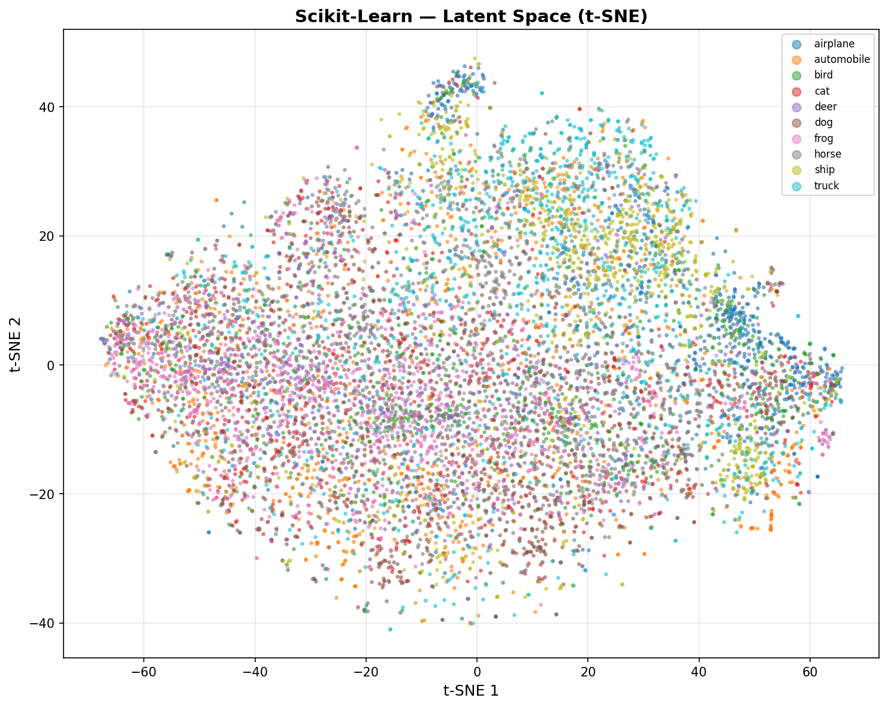

# Autoencoders — Scikit-Learn

Scikit-Learn's LAST model in this project. MLPRegressor repurposed as a dense autoencoder (input = output, hidden layers as bottleneck) achieves 0.0133 reconstruction MSE on CIFAR-10 color images with a 128-dim latent space — 24x compression from 3,072 features. Bottleneck dimension sweep showcase demonstrates how latent size affects reconstruction quality and downstream classification.

## Overview

- Train symmetric dense autoencoder (3072→512→128→512→3072) with early stopping
- Visualize training loss curve + reconstruction quality grid (RGB)
- **Showcase**: Bottleneck Dimension Sweep — 5 latent sizes (32, 64, 128, 256, 512) compared on MSE, params, and training time
- Downstream classification via KNN(K=5) on latent features + t-SNE latent space visualization
- Performance benchmarks + save results

## Dataset

| Property | Value |
|----------|-------|
| Source | CIFAR-10 (via `tensorflow.keras.datasets.cifar10`) |
| Total Samples | 60,000 (50,000 train / 10,000 test) |
| SK Training Subset | 10,000 (full-batch MLPRegressor is slow on 50K) |
| Features | 3,072 (32×32×3 RGB images, flattened) |
| Image Shape | (32, 32, 3) |
| Classes | 10 (airplane, automobile, bird, cat, deer, dog, frog, horse, ship, truck) |
| Class Balance | Perfectly balanced (5,000/class train, 1,000/class test) |
| Normalization | [0, 1] float32 (pixel / 255.0) — NOT StandardScaler |
| Labels | Used for evaluation only, not training (self-supervised) |

## Model Configuration

### Baseline (128-dim Bottleneck)
```python
model = MLPRegressor(
    hidden_layer_sizes=(512, 128, 512),
    activation='relu',
    solver='adam',
    max_iter=200,
    random_state=113,
    early_stopping=True,
    validation_fraction=0.1,
    n_iter_no_change=15
)
# Train: model.fit(X_train, X_train) — input IS the target
```

## Results

### Baseline: Dense AE (3072→512→128→512→3072)

| Metric | Value |
|--------|-------|
| Reconstruction MSE | 0.0133 |
| Reconstruction MAE | 0.0841 |
| Reconstruction RMSE | 0.1153 |
| Epochs | 97 (early stopped) |
| Training Time | 6.6 min (10K subset) |
| Inference | 44.17 µs/sample |
| Model Size | 12.52 MB (weights only) |
| Parameters | 3,281,024 |
| Peak Memory | 351.38 MB |
| Downstream KNN Accuracy | 0.3427 |
| Compression Ratio | 24x (3072 → 128) |

## Showcase: Bottleneck Dimension Sweep

Trained autoencoders at 5 latent dimensions with symmetric architectures: `3072 → max(dim*2, 256) → dim → max(dim*2, 256) → 3072`

| Latent Dim | MSE | Parameters | Epochs | Training Time | Compression |
|-----------|------|-----------|--------|---------------|-------------|
| 32 | 0.023326 | 1,592,864 | 155 | 360.6s | 96x |
| 64 | 0.013981 | 1,609,280 | 143 | 256.2s | 48x |
| 128 | 0.010473 | 1,642,112 | 115 | 224.3s | 24x |
| 256 | 0.008676 | 3,412,224 | 152 | 671.1s | 12x |
| 512 | 0.007150 | 7,345,664 | 137 | 1369.5s | 6x |

**Key insight**: dim=512 wins MSE (0.0072) but dim=128 offers 24x compression at only 46.5% higher MSE. Dims 32–128 share ~1.6M params (hidden layer floor at 256), then params explode at 256/512 due to wider encoder/decoder layers.

## Downstream Classification

Latent features extracted via manual forward pass through `model.coefs_` / `model.intercepts_` (MLPRegressor doesn't expose intermediate activations). KNN(K=5) trained on latent vectors:

| Latent Dim | KNN Accuracy |
|-----------|-------------|
| 128 | 0.3427 |
| 512 | 0.3135 |

**Key insight**: ~34% accuracy (vs 10% random) means the autoencoder learns some class structure, but it's optimized for reconstruction, not classification. Larger latent space preserves more pixel-level detail but doesn't learn more class-separable features.

## Visualizations

### Reconstruction Grid (Baseline)


### Training History (Baseline)


### Bottleneck Dimension Comparison


### MSE vs Model Size


### Latent Space t-SNE (dim=128)


### Latent Space t-SNE (dim=512)


## Key Insights

1. **MLPRegressor works as an autoencoder with zero modification** — set `model.fit(X, X)` and MSE loss is the default. The hidden layer bottleneck forces compression, and early stopping prevents overfitting. SK's simplest regression tool becomes a feature extractor.

2. **Dense autoencoders on color images produce characteristic blurriness** — general shapes and dominant colors are preserved, but fine details and edges are lost. This is the fundamental limitation that convolutional architectures (PT/TF) address.

3. **Diminishing returns on latent dimensionality** — the 128→256 jump gives 21% MSE improvement, while 256→512 gains only 18% at 2x the params and training time. The compression/quality sweet spot is dataset-dependent.

4. **Reconstruction quality ≠ classification quality** — dim=128 has higher MSE but better downstream KNN accuracy than dim=512. Tighter bottlenecks force the network to encode discriminative features rather than pixel-level detail.

5. **SK's full-batch limitation is the training bottleneck** — 385s for 10K samples at 3,072 features. MLPRegressor cannot do mini-batch, making it impractical for the full 50K. PT/TF's DataLoader pattern solves this.

## Files

```
Scikit-Learn/10-autoencoders/
├── pipeline.ipynb                         # Main implementation
├── README.md                              # This file
├── requirements.txt                       # Dependencies
└── results/
    ├── sk_autoencoder_results.json/
    │   └── metrics.json                   # Saved metrics
    ├── reconstruction_baseline.png        # Original vs reconstructed (baseline)
    ├── training_history_baseline.png      # Training loss curve
    ├── reconstruction_sweep.png           # All 5 dims side-by-side
    ├── sweep_comparison.png               # MSE + params bar charts
    ├── latent_space_dim128.png            # t-SNE latent space (128-dim)
    └── latent_space_dim512.png            # t-SNE latent space (512-dim)
```

## How to Run

```bash
cd Scikit-Learn/10-autoencoders
jupyter notebook pipeline.ipynb
```

**Prerequisites**: Run preprocessing script first:
```bash
cd data-preperation
python preprocess_autoencoder.py
```

Requires: `numpy`, `scikit-learn`, `matplotlib`
