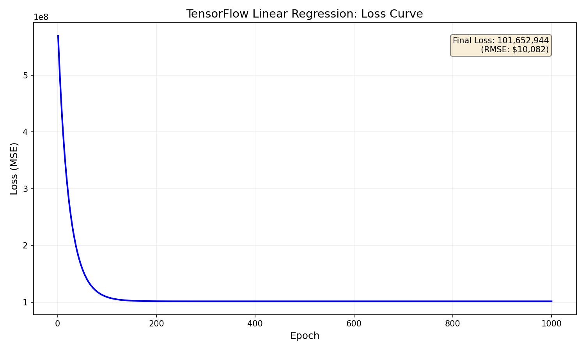
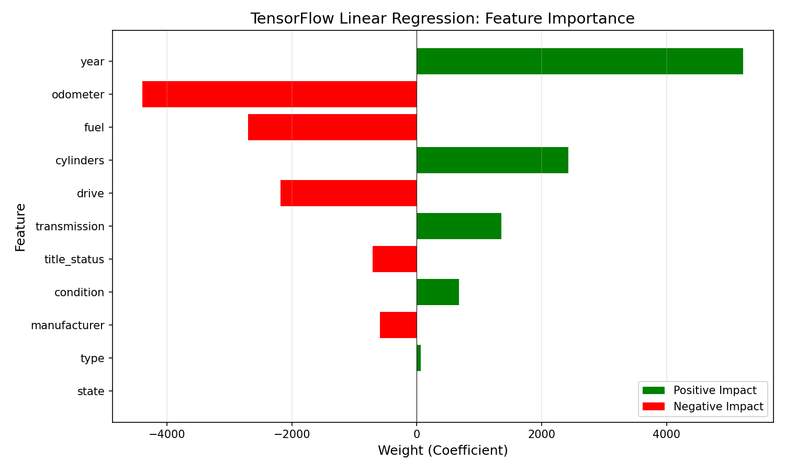

# TensorFlow Linear Regression

TensorFlow/Keras implementation of linear regression using the Sequential API.

## Overview

This implementation predicts used car prices using TensorFlow's Keras API. It serves as a comparison to No-Framework, Scikit-Learn, and PyTorch, demonstrating Keras's high-level abstraction with `model.fit()`.

## Dataset

- **Source**: [Craigslist Cars/Trucks Dataset](https://www.kaggle.com/datasets/austinreese/craigslist-carstrucks-data)
- **Samples**: 100,000 (sampled from ~350k cleaned rows)
- **Features**: 11 (year, manufacturer, condition, cylinders, fuel, odometer, title_status, transmission, drive, type, state)
- **Target**: Price ($500 - $100,000)

## Key Difference: Keras model.fit() vs Manual Training Loop

| Aspect | PyTorch | TensorFlow/Keras |
|--------|---------|------------------|
| Training loop | Manual `for` loop | `model.fit()` (one line) |
| Model definition | `nn.Linear()` | `Sequential + Dense` |
| Gradient handling | `loss.backward()` + `optimizer.step()` | Automatic in `fit()` |
| Verbosity | More explicit control | More abstracted |
| Philosophy | Research-oriented | Production-oriented |

## Results

| Metric | Training Set | Test Set   |
|--------|--------------|------------|
| MSE    | 101,652,944  | 102,115,050 |
| RMSE   | $10,082      | $10,105    |
| R²     | 0.4933       | 0.4986     |

**Interpretation**: The model explains ~50% of price variance with an average prediction error of ~$10,100. No overfitting detected (R² gap: -0.005).

## Framework Comparison

| Metric | No-Framework | Scikit-Learn | PyTorch | TensorFlow |
|--------|--------------|--------------|---------|------------|
| Training Time | 0.3799 sec | 0.0258 sec | 3.4400 sec | 23.5790 sec |
| Peak Memory | 1.96 MB | 14.76 MB | 54.18 MB | 8.37 MB |
| Test RMSE | $10,058 | $10,105 | $10,105 | $10,105 |
| Test R² | 0.4983 | 0.4986 | 0.4986 | 0.4986 |

**Key Insight**: TensorFlow is the slowest for simple linear regression due to Keras `model.fit()` overhead, but uses less memory than PyTorch. The high abstraction level trades performance for simplicity - entire training loop in one line.

## Learned Weights (Feature Importance)

| Feature | Weight | Impact on Price |
|---------|--------|-----------------|
| year | +$5,191 | Newer cars cost more |
| odometer | -$4,482 | Higher mileage = lower price |
| cylinders | +$2,401 | Larger engines cost more |
| fuel | -$2,722 | Diesel costs more than gas |
| drive | -$2,166 | 4WD costs more than FWD/RWD |
| transmission | +$1,271 | Manual slightly higher value |
| title_status | -$772 | Clean titles worth more |
| condition | +$703 | Better condition = higher price |
| manufacturer | -$588 | Brand effect (limited by encoding) |
| type | +$69 | Minimal body type effect |
| state | -$22 | Minimal geographic effect |

## TensorFlow/Keras Functions Used

| TensorFlow/Keras | PyTorch Equivalent | No-Framework Equivalent |
|------------------|-------------------|------------------------|
| `tf.keras.Sequential` | `nn.Module` | Manual model class |
| `tf.keras.layers.Dense(1)` | `nn.Linear(11, 1)` | `weights = np.zeros(11)` + `bias = 0` |
| `model.compile(loss, optimizer)` | Separate `criterion` + `optimizer` | N/A |
| `model.fit(X, y, epochs)` | Manual training loop | Manual training loop |
| `model.predict(X)` | `model(X)` with `torch.no_grad()` | `X @ weights + bias` |
| `history.history['loss']` | Manual `loss_history` list | Manual `cost_history` list |
| `model.get_weights()` | `model.parameters()` | Manual weight variables |

## Visualizations

### Training Convergence



### Predicted vs Actual


### Feature Importance



## Key Learnings

1. **Keras maximizes abstraction** — `model.fit()` replaces the entire training loop (forward pass, loss, backward pass, optimizer step)

2. **Abstraction has overhead** — TensorFlow is slowest for simple tasks, but the simplicity is valuable for rapid prototyping

3. **Lower memory than PyTorch** — TensorFlow's eager execution is more memory-efficient than PyTorch's computational graph

4. **Same results validate implementation** — Matching R² and RMSE across all four frameworks confirms correctness

5. **Framework choice depends on use case** — Scikit-Learn for simple ML, PyTorch for research flexibility, TensorFlow for production deployment

## Files

```text
TensorFlow/01-linear-regression/
├── pipeline.ipynb          # Main implementation
├── README.md               # This file
├── requirements.txt        # Dependencies
└── results/
    ├── cost_curve.png
    ├── predictions_vs_actual.png
    └── feature_importance.png
```

## How to Run

```bash
cd TensorFlow/01-linear-regression
pip install -r requirements.txt
jupyter notebook pipeline.ipynb
```

Requires: `tensorflow`, `numpy`, `pandas`, `matplotlib`, `scikit-learn`
