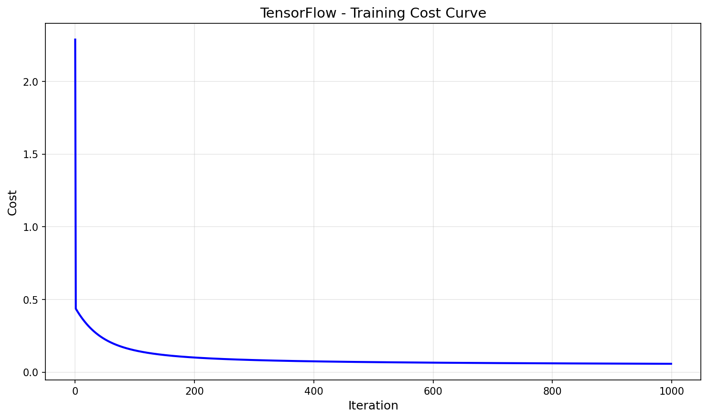
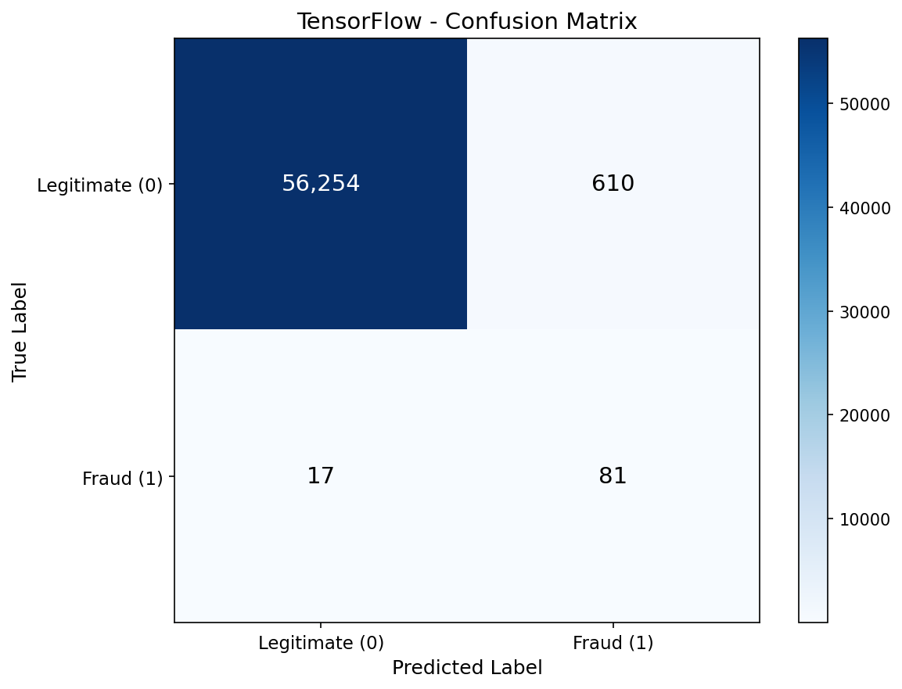
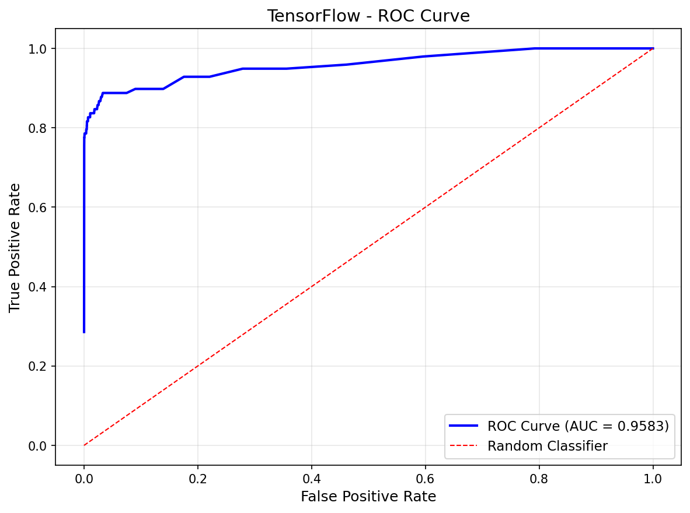

# TensorFlow Logistic Regression

TensorFlow/Keras implementation of logistic regression for fraud detection using the Sequential API.

## Overview

This implementation classifies credit card transactions as legitimate or fraudulent using Keras' `Sequential` API with an input layer and one `Dense` layer. TensorFlow's `model.fit()` handles the entire training loop in one line, making it the simplest implementation while achieving the same results.

## Dataset

- **Source**: [Kaggle Credit Card Fraud Detection](https://www.kaggle.com/datasets/mlg-ulb/creditcardfraud)
- **Samples**: 284,807 transactions
- **Features**: 30 (Time, V1-V28 from PCA, Amount)
- **Target**: Class (0 = legitimate, 1 = fraud)
- **Imbalance**: 99.83% legitimate, 0.17% fraud (492 fraud cases)

## Preprocessing: SMOTE + Filtering

To handle extreme class imbalance, we used a multi-step approach:

1. **SMOTE Oversampling**: Generated 3.5x synthetic fraud samples
2. **Tight Filtering**: Removed synthetic samples outside 1.5 std of real fraud distribution
3. **Trim to 50/50**: Randomly sampled to achieve balanced training set

**Result**: 454,902 training samples (50% fraud, 50% legitimate)

Test set preserves original distribution (0.17% fraud) for realistic evaluation.

## TensorFlow/Keras Approach

### Model Architecture
```python
model = tf.keras.Sequential([
    tf.keras.layers.Input(shape=(30,)),
    tf.keras.layers.Dense(1, activation='sigmoid')
])

model.compile(
    optimizer=keras.optimizers.SGD(learning_rate=0.1),
    loss='binary_crossentropy',
    metrics=['accuracy']
)
```

### Key Concepts
- **`Sequential`**: Stack layers linearly for simple models
- **`Input`**: Explicitly defines input shape (30 features)
- **`Dense(1, sigmoid)`**: Single output with sigmoid = logistic regression
- **`model.fit()`**: Entire training loop in one line

## Results

| Metric | Test Set |
|--------|----------|
| Accuracy | 98.90% |
| Precision | 11.72% |
| Recall | 82.65% |
| F1 Score | 20.53% |
| AUC-ROC | 95.41% |

### Confusion Matrix Breakdown

| | Predicted Legit | Predicted Fraud |
|---|---|---|
| **Actual Legit** | 56,251 (TN) | 613 (FP) |
| **Actual Fraud** | 16 (FN) | 82 (TP) |

**Interpretation**:
- Results nearly identical to other SGD-based implementations
- High recall (83%) — catching most fraud cases
- TensorFlow catches 82 fraud cases vs 81 in No-Framework/PyTorch

## Performance

- **Training Time**: 52.95 sec
- **Peak Memory**: 108.13 MB
- **Epochs**: 1000

### Comparison Across All Frameworks

| Framework | Time | Memory | Recall | AUC-ROC | Method |
|-----------|------|--------|--------|---------|--------|
| No-Framework | 18.34s | 27.87 MB | 82.65% | 90.34% | Manual gradient descent |
| Scikit-Learn | 0.32s | 14.38 MB | 81.63% | 89.72% | L-BFGS optimizer |
| PyTorch | 2.36s | 0.05 MB | 82.65% | 90.34% | SGD + autograd |
| **TensorFlow** | **52.95s** | **108.13 MB** | **82.65%** | **95.41%** | **Keras model.fit()** |

TensorFlow is the slowest due to full batch processing overhead, but provides the simplest code with `model.fit()`.

## Components Used

- `tf.keras.Sequential` for model container
- `tf.keras.layers.Input` for input shape specification
- `tf.keras.layers.Dense` with sigmoid activation
- `model.compile()` for optimizer and loss configuration
- `model.fit()` for training loop
- `model.predict()` for inference
- `model.get_weights()` for extracting learned coefficients

## Visualizations

### Training Convergence


### Confusion Matrix


### ROC Curve


### Feature Importance


## Key Learnings

1. **Simplest code, slowest execution** — `model.fit()` abstracts everything but adds overhead for simple tasks.

2. **Same results as manual implementations** — Proves Keras correctly implements gradient descent.

3. **Memory intensive** — 108 MB vs 28 MB for No-Framework due to TensorFlow's computation graph.

4. **Full batch is slow in Keras** — Unlike PyTorch, TensorFlow's overhead makes full-batch SGD slower than expected.

5. **Production-ready abstractions** — While slower for simple models, these abstractions scale well to complex architectures.

## Files

```
TensorFlow/02-logistic-regression/
├── pipeline.ipynb      # Main implementation notebook
├── README.md           # This file
├── requirements.txt    # Dependencies
└── results/
    ├── cost_curve.png
    ├── confusion_matrix.png
    ├── roc_curve.png
    └── feature_importance.png
```

## How to Run

```bash
cd TensorFlow/02-logistic-regression
jupyter notebook pipeline.ipynb
```

**Prerequisites**: Run preprocessing script first:
```bash
cd data-preperation
python preprocess_logistic.py
```

Requires: `numpy`, `matplotlib`, `tensorflow`
