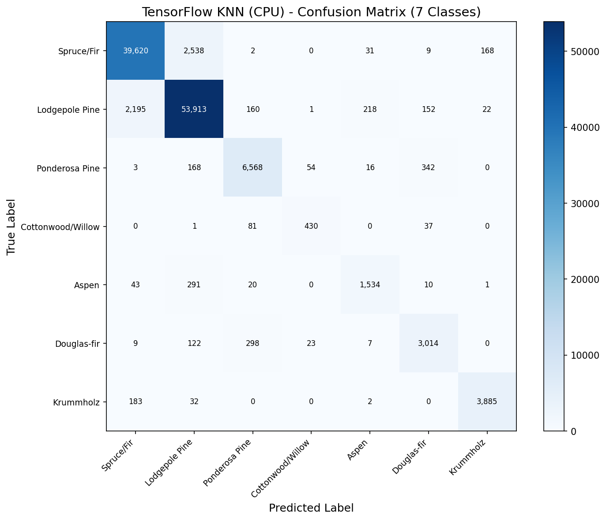

# K-Nearest Neighbors (KNN) - TensorFlow Implementation

Multi-class classification on the **Covertype (Forest Cover Type)** dataset using TensorFlow tensor operations (CPU).

## Overview

This implementation uses TensorFlow's tensor operations for KNN prediction. TensorFlow lacks a `torch.cdist` equivalent, so we use broadcasting with a chunked approach to compute Manhattan distances without exceeding memory limits. Runs on CPU since TensorFlow 2.11+ dropped native Windows GPU support.

**Key Insight**: TensorFlow achieves **identical accuracy** (93.77%) to all other frameworks but is the **slowest for full-dataset KNN** due to CPU-only execution and no optimized pairwise distance kernel. However, the chunked broadcasting approach demonstrates effective memory management with tensor operations.

## Dataset

| Property | Value |
|----------|-------|
| Source | UCI ML Repository / `sklearn.datasets.fetch_covtype` |
| Total Samples | 581,012 |
| Train / Test | 464,809 / 116,203 (80/20 split) |
| Features | 54 (elevation, slope, soil types, wilderness areas) |
| Classes | 7 forest cover types |
| Preprocessing | StandardScaler (fit on train only) |

### Forest Cover Types
1. Spruce/Fir (36.46%)
2. Lodgepole Pine (48.76%)
3. Ponderosa Pine (6.15%)
4. Cottonwood/Willow (0.47%)
5. Aspen (1.63%)
6. Douglas-fir (2.99%)
7. Krummholz (3.53%)

## TensorFlow Approach

### Key Components

```python
# Chunked Manhattan distance (no tf.cdist available)
diff = tf.abs(tf.expand_dims(batch, 1) - tf.expand_dims(chunk, 0))
distances = tf.reduce_sum(diff, axis=2)

# top_k returns LARGEST, so negate to get smallest distances
neg_distances = tf.negative(distances)
k_values, k_indices = tf.math.top_k(neg_distances, k=k)

# Distance-weighted voting using tf.one_hot
class_weights = class_weights + tf.one_hot(class_idx, n_classes) * weights[i, j]
```

### Memory Management (Chunked Distance)

```python
# Broadcasting creates (batch_size, n_train, 54) intermediate tensor
# Full: 500 × 464,809 × 54 × 4 bytes = ~50 GB (will crash!)
# Chunked: 500 × 5,000 × 54 × 4 bytes = ~540 MB per chunk (manageable)
def manhattan_distance_chunked(batch, X_train, train_chunk_size=5000):
    chunks = []
    for c_start in range(0, X_train.shape[0], train_chunk_size):
        chunk = X_train[c_start:c_end]
        diff = tf.abs(tf.expand_dims(batch, 1) - tf.expand_dims(chunk, 0))
        chunks.append(tf.reduce_sum(diff, axis=2))
    return tf.concat(chunks, axis=1)
```

### Why CPU Only?
- TensorFlow 2.11+ dropped native Windows GPU support
- Python 3.12.2 is too new for TensorFlow 2.10 (last version with Windows GPU)
- WSL2 setup planned for neural network models (DNNs, CNNs)

## Results & Performance

| Metric | Value |
|--------|-------|
| Test Accuracy | 93.77% |
| Macro F1 Score | 0.8935 |
| Prediction Time | 1,055 seconds (116K samples) |
| Peak Memory | 24.30 MB |
| Throughput | 110 samples/second |

### Best Hyperparameters (from Scikit-Learn GridSearchCV)
- `n_neighbors`: 3
- `metric`: manhattan
- `weights`: distance

### Per-Class F1 Scores
| Class | F1 Score |
|-------|----------|
| Spruce/Fir | 0.9386 |
| Lodgepole Pine | 0.9481 |
| Ponderosa Pine | 0.9199 |
| Cottonwood/Willow | 0.8136 |
| Aspen | 0.8276 |
| Douglas-fir | 0.8566 |
| Krummholz | 0.9501 |

## Framework Comparison

| Framework | Accuracy | Time | Speed | Notes |
|-----------|----------|------|-------|-------|
| Scikit-Learn | 93.77% | 57s | ~2,000/sec | KD-tree + multi-core CPU |
| PyTorch (GPU) | 93.77% | 100s | ~1,164/sec | torch.cdist + RTX 4090 |
| TensorFlow (CPU) | 93.77% | 1,055s | ~110/sec | Chunked broadcasting, CPU-only |
| No-Framework | 93.79% | ~2 hrs (10%) | ~1.5/sec | Brute force + single-thread |

## Visualizations

### Confusion Matrix


### Per-Class F1 Scores


## Key Insights

1. **Identical accuracy across all 4 frameworks** — 93.77% proves the algorithm is implementation-agnostic; framework choice affects speed, not correctness.

2. **No tf.cdist equivalent** — TensorFlow's biggest limitation for KNN. Broadcasting creates a massive 3D intermediate tensor requiring chunking to avoid OOM.

3. **Chunking is essential** — Without chunking, a single batch would require ~50-200 GB. Chunking along the training axis keeps peak memory at ~540 MB per chunk.

4. **CPU bottleneck, not algorithm** — TensorFlow is ~10x slower than PyTorch GPU purely due to running on CPU. The tensor operations are equivalent.

5. **TensorFlow shines elsewhere** — KNN is not TensorFlow's strength. Its value emerges with neural networks where Keras, tf.data pipelines, and TensorBoard provide significant advantages.

## Why Is TensorFlow Slower Than Scikit-Learn?

| Factor | TensorFlow | Scikit-Learn |
|--------|------------|--------------|
| Distance algorithm | Brute force O(n) | KD-tree O(log n) |
| Execution | CPU tensor ops | Optimized C++ |
| Distance kernel | Broadcasting (3D intermediate) | Dedicated distance function |
| Parallelization | Limited on CPU | n_jobs=-1 (all cores) |
| Windows GPU | Not available (TF 2.11+) | N/A (CPU-only anyway) |

## Files

```
TensorFlow/03-knn/
├── pipeline.ipynb      # Main implementation notebook
├── README.md           # This file
├── requirements.txt    # Dependencies
└── results/
    ├── confusion_matrix.png
    ├── per_class_f1.png
    └── metrics.json
```

## How to Run

```bash
cd TensorFlow/03-knn
jupyter notebook pipeline.ipynb
```

**Prerequisites**: Run preprocessing script first:
```bash
cd data-preperation
python preprocess_knn.py
```

**Note**: Prediction takes ~18 minutes on CPU. TensorFlow 2.11+ does not support GPU on native Windows.

Requires: `numpy`, `matplotlib`, `tensorflow`
