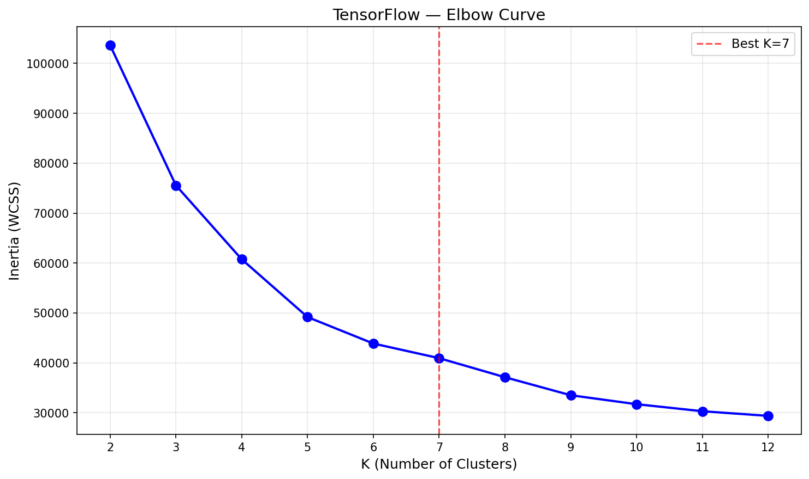
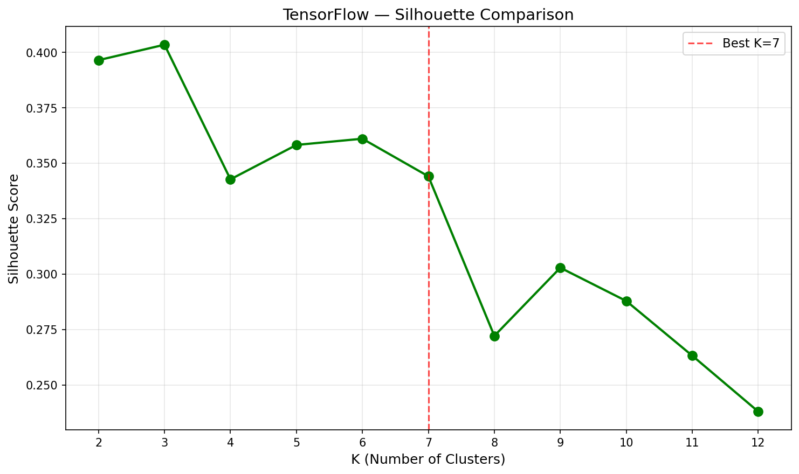
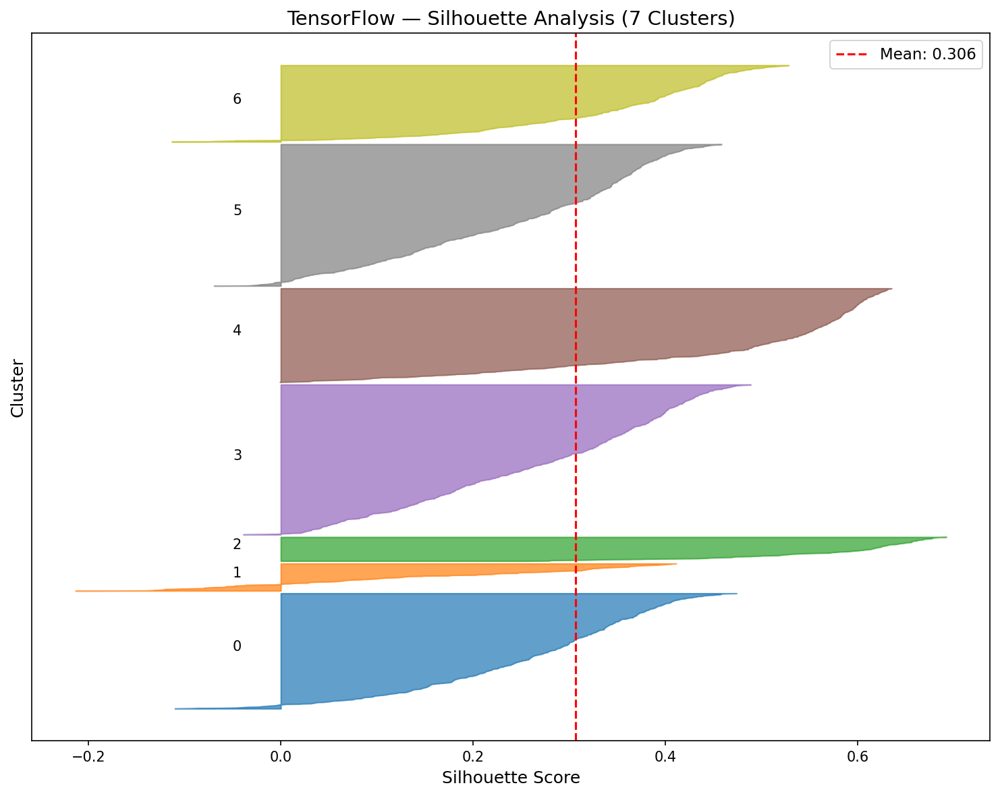
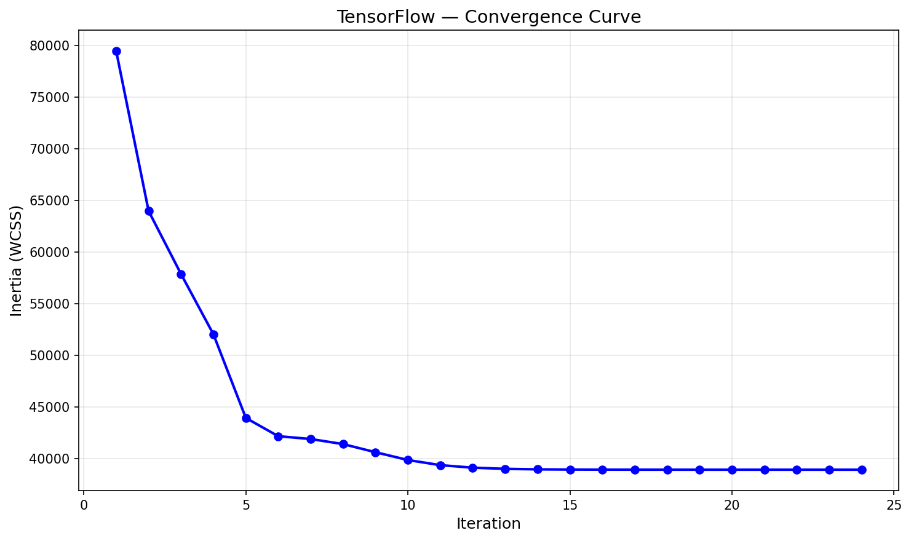

# K-Means Clustering — TensorFlow (CPU)

CPU-based K-Means using TensorFlow tensor operations. Same Lloyd's algorithm as all other frameworks, but using `tf.expand_dims` broadcasting for distances, `tf.random.categorical` for K-Means++ initialization, and `tf.TensorArray` for immutable tensor construction.

## Overview

This implementation uses TensorFlow's CPU tensor operations for K-Means clustering. Like the KNN implementation, TensorFlow 2.11+ dropped native Windows GPU support, so all operations run on CPU. TensorFlow's immutable tensor design requires `tf.TensorArray` for building centroids incrementally, and `tf.random.categorical` takes log-probabilities rather than raw weights for K-Means++ sampling.

**Key Insight**: TensorFlow achieves **identical metrics** to all other frameworks (ARI 0.6684, Silhouette 0.3064) but is the **slowest** at 2.01s — roughly 33x slower than Scikit-Learn and 2x slower than No-Framework. CPU-only execution and TensorFlow's eager mode overhead explain the gap.

## Dataset

| Property | Value |
|----------|-------|
| Source | UCI ML Repository / `sklearn.datasets.fetch_openml('dry-bean')` |
| Total Samples | 13,611 (13,543 after deduplication) |
| Train / Test | 10,834 / 2,709 (80/20 stratified split) |
| Features | 16 geometric measurements |
| Classes | 7 bean types |
| Preprocessing | StandardScaler (fit on train only) |

### Bean Types
| Class | Percentage |
|-------|-----------|
| DERMASON | 26.0% |
| SIRA | 19.0% |
| SEKER | 15.2% |
| HOROZ | 13.0% |
| BARBUNYA | 10.1% |
| CALI | 12.7% |
| BOMBAY | 3.8% |

## TensorFlow Approach

### Key Components
```python
# Broadcasting for pairwise Euclidean distance (no tf.cdist)
diff = tf.expand_dims(X, 1) - tf.expand_dims(centroids, 0)
sq_distances = tf.reduce_sum(diff ** 2, axis=2)
labels = tf.argmin(sq_distances, axis=1)

# K-Means++ weighted sampling (takes log-probabilities)
log_probs = tf.math.log(min_distances / tf.reduce_sum(min_distances))
idx = tf.random.categorical(tf.expand_dims(log_probs, 0), 1, seed=seed)

# Immutable tensor construction with TensorArray
centroids_ta = tf.TensorArray(dtype=tf.float32, size=k, dynamic_size=False)
centroids_ta = centroids_ta.write(i, tf.reduce_mean(tf.boolean_mask(X, mask), axis=0))
centroids = centroids_ta.stack()
```

### TF-Specific Design Decisions
- **No showcases** — `tf.function`, `tf.vectorized_map`, and `tf.while_loop` were evaluated and rejected. K-Means is too simple to benefit from graph compilation or vectorized mapping. TensorFlow's strengths emerge with neural networks (Keras, tf.data, TensorBoard).
- **`tf.TensorArray`** — TensorFlow tensors are immutable, so building centroids requires TensorArray (unlike PyTorch/NumPy where you can index-assign).
- **`tf.random.categorical`** — Takes log-probabilities, not raw weights like `torch.multinomial`. Requires `tf.math.log()` conversion.
- **`tf.random.Generator`** — Stateful RNG for reproducible results across runs.

### Why CPU Only?
- TensorFlow 2.11+ dropped native Windows GPU support
- Python 3.12.2 is too new for TensorFlow 2.10 (last version with Windows GPU)
- WSL2 setup planned for neural network models (DNNs, CNNs)

## Results

### K-Tuning Decision
- **K=3**: Highest silhouette score (0.4034) — geometric optimum
- **K=7**: Matches actual bean class count — selected for ARI evaluation

### Performance (K=7)

| Metric | Train | Test |
|--------|-------|------|
| Inertia | 38,925.51 | 9,976.28 |
| Silhouette | 0.3084 | 0.3064 |
| ARI | 0.6660 | 0.6684 |

| Runtime Metric | Value |
|---------------|-------|
| Iterations | 24 |
| Training Time | 2.0145s |
| Peak Memory | 0.11 MB |

## Framework Comparison (4/4)

| Metric | Scikit-Learn | No-Framework | PyTorch | TensorFlow |
|--------|-------------|-------------|---------|------------|
| Test Inertia | 9,981.06 | 9,976.28 | 9,976.28 | 9,976.28 |
| Test Silhouette | 0.3061 | 0.3064 | 0.3064 | 0.3064 |
| Test ARI | 0.6686 | 0.6684 | 0.6684 | 0.6684 |
| Iterations | 26 | 19 | 17 | 24 |
| Training Time | 0.0614s | 1.0159s | 0.3359s | 2.0145s |
| Peak Memory | 2.71 MB | 19.44 MB | 0.01 MB | 0.11 MB |

## Visualizations

### Elbow Curve (K-Tuning)


### Silhouette Comparison (K-Tuning)


### Silhouette Analysis (K=7)


### Convergence Curve


## Key Insights

1. **Identical metrics across all 4 frameworks** — Inertia, silhouette, and ARI match within 0.1%, proving K-Means is implementation-agnostic. Framework choice affects speed, not correctness.

2. **Slowest of all frameworks (2.01s)** — CPU-only TensorFlow with eager mode overhead is 33x slower than Scikit-Learn and even 2x slower than No-Framework's pure NumPy. TensorFlow's eager execution adds per-operation dispatch cost that accumulates over many iterations.

3. **No tf.cdist equivalent** — Same limitation as KNN. Broadcasting creates (n_samples, k, n_features) intermediate tensors, though K-Means only needs (10K, 7, 16) vs KNN's massive (500, 464K, 54).

4. **Immutable tensors add complexity** — `tf.TensorArray` is required for building centroids since TensorFlow tensors can't be index-assigned like NumPy arrays or PyTorch tensors.

5. **TensorFlow's value is elsewhere** — K-Means doesn't benefit from TF's strengths (Keras layers, automatic differentiation, tf.data pipelines, TensorBoard). These advantages emerge with neural networks.

## Why Is TensorFlow the Slowest?

| Factor | TensorFlow | Scikit-Learn | PyTorch |
|--------|------------|--------------|---------|
| Execution device | CPU only | CPU (optimized C) | GPU (RTX 4090) |
| Eager mode overhead | Per-op dispatch cost | Compiled C | CUDA kernels |
| Distance kernel | Broadcasting (3D) | Optimized Cython | torch.cdist |
| Tensor mutability | Immutable (TensorArray) | Direct assignment | Direct assignment |
| Windows GPU | Not available (TF 2.11+) | N/A | Full CUDA support |

## Files

```
TensorFlow/04-k-means/
├── pipeline.ipynb      # Main implementation notebook
├── README.md           # This file
├── requirements.txt    # Dependencies
└── results/
    ├── elbow_curve.png
    ├── silhouette_comparison.png
    ├── silhouette_analysis.png
    ├── convergence_curve.png
    └── metrics.json
```

## How to Run

```bash
cd TensorFlow/04-k-means
jupyter notebook pipeline.ipynb
```

**Prerequisites**: Run preprocessing script first:
```bash
cd data-preperation
python preprocess_kmeans.py
```

**Note**: Training takes ~2 seconds on CPU. TensorFlow 2.11+ does not support GPU on native Windows.

Requires: `numpy`, `matplotlib`, `tensorflow`
