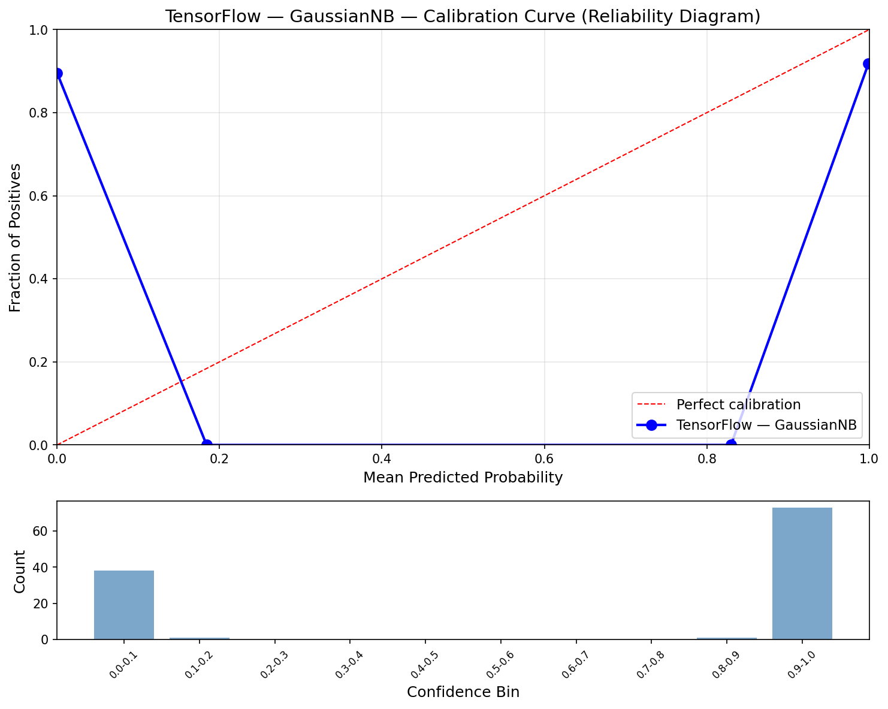
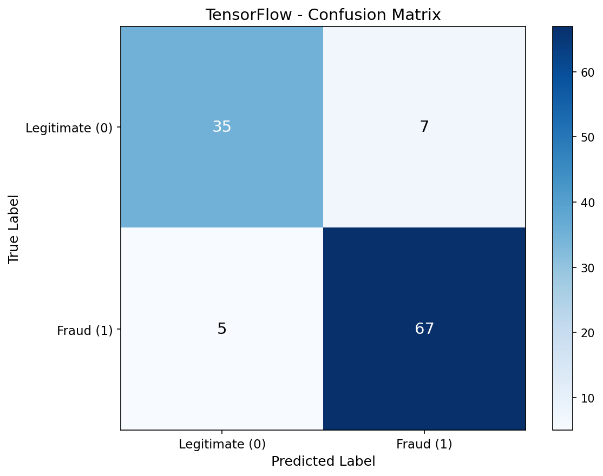
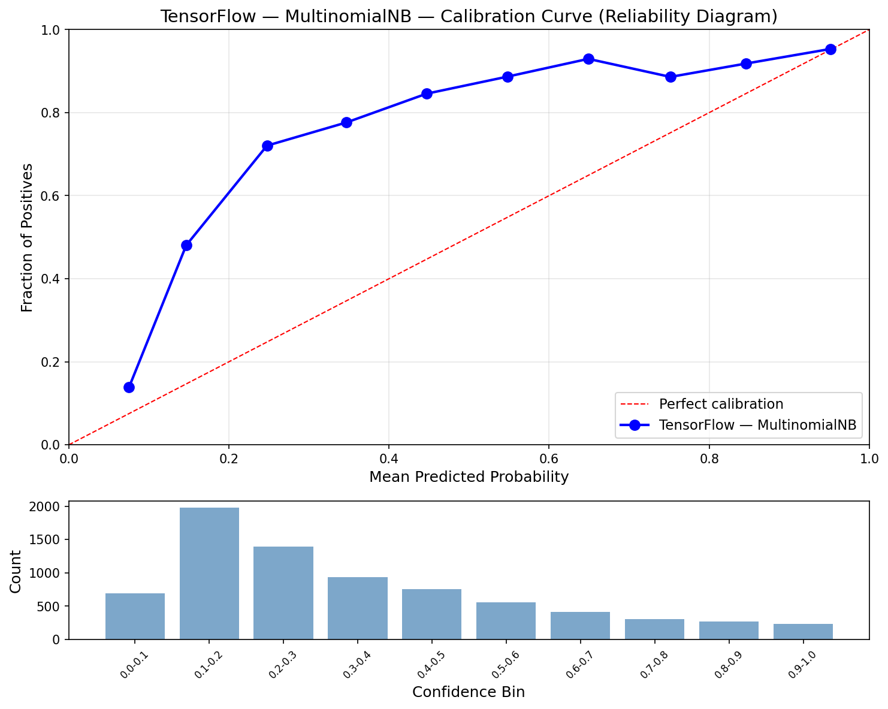
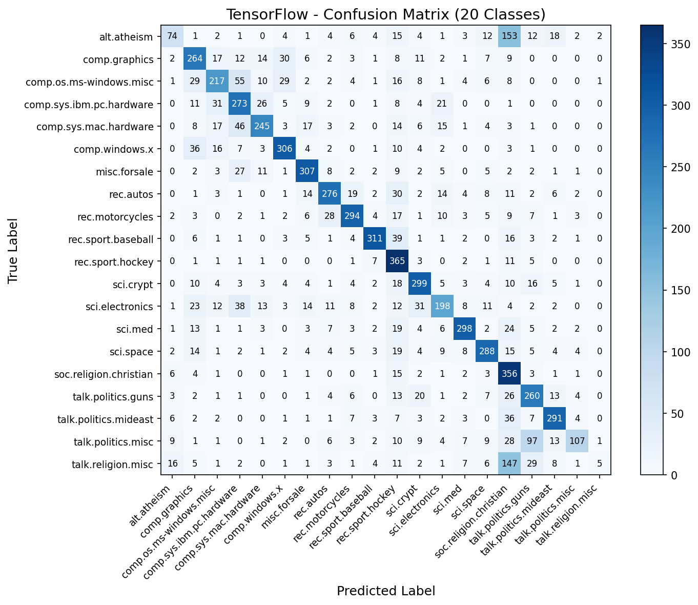
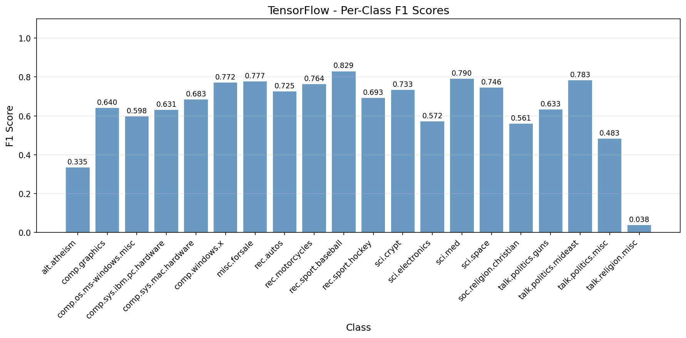

# TensorFlow Naive Bayes (CPU)

Both Naive Bayes variants implemented using TensorFlow tensors on CPU. All math operations — means, variances, log-probabilities, matrix multiply prediction — use `tf.math` operations and immutable `tf.constant` tensors.

## Overview

Two-part pipeline with TensorFlow Naive Bayes on CPU:
- **Part 1**: GaussianNB on Breast Cancer (binary classification baseline)
- **Part 2**: MultinomialNB on 20 Newsgroups (text classification main event)
- **Showcase**: `tf.function` — eager execution vs graph-compiled execution benchmark

**Note**: TF 2.11+ dropped native Windows GPU support. This pipeline runs on CPU. GPU acceleration via WSL2 is planned for neural network models.

## Datasets

### Breast Cancer Wisconsin (GaussianNB)
- **Samples**: 569 (455 train / 114 test, stratified 80/20 split)
- **Features**: 30 continuous (mean, SE, worst of 10 cell nucleus measurements)
- **Target**: Malignant (0) or Benign (1)
- **Tensor dtype**: float64 (matches numpy precision for exact metric parity)

### 20 Newsgroups (MultinomialNB)
- **Samples**: 18,846 (11,314 train / 7,532 test, published benchmark split)
- **Features**: 10,000 TF-IDF terms
- **Target**: 20 newsgroup categories
- **Tensor dtype**: float32 (standard for TF operations)

## Configuration

| Parameter | Value | Purpose |
|-----------|-------|---------|
| `RANDOM_STATE` | 113 | Reproducibility |
| `ALPHA` | 1.0 | Laplace smoothing |
| `VAR_SMOOTHING` | 1e-9 | Variance floor for GaussianNB |
| Device | CPU | TF 2.11+ dropped native Windows GPU |

## Results

### Part 1: GaussianNB (Breast Cancer)

| Metric | Train | Test |
|--------|-------|------|
| Accuracy | 0.9385 | 0.8947 |
| Precision | 0.9509 | 0.9054 |
| Recall | 0.9509 | 0.9306 |
| F1 | 0.9509 | 0.9178 |
| AUC | 0.9592 | 0.9363 |
| Log Loss | 0.7158 | 1.0123 |
| Brier Score | 0.0608 | 0.0983 |
| ECE | 0.3681 | 0.3590 |

### Part 2: MultinomialNB (20 Newsgroups)

| Metric | Train | Test |
|--------|-------|------|
| Accuracy | 0.8367 | 0.6683 |
| Macro F1 | 0.8194 | 0.6394 |
| Log Loss | 1.1388 | 1.5576 |
| Brier Score | 0.4553 | 0.6008 |
| ECE | 0.4015 | 0.3229 |

### Performance

| Metric | Value |
|--------|-------|
| Training Time | 0.10s |
| Inference Speed | 7.62 μs/sample (131,213 samples/sec) |
| Model Size | 0.76 MB |
| Peak Memory | 0.07 MB |

### Cross-Framework Comparison

| Metric | Scikit-Learn | No-Framework | PyTorch | TensorFlow |
|--------|-------------|--------------|---------|------------|
| Accuracy | 0.6683 | 0.6683 | 0.6683 | 0.6683 |
| Macro F1 | 0.6394 | 0.6394 | 0.6394 | 0.6394 |
| Log Loss | 1.5576 | 1.5576 | 1.5576 | 1.5576 |
| Brier Score | 0.6008 | 0.6008 | 0.6008 | 0.6008 |
| ECE | 0.3229 | 0.3229 | 0.3229 | 0.3229 |
| Training Time | 0.21s | 0.13s | 0.03s | 0.10s |
| Inference | 17.07 μs | 14.66 μs | 3.50 μs | 7.62 μs |
| Model Size | 3.05 MB | 1.53 MB | 0.76 MB | 0.76 MB |

All classification and probabilistic metrics are identical across all 4 frameworks. PyTorch GPU is fastest, TensorFlow CPU sits between No-Framework and sklearn.

## Showcase: `tf.function` — Eager vs Graph Execution

TensorFlow 2.x runs in eager mode by default (operations execute immediately, like PyTorch). Wrapping a function with `@tf.function` compiles it into an optimized static computation graph — TF's defining feature.

### Benchmark Results (100 runs, MultinomialNB predict)

| Mode | Avg Time (ms) | Per Sample (μs) |
|------|---------------|-----------------|
| Eager (default) | 7.20 | 0.96 |
| Graph (`tf.function`) | 6.40 | 0.85 |
| **Speedup** | — | **1.12x** |

The 1.12x speedup is modest because:
- MultinomialNB prediction is a single matmul — minimal Python dispatch overhead to eliminate
- CPU execution doesn't benefit from graph-level operator fusion as much as GPU
- Graph mode shines more with complex models (many ops, control flow, GPU kernels)

The value of `tf.function` grows with model complexity: for DNNs/CNNs with dozens of layers, eliminating per-op Python overhead compounds significantly.

## TensorFlow-Specific Lessons

1. **Immutable tensors** — TF tensors don't support in-place assignment (`tensor[k] = value` fails). Must build Python lists then `tf.stack()`. This also sidesteps the dtype gotcha that caused issues in PyTorch (where `torch.zeros()` defaults to float32 regardless of input dtype).

2. **`tf.unique()` returns unsorted values** — Unlike `torch.unique()` or `np.unique()`, TF returns values in first-occurrence order. Wrap with `tf.sort()` for consistent class ordering.

3. **`tf.boolean_mask()` for class selection** — Replaces NumPy's `X[y == cls]` boolean indexing. Combined with `tf.equal()` for the mask.

4. **`tf.math.reduce_variance()` uses population variance** — No `unbiased` flag like PyTorch's `tensor.var(unbiased=False)`. TF defaults to population variance, which is what we want for NB.

5. **`tf.gather()` for index-based lookup** — TF doesn't support PyTorch-style `classes[argmax_indices]` fancy indexing. Use `tf.gather(classes, indices)` instead.

6. **`tf.reduce_logsumexp()` is built-in** — Like PyTorch's `torch.logsumexp()`, no manual log-sum-exp implementation needed.

## Functions Defined

| Function | Purpose | Key Detail |
|----------|---------|------------|
| `gaussian_nb_train_tf(X, y)` | Learn means/vars/priors | `tf.boolean_mask` + `tf.stack` pattern |
| `gaussian_nb_predict_tf(model, X)` | Gaussian log-lik + softmax | `tf.reduce_logsumexp()` built-in |
| `multinomial_nb_train_tf(X, y, alpha)` | Smoothed feature log-probs | Same Laplace smoothing math on CPU tensors |
| `multinomial_nb_predict_tf(model, X)` | Matmul prediction | `X @ tf.transpose(feature_log_prob)` |

## Visualizations

### GaussianNB Calibration Curve


### GaussianNB Confusion Matrix


### MultinomialNB Calibration Curve


### MultinomialNB Confusion Matrix (20 Classes)


### Per-Class F1 Scores


## Files

```
TensorFlow/05-naive-bayes/
├── pipeline.ipynb                          # Main implementation (10 cells)
├── README.md                               # This file
├── requirements.txt                        # Dependencies
└── results/
    ├── metrics.json                        # Saved metrics
    ├── gaussian_calibration.png            # GaussianNB reliability diagram
    ├── gaussian_confusion_matrix.png       # GaussianNB confusion matrix
    ├── multinomial_calibration.png         # MultinomialNB reliability diagram
    ├── multinomial_confusion_matrix.png    # 20-class confusion matrix
    └── multinomial_per_class_f1.png        # Per-class F1 bar chart
```

## How to Run

```bash
cd TensorFlow/05-naive-bayes
jupyter notebook pipeline.ipynb
```

Requires: `numpy`, `matplotlib`, `tensorflow`
