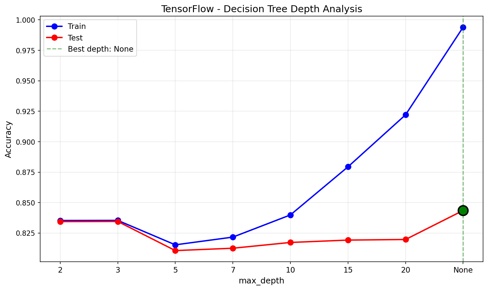
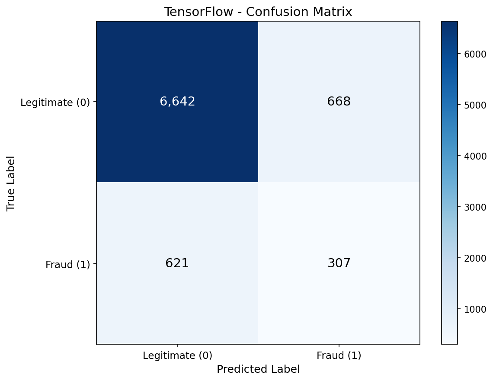
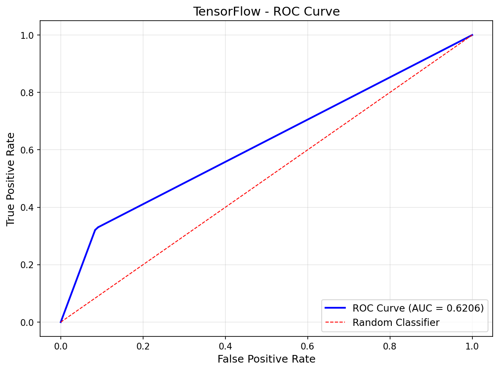
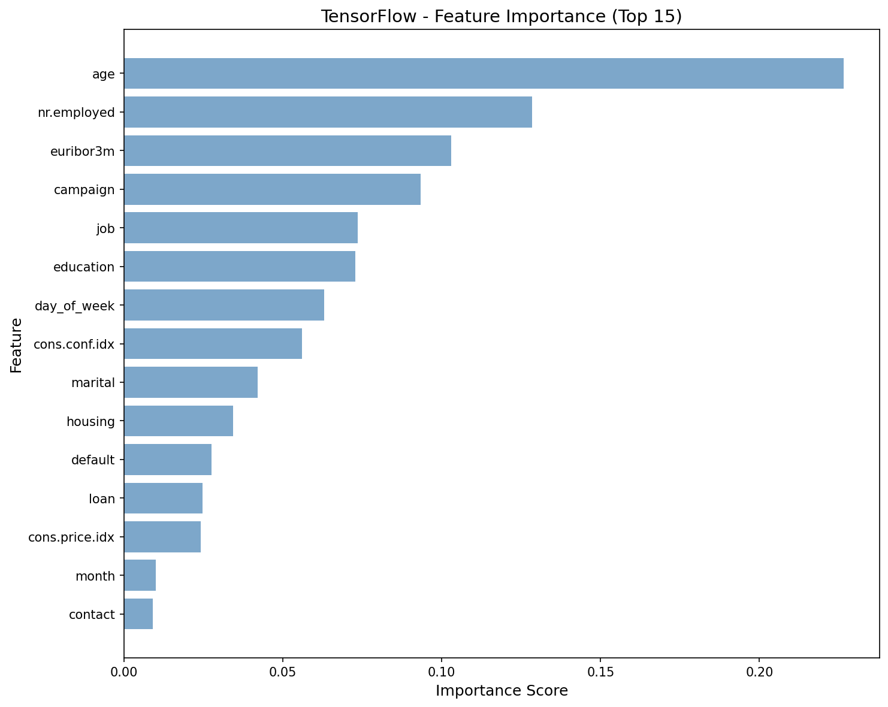
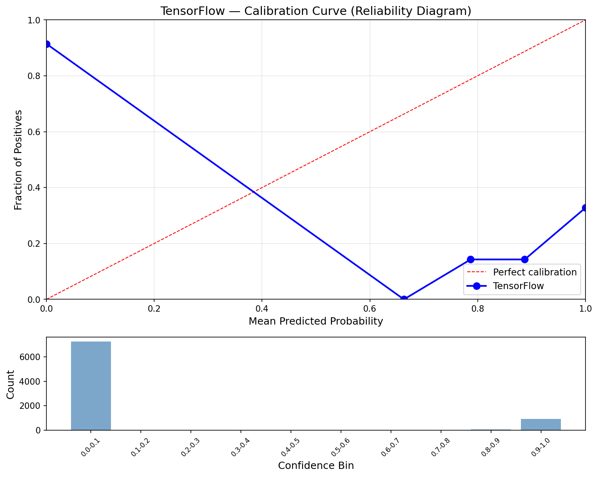
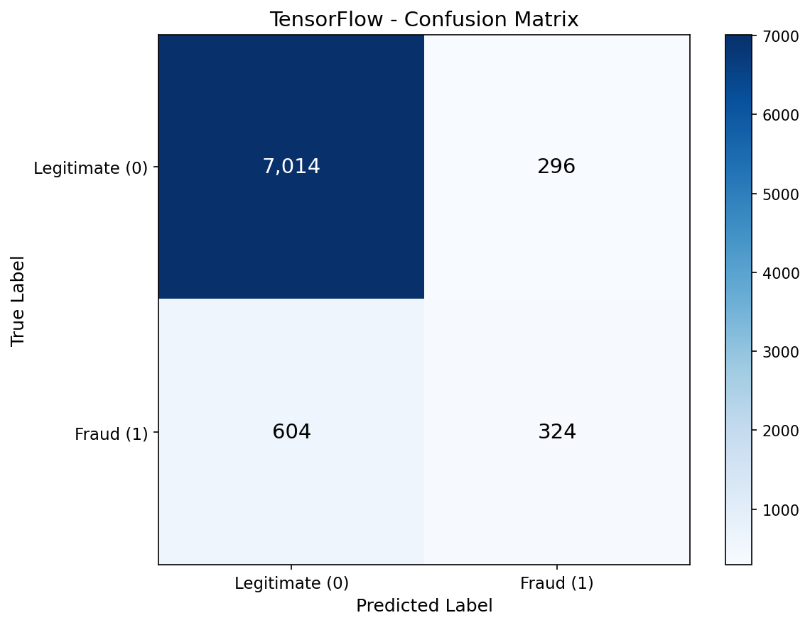
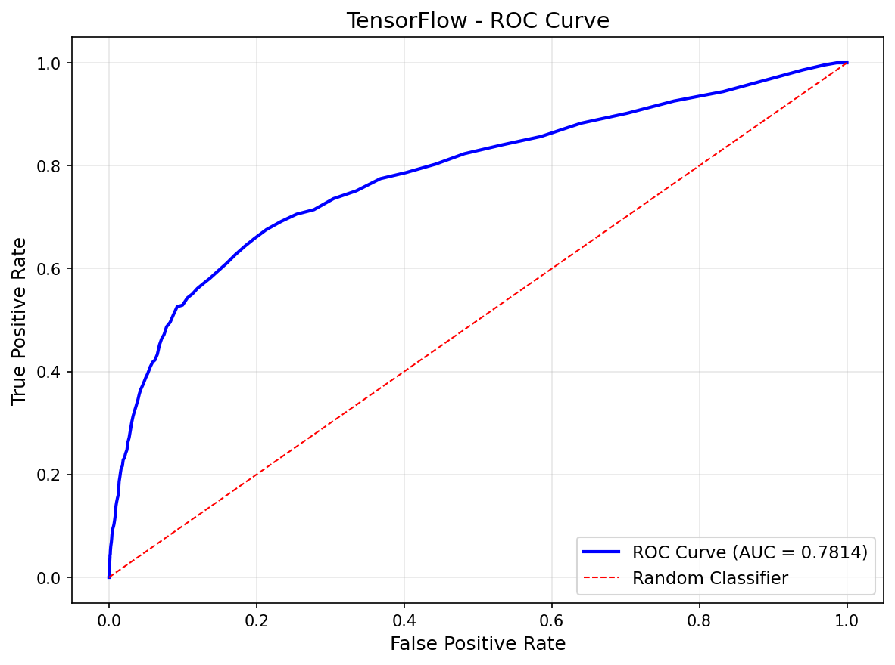
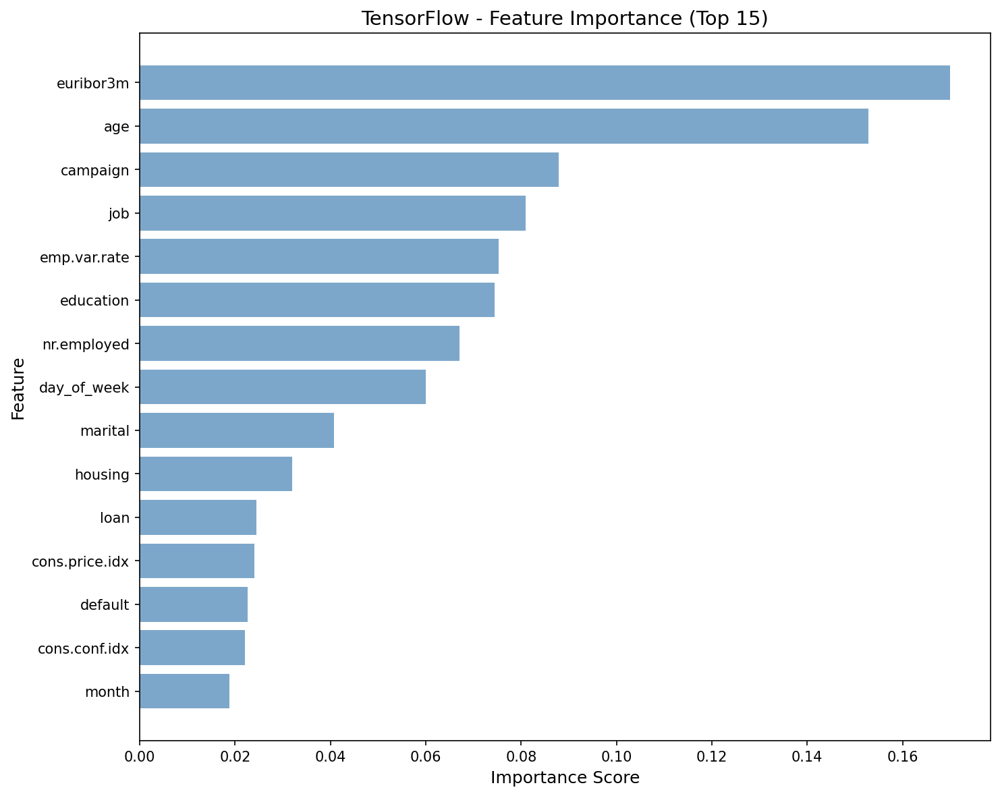
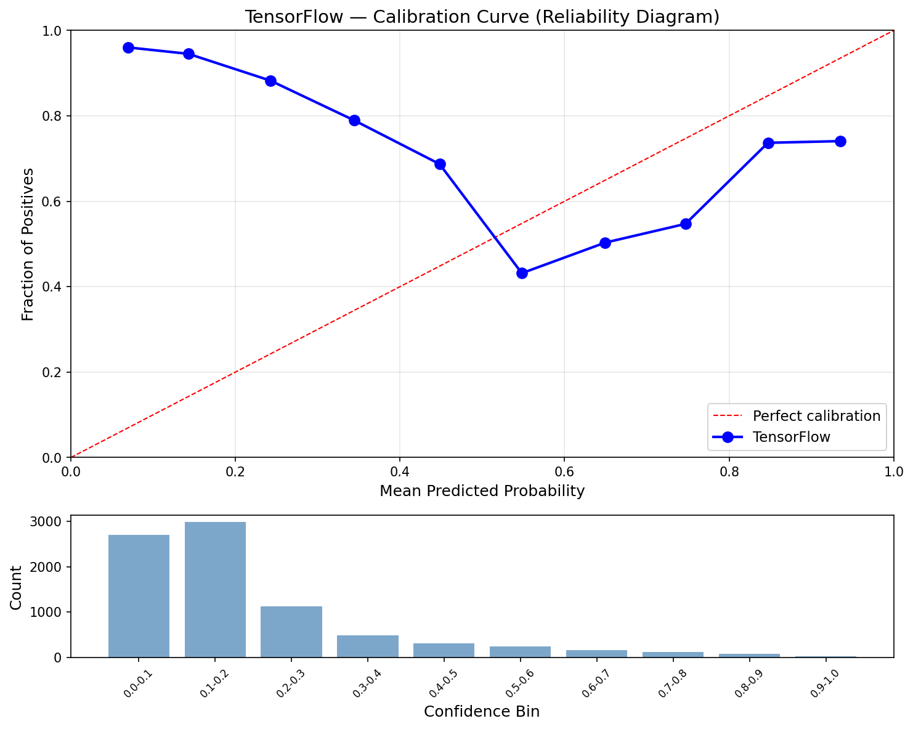
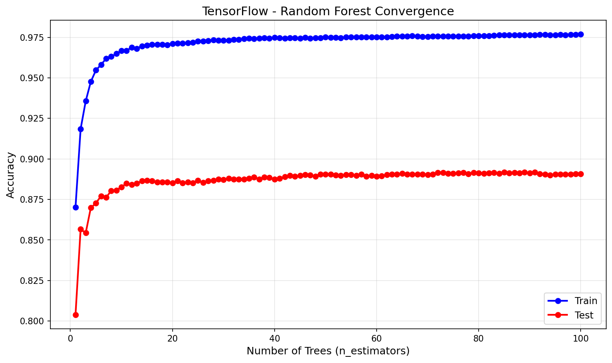

# Decision Trees & Random Forests — TensorFlow (CPU)

CPU tensor ops implementation of Decision Trees and Random Forests using TensorFlow on Windows (TF 2.11+ dropped native GPU support). Same **vectorized split search** as PyTorch — `tf.sort` + `tf.cumsum` evaluates all candidate thresholds simultaneously — but running entirely on CPU. This pipeline completes the 4/4 framework comparison for DT/RF.

## Overview

Two-part pipeline implementing DT and RF with TF-accelerated split search:
- **Part 1**: Decision Tree with TF CPU split search + depth analysis sweep (depth 42, 5,381 leaves)
- **Part 2**: Random Forest with 100 bootstrap-aggregated trees, per-node random feature subsets
- **Showcase**: TF CPU vs NumPy split search benchmark — vectorized `tf.cumsum` vs Python for-loop

## Key TensorFlow Operations

| Operation | TensorFlow Function | Replaces |
|-----------|-------------------|----------|
| Sort features for threshold scan | `tf.sort()` + `tf.argsort()` | `np.argsort()` |
| Running class counts (left/right) | `tf.cumsum()` | Python for-loop accumulator |
| Vectorized Gini at all thresholds | TF tensor arithmetic | Per-threshold Python calculation |
| Best threshold selection | `tf.argmax()` | Python `max()` tracking |
| Bootstrap sampling | `tf.random.uniform()` | `np.random.choice()` |
| Data partitioning | `tf.boolean_mask()` | NumPy boolean indexing |
| Reorder by sorted indices | `tf.gather()` | Direct array indexing |

## Dataset

### Bank Marketing (UCI)
- **Source**: UCI ML Repository (Moro et al., 2014) — Portuguese banking direct marketing
- **Samples**: 41,188 (32,950 train / 8,238 test, stratified 80/20 split)
- **Features**: 19 (10 categorical ordinal-encoded, 9 continuous)
- **Target**: Term deposit subscription — no (0) / yes (1)
- **Class Imbalance**: 88.7% no / 11.3% yes
- **Dropped**: `duration` (data leakage — only known after call ends)

## Configuration

| Parameter | Value | Purpose |
|-----------|-------|---------|
| `RANDOM_STATE` | 113 | Reproducibility |
| `N_ESTIMATORS` | 100 | Number of trees in forest |
| `MAX_FEATURES` | 'sqrt' | sqrt(19) = 4 random features per split |
| `DEPTH_VALUES` | [2, 3, 5, 7, 10, 15, 20, None] | Depth sweep for analysis |
| `device` | CPU only | TF 2.11+ no native Windows GPU |
| `dtype` | `float32` (features), `int64` (labels) | Standard TF dtypes |

## Results

### Part 1: Decision Tree (Unrestricted — depth 42, 5,381 leaves)

| Metric | Train | Test |
|--------|-------|------|
| Accuracy | 0.9940 | 0.8435 |
| Precision | 0.9491 | 0.3149 |
| Recall | 1.0000 | 0.3308 |
| F1 | 0.9739 | 0.3226 |
| AUC | 0.9999 | 0.6206 |

Train near 100% vs test 84% — classic overfitting. The tree memorizes noise, not patterns.

### Part 2: Random Forest (100 trees)

| Metric | Train | Test |
|--------|-------|------|
| Accuracy | 0.9768 | 0.8908 |
| Precision | 0.9219 | 0.5226 |
| Recall | 0.8677 | 0.3491 |
| F1 | 0.8940 | 0.4186 |
| AUC | 0.9961 | 0.7814 |

RF improves test accuracy (+4.7%), AUC (+16.1%), and precision (+20.8%) over DT.

### Performance

| Metric | Value |
|--------|-------|
| Training Time | 13,057.7s (199.2 min for 100 trees) |
| Inference Speed | 725.14 µs/sample (1,379 samples/sec) |
| Model Size | 29.50 MB |
| Peak Memory | 215.58 MB |

### Cross-Framework Comparison (4/4)

| Metric | Scikit-Learn | No-Framework | PyTorch | TensorFlow |
|--------|-------------|--------------|---------|------------|
| Accuracy | 0.8554 | 0.8897 | 0.8906 | 0.8908 |
| F1 | 0.4837 | 0.4101 | 0.4206 | 0.4186 |
| AUC | 0.7988 | 0.7801 | 0.7807 | 0.7814 |
| Training Time | 21.19s | 1752s (29.2 min) | 1473s (24.6 min) | 13058s (199.2 min) |
| Inference | 3.39 µs/sample | 169.46 µs/sample | 279.79 µs/sample | 725.14 µs/sample |
| Model Size | 11.50 MB | 55.23 MB | 29.47 MB | 29.50 MB |
| n_estimators | 200 (GridSearchCV) | 100 | 100 | 100 |

TensorFlow is the slowest framework at 199 min — 6.8x slower than No-Framework and 9.5x slower than PyTorch. The same vectorized algorithm runs far slower due to TF's eager dispatch overhead: every `tf.sort`, `tf.gather`, `tf.boolean_mask` call crosses the Python→C++ bridge, and this compounds across millions of recursive split search calls. Model size is identical to PyTorch (29.50 MB vs 29.47 MB), confirming size is driven by tree structure, not framework.

## Showcase: TF CPU vs NumPy Split Search

Benchmarked `find_best_split_tf` (vectorized `tf.sort` + `tf.cumsum`) vs a pure NumPy reimplementation (sequential `np.argsort` + Python for-loop) on the same data (50 runs, 32,950 samples × 19 features):

| Method | Per Split | Approach |
|--------|-----------|----------|
| TF CPU (vectorized) | 313.07 ± 4.86 ms | `tf.sort` + `tf.cumsum` — all thresholds simultaneously |
| NumPy (for-loop) | 296.12 ± 5.35 ms | `np.argsort` + Python loop — one threshold at a time |
| **Result** | **NumPy 1.06x faster** | |

NumPy's compiled C routines with incremental O(1) weight updates beat TF's vectorized approach. TF's eager dispatch overhead (Python→C++ bridge per tensor op) and memory allocation for intermediate tensors outweigh the vectorization benefit. This is a key insight: on CPU, TF's tensor abstraction layer adds latency that numpy avoids by calling C directly.

## Visualizations

### Decision Tree Depth Analysis


### Decision Tree Confusion Matrix


### Decision Tree ROC Curve


### Decision Tree Feature Importance


### Decision Tree Calibration


### Random Forest Confusion Matrix


### Random Forest ROC Curve


### Random Forest Feature Importance


### Random Forest Calibration


### Random Forest Convergence


## Key Learnings

1. **TF eager dispatch kills CPU tree performance** — 199 min training (6.8x slower than No-Framework's 29 min) for the same algorithm. Every tensor op crosses the Python→C++ bridge, and decision tree recursion triggers millions of these crossings. TF's overhead is tolerable for batched neural network ops but devastating for fine-grained recursive algorithms.

2. **Vectorization doesn't guarantee speedup on CPU** — `tf.cumsum` evaluates all 32,949 thresholds simultaneously per feature, yet NumPy's sequential for-loop with O(1) incremental updates is 1.06x faster. The memory allocation overhead for intermediate tensors (sorted values, one-hot matrices, cumsum results) outweighs the computation savings.

3. **TF's API requires more boilerplate than PyTorch** — `tf.sort()` + `tf.argsort()` are separate calls (PyTorch returns both from `torch.sort()`). `tf.boolean_mask()` replaces direct `tensor[mask]` indexing. `tf.gather()` replaces `array[indices]`. Each adds a function call boundary that compounds in tight loops.

4. **`predict_batch` from tree_utils.py should have been used** — The notebook reimplemented prediction as `predict_tree_tf` + `flat_tree_to_tf` (~50 lines) when `tree_utils.predict_batch` already handles batch prediction on numpy arrays. The tree building and split search genuinely need TF ops, but prediction didn't — a lesson in checking shared utilities before writing framework-specific code.

5. **Model size is structure-driven, not framework-driven** — TF (29.50 MB) and PyTorch (29.47 MB) produce nearly identical model sizes because both store the same Python dict trees. The 47% reduction vs No-Framework (55.23 MB) comes from tree structure differences due to different random states in bootstrap sampling, not from tensor representation.

6. **TF on Windows is CPU-only for now** — TF 2.11+ removed native Windows GPU support. This makes TF the worst choice for custom algorithms on Windows. For neural networks, WSL2 with TF-GPU is the planned workaround.

7. **`tf.gather_nd` doesn't handle -1 indices** — Unlike numpy's `-1` indexing (last element), TF raises `InvalidArgumentError`. Leaf nodes in flat trees use -1 as sentinel values, requiring explicit clamping (`tf.where(at_internal, features, zeros)`) before gathering.

## Files

```
TensorFlow/06-decision-trees-random-forests/
├── pipeline.ipynb                          # Main implementation (12 cells)
├── README.md                               # This file
├── requirements.txt                        # Dependencies
└── results/
    ├── metrics.json                        # Saved metrics
    ├── dt_depth_analysis.png              # Train vs test across max_depth
    ├── dt_confusion_matrix.png            # DT confusion matrix
    ├── dt_roc_curve.png                   # DT ROC curve
    ├── dt_feature_importance.png          # DT Gini importance
    ├── dt_calibration_curve.png           # DT calibration curve
    ├── rf_confusion_matrix.png            # RF confusion matrix
    ├── rf_roc_curve.png                   # RF ROC curve
    ├── rf_feature_importance.png          # RF averaged Gini importance
    ├── rf_calibration_curve.png           # RF calibration curve
    └── rf_convergence.png                 # Accuracy vs n_estimators
```

## How to Run

```bash
cd TensorFlow/06-decision-trees-random-forests
jupyter notebook pipeline.ipynb
```

**Prerequisites**: Run preprocessing script first:
```bash
cd data-preperation
python preprocess_decision_tree.py
```

Requires: `tensorflow`, `numpy`, `matplotlib`

**Note**: Training takes ~3.3 hours on CPU. TF 2.11+ has no native Windows GPU support.
