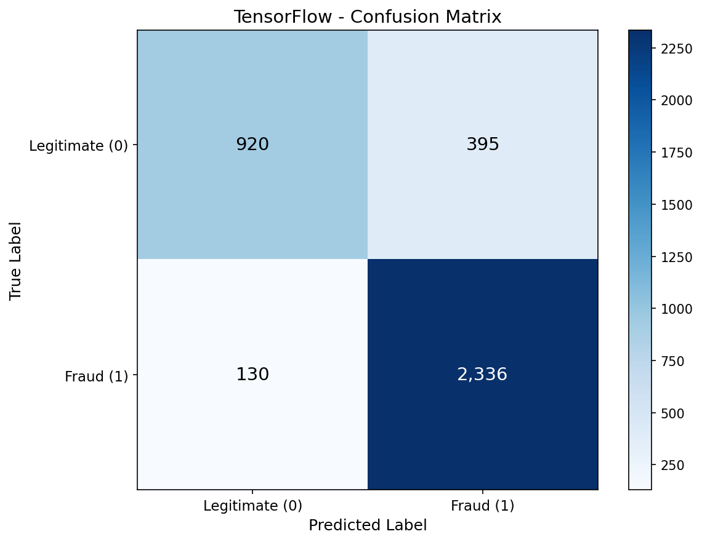
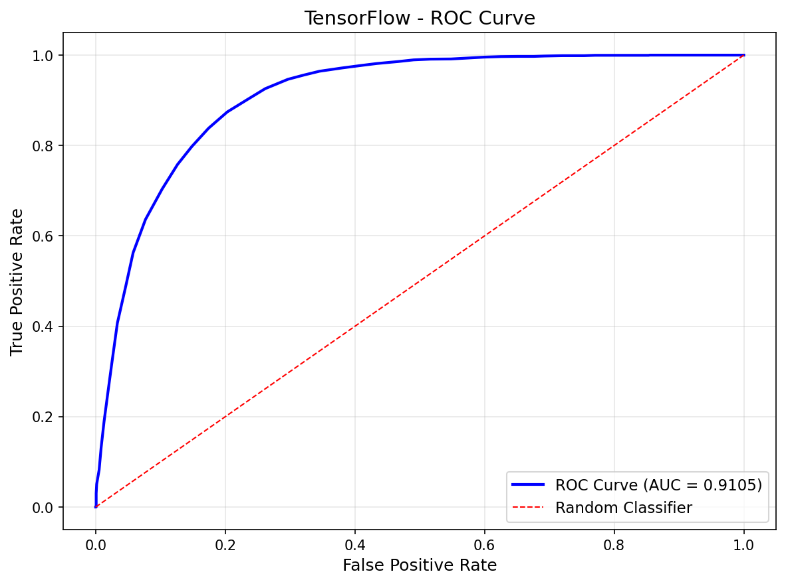
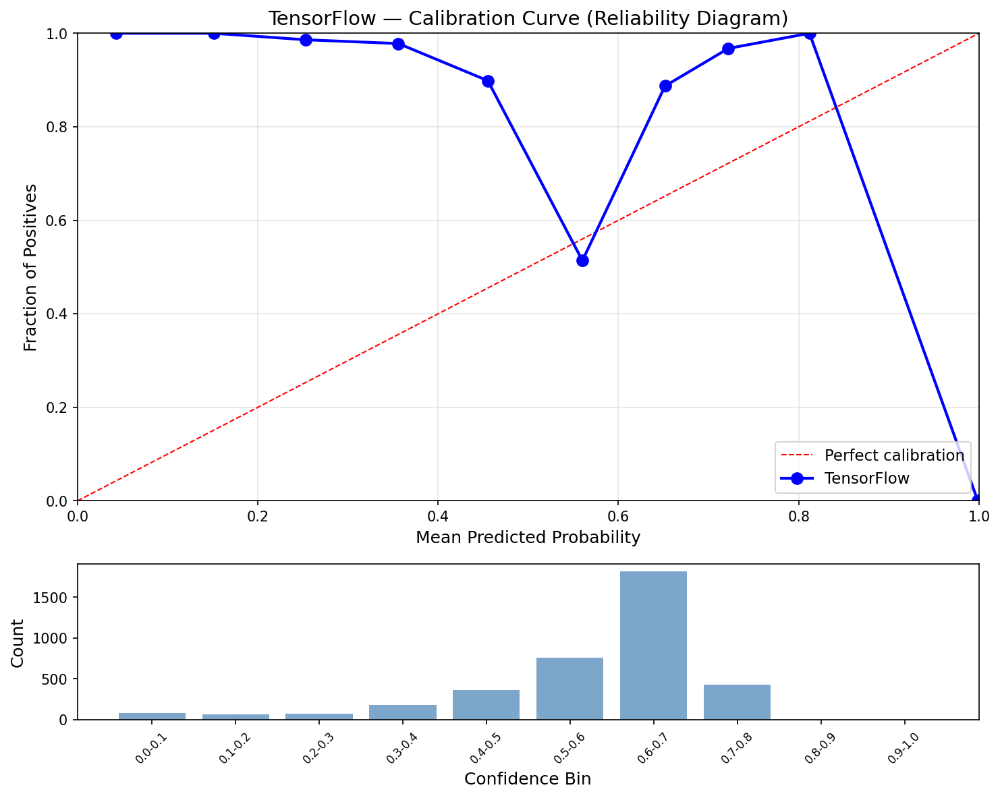
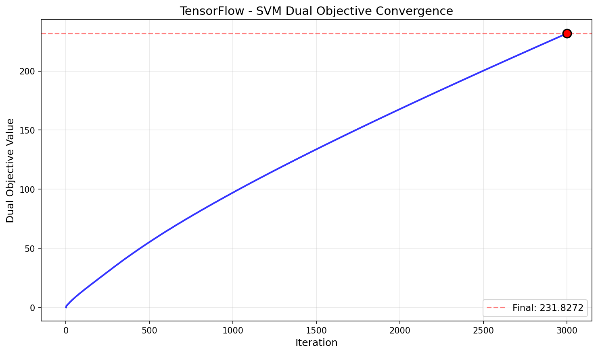
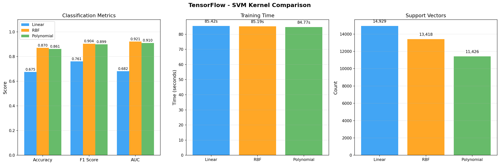

# Support Vector Machine — TensorFlow (CPU Tensor Ops)

CPU tensor-based SVM using projected gradient ascent on the dual objective with TensorFlow eager-mode operations. Same algorithm as No-Framework and PyTorch but using `tf.linalg.matvec`, `tf.reduce_sum`, and `tf.clip_by_value` on CPU tensors. TF 2.11+ dropped native Windows GPU support, so all ops run on CPU. Platt probability calibration on CPU via shared `svm_utils.py`.

## Overview

- Implement 3 TF kernel functions (linear, RBF, polynomial) using `tf.transpose`, `tf.exp`, matmul
- Train SVM via projected gradient ascent on the dual QP — all operations on CPU TF tensors
- Predict using support vector expansion: f(x) = K_new @ (alpha * y) + b
- Platt scaling on CPU (numpy — same as all from-scratch frameworks)
- Evaluate with full classification metrics (accuracy, F1, AUC, calibration)
- **Showcase**: Kernel Comparison — linear vs RBF vs polynomial on CPU tensors
- Convergence visualization (dual objective over iterations)
- Inference benchmarks + model size

## What We Build

| Function | Purpose | Key Math |
|----------|---------|----------|
| `linear_kernel_tf(X1, X2)` | Dot product kernel | `K = X1 @ tf.transpose(X2)` |
| `rbf_kernel_tf(X1, X2, gamma)` | Radial basis function | `K = tf.exp(-gamma * dist_sq)` |
| `poly_kernel_tf(X1, X2, gamma, degree, coef0)` | Polynomial kernel | `K = (gamma * X1 @ tf.transpose(X2) + coef0)^d` |
| `train_dual_svm_tf(K, y, C, n_iters)` | Projected gradient ascent (CPU) | Maximize `L(a) = sum(a) - 0.5 * a^T Q a` |
| `predict_svm_tf(X_new, X_train, ...)` | SVM decision function | `f(x) = K_new @ (alpha * y) + b` |

**From shared `utils/svm_utils.py`** (numpy-only — `.numpy()` at boundaries): `to_svm_labels`, `to_std_labels`, `platt_calibrate`, `platt_predict_proba`

## Key TensorFlow Operations

| TensorFlow Operation | PyTorch Equivalent | Purpose |
|---------------------|-------------------|---------|
| `tf.zeros(n, dtype=tf.float32)` | `torch.zeros(n, device=device)` | Initialize alphas |
| `tf.reduce_sum(a * b)` | `torch.dot(a, b)` | Dot products (no `tf.dot` exists) |
| `tf.linalg.matvec(K, ay)` | `K @ ay` | Matrix-vector product (`@` needs 2D+ in TF) |
| `tf.clip_by_value(a, 0, C)` | `torch.clamp(a, 0, C)` | Box constraint projection |
| `tf.sign(dv)` | `torch.sign(dv)` | SVM class prediction |
| `tf.boolean_mask(X, mask)` | `X[mask]` | Boolean indexing (TF tensors don't support `[]`) |
| `tf.expand_dims(x, axis=1)` | `x.unsqueeze(1)` | RBF squared distances |
| `tf.transpose(X)` | `X.T` | Transpose (no `.T` on TF tensors) |
| `float(obj.numpy())` | `obj.item()` | Convert tensor to Python float |

## Dataset

### MAGIC Gamma Telescope (UCI)
- **Source**: UCI ML Repository — Major Atmospheric Gamma Imaging Cherenkov Telescope
- **Samples**: 18,905 (15,124 train / 3,781 test, stratified 80/20 split)
- **Features**: 10 continuous (fLength, fWidth, fSize, fConc, fConc1, fAsym, fM3Long, fM3Trans, fAlpha, fDist)
- **Target**: Binary — gamma ray signal (1) vs hadron background noise (0)
- **Class Balance**: 65.2% gamma / 34.8% hadron
- **Scaling**: StandardScaler (fit on train, transform both) — critical for SVM kernel distances

## Configuration

| Parameter | Value | Purpose |
|-----------|-------|---------|
| `RANDOM_STATE` | 113 | Reproducibility |
| `C` | 10.0 | Regularization (from SK tuning) |
| `kernel` | Polynomial | Best kernel (from SK comparison) |
| `degree` | 3 | Cubic polynomial interactions |
| `coef0` | 1 | Non-homogeneous polynomial |
| `gamma` | 0.1 | `1 / (n_features * X.var())` — matches sklearn 'scale' |
| `n_iters` | 3000 | Gradient descent iterations |
| `device` | CPU | TF 2.11+ dropped native Windows GPU |
| `dtype` | float32 | Half memory vs float64, negligible precision loss |

## Results

### Polynomial Kernel (C=10, degree=3)

| Metric | Train | Test |
|--------|-------|------|
| Accuracy | 0.8682 | 0.8611 |
| Precision | 0.8622 | 0.8554 |
| Recall | 0.9496 | 0.9473 |
| F1 | 0.9038 | 0.8990 |
| AUC | 0.9189 | 0.9105 |
| Log Loss | 0.4989 | 0.5071 |
| Brier Score | 0.1587 | 0.1619 |
| ECE | 0.2885 | 0.2732 |

### Performance

| Metric | Value |
|--------|-------|
| Training Time | 85.77s (1.9x faster than NF, 9.7x slower than PyTorch GPU) |
| Inference Speed | 15.55 us/sample (64,294 samples/sec) |
| Model Size | 0.52 MB (11,426 support vectors, float32) |
| Peak Memory (CPU) | 0.33 MB |

### Cross-Framework Comparison (4/4)

| Metric | Scikit-Learn | No-Framework | PyTorch | TensorFlow |
|--------|-------------|--------------|---------|------------|
| Accuracy | 0.8606 | 0.8614 | 0.8611 | 0.8611 |
| F1 | 0.8942 | 0.8992 | 0.8990 | 0.8990 |
| AUC | 0.9164 | 0.9105 | 0.9105 | 0.9105 |
| Training Time | 20.32s | 160.0s | 9.03s | 85.77s |
| Inference | 36.63 us/sample | 153.57 us/sample | 0.59 us/sample | 15.55 us/sample |
| Model Size | 523.4 KB | 1.05 MB | 535.6 KB | 535.6 KB |
| Support Vectors | 5,343 (35.3%) | 11,426 (75.5%) | 11,426 (75.5%) | 11,426 (75.5%) |

TensorFlow matches PyTorch exactly across all metrics (identical algorithm, same float32 precision). Training at 85.77s sits between NF (160s) and PyTorch GPU (9.03s) — TF eager-mode CPU matmul is more optimized than raw NumPy but can't compete with GPU parallelism. Inference at 15.55 us/sample is 10x faster than NF but 26x slower than PyTorch GPU.

## Showcase: Kernel Comparison on CPU

Trained 3 SVMs with different kernels on CPU TF tensors, same hyperparameters (C=10, gamma=0.1):

| Kernel | Accuracy | F1 | AUC | Time | SVs |
|--------|----------|-----|-----|------|-----|
| Linear | 0.6750 | 0.7606 | 0.6816 | 85.4s | 14,929 |
| RBF | 0.8704 | 0.9045 | 0.9212 | 85.2s | 13,418 |
| Polynomial | 0.8611 | 0.8990 | 0.9105 | 84.8s | 11,426 |

All 3 kernels train in ~85s on CPU — uniform timing because CPU doesn't benefit from kernel complexity differences the way GPU does. RBF leads (87.0%), Polynomial close (86.1%). Linear kernel accuracy (67.5%) differs from PyTorch (77.2%) — same float32 precision but different convergence paths between TF eager CPU and PyTorch GPU dispatch for the underfitting linear model.

## Visualizations

### Confusion Matrix


### ROC Curve (AUC = 0.9105)


### Calibration Curve


### Dual Objective Convergence


### Kernel Comparison


## Key Learnings

1. **TF eager-mode CPU is 1.9x faster than raw NumPy** — 85.77s vs 160s for the same algorithm. TF's optimized C++ matmul kernels (`tf.linalg.matvec`) outperform NumPy's BLAS bindings for the O(n^2) matrix-vector product that dominates each iteration.

2. **Still 9.7x slower than PyTorch GPU** — CPU parallelism can't match GPU's thousands of CUDA cores for the 15K x 15K kernel matrix operations. The SVM dual optimization is embarrassingly parallel.

3. **No `.T`, no `[]` indexing, no `tf.dot`** — TF tensors require explicit `tf.transpose()`, `tf.boolean_mask()`, and `tf.reduce_sum(a * b)` for operations that are one-liners in PyTorch/NumPy. More verbose but forces explicit thinking about tensor shapes.

4. **`tf.linalg.matvec` is essential** — TF's `@` operator requires 2D+ inputs. The matrix-vector product `K @ (alpha * y)` needs `tf.linalg.matvec(K, ay)` instead. This is the most common gotcha when translating from PyTorch.

5. **Uniform kernel comparison timing** — all 3 kernels train in ~85s (vs PyTorch's ~9s each). CPU execution time is dominated by the iteration loop overhead, not kernel computation complexity.

6. **Linear kernel convergence differs across frameworks** — TF gets 67.5%, PyTorch gets 77.2%, NF gets 62.1%. For the underfitting linear model where the algorithm never converges, tiny numerical differences in matmul dispatch compound over 3000 iterations.

7. **Memory management is simpler on CPU** — just `del K` between kernel comparison runs. No `torch.cuda.empty_cache()` needed. Python's garbage collector handles CPU memory naturally.

## Files

```
TensorFlow/07-svm/
├── pipeline.ipynb                          # Main implementation (9 cells)
├── README.md                               # This file
├── requirements.txt                        # Dependencies
└── results/
    ├── metrics.json                        # Saved metrics
    ├── confusion_matrix.png               # Test set confusion matrix
    ├── roc_curve.png                      # ROC curve (AUC = 0.9105)
    ├── calibration_curve.png              # Reliability diagram
    ├── svm_convergence.png                # Dual objective over iterations
    └── kernel_comparison.png              # 3-kernel side-by-side comparison
```

## How to Run

```bash
cd TensorFlow/07-svm
jupyter notebook pipeline.ipynb
```

**Prerequisites**: Run preprocessing script first:
```bash
cd data-preperation
python preprocess_svm.py
```

Requires: `tensorflow`, `numpy`, `matplotlib`
