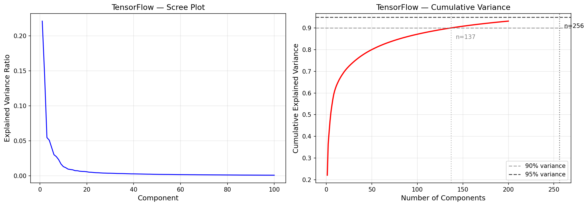
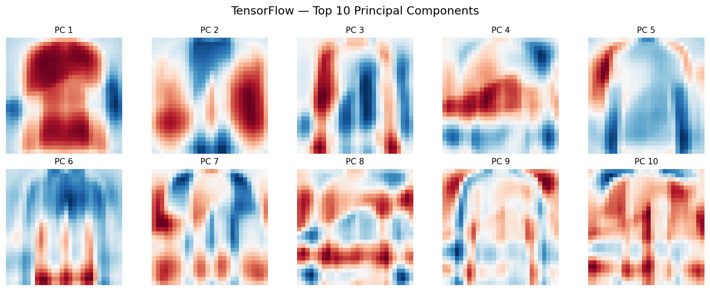
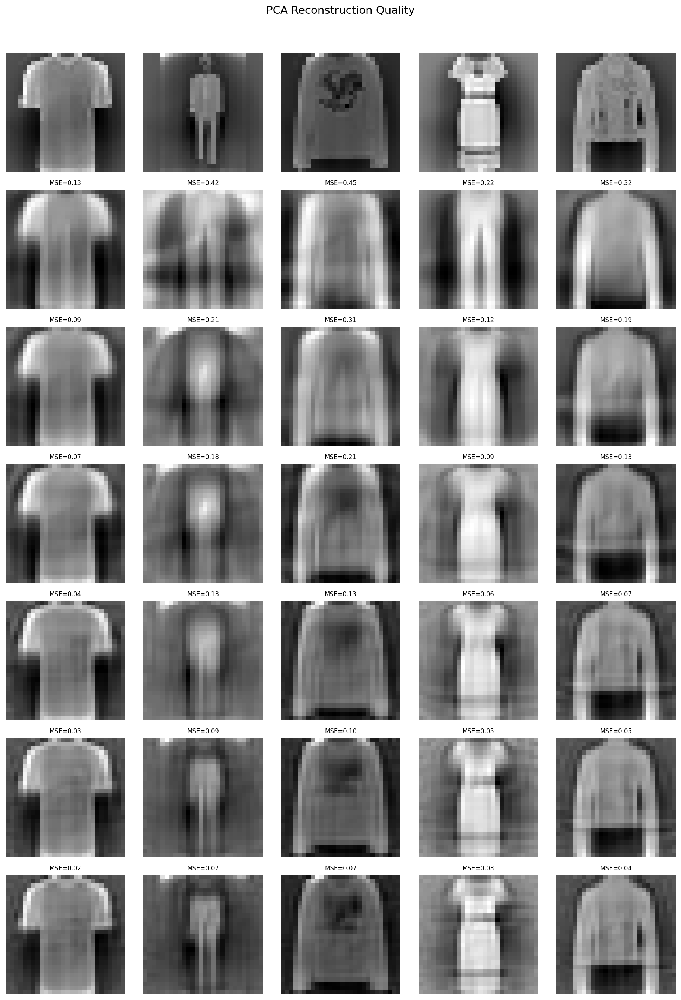
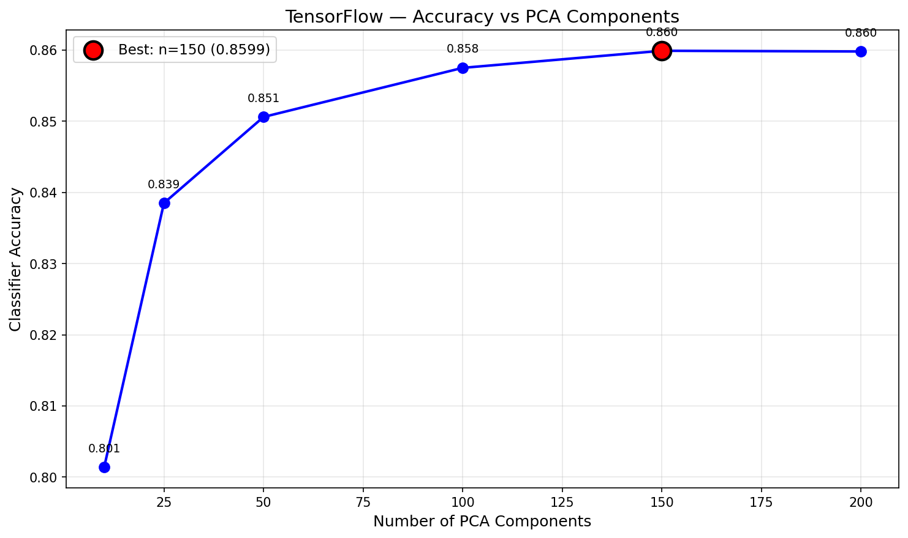

# Principal Component Analysis — TensorFlow (CPU Tensor Ops)

CPU tensor-based PCA via eigendecomposition using TensorFlow eager-mode operations. TF 2.11+ dropped native Windows GPU support, so all ops run on CPU. Same covariance → eigh algorithm as NF/PyTorch, translated to TF tensor ops. Showcase benchmarks eager execution vs `tf.function` graph-mode compilation.

## Overview

- Implement `PCATf` class: fit (CPU covariance → `tf.linalg.eigh`), transform, inverse_transform
- Fit full PCA (784 components) to analyze eigenvalue spectrum
- Scree plot + cumulative variance to determine optimal component count
- Visualize top principal components as 28×28 images
- Reconstruction quality at [10, 25, 50, 100, 150, 200] components
- Downstream KNN accuracy vs compression level
- **Showcase**: Eager vs `tf.function` — graph compilation speedup on PCA's linear algebra
- Performance benchmarks + save results

## TF Translation Guide

Key differences from NumPy/PyTorch when implementing PCA in TensorFlow:

| NumPy / PyTorch | TensorFlow | Why |
|----------------|------------|-----|
| `X.T` | `tf.transpose(X)` | No `.T` property on TF tensors |
| `np.dot(a, b)` | `tf.reduce_sum(a * b)` | No `tf.dot` function |
| `X @ v` (matrix-vector) | `tf.linalg.matvec(X, v)` | `@` needs 2D+ on both sides |
| `arr[bool_mask]` | `tf.boolean_mask(arr, mask)` | No boolean indexing |
| `np.argsort(x)[::-1]` | `tf.argsort(x, direction='DESCENDING')` | Built-in direction parameter |
| `arr[:, idx]` | `tf.gather(arr, idx, axis=1)` | No fancy indexing |
| `.numpy()` at boundaries | `.numpy()` at boundaries | Same pattern as PyTorch `.cpu().numpy()` |

**From sklearn**: `KNeighborsClassifier` only (downstream evaluation, not PCA itself)

## Dataset

| Property | Value |
|----------|-------|
| Source | Fashion-MNIST (Zalando Research, via TensorFlow/Keras) |
| Total Samples | 70,000 (pre-split by Keras) |
| Train / Test | 60,000 / 10,000 |
| Features | 784 (28×28 grayscale images, flattened) |
| Classes | 10 (T-shirt, Trouser, Pullover, Dress, Coat, Sandal, Shirt, Bag, Sneaker, Ankle boot) |
| Class Balance | Perfectly balanced — 6,000/class (train), 1,000/class (test) |
| Scaling | StandardScaler (fit on train, transform both) |
| Pixel Range | 0–255 (uint8) → standardized (zero mean, unit variance) |

## Model Configuration

### PCATf (CPU Eigendecomposition)
```python
pca = PCATf(n_components=150)
pca.fit(X_train)  # float32 on CPU
# Internally: tf.transpose(X_c) @ X_c / n → tf.linalg.eigh → tf.argsort → tf.gather → keep top 150
X_train_pca = pca.transform(X_train)      # TF tensor
X_test_pca = pca.transform(X_test)        # TF tensor
X_test_np = X_test_pca.numpy()            # CPU numpy for sklearn KNN
```

## Results

### Variance Retention

| Components | Explained Variance | Compression Ratio |
|------------|-------------------|-------------------|
| 10 | ~22% | 78.4x |
| 25 | ~38% | 31.4x |
| 50 | ~53% | 15.7x |
| 100 | ~73% | 7.8x |
| 150 | 90.85% | 5.2x |
| 200 | ~95% | 3.9x |

Same population covariance (1/n) as NF/PyTorch — 90% at 137 components, 95% at 256.

### Reconstruction Quality

| Components | MSE |
|------------|-----|
| 10 | 0.3077 |
| 25 | 0.1846 |
| 50 | 0.1361 |
| 100 | 0.0886 |
| 150 | 0.0623 |
| 200 | 0.0462 |

### Downstream KNN Accuracy (K=5)

| Components | Accuracy |
|------------|----------|
| 10 | 0.8014 |
| 25 | 0.8385 |
| 50 | 0.8506 |
| 100 | 0.8575 |
| 150 | 0.8599 |
| 200 | 0.8598 |

150 components is the sweet spot — matches all other frameworks exactly.

### Performance

| Metric | Value |
|--------|-------|
| Training Time (fit) | 0.17s |
| Inference Speed | 0.93 µs/sample |
| Model Size | 463.6 KB |
| Peak Memory | 0.02 MB |
| Components Matrix | (150, 784) |

Peak memory appears near-zero because TensorFlow manages its own memory allocator outside Python's `tracemalloc`.

### Cross-Framework Comparison (4/4)

| Metric | Scikit-Learn | No-Framework | PyTorch | TensorFlow |
|--------|-------------|--------------|---------|------------|
| Training Time | 0.19s | 0.23s | 0.11s | 0.17s |
| Inference Speed | 0.52 µs/sample | 0.89 µs/sample | 0.39 µs/sample | 0.93 µs/sample |
| Model Size | 464.2 KB | 463.6 KB | 463.6 KB | 463.6 KB |
| Peak Memory | 11.74 MB | 191.18 MB | 599.33 MB (GPU) | 0.02 MB |
| Explained Variance | 0.9085 | 0.9085 | 0.9085 | 0.9085 |
| Reconstruction MSE | 0.0951 | 0.0951 | 0.0951 | 0.0951 |
| KNN Accuracy (n=150) | 0.8599 | 0.8599 | 0.8599 | 0.8599 |

TF CPU lands between SK and NF on training speed. Inference is slowest due to eager tensor conversion overhead at the `.numpy()` boundary. All quality metrics match exactly across all 4 frameworks.

## Showcase: Eager vs tf.function

Benchmarked the same PCA fit operation in eager mode vs `tf.function`-compiled graph mode across 50 runs (3 warmup excluded):

| Mode | Mean Time | Std |
|------|-----------|-----|
| Eager | 177.51 ms | 12.01 ms |
| tf.function | 161.74 ms | 3.31 ms |

**1.10x speedup** with graph compilation. Modest improvement because PCA is dominated by a single `tf.linalg.eigh` LAPACK call — graph mode helps most when there are many small ops to fuse. The real benefit is lower variance (3.31 ms vs 12.01 ms std) — graph execution is more consistent.

Eigenvalue difference between modes: 3.43e-05 (identical results).

## Visualizations

### Scree Plot


### Principal Components (Top 10)


### Reconstruction Grid


### Component Accuracy Curve


## Key Insights

1. **TF eager mode works fine for PCA** — the 1.10x `tf.function` speedup confirms that eager mode's Python overhead is small relative to the LAPACK eigendecomposition. For PCA-scale linear algebra, eager is good enough.

2. **Graph mode's real win is consistency** — 3.31 ms std vs 12.01 ms. Eliminating Python interpreter overhead between ops reduces timing jitter, which matters for production latency SLAs more than raw throughput.

3. **TF tensor translation is verbose but mechanical** — every `X.T`, `arr[mask]`, `np.dot` needs an explicit TF equivalent. The pattern is always the same: find the TF function, add `.numpy()` at boundaries. No conceptual difficulty, just boilerplate.

4. **Memory tracking is misleading for TF** — 0.02 MB peak memory is an artifact of TF's custom allocator bypassing Python's `tracemalloc`. The actual memory usage is comparable to NF (~190 MB for the covariance matrix).

5. **All 4 frameworks produce identical PCA** — 0.9085 variance, 0.0951 MSE, 0.8599 accuracy. The algorithm is the same everywhere; only the tensor backend and hardware differ.

## TensorFlow Functions Used

| Function | Purpose |
|----------|---------|
| `tf.transpose(X) @ X / n` | Covariance matrix via CPU matmul |
| `tf.linalg.eigh(cov)` | Symmetric eigendecomposition on CPU |
| `tf.argsort(eigenvalues, direction='DESCENDING')` | Sort by decreasing variance |
| `tf.gather(eigenvectors, idx, axis=1)` | Reorder columns by sorted indices |
| `(X - mean) @ tf.transpose(components)` | Project to reduced space |
| `X_reduced @ components + mean` | Reconstruct from reduced |
| `tensor.numpy()` | TF tensor → numpy at sklearn/plotting boundaries |
| `tf.constant(array, dtype=tf.float32)` | numpy → TF tensor at input boundaries |
| `@tf.function` | Graph-mode compilation for showcase benchmark |

## Files

```
TensorFlow/08-pca/
├── pipeline.ipynb                    # Main implementation (8 cells)
├── README.md                         # This file
├── requirements.txt                  # Dependencies
└── results/
    ├── metrics.json                  # Saved metrics
    ├── scree_plot.png                # Eigenvalue spectrum
    ├── principal_components.png      # Top 10 PCs as images
    ├── reconstruction_grid.png       # Original vs reconstructed
    └── component_accuracy.png        # KNN accuracy vs n_components
```

## How to Run

```bash
cd TensorFlow/08-pca
jupyter notebook pipeline.ipynb
```

**Prerequisites**: Run preprocessing script first:
```bash
cd data-preperation
python preprocess_pca.py
```

Requires: `numpy`, `tensorflow`, `scikit-learn` (KNN only), `matplotlib`
