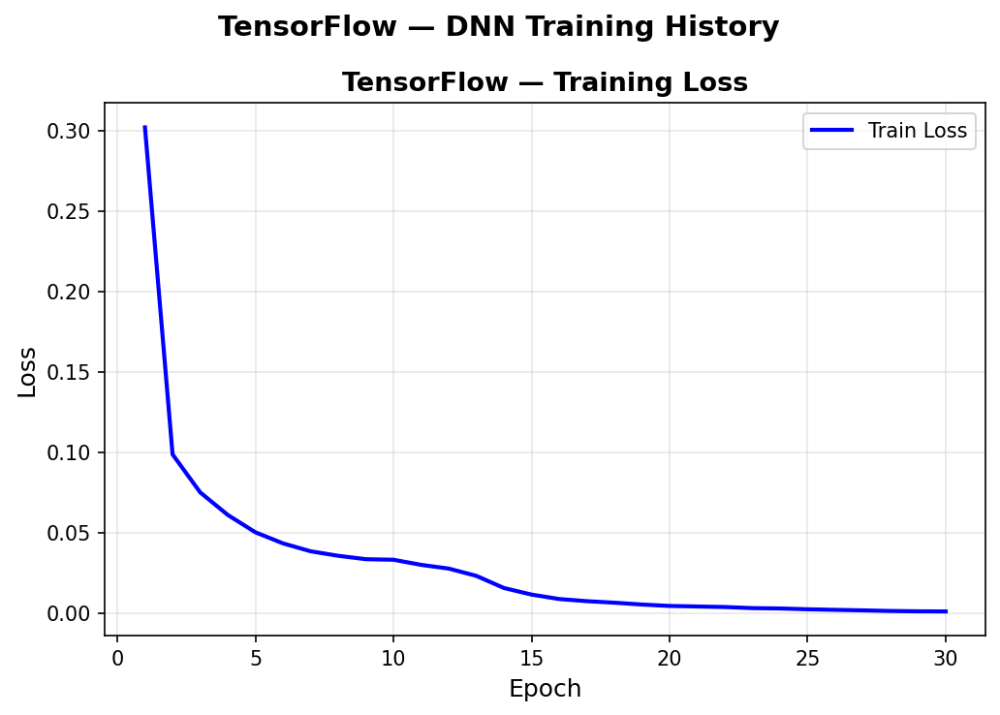
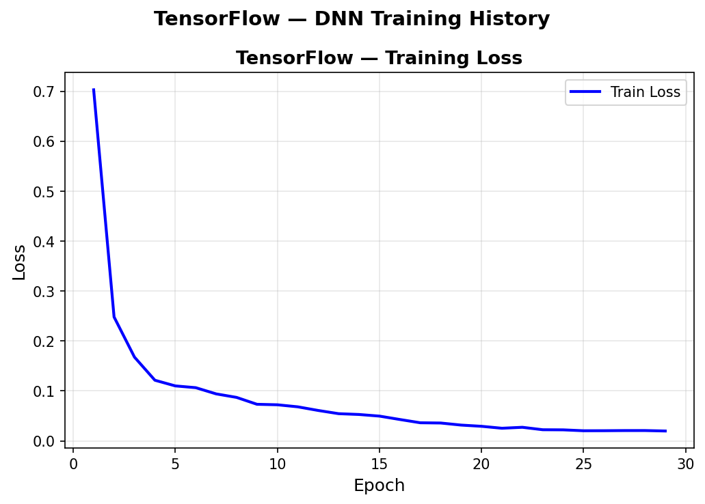
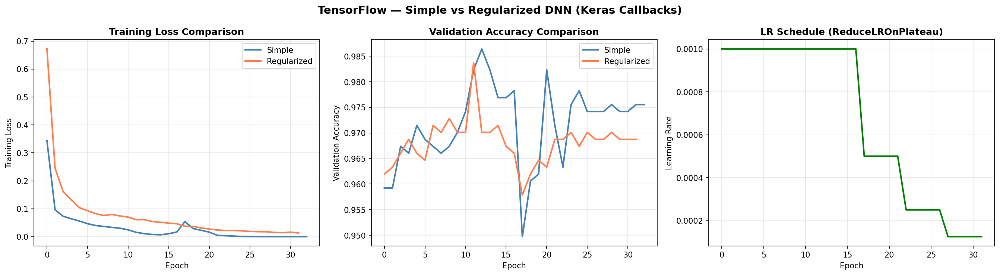
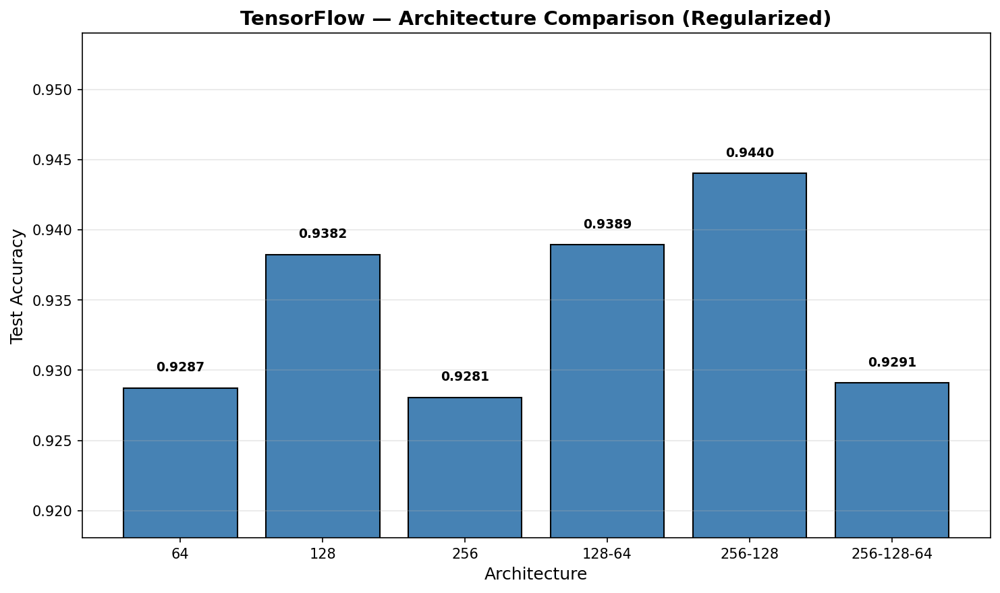
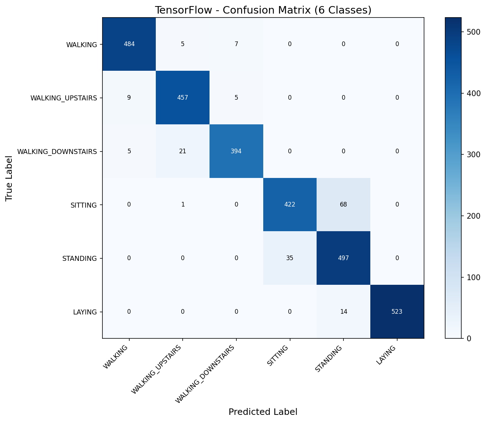
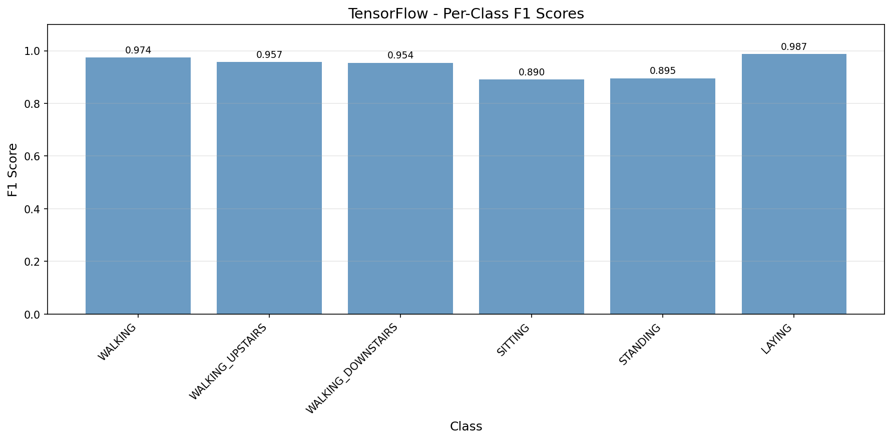

# DNN — TensorFlow / Keras (CPU)

Keras Sequential API with built-in callbacks replaces manual training loops entirely. The 128-64 bottleneck architecture with BatchNorm + Dropout achieves 94.23% accuracy on UCI HAR — competitive with Scikit-Learn (94.91%) using dramatically less code. Showcase compares simple vs regularized models using Keras callbacks (EarlyStopping + ReduceLROnPlateau), demonstrating how 5 lines of callback configuration replaces ~40 lines of manual PyTorch training logic.

## Overview

- Train single-layer baseline DNN (128 neurons) with early stopping
- Visualize training loss curves
- **Showcase**: Keras Callbacks — EarlyStopping + ReduceLROnPlateau vs manual training loop
- Architecture sweep (6 configurations, all regularized)
- Full evaluation on best architecture with confusion matrix + per-class F1
- Performance benchmarks + save results

## CPU Strategy

- TF 2.11+ dropped native Windows GPU support — all ops run on CPU
- Keras `Sequential` API for model building (high-level, production-oriented)
- Built-in `model.fit()` with `validation_split`, callbacks, and automatic history tracking
- No manual training loop needed — Keras handles epochs, batches, metrics internally
- WSL2 GPU setup deferred to CNNs where GPU acceleration provides meaningful benefit

## Dataset

| Property | Value |
|----------|-------|
| Source | UCI ML Repository — Human Activity Recognition Using Smartphones |
| Total Samples | 10,299 (pre-split by subject) |
| Train / Test | 7,352 / 2,947 (21 / 9 subjects) |
| Train / Val Split | 90/10 via `validation_split=0.1` in model.fit() |
| Features | 561 (sensor-derived, pre-computed from accelerometer + gyroscope) |
| Classes | 6 (WALKING, WALKING_UPSTAIRS, WALKING_DOWNSTAIRS, SITTING, STANDING, LAYING) |
| Class Balance | 1.43x imbalance ratio (acceptable, no weighting needed) |
| Scaling | StandardScaler (fit on train, transform both) |
| Label Encoding | Original 1-6 shifted to 0-5 for softmax |

## Model Configuration

### Baseline (Simple DNN)
```python
baseline = keras.Sequential([
    keras.layers.Input(shape=(561,)),
    keras.layers.Dense(128, activation='relu'),
    keras.layers.Dense(6, activation='softmax')
])
baseline.compile(optimizer='adam', loss='sparse_categorical_crossentropy', metrics=['accuracy'])
# EarlyStopping(monitor='val_accuracy', patience=15, restore_best_weights=True)
```

### Best (Regularized DNN with Callbacks)
```python
model = keras.Sequential([
    keras.layers.Input(shape=(561,)),
    keras.layers.Dense(128), keras.layers.BatchNormalization(), keras.layers.ReLU(), keras.layers.Dropout(0.3),
    keras.layers.Dense(64), keras.layers.BatchNormalization(), keras.layers.ReLU(), keras.layers.Dropout(0.3),
    keras.layers.Dense(6, activation='softmax')
])
model.compile(optimizer='adam', loss='sparse_categorical_crossentropy', metrics=['accuracy'])

callbacks = [
    keras.callbacks.EarlyStopping(monitor='val_accuracy', patience=20, restore_best_weights=True),
    keras.callbacks.ReduceLROnPlateau(monitor='val_accuracy', factor=0.5, patience=5)
]
model.fit(X_train, y_train, epochs=200, batch_size=64, validation_split=0.1, callbacks=callbacks)
```

## Results

### Baseline: Simple DNN (128)

| Metric | Value |
|--------|-------|
| Accuracy | 0.9396 |
| Macro F1 | 0.9396 |
| Epochs | 29 (best val_acc: 0.9891) |

### Best: Regularized DNN (128-64)

| Metric | Value |
|--------|-------|
| Accuracy | 0.9423 |
| Macro F1 | 0.9428 |
| Epochs | 29 (best at 9) |
| Training Time | 9.14s |
| Inference | 31.68 µs/sample |
| Model Size | 316.27 KB (trainable only) |
| Parameters | 81,350 (80,966 trainable + 384 non-trainable) |
| Peak Memory | 19.98 MB |

### Model Architecture (best)
```
Model: "sequential"
┌─────────────────────────────────┬────────────────────────┬───────────────┐
│ Layer (type)                    │ Output Shape           │       Param # │
├─────────────────────────────────┼────────────────────────┼───────────────┤
│ Dense (128)                     │ (None, 128)            │        71,936 │
│ BatchNormalization              │ (None, 128)            │           512 │
│ ReLU                            │ (None, 128)            │             0 │
│ Dropout (0.3)                   │ (None, 128)            │             0 │
│ Dense (64)                      │ (None, 64)             │         8,256 │
│ BatchNormalization              │ (None, 64)             │           256 │
│ ReLU                            │ (None, 64)             │             0 │
│ Dropout (0.3)                   │ (None, 64)             │             0 │
│ Dense (6, softmax)              │ (None, 6)              │           390 │
├─────────────────────────────────┼────────────────────────┼───────────────┤
│ Total params: 81,350            │ Trainable: 80,966      │ Non-train: 384│
└─────────────────────────────────┴────────────────────────┴───────────────┘
```

## Showcase: Keras Callbacks

Compared the same 128-64 architecture with and without regularization (BatchNorm + Dropout + ReduceLROnPlateau callbacks):

| Model | Accuracy | Macro F1 | Epochs |
|-------|----------|----------|--------|
| Simple (128-64) | 0.9294 | 0.9294 | 39 |
| Regularized (128-64) | 0.9440 | 0.9439 | 37 |

**Key insights**:
- Regularization adds +1.46% accuracy with fewer epochs
- Keras callbacks replace ~40 lines of PyTorch manual training loop with 5 lines of configuration
- EarlyStopping + restore_best_weights = automatic model checkpointing
- ReduceLROnPlateau = zero-code LR scheduling (PT requires manual `scheduler.step()` call)
- LR schedule shows same step-down pattern as PyTorch (0.001 → 0.0005 → 0.00025 → 0.000125)

## Architecture Sweep (All Regularized)

| Architecture | Accuracy | Macro F1 | Parameters | Epochs |
|-------------|----------|----------|------------|--------|
| 64 | 0.9389 | 0.9395 | 36,614 | 28 |
| 128 | 0.9406 | 0.9416 | 73,222 | 30 |
| 256 | 0.9413 | 0.9417 | 146,438 | 58 |
| 128-64 | 0.9437 | 0.9436 | 81,350 | 36 |
| 256-128 | 0.9270 | 0.9273 | 179,078 | 24 |
| 256-128-64 | 0.9315 | 0.9304 | 187,206 | 25 |

**Best**: 128-64 (bottleneck) — same winner as Scikit-Learn. Wider architectures (256-128, 256-128-64) underperformed, likely due to CPU-only training dynamics and random seed differences.

## Per-Class Performance
- Dynamic activities (WALKING variants): F1 0.920–0.946
- Static activities (SITTING/STANDING): F1 0.870–0.891 — most pronounced confusion across all frameworks
- LAYING: F1 0.995 — near-perfect
- SITTING→STANDING: 86 misclassifications (vs PT's 57, SK's 49) — largest gap here drives TF's lower overall accuracy

## Cross-Framework Comparison (3/3 — No-Framework retired)

| Metric | Scikit-Learn | PyTorch | TensorFlow |
|--------|-------------|---------|------------|
| Accuracy | 0.9491 | 0.9603 | 0.9423 |
| Macro F1 | 0.9493 | 0.9602 | 0.9428 |
| Training Time | 2.42s | 14.65s | 9.14s |
| Inference Speed | 0.65 µs | 0.35 µs | 31.68 µs |
| Model Size | 314.8 KB | 696.5 KB | 316.3 KB |
| Parameters | 80,582 | 178,310 | 81,350 |
| Architecture | 128-64 | 256-128 (BN+DO) | 128-64 (BN+DO) |

**PyTorch wins accuracy** (96.03%) with GPU + wider architecture + regularization. **Scikit-Learn wins speed** (2.42s training, 0.65 µs inference). **TensorFlow wins code simplicity** — `model.fit()` with callbacks is the most concise.

## Visualizations

### Training History (Baseline)


### Training History (Best Model — 128-64)


### Showcase: Keras Callbacks (Simple vs Regularized)


### Architecture Sweep


### Confusion Matrix (6 Classes)


### Per-Class F1 Scores


## Key Insights

1. **Keras callbacks are the killer feature** — EarlyStopping, ReduceLROnPlateau, and restore_best_weights replace 40+ lines of manual PyTorch training logic with 5 lines of callback configuration. For production workflows, this code reduction means fewer bugs and faster iteration.

2. **CPU-only limits DNN potential** — TF's best (94.23%) trails PyTorch GPU (96.03%). The 256-128 architecture that won in PyTorch underperformed in TF (92.70%), suggesting GPU + BatchNorm training dynamics differ from CPU. WSL2 GPU setup will be critical for CNNs.

3. **Inference overhead is Keras's weakness** — 31.68 µs/sample vs PyTorch's 0.35 µs (90x slower). `model.predict()` has per-call Python overhead that dominates for small batches. For production, TF Serving or TFLite would bypass this.

4. **model.summary() is built-in documentation** — Keras automatically generates layer-by-layer architecture tables with parameter counts. PyTorch's `print(model)` is similar but Keras includes total/trainable/non-trainable breakdown and optimizer state.

5. **Same bottleneck architecture wins as SK** — 128-64 outperforms wider/deeper nets, confirming this dataset favors compact representations regardless of framework. The difference is PyTorch's GPU could leverage the wider 256-128 architecture where TF CPU could not.

## Keras Features Used

| Feature | Purpose |
|---------|---------|
| `keras.Sequential` | Layer stacking API |
| `keras.layers.Input` | Explicit input shape (Keras 3.x requirement) |
| `keras.layers.Dense` | Fully connected layers |
| `keras.layers.BatchNormalization` | Batch normalization |
| `keras.layers.Dropout` | Regularization |
| `keras.callbacks.EarlyStopping` | Auto-stop + restore best weights |
| `keras.callbacks.ReduceLROnPlateau` | LR decay on metric plateau |
| `model.compile()` | Configure optimizer, loss, metrics |
| `model.fit()` | Full training loop with validation + callbacks |
| `model.predict()` | Batch inference |
| `model.summary()` | Architecture documentation |
| `model.count_params()` | Parameter counting |

## Files

```
TensorFlow/09-dnn/
├── pipeline.ipynb                    # Main implementation (8 cells)
├── README.md                         # This file
├── requirements.txt                  # Dependencies
└── results/
    ├── dnn.json                      # Saved metrics
    ├── training_history_baseline.png # Baseline loss curve
    ├── training_history_best.png     # Best model loss curve
    ├── showcase_callbacks.png        # Simple vs Regularized comparison
    ├── architecture_sweep.png        # Width/depth comparison
    ├── confusion_matrix.png          # 6-class confusion matrix
    └── per_class_f1.png              # Per-class F1 scores
```

## How to Run

```bash
cd TensorFlow/09-dnn
jupyter notebook pipeline.ipynb
```

**Prerequisites**: Run preprocessing script first:
```bash
cd data-preperation
python preprocess_dnn.py
```

Requires: `numpy`, `tensorflow`, `scikit-learn` (metrics only), `matplotlib`
