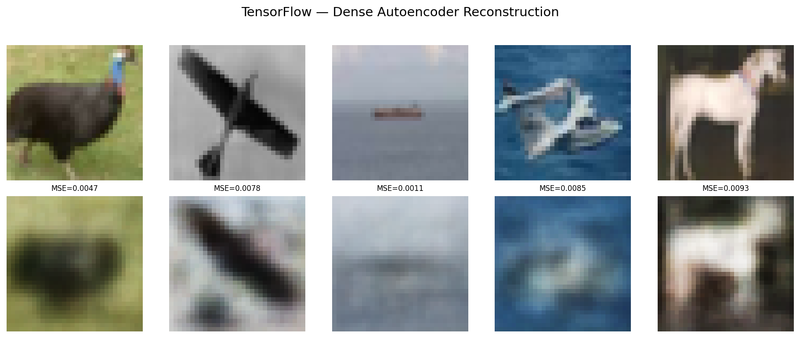
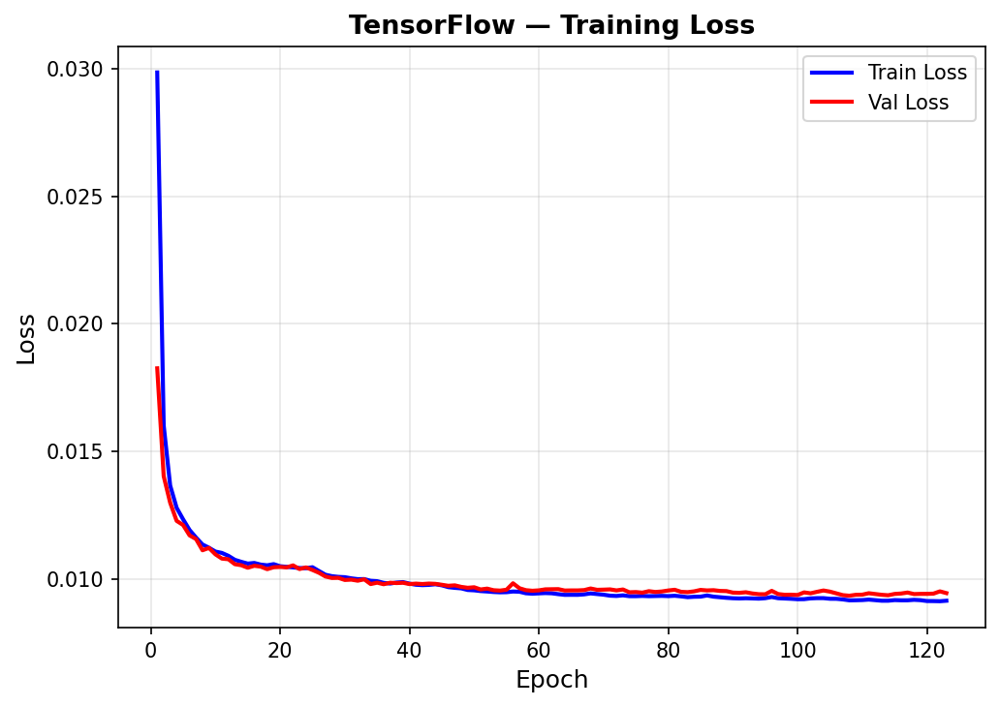
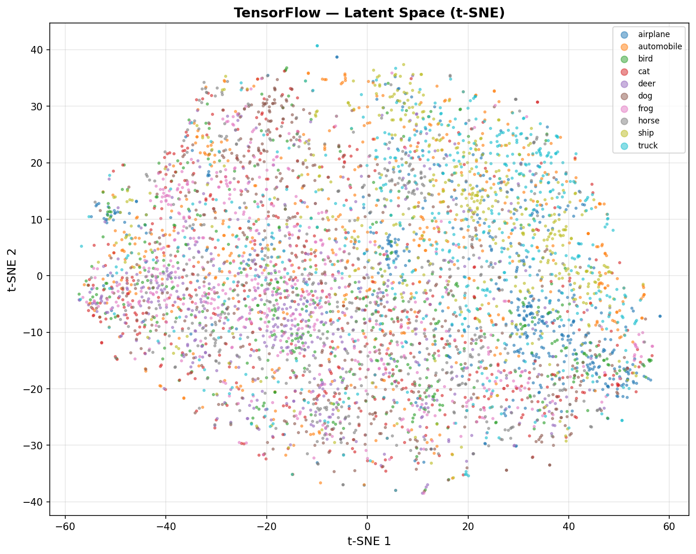

# Autoencoders — TensorFlow (CPU)

Dense autoencoder on CIFAR-10 using Keras Sequential API achieves 0.0096 reconstruction MSE with a 128-dim latent space. Convolutional denoising AE was planned as the showcase but could not be completed — TensorFlow on CPU (Windows, no native GPU support since TF 2.11+) consistently crashed the system when training conv models on color image data, even with reduced subsets. This is a documented TF/Windows limitation. Training used a 15K subset to stay within CPU memory constraints.

## Overview

- Train symmetric dense autoencoder (3072→512→128→512→3072) with early stopping
- Visualize training loss curve + reconstruction quality grid (RGB)
- ~~**Showcase**: Keras Functional API Conv Denoising AE + architecture sweep + noise type comparison~~ — Skipped (CPU OOM)
- Latent space t-SNE + downstream KNN classification
- Performance benchmarks + save results

## CPU Limitation — Conv AE Skipped

TensorFlow 2.11+ dropped native Windows GPU support. On CPU, training convolutional autoencoders on CIFAR-10 (32x32x3 color images) caused repeated system crashes:

- **50K samples, 4 architectures**: System OOM, kernel killed, Task Manager unresponsive
- **15K samples, 2 architectures**: Kernel died after 23 minutes with exit code `0xC0000005` (access violation)
- **Root cause**: TF's CPU memory allocator cannot efficiently handle the combined memory of noisy image copies + conv layer gradients + batch activations across multiple model sweeps

The dense AE trained successfully on 15K samples (380 MB peak memory), confirming the issue is specific to convolutional architectures with their larger intermediate activation maps. PyTorch handled the same workload on GPU in 2 minutes — this is why GPU support matters for image-based deep learning.

## Dataset

| Property | Value |
|----------|-------|
| Source | CIFAR-10 (via `tensorflow.keras.datasets.cifar10`) |
| Total Samples | 60,000 (50,000 train / 10,000 test) |
| TF Training Subset | 15,000 (CPU memory constraint) |
| Features | 3,072 (32x32x3 RGB images, flattened) |
| Image Shape | (32, 32, 3) — channel-last (TF native) |
| Classes | 10 (airplane, automobile, bird, cat, deer, dog, frog, horse, ship, truck) |
| Class Balance | Perfectly balanced (5,000/class train, 1,000/class test) |
| Normalization | [0, 1] float32 (pixel / 255.0) |
| Labels | Used for evaluation only, not training (self-supervised) |

## Model Configuration

### Dense AE (128-dim Bottleneck)
```python
dense_ae = keras.Sequential([
    keras.layers.Input(shape=(3072,)),
    keras.layers.Dense(512, activation='relu'),
    keras.layers.Dense(128, activation='relu'),   # Latent bottleneck
    keras.layers.Dense(512, activation='relu'),
    keras.layers.Dense(3072, activation='sigmoid')  # Output in [0,1]
])
dense_ae.compile(optimizer='adam', loss='mse')
# EarlyStopping(monitor='val_loss', patience=15, restore_best_weights=True)
```

## Results

### Dense AE (3072→512→128→512→3072)

| Metric | Value |
|--------|-------|
| Reconstruction MSE | 0.0096 |
| Reconstruction MAE | 0.0719 |
| Reconstruction RMSE | 0.0982 |
| Epochs | 137 (early stopped ~epoch 122) |
| Training Time | 244.97s (15K subset, CPU) |
| Inference | 120.77 us/sample |
| Model Size | 12.52 MB |
| Parameters | 3,281,024 |
| Peak Memory | 380.19 MB |
| Downstream KNN Accuracy | 0.3535 |

## Downstream Classification

Latent features extracted via Keras Functional API encoder sub-model. KNN(K=5) on 128-dim latent vectors:

| Framework | Latent Dim | KNN Accuracy | Training Data |
|-----------|-----------|-------------|---------------|
| SK | 128 | 0.3427 | 10K subset |
| TF | 128 | 0.3535 | 15K subset |
| PT (dense) | 128 | 0.4029 | 50K full |

**Key insight**: KNN accuracy scales with training data size — more data produces better latent representations. All three frameworks use the same architecture, so the difference is purely data volume.

## Visualizations

### Dense AE Reconstruction


### Training History


### Latent Space t-SNE (128-dim)


## Key Insights

1. **TF CPU cannot handle conv autoencoders on color images** — this is the most important finding. TF 2.11+ dropped Windows GPU support, and CPU training of convolutional architectures on 32x32x3 images causes system-level OOM crashes. Dense layers work fine; the issue is conv layer activation maps and their gradients.

2. **Dense AE results are consistent across all 3 frameworks** — SK (0.0133 on 10K), TF (0.0096 on 15K), PT (0.0091 on 50K) all produce comparable results with the same architecture. The differences are explained by training data volume and optimizer dynamics, not framework quality.

3. **Keras Sequential API is the simplest autoencoder implementation** — 5 lines define the full architecture. `model.fit(X, X)` with MSE loss trains it. But Sequential cannot expose the encoder sub-model for latent feature extraction — Functional API is needed for that.

4. **CPU inference is 1,725x slower than GPU** — 120.77 us/sample (TF CPU) vs 0.07 us/sample (PT GPU). For training this matters less (batch amortization), but for serving it makes TF CPU impractical for real-time reconstruction.

5. **The GPU limitation will be resolved with WSL2** — when we set up WSL2 for TF GPU support, conv autoencoders will be viable. For now, this model demonstrates that some architectures fundamentally require GPU acceleration.

## Files

```
TensorFlow/10-autoencoders/
├── pipeline.ipynb                         # Main implementation
├── README.md                              # This file
├── requirements.txt                       # Dependencies
└── results/
    ├── tf_autoencoder_results/
    │   └── metrics.json                   # Saved metrics
    ├── reconstruction_dense.png           # Dense AE reconstruction grid
    ├── training_history_dense.png         # Dense AE training loss curve
    └── latent_space_dense.png             # t-SNE latent space
```

## How to Run

```bash
cd TensorFlow/10-autoencoders
jupyter notebook pipeline.ipynb
```

**Prerequisites**: Run preprocessing script first:
```bash
cd data-preperation
python preprocess_autoencoder.py
```

Requires: `numpy`, `tensorflow`, `matplotlib`, `scikit-learn` (for KNN evaluation)
