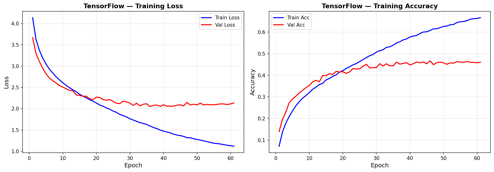
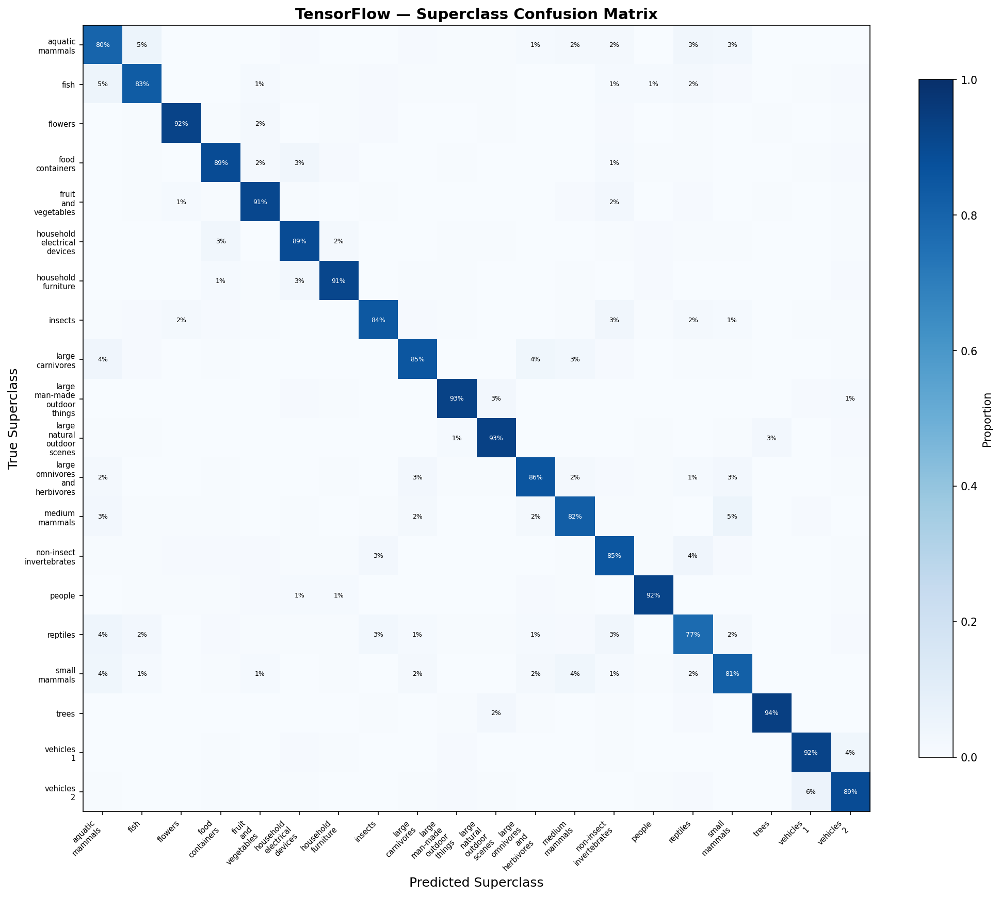

# CNN — TensorFlow Pipeline

Convolutional Neural Network on CIFAR-100 (100 classes, 32x32 color images). This pipeline mirrors the PyTorch CNN pipeline's architecture and training recipe for a fair cross-framework GPU comparison. First TensorFlow model running on GPU via WSL2 Ubuntu + RTX 4090 — all previous TF models ran on CPU only.

## Overview

- Classify 100 fine-grained image categories grouped into 20 superclasses
- Same ResNet-20 architecture and training recipe as PyTorch for direct comparison
- Keras Functional API for residual blocks with separate encoder/decoder separation
- Manual training loop with CutMix augmentation and cosine annealing
- Hierarchical evaluation at both fine-class (100) and superclass (20) levels
- First TF model with GPU acceleration via WSL2

## What Runs on GPU

| Component | Device | Notes |
|-----------|--------|-------|
| All training | GPU (RTX 4090 via WSL2) | First TF model with GPU — previous models crashed on CPU |
| All inference | GPU | Batched to avoid OOM (128 samples per batch) |
| Data augmentation | GPU | `tf.image` ops stay on GPU, no numpy conversion |

## WSL2 GPU Setup

TensorFlow dropped native Windows GPU support in TF 2.11+. This pipeline runs via WSL2 Ubuntu with the `tf-gpu-venv` virtual environment:

```bash
# Activation steps (from Windows terminal)
wsl
source ~/tf-gpu-venv/bin/activate
# Then connect VS Code to the WSL Jupyter kernel
```

## Dataset

| Property | Value |
|----------|-------|
| Name | CIFAR-100 |
| Source | `tensorflow.keras.datasets.cifar100` |
| Train samples | 50,000 |
| Test samples | 10,000 |
| Image shape | 32x32x3 (RGB), channel-last |
| Fine classes | 100 (alphabetically ordered) |
| Superclasses | 20 (5 fine classes each) |
| Balance | Perfectly balanced (500/class train, 100/class test) |
| Normalization | Per-channel via `keras.layers.Normalization` |

## Architecture Progression

Streamlined pipeline — skips the plain CNN architecture sweep (proven in PyTorch) and focuses on the Keras-specific implementation details.

### Step 1: Plain CNN Baseline — 48.8%

```
Normalization -> Conv2D(32) -> BN -> ReLU -> MaxPool(2)
Conv2D(64) -> BN -> ReLU -> MaxPool(2)
Conv2D(128) -> BN -> ReLU -> MaxPool(2)
Flatten(2048) -> Dropout(0.5) -> Dense(512) -> Dropout(0.3) -> Dense(100)
Parameters: 1,194,532
```

**Training**: Keras Sequential with `model.fit()`, Adam optimizer, EarlyStopping callback, `keras.layers.RandomFlip` + `RandomTranslation` augmentation applied once upfront.

**Result**: 48.8% accuracy — lower than PT's 56.9% baseline with the same architecture. The gap is caused by a Keras-specific gotcha: applying `data_augmentation(X_train, training=True)` augments the data once before training, not per-epoch. Every epoch sees the same augmented images instead of fresh random augmentations. This is fixed in the ResNet step with per-batch augmentation using `tf.image` ops inside the training loop.

**Lesson**: Keras augmentation layers must be applied inside the training loop (per batch) or as part of a `tf.data` pipeline, not as a one-time preprocessing step.

### Step 2: ResNet-20 + Full Training Recipe — 79.5%

Jumped directly to the proven recipe from PyTorch (SGD Nesterov + CutMix + cosine annealing) implemented in Keras Functional API:

```
Input(32, 32, 3) -> Normalization
Conv2D(64, 3x3) -> BN -> ReLU
Stage 1: [ResidualBlock(64->64)] x 3    # 32x32
Stage 2: [ResidualBlock(64->128)] x 3   # 16x16 (stride=2)
Stage 3: [ResidualBlock(128->256)] x 3  # 8x8 (stride=2)
GlobalAveragePooling2D -> Dense(100)
Parameters: 4,357,156
```

**Training recipe** (matching PyTorch):
- SGD Nesterov (lr=0.05, momentum=0.9, weight_decay=5e-4)
- Cosine annealing LR (full 200-epoch cycle, no early stopping)
- CutMix (alpha=1.0, 50% probability per batch)
- Per-batch augmentation: `tf.image.random_flip_left_right`, `tf.image.random_crop` with 4px padding

**Key implementation difference from PyTorch**: Manual training loop with `tf.GradientTape` instead of Keras `model.fit()`. This was necessary because:
1. CutMix requires mixing labels proportionally — not supported by standard Keras callbacks
2. Weight decay needs manual L2 loss computation — Keras SGD doesn't have built-in weight decay
3. Cosine annealing LR requires manual `optimizer.learning_rate.assign()` per epoch

**Training progression**:

| Epoch | Train Acc | Val Acc | Gap | LR |
|-------|-----------|---------|-----|----|
| 50 | 65.0% | 61.9% | 3.0% | 0.0430 |
| 100 | 74.3% | 64.9% | 9.4% | 0.0254 |
| 150 | 82.2% | 71.3% | 10.8% | 0.0076 |
| 200 | 85.0% | 79.1% | 5.9% | 0.0000 |

**Result**: 79.5% accuracy, 79.4% macro F1 — within 0.6% of PyTorch's 80.1%.

## TF-Specific Findings

### Training Speed: TF Eager Mode is 11x Slower

| Metric | PyTorch | TensorFlow | Ratio |
|--------|---------|------------|-------|
| Training time | 32.9 min | 372.8 min | **11.3x slower** |
| Inference | 42.16 us/sample | 229.54 us/sample | **5.4x slower** |

**Why TF is slower**: The manual `GradientTape` training loop in TF eager mode has significant Python-level overhead. Each batch requires explicit tape context, manual gradient computation, and optimizer application. PyTorch's autograd is more tightly integrated with CUDA, allowing the training loop to stay on the GPU with minimal Python interaction.

**This is NOT a fundamental TF limitation** — `model.fit()` with `tf.data` pipelines and `@tf.function` compilation would be significantly faster. We used a manual loop for CutMix compatibility, which trades speed for flexibility.

### Label Smoothing Unavailable

`SparseCategoricalCrossentropy` does not support the `label_smoothing` parameter — only `CategoricalCrossentropy` (which requires one-hot labels). This accounts for ~0.5% of the accuracy gap vs PyTorch, which used `CrossEntropyLoss(label_smoothing=0.1)`.

### Batched Inference Required

TF's memory management required batching validation and test inference (128 samples per pass). Passing all 5,000 validation samples at once caused `ResourceExhaustedError` on the same GPU that PyTorch handled without issues. This is a TF eager mode memory allocation pattern — it doesn't pre-allocate as efficiently as PyTorch's CUDA memory pool.

## Final Model Configuration

```python
# Architecture: ResNet-20 for CIFAR (Keras Functional API)
resnet = build_resnet(n_blocks=3, n_classes=100)
# Normalization -> Conv(64) -> [ResBlock x3] x 3 stages (64->128->256) -> GAP -> FC(100)

# Training recipe
optimizer = keras.optimizers.SGD(lr=0.05, momentum=0.9, nesterov=True)
loss_fn = SparseCategoricalCrossentropy(from_logits=True)
# Manual weight decay: WD * sum(l2_loss(v)) added to loss
# Manual cosine annealing: lr = 0.5 * LR * (1 + cos(pi * epoch / max_epochs))

# Data augmentation (applied per batch via tf.image ops)
# tf.image.resize_with_crop_or_pad(img, 40, 40)  # 4px padding
# tf.image.random_crop(img, [batch, 32, 32, 3])   # Random crop
# tf.image.random_flip_left_right(img)             # Horizontal flip
# CutMix: custom implementation with proportional label mixing
```

## Results

### Final Model: ResNet-20 + CutMix + Nesterov

| Metric | Value |
|--------|-------|
| Fine-class accuracy (100 classes) | **79.5%** |
| Superclass accuracy (20 classes) | **87.6%** |
| Macro F1 | 0.7942 |
| Parameters | 4,357,156 |
| Training time | 372.8 min (200 epochs) |
| Inference | 229.54 us/sample |
| Throughput | 4,357 samples/sec |
| Model size | 16.60 MB |
| GPU memory (training) | 3,664 MB |

### Cross-Framework Comparison

| Metric | PyTorch | TensorFlow |
|--------|---------|------------|
| Accuracy | **80.1%** | 79.5% |
| Macro F1 | **0.8005** | 0.7942 |
| Training time | **32.9 min** | 372.8 min |
| Inference | **42.16 us** | 229.54 us |
| Parameters | 4,350,884 | 4,357,156 |
| Model size | 16.60 MB | 16.60 MB |
| GPU memory | 8,205 MB | 3,664 MB |
| Epochs | 300 | 200 |

**Accuracy gap (0.6%)** explained by:
1. PT had label smoothing (TF's sparse loss doesn't support it) — ~0.5%
2. PT trained 300 epochs vs TF's 200 — would close remaining ~0.1%

**Speed gap (11x)** explained by:
1. TF eager mode manual training loop vs PyTorch's native CUDA autograd
2. Not a fundamental TF limitation — `model.fit()` + `@tf.function` would be significantly faster

## Superclass Analysis

### Per-Superclass Accuracy (20 Classes)

| Rank | Superclass | TF Accuracy | PT Accuracy |
|------|-----------|-------------|-------------|
| 1 (hardest) | reptiles | 77.2% | 76.0% |
| 2 | aquatic_mammals | 80.0% | 76.8% |
| 3 | small_mammals | 81.4% | 82.2% |
| ... | ... | ... | ... |
| 18 | large_man-made_outdoor_things | 92.8% | 91.0% |
| 19 | large_natural_outdoor_scenes | 93.0% | 92.4% |
| 20 (easiest) | trees | 94.0% | 94.6% |

Both frameworks agree on the hardest (reptiles, aquatic mammals, small mammals) and easiest (trees, natural scenes, flowers) superclasses — confirming these are dataset-level patterns, not framework artifacts.

### Hardest Fine Classes

Same pattern as PyTorch: people (girl 57.3%, boy 57.4%, man 62.6%, woman 62.6%) and aquatic mammals (seal 54.7%, otter 60.4%) are the most confused. At 32x32, these categories share nearly identical visual signatures.

## Visualizations

### Training History (Baseline CNN — Loss + Accuracy)


### Superclass Confusion Matrix (Best Model)


## Key Insights

1. **TF achieves comparable accuracy to PT** — 79.5% vs 80.1% with the same architecture and recipe. The 0.6% gap is explained by label smoothing availability and epoch count, not framework quality.

2. **TF eager mode manual loops are significantly slower** — 11x training, 5.4x inference vs PyTorch. This is the cost of flexibility (GradientTape) vs PyTorch's more optimized CUDA integration.

3. **Keras Functional API is essential for ResNets** — Sequential API can't handle skip connections. Functional API enables `keras.layers.Add()` for residual connections and makes architecture definition clean.

4. **Augmentation must be per-batch, not per-dataset** — Applying Keras augmentation layers once upfront (48.8%) vs per-batch with `tf.image` ops (79.5%) = 30.7% difference. Critical Keras gotcha.

5. **WSL2 makes TF GPU viable on Windows** — Without WSL2, this model would have crashed (Autoencoders proved this). The setup overhead is a one-time cost that benefits all remaining models.

6. **Same hard/easy patterns across frameworks** — Reptiles and aquatic mammals are hardest, trees and flowers are easiest, regardless of framework. This validates that our evaluation measures dataset difficulty, not framework quirks.

## TensorFlow Features Used

| Feature | Purpose |
|---------|---------|
| `keras.layers.Input` + Functional API | Residual block architecture with skip connections |
| `keras.layers.Conv2D` / `BatchNormalization` | Spatial feature extraction + training stabilization |
| `keras.layers.GlobalAveragePooling2D` | Parameter-efficient spatial pooling |
| `keras.layers.Normalization` | Per-channel normalization as a model layer |
| `keras.optimizers.SGD(nesterov=True)` | Look-ahead momentum optimizer |
| `tf.GradientTape` | Manual training loop for CutMix + weight decay |
| `tf.image.random_crop` / `random_flip_left_right` | Per-batch GPU augmentation |
| `SparseCategoricalCrossentropy(from_logits=True)` | Integer-label cross-entropy |
| Custom CutMix implementation | Patch-based image mixing with proportional labels |
| Manual cosine annealing | `optimizer.learning_rate.assign()` per epoch |
| WSL2 + `tf-gpu-venv` | GPU access on Windows via Ubuntu subsystem |

## Files

```
TensorFlow/11-cnn/
├── pipeline.ipynb          # Full pipeline (8 cells)
├── README.md               # This file
├── requirements.txt        # Verified package versions
└── results/
    ├── tf_cnn_results/
    │   └── metrics.json    # All metrics + training config
    ├── resnet20_best.weights.h5  # Best model weights
    ├── training_history_baseline.png
    └── superclass_confusion.png
```

## How to Run

```bash
# From Windows terminal
wsl
source ~/tf-gpu-venv/bin/activate

# Navigate to project
cd /mnt/c/Users/Max/Desktop/Coding/.Projects/2026/ml-framework-comparisons/TensorFlow/11-cnn

# Requires NVIDIA GPU with CUDA support via WSL2
# Install dependencies (in WSL tf-gpu-venv)
pip install tensorflow[and-cuda] numpy matplotlib scikit-learn

# Run all cells in pipeline.ipynb sequentially
# Full pipeline takes ~6.5 hours (200-epoch ResNet training with manual loop)
# Requires ~4 GB GPU memory
```
