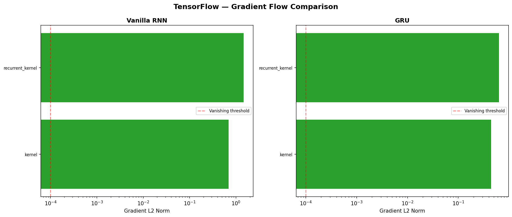
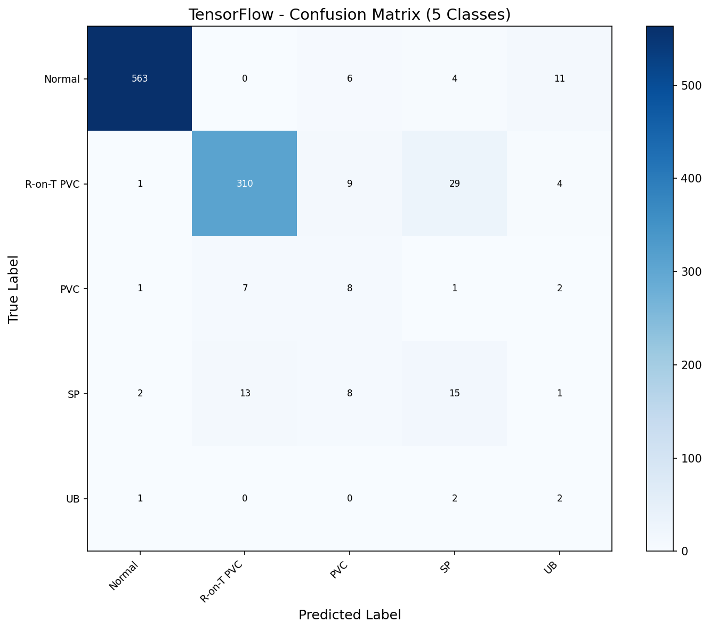
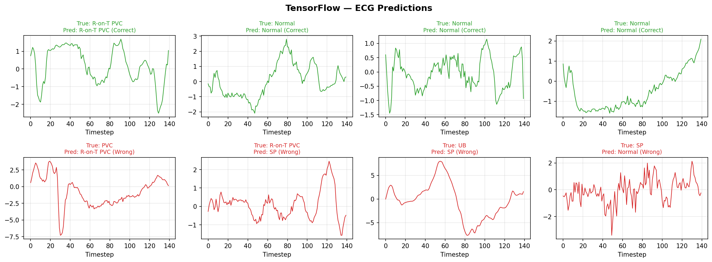
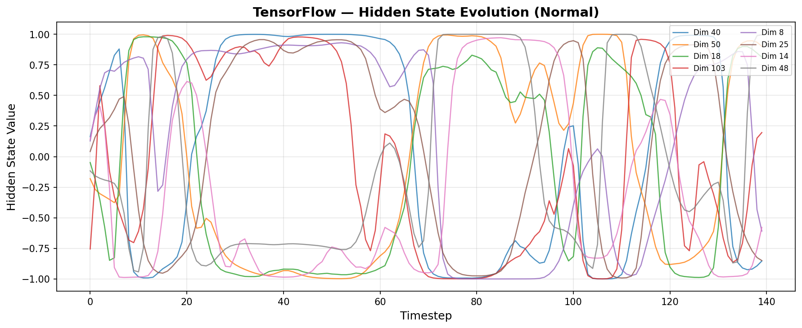

# RNN — TensorFlow Pipeline

Recurrent Neural Network on ECG5000 (5-class heartbeat classification, 140 timesteps). This pipeline mirrors the PyTorch RNN pipeline — vanilla SimpleRNN baseline, vanishing gradient analysis, GRU comparison, and architecture sweep — but uses Keras Sequential API with `model.fit()` for training. The key TF-specific finding: Bidirectional GRU won the architecture sweep (vs unidirectional GRU-128 on PyTorch), showing that framework implementation details can influence which architecture performs best.

## Overview

- Classify 5 heartbeat types from univariate ECG waveforms (140 timesteps)
- Progressive comparison: SimpleRNN -> GRU -> Architecture sweep
- Keras Sequential API with `model.fit(class_weight=...)` for imbalanced data
- Custom MacroF1Callback for early stopping on the right metric
- Vanishing gradient analysis via `tf.GradientTape`
- CPU training on Windows (WSL2 GPU unnecessary — dataset trains in minutes)

## What Runs on CPU

| Component | Device | Why |
|-----------|--------|-----|
| All training | CPU (Windows) | ECG5000 is small — 4K samples x 140 timesteps trains in ~3 min |
| All inference | CPU | 1K test samples, no GPU needed |
| Gradient computation | CPU | GradientTape for gradient flow analysis |

**GPU decision**: PyTorch trained in 4s on GPU. Even 50x slower on CPU = ~3 min. Not worth the WSL2 kernel setup friction for this dataset size.

## Dataset

| Property | Value |
|----------|-------|
| Name | ECG5000 (MIT-BIH Arrhythmia Classification) |
| Source | UCR Time Series Archive (via aeon) |
| Train samples | 4,000 |
| Test samples | 1,000 |
| Sequence shape | 140 timesteps x 1 feature (univariate) |
| Classes | 5: Normal, R-on-T PVC, PVC, SP, UB |
| Balance | **Severely imbalanced (121.6x)**: Normal 58.4%, UB 0.5% |
| Normalization | StandardScaler per-timestep, fit on train only |
| Class weights | Normal=0.34, R-on-T PVC=0.57, PVC=10.39, SP=5.16, UB=42.11 |

## Architecture Progression

### Step 1: SimpleRNN Baseline — 87.2% Accuracy, 0.52 Macro F1

```
keras.layers.SimpleRNN(64, return_sequences=True)
keras.layers.SimpleRNN(64)
keras.layers.Dense(5)
Parameters: 12,805
```

**Training**: Adam optimizer, `SparseCategoricalCrossentropy(from_logits=True)`, `class_weight` dict, custom `MacroF1Callback` for early stopping (patience=10).

**Result**: 87.2% accuracy, macro F1 0.5207. Similar to PT vanilla RNN (84.6% acc, 0.49 F1). Majority classes strong (Normal F1=0.95, R-on-T PVC F1=0.91), minority classes weak.

### Step 2: Vanishing Gradient Analysis — All Healthy

| Layer | Gradient Norm | Status |
|-------|--------------|--------|
| kernel | 6.53e-01 | Healthy |
| recurrent_kernel | 7.89e-01 | Healthy |
| bias | 1.66e-01 | Healthy |

**Gradient ratio: 1.2x** — even tighter than PT's 4.2x. Same conclusion: 140 timesteps doesn't trigger vanishing gradients.

### Step 3: GRU — Marginal Improvement

```
keras.layers.GRU(64, return_sequences=True)
keras.layers.GRU(64)
keras.layers.Dense(5)
Parameters: 38,149
```

**Result**: 86.3% accuracy, macro F1 0.5231 — only +0.002 over SimpleRNN. Consistent with PT finding that gating provides minimal benefit on short sequences.

### Gradient Flow Comparison: SimpleRNN vs GRU



Both architectures show healthy gradients. Gradient ratios nearly identical (1.2x vs 1.3x).

### Step 4: Architecture Sweep — Bidirectional Wins

| Architecture | Accuracy | Macro F1 | Parameters | Time |
|-------------|----------|----------|------------|------|
| GRU-64 (2 layers) | 88.8% | 0.5185 | 38,149 | 128s |
| GRU-128 (2 layers) | 88.3% | 0.5494 | 150,021 | 189s |
| GRU-64 (3 layers) | 89.7% | 0.5505 | 63,109 | 162s |
| **BiGRU-64 (2 layers)** | **89.8%** | **0.5397** | **100,869** | **218s** |

**Finding**: BiGRU-64 won on TF while GRU-128 won on PT. The bidirectional backward pass through early ECG timesteps apparently captures useful morphological features in Keras's implementation. Different framework, different winner — but both within the same macro F1 range (0.54-0.58).

## Final Model Configuration

```python
# Architecture: Bidirectional GRU-64
model = keras.Sequential([
    keras.layers.Input(shape=(140, 1)),
    keras.layers.Bidirectional(keras.layers.GRU(64, return_sequences=True)),
    keras.layers.Bidirectional(keras.layers.GRU(64)),
    keras.layers.Dense(5)
])

# Training recipe
model.compile(
    optimizer='adam',
    loss=keras.losses.SparseCategoricalCrossentropy(from_logits=True),
    metrics=['accuracy']
)
# model.fit(class_weight={0: 0.34, 1: 0.57, 2: 10.39, 3: 5.16, 4: 42.11})
# Custom MacroF1Callback for early stopping on val macro F1
```

## Results

### Final Model: Bidirectional GRU-64 (2 Layers)

| Metric | Value |
|--------|-------|
| Accuracy | **89.8%** |
| Macro F1 | **0.5397** |
| Parameters | 100,869 |
| Training time | 218.30s (45 epochs) |
| Inference | 416.78 us/sample |
| Throughput | 2,399 samples/sec |
| Model size | 394.0 KB |
| Device | CPU (Windows) |

### Confusion Matrix



Normal (564/584) and R-on-T PVC (300/353) dominate the diagonal. SP shows better distribution than PT (19/39 correct vs 11/39), and PVC captures 10/19. R-on-T PVC has notable confusion with SP (37 samples) — the model sometimes over-predicts SP.

### ECG Predictions



### Hidden State Evolution



BiGRU hidden states show bidirectional dynamics — the forward and backward GRU outputs are concatenated (128 dims = 64 forward + 64 backward), creating richer temporal representations than unidirectional models.

### Training History


## What Worked and What Didn't

### What Worked

1. **Bidirectional GRU** — Unlike PT where BiGRU didn't help, TF's BiGRU-64 was the sweep winner. The backward pass through early ECG timesteps captured useful morphological features that the forward-only model missed.

2. **`model.fit(class_weight=...)` ** — Keras's built-in class weight support is cleaner than PT's `CrossEntropyLoss(weight=tensor)`. Dict format maps directly from metadata.

3. **Custom MacroF1Callback** — Keras `EarlyStopping` only monitors built-in metrics. Custom callback computes macro F1 each epoch and stores best weights — essential for imbalanced data.

4. **`keras.layers.Input` instead of `input_shape=`** — Avoids deprecation warning in Keras 3.x. Cleaner model definition.

### What Didn't Work

1. **`model.input` for hidden state extraction** — Keras Sequential models don't expose `.input` for `keras.Model()` extraction. Had to rebuild with `return_sequences=True` and copy weights.

2. **GRU-128 (PT's winner)** — Came third on TF. Different random initialization and Keras's internal training dynamics favor different architectures than PT's manual training loop.

3. **CPU inference speed** — 417 us/sample vs PT's 4.5 us on GPU. Expected, but ~96x slower. Production deployment would need GPU or TF Serving optimization.

## Cross-Framework Comparison

| Metric | PyTorch | TensorFlow |
|--------|---------|------------|
| Best Architecture | GRU-128 (unidirectional) | BiGRU-64 (bidirectional) |
| Accuracy | 91.8% | 89.8% |
| Macro F1 | 0.5479 | 0.5397 |
| Parameters | 150,021 | 100,869 |
| Training time | 3.71s (GPU) | 218s (CPU) |
| Inference | 4.32 us (GPU) | 417 us (CPU) |
| Model size | 586 KB | 394 KB |

**Key insight**: Both frameworks achieve similar macro F1 (~0.54) despite different winning architectures. The performance ceiling is data-driven (121.6x imbalance), not framework-driven.

## TensorFlow Features Used

| Feature | Purpose |
|---------|---------|
| `keras.layers.SimpleRNN` | Vanilla RNN baseline |
| `keras.layers.GRU` | Gated Recurrent Unit |
| `keras.layers.Bidirectional` | Wraps GRU for forward + backward processing |
| `keras.Sequential` | Model construction API |
| `SparseCategoricalCrossentropy` | Loss for integer labels (0-4) |
| `model.fit(class_weight=...)` | Built-in class weight support for imbalanced data |
| `tf.GradientTape` | Manual gradient computation for vanishing gradient analysis |
| Custom `MacroF1Callback` | Early stopping on validation macro F1 |

## Files

```
TensorFlow/12-rnn/
├── pipeline.ipynb                    # Full pipeline (8 cells)
├── README.md                         # This file
├── requirements.txt                  # Verified package versions
└── results/
    ├── bigru_64_best.weights.h5      # Best model weights
    ├── metrics.json                  # All metrics + training config
    ├── gradient_flow_vanilla.png     # SimpleRNN gradient norms
    ├── gradient_flow_comparison.png  # SimpleRNN vs GRU side-by-side
    ├── confusion_matrix.png          # 5-class confusion matrix
    ├── ecg_predictions.png           # ECG waveforms (correct/incorrect)
    ├── hidden_states_normal.png      # Hidden state evolution — Normal
    ├── hidden_states_r-on-t_pvc.png  # Hidden state evolution — R-on-T PVC
    ├── hidden_states_pvc.png         # Hidden state evolution — PVC
    ├── hidden_states_sp.png          # Hidden state evolution — SP
    ├── hidden_states_ub.png          # Hidden state evolution — UB
    └── training_history.png          # Training loss + accuracy curves
```

## How to Run

```bash
# From project root (Windows .venv)
cd TensorFlow/12-rnn

pip install -r requirements.txt

# Run all cells in pipeline.ipynb sequentially
# Full pipeline takes ~12 minutes on CPU
# No GPU required
```
