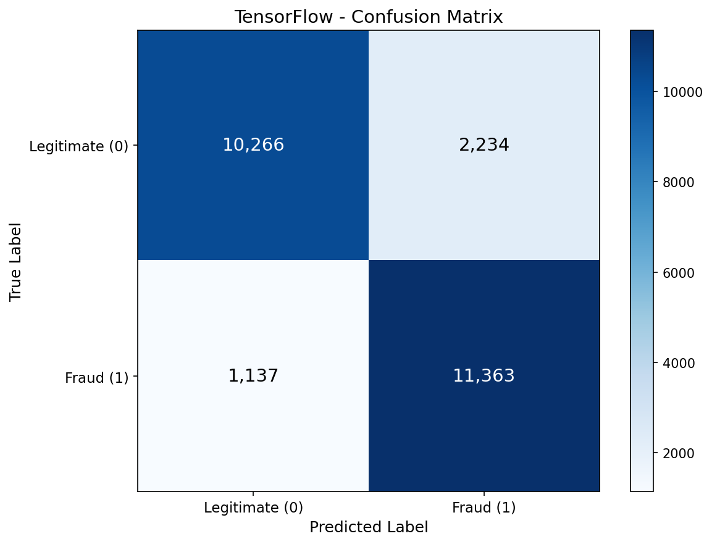
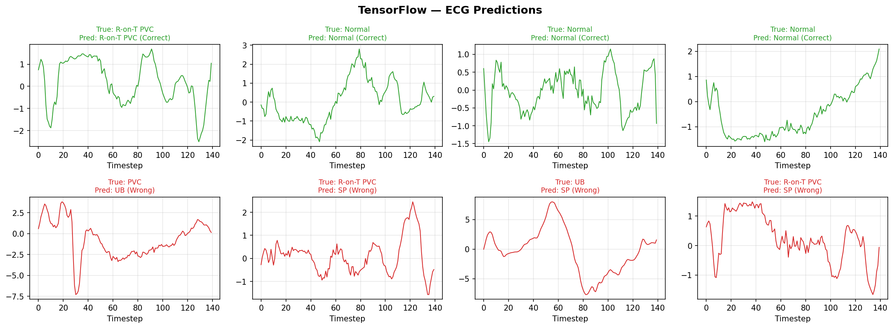
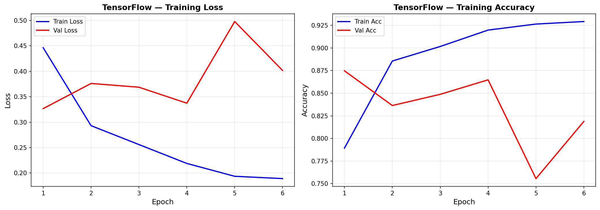

# LSTM — TensorFlow Pipeline

Two-part LSTM pipeline mirroring the PyTorch implementation. Part A trains LSTM-128 on augmented ECG5000 (0.607 macro F1, slightly beating PT's 0.603). Part B confirms IMDB baseline (86.5% accuracy vs PT's 87.8%). Both run on CPU — ECG trains in 8 min, IMDB in 24 min. Architecture sweep and sequence length ablation are covered in the PyTorch pipeline and skipped here due to CPU training time.

## Overview

- **Part A (ECG5000)**: GRU-128 baseline on augmented data, LSTM-128 head-to-head comparison, full evaluation with confusion matrix + ECG predictions
- **Part B (IMDB)**: Embedding + LSTM-128 for binary sentiment, baseline confirmation against PyTorch
- CPU training on Windows (WSL2 GPU unnecessary — PT trained both in under 30s)

## Device Strategy

| Pipeline | Device | Training Time | Why CPU |
|----------|--------|--------------|---------|
| ECG | CPU | ~8 min | PT trained in 16s, 30x slower on CPU = manageable |
| IMDB | CPU | ~24 min | PT trained in 25s, 58x slower on CPU = acceptable |

---

## Part A: ECG5000 — Augmented LSTM vs GRU

### Dataset

| Property | Value |
|----------|-------|
| Name | ECG5000 (augmented) |
| Train | 7,250 samples (augmented from 4,000) |
| Test | 1,000 samples (unchanged) |
| Sequence | 140 timesteps x 1 feature |
| Classes | 5: Normal, R-on-T PVC, PVC, SP, UB |

### Results

| Model | Accuracy | Macro F1 |
|-------|----------|----------|
| GRU-128 (augmented) | 91.7% | 0.5866 |
| LSTM-128 (augmented) | 91.1% | 0.6071 |
| PT LSTM-128 (augmented) | 92.4% | 0.6033 |

**Key finding**: TF LSTM (0.607) slightly beats PT LSTM (0.603) on ECG — results are within noise. LSTM adds +0.020 over GRU on TF vs +0.008 on PT, suggesting framework implementation details matter.

### Per-Class F1

| Class | GRU Aug | LSTM Aug | Delta |
|-------|---------|----------|-------|
| Normal | 0.9862 | 0.9801 | -0.006 |
| R-on-T PVC | 0.9188 | 0.9099 | -0.009 |
| PVC | 0.4186 | 0.5652 | +0.147 |
| SP | 0.3596 | 0.3696 | +0.010 |
| UB | 0.2500 | 0.2105 | -0.040 |

### Confusion Matrix



### ECG Predictions



### Training History



---

## Part B: IMDB Sentiment Analysis

### Dataset

| Property | Value |
|----------|-------|
| Name | IMDB Movie Reviews |
| Source | `keras.datasets.imdb` |
| Train | 25,000 reviews |
| Test | 25,000 reviews |
| Vocab | 10,000 words |
| Max Length | 300 tokens (pre-padded) |
| Classes | Negative / Positive (balanced 50/50) |

### Model Architecture

```python
model = keras.Sequential([
    keras.layers.Input(shape=(300,)),
    keras.layers.Embedding(10001, 128, mask_zero=True),
    keras.layers.LSTM(128, return_sequences=True, dropout=0.3),
    keras.layers.LSTM(128, dropout=0.3),
    keras.layers.Dense(1, activation='sigmoid')
])
```

### Results

| Metric | TensorFlow | PyTorch |
|--------|-----------|---------|
| Accuracy | 86.5% | 87.8% |
| F1 | 0.871 | 0.883 |
| AUC | 0.940 | 0.946 |
| Training Time | 24.1 min (CPU) | 24.7s (GPU) |
| Inference | 1,674 us/sample (CPU) | 22.8 us/sample (GPU) |
| Model Size | 5.89 MB | 5.89 MB |

**Note**: Architecture sweep + sequence length ablation skipped on TF due to CPU training time (~5+ hours for 8 models). PT results cover these experiments comprehensively.

### Confusion Matrix


### Training History


---

## What Worked and What Didn't

### What Worked

1. **MacroF1Callback (ECG)** — Custom Keras callback inheriting from `keras.callbacks.Callback` enables early stopping on macro F1. Essential for imbalanced data where accuracy-based stopping masks minority class degradation.

2. **model.fit with class_weight** — Keras's dict-based class weight interface (`{0: 0.62, 1: 1.03, ...}`) is cleaner than PT's tensor-based approach. One-line configuration.

3. **mask_zero=True for IMDB** — Keras Embedding handles padding elegantly by masking zero tokens, avoiding explicit padding logic in the LSTM.

4. **CPU viability for small datasets** — Both datasets train in under 25 min on CPU. No WSL2 kernel friction for a straightforward baseline confirmation.

### What Didn't Work

1. **Architecture sweep on CPU** — Each IMDB model takes ~24 min, making a 4-model sweep + 4-length ablation impractical (5+ hours). PT's GPU makes experimentation 58x faster.

2. **TF IMDB accuracy gap** — 86.5% vs PT's 87.8%. Fewer epochs (6 vs 13 due to CPU early stopping) partially explains this. The model underfits slightly on CPU.

3. **MacroF1Callback in rnn_utils.py** — The shared version doesn't inherit from `keras.callbacks.Callback`, so it can't be used with `model.fit()` directly. Had to redefine locally in the ECG notebook. Future fix: update the shared version.

## Key Insights

1. **TF and PT achieve comparable accuracy on both datasets** — ECG: TF 0.607 vs PT 0.603. IMDB: TF 86.5% vs PT 87.8%. The accuracy gap is within noise for ECG and explained by fewer epochs for IMDB.

2. **CPU training is viable for small sequence datasets** — 8 min (ECG) and 24 min (IMDB) are acceptable for baseline confirmation. But experimentation (sweeps, ablations) requires GPU.

3. **Keras API advantages** — `model.fit(class_weight=...)`, `mask_zero=True`, `EarlyStopping` callbacks are more concise than PT equivalents. The code simplicity gap is significant for production workflows.

4. **Framework choice for LSTM**: PT for experimentation (GPU speed), TF/Keras for production deployment (simpler API, TF Serving integration).

## TensorFlow Features Used

| Feature | Purpose |
|---------|---------|
| `keras.layers.LSTM` | Long Short-Term Memory recurrent layer |
| `keras.layers.GRU` | Gated Recurrent Unit (ECG control) |
| `keras.layers.Embedding(mask_zero=True)` | Word index -> dense vector with padding mask |
| `keras.Sequential` | Model construction API |
| `SparseCategoricalCrossentropy` | ECG multiclass loss (integer labels) |
| `BinaryCrossentropy` | IMDB binary loss |
| `model.fit(class_weight=...)` | Built-in class weight for imbalanced ECG |
| `EarlyStopping` | Built-in early stopping callback |
| Custom `MacroF1Callback` | Early stopping on macro F1 (ECG) |

## Files

```
TensorFlow/13-lstm/
├── pipeline_ecg.ipynb                  # Part A: ECG augmented LSTM vs GRU (8 cells)
├── pipeline_imdb.ipynb                 # Part B: IMDB sentiment LSTM (4 cells)
├── README.md                           # This file
├── requirements.txt                    # Verified package versions
└── results/
    ├── lstm_128_best.weights.h5        # ECG best model weights
    ├── lstm_imdb_best.weights.h5       # IMDB best model weights
    ├── metrics.json                    # IMDB metrics
    ├── confusion_matrix.png            # ECG/IMDB confusion matrices
    ├── ecg_predictions.png             # ECG waveform predictions
    └── training_history.png            # Training curves
```

## How to Run

```bash
# From project root (Windows .venv)
cd TensorFlow/13-lstm

pip install -r requirements.txt

# Run preprocessing first (if not already done)
python ../../data-preperation/preprocess_lstm.py

# Run ECG pipeline (Part A) — ~10 minutes on CPU
jupyter notebook pipeline_ecg.ipynb

# Run IMDB pipeline (Part B) — ~30 minutes on CPU
jupyter notebook pipeline_imdb.ipynb
```
